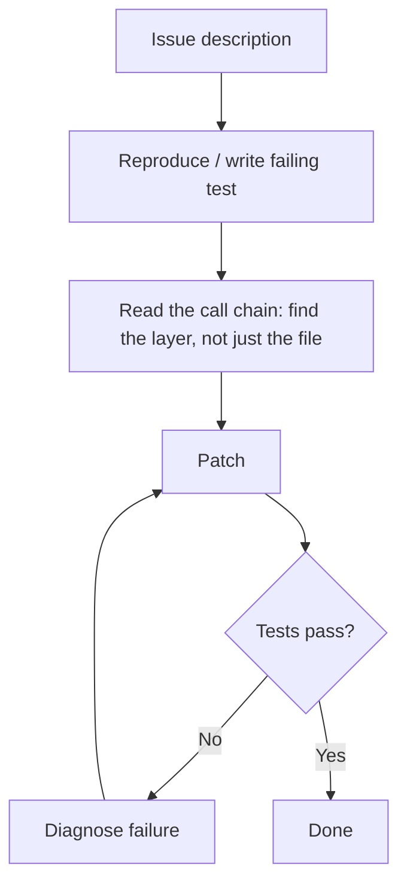

# Behavioral Drivers of Coding Agent Success and Failure

> Aggregate resolve rates conceal why agents fail. On the tasks no agent solves, the agent finds the right file and patches the wrong architectural layer.

## The resolve rate problem

SWE-bench Verified gives each agent a single percentage. The best agents still fail more than 20% of tasks as of February 2026. The score hides a more useful signal: two agents with identical resolve rates can fail on almost separate sets of tasks, for different reasons.

Analysis of 9,374 trajectories across 19 agents, 8 frameworks, and 14 LLMs on 500 tasks confirms this ([arXiv:2604.02547v1](https://arxiv.org/abs/2604.02547v1)). Task heterogeneity is the structural problem: no single agent wins across every task type.

## The tasks nobody solves fail at the wrong layer, not the wrong file

Task difficulty is bimodal: of 500 SWE-bench Verified tasks, 55 are never solved by any agent, 416 are contested, and 29 are always solved. Twelve of the never-solved tasks need only a single-file patch of ten changes or fewer, and human annotators labeled them easy ([arXiv:2604.02547v1](https://arxiv.org/abs/2604.02547v1)).

Those twelve are the diagnostic set. Comparing each best-performing agent's submitted patch against the gold patch sorts them into three root causes:

| Root cause | Tasks | What happens |
|---|---|---|
| Architectural judgment | 10 of 12 | The agent patches the symptom — the caller, the consumer, the display layer — where the gold patch changes the root: the callee, the producer, the serialization |
| Behavioral | 1 of 12 | The agent reaches a correct fix and abandons it |
| Domain knowledge | 1 of 12 | The fix needs knowledge the agent does not have, such as the correct TeX commands |

Localization is not the failure. The best agent found the gold-patch file in 12 of 12 tasks and edited it in 10 of 12, and failed every time regardless ([arXiv:2604.02547v1](https://arxiv.org/abs/2604.02547v1)). Reading the wrong file is not what defeats these tasks; intervening at the wrong architectural layer is.

That reframes what an audit should look for. Twelve tasks is a small diagnostic set and the split is not a general failure taxonomy, but the direction it points is the useful part: a monitor that checks whether the agent opened the right file will pass a run that is already lost.

## Three behavioral predictors of success

Three patterns correlate with higher resolve rates across agents and frameworks ([arXiv:2604.02547v1](https://arxiv.org/abs/2604.02547v1)):

### 1. Exploration before execution

Agents that read related files, trace call chains, and inspect tests before touching the implementation succeed at higher rates. The pattern is `read → read → read → write`, not `read → write`. It comes down to decision ordering, not token count. Trajectory length itself is an ambiguous signal — its direction reverses depending on whether you control for agent identity or for task difficulty — while trajectory structure discriminates consistently ([arXiv:2604.02547v1](https://arxiv.org/abs/2604.02547v1)).

### 2. Post-patch verification loops

Agents that run tests after patching and iterate on failures — the [agent self-review loop](../../code-review/agent-self-review-loop.md) — resolve more tasks than those that patch without verification:

```
patch → test → diagnose failure → repatch → test → ...
```

Frameworks that stop after the first patch prevent this pattern, whatever the model can do.

### 3. No premature patching

The opening strategy — read-first against patch-first — is visible within the first ten steps and correlates with the outcome across every agent in the study. All three dimensions are agent-determined and stable across task complexity: agents run a fixed strategy rather than adapting it to the task in front of them ([arXiv:2604.02547v1](https://arxiv.org/abs/2604.02547v1)).

That stability is what makes the signal usable. A monitor that detects premature patching in the opening steps can flag a run as unlikely to succeed before most of its compute is spent.



## Framework constrains model behavior

The LLM is the primary driver of both outcome and behavior. Agents sharing an LLM agree on more tasks than agents sharing a framework, and the framework performance gap shrinks each LLM generation ([arXiv:2604.02547v1](https://arxiv.org/abs/2604.02547v1)).

The framework still sets hard limits: without a test-execution step, no model produces a verification loop. Framework prompts shape tactics, though the effect fades with stronger LLMs.

Ask these [harness-level](harness-engineering.md) audit questions, since they set constraints even capable LLMs cannot bypass:
- Does the agent run tests after patching?
- Does test failure output route back for a repatch attempt?
- Does the iteration cap allow at least two repatch cycles?
- Does the agent read related files and tests before writing?

## Ensemble strategy for task heterogeneity

Combining agents beats picking the best single agent when failure sets do not overlap. Task-level agreement across agents is low, and DEI reached 34.3% resolution by ensembling open-source agents that individually scored at most 27.3% ([Zhang et al., 2024, arXiv:2408.07060v1](https://arxiv.org/abs/2408.07060v1), as reported in [arXiv:2604.02547v1](https://arxiv.org/abs/2604.02547v1)).

Practical approaches:
- Majority vote: run three agents and take the most common patch
- Confidence-weighted: route to a [specialized agent](specialized-agent-roles.md) by task characteristics, such as test demand or how much the issue description specifies
- Sequential fallback: if A fails its tests, route to B

The gain rises with how much the failure sets diverge. Agents with different frameworks and exploration strategies diverge more than agents sharing a framework with different models.

## When this backfires

Behavioral-pattern auditing and ensembling have diminishing returns in several conditions:

- LLM gap dominates: when the model is weaker than alternatives, framework tweaks yield less than a model upgrade, so framework auditing is premature.
- Benchmark divergence: the root-cause split comes from 12 never-solved tasks in SWE-bench Verified, which skews toward well-specified single-file bugs. Production tasks (architecture changes, multi-repo work, ambiguous requirements) may fail for different dominant reasons, and 12 tasks is a narrow base to generalize from.
- Benchmark integrity: OpenAI retired SWE-bench Verified after finding 59.4% of audited problems had flawed tests, and METR observed reward-hacking in 30%+ of frontier-model runs ([OpenAI, 2026](https://openai.com/index/why-we-no-longer-evaluate-swe-bench-verified/); [Berkeley RDI, 2026](https://rdi.berkeley.edu/blog/trustworthy-benchmarks-cont/)). Treat the trajectory-derived findings as directional, not ground truth.
- Low divergence: agents sharing an LLM with different prompts often have overlapping failure sets, so coverage gains are much smaller than the 60%-overlap example implies.

## Key Takeaways

- Two agents with identical resolve rates can have non-overlapping failure sets — headline score is an insufficient comparison metric
- On the 12 never-solved simple-patch tasks, the agent found the gold-patch file 12 times out of 12 and still failed every one: 10 failed on architectural judgment, patching the symptom rather than the root
- Trajectory structure predicts success where trajectory length does not: gather context before editing, invest in validation, and do not patch early
- LLM capability is the primary driver of outcome; framework design sets hard limits on which behavioral patterns are structurally possible (no model can produce a verification loop in a framework with no test-execution step) but matters less as LLMs improve
- Ensembling agents with divergent failure profiles produces higher coverage than optimizing a single agent

## Related

- [Agentless vs Autonomous: When Simple Beats Complex](agentless-vs-autonomous.md) — two-phase constrained approaches outperforming autonomous agents on SWE-bench
- [Agent Self-Review Loop](../../code-review/agent-self-review-loop.md) — implementing the post-patch verification loop pattern
- [Harness Engineering](harness-engineering.md) — environment design as the primary lever on agent behavioral patterns
- [Agent Harness: Initializer and Coding Agent Pattern](agent-harness.md) — structuring long-running agent work with initializer and execution phases
- [Wink: Classifying and Auto-Correcting Coding Agent Misbehaviors](wink-agent-misbehavior-correction.md) — trajectory-level misbehavior classification (30% misbehavior rate in production)
- [Evaluator-Optimizer Pattern](evaluator-optimizer.md) — two-role loop for iterative quality improvement
- [Cross-Vendor Competitive Routing](cross-vendor-competitive-routing.md) — routing tasks across competing agents to select the best result
- [Loop Strategy Spectrum](../../loop-engineering/loop-strategy-spectrum.md) — choosing accumulated vs fresh context for iteration cycles
- [Agent Failure Trajectories and the Recovery Window](failure-trajectory-recovery-window.md) — the temporal companion: when in a run the decisive error lands and how narrow the window to correct it is
