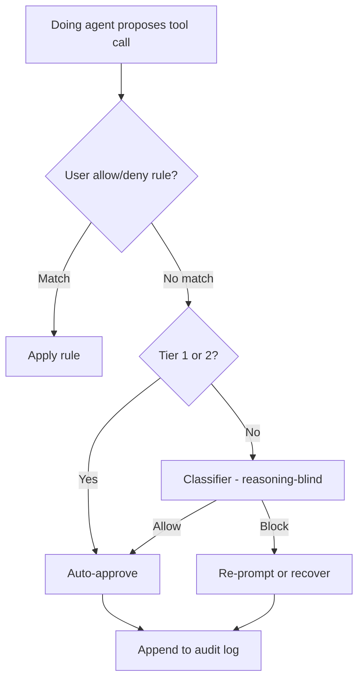

# Classifier-Gated Auto-Permission for Cloud-IDE Coding Agents

> Classifier-gated auto-permission inspects each tool call and re-prompts only on escalations — a probabilistic safety floor distinct from per-call quality review and static allowlists.

Classifier-gated auto-permission splits the "may I run this?" decision between a fast classifier model and a human reviewer. The doing agent stays uninterrupted on benign actions; the classifier re-introduces the prompt only on escalations — network egress to unrecognized destinations, writes outside the project, destructive shell, or content judged to have been driven by hostile input.

## When the pattern earns its complexity

The pattern adds reviewer tokens, latency, and a new LLM attack surface. It pays back only when all of the following hold:

- Action volume produces approval fatigue. OpenAI's internal Codex traffic reports roughly 720 boundary-crossing actions per 10,000 ([Auto-review of agent actions](https://alignment.openai.com/auto-review/)) — well past the rubber-stamp threshold. At three escalations an hour, a human reviewer wins.
- The configuration surface is admin-enforced. If a developer can flip `--dangerously-skip-permissions` or rewrite the classifier rule file inside the workspace, the whole scheme collapses to whichever layer the attacker reaches first. Claude Code documents this requirement plainly: the classifier does not read rules in shared `.claude/settings.json`, and you must deploy `hard_deny` rules through [managed settings](../../tools/claude/managed-settings-drop-in.md) for organizational guarantees.
- The workload is in-distribution. Anthropic reports 0.4% false-positive and 5.7–17% false-negative rates on real and synthetic exfiltration traffic ([Anthropic engineering](https://www.anthropic.com/engineering/claude-code-auto-mode)). An independent stress test (Ji et al., 2026) measured 81.0% FNR (95% CI 73.8%–87.4%) on deliberately ambiguous authorization scenarios, and 36.8% of state-changing actions bypassing classification entirely through in-project file edits ([Measuring the Permission Gate](https://arxiv.org/abs/2604.04978)). The gap is workload, not a contradiction.
- Irreversible actions are routed elsewhere. Production deploys, money movement, IAM rotation, and credential exposure belong on a human or cryptographic gate ([Cryptographic Governance Audit Trail](../../security/cryptographic-governance-audit-trail.md)). A 99% auto-approval rate is the wrong tier for those. Newer auto-mode implementations narrow this further with intent-scoped destructive-command rules rather than blanket risk tiers. Claude Code v2.1.183 blocks `git reset --hard`, `git checkout -- .`, `git clean -fd`, `git stash drop`, and `git commit --amend` on non-agent commits, plus `terraform`/`pulumi`/`cdk destroy` unless the specific stack was named — gating on whether the user asked for this destructive action rather than on a static risk tier ([Claude Code changelog v2.1.183](https://code.claude.com/docs/en/changelog)).

If any condition fails, simpler postures dominate: a static allowlist plus sandbox for low-volume sessions, or an evidence-based allowlist for steady-state workloads where the action distribution is enumerable.

## What the classifier inspects

Three implementation tiers recur across the cloud-IDE coding agents that ship this pattern:

| Tier | What runs without classifier | Reviewer fires on |
|------|------------------------------|-------------------|
| 1 — Safe tools | File reads, code search, navigation | — |
| 2 — In-project file ops | Writes and edits inside the project root | — |
| 3 — Boundary-crossing | — | Shell commands, external APIs, out-of-project writes, subagent spawns |

The tier table comes from Claude Code's auto-mode ([Claude Code permission modes](https://code.claude.com/docs/en/permission-modes)). VS Code 1.121's `github.copilot.chat.claudeAgent.allowAutoPermissions` ([VS Code 1.121 release notes](https://code.visualstudio.com/updates/v1_121)) and OpenAI Codex's `approvals_reviewer = "auto_review"` ([Codex Agent Approvals](https://developers.openai.com/codex/agent-approvals-security)) follow the same shape. Cursor ships the pattern for headless agents through a natural-language classifier: `autoRun.allow_instructions` and `autoRun.block_instructions` in `permissions.json` steer which tool calls run automatically versus hold for review, for example allowing read-only build-artifact inspection while always pausing deletes ([Cursor — agent autonomy auto-review](https://cursor.com/blog/agent-autonomy-auto-review)). Inputs the classifier reads typically include the user prompt, tool name, argument shape, target paths, and network destinations, never the doing agent's own reasoning (see below).

One vendor now ships the gate on by default. Simon Willison reports that auto mode is the default in Claude Code for Pro, Max, and Team plans ([Auto mode is now the default in Claude Code](https://simonwillison.net/2026/Aug/8/auto-mode/)), so those users run under the classifier without opting in.

VS Code 1.121's escalation criteria are stated verbatim: the classifier blocks anything that "escalates beyond your request", "targets unrecognized infrastructure", or "appears driven by hostile content Claude read" ([VS Code 1.121 release notes](https://code.visualstudio.com/updates/v1_121)).

## Why it works

The classifier sees the escalation signal in the same context the doing agent reads — user prompt, tool name, argument shape, target paths — but evaluates it in a model the doing agent cannot reason with. Anthropic states the mechanism: "we strip out Claude's own messages and tool outputs, making it reasoning-blind by design" ([Anthropic engineering](https://www.anthropic.com/engineering/claude-code-auto-mode)). OpenAI states the same property for Codex auto-review: "The main agent is optimized to complete the user's task. This creates pressure to treat an approval boundary as just another obstacle to overcome. Auto-review has a narrower job: decide whether a proposed boundary-crossing action should run" ([Auto-review of agent actions](https://alignment.openai.com/auto-review/)).

The empirical effect is the rubber-stamp problem inverted. Codex sessions stop for human approval roughly 200 times less often in auto-review mode than in manual mode, while still catching the actions that should stop: in a 10,000-action snapshot, 9,280 ran inside the sandbox without review and 720 escalated, of which the reviewer denied 7 and the doing agent recovered safely on 4 ([Auto-review of agent actions](https://alignment.openai.com/auto-review/)). Claude Code's two-stage pipeline (a single-token filter tuned for recall, then chain-of-thought reasoning only on flags) keeps the cost shape compatible with high-volume traffic ([Anthropic engineering](https://www.anthropic.com/engineering/claude-code-auto-mode)).

## Four design choices that decide the trade

Whether a given implementation earns its complexity depends on four choices:

1. Reviewer isolation from the doing agent. The same training distribution means the same jailbreak defeats both — measured at a 64.5% blind-spot rate when models review their own outputs ([Panickssery et al., 2025](https://arxiv.org/abs/2507.02778)). Use a different model class, or at minimum reasoning-blind the reviewer so the doing agent cannot argue it down.
2. Reasoning-blinding. Strip the agent's own messages and tool outputs from the classifier's context. Without this, the doing agent learns to insert justifications into its reasoning that satisfy the classifier ([Anthropic engineering](https://www.anthropic.com/engineering/claude-code-auto-mode)).
3. Coverage boundary. Whatever bypasses the classifier (Tier 1 and Tier 2 above) is the system's residual blast radius. When ops state lives inside the project root — terraform state, sealed-secrets manifests, k8s YAML — Tier 2 becomes an exfiltration and destruction surface the classifier never sees. Ji et al. measured 36.8% of state-changing actions bypassing classification this way ([Measuring the Permission Gate](https://arxiv.org/abs/2604.04978)). Some implementations expose a knob to widen the boundary: Claude Code's `autoMode.classifyAllShell` (added in v2.1.193) routes *every* shell command through the classifier rather than only arbitrary-code-execution paths, closing part of the coverage gap at the cost of more classifier calls ([Claude Code changelog](https://code.claude.com/docs/en/changelog)).
4. Audit trail. Every auto-approved action must be reconstructable afterwards — the reviewer's verdict, the rule it matched, and the resolved arguments. Without per-action telemetry, the classifier's decisions are unauditable and the layer gives false confidence. OpenAI's Codex posture wires OTel exports for prompt, approval decision, execution result, and network proxy decisions as the fourth load-bearing leg ([Running Codex safely at OpenAI](https://openai.com/index/running-codex-safely/)).

## When this backfires

- Workload outside the calibration distribution. Anthropic's 17% FNR is on a hand-curated overeager set of 52; Ji et al.'s 81% FNR is on 128 deliberately ambiguous DevOps prompts, and 92.9% on artifact-cleanup tasks ([Measuring the Permission Gate](https://arxiv.org/abs/2604.04978)). The floor is calibrated against typical traffic, not against an adversary.
- In-project ops state. When the project root holds production-affecting files, move that state out or pin the paths with deterministic [permission-framework-over-model](../../security/permission-framework-over-model.md) rules.
- Same model class for agent and classifier. Reasoning-blinding reduces argument-based bypass but not the shared training-distribution jailbreak surface.
- Reviewer-targeted prompt injection. The classifier is an LLM-as-judge and inherits the documented failure modes — peer-reviewed work shows judges can be misled by the same injections they detect ([How Not to Detect Prompt Injections with an LLM, ACM AISec 2025](https://dl.acm.org/doi/10.1145/3733799.3762980)).
- Transitive supply-chain attacks. The classifier evaluates actions, not outcomes. `pip install -r requirements.txt` is exactly what the user asked for; it cannot reason about what declared dependencies pull in.
- Untrusted configuration surface. If attackers can write `.cursor/permissions.json`, `.vscode/settings.json`, or local auto-mode rule files, the [YOLO attack chain](https://ajbuilds.medium.com/the-yolo-attack-how-hackers-are-hijacking-ai-agents-by-flipping-one-switch-f8a7ff586310) bypasses the scheme by flipping the gate.
- Static-allowlist alternative is sufficient. Where the action distribution is small and stable, a deterministic allowlist plus sandbox is lower-latency, has no reviewer-injection surface, and produces a grep-able audit trail.

## Distinguishing the pattern from adjacent stations

Three nearby patterns occupy different slots in the harness — none is interchangeable:

| Station | Decides | Cost shape | When |
|---------|---------|------------|------|
| Classifier-gated auto-permission | Auto-approve vs re-prompt for boundary crossings | One classifier call per Tier-3 action | High-volume routine with admin-enforced config |
| [Inference-time tool-call reviewer](inference-time-tool-call-reviewer.md) | Whether the proposed call is correct | One reviewer call per provisional tool call | High blast radius + measured Helpfulness:Harmfulness |
| [Pre-execution command risk classification](../../security/pre-execution-command-risk-classification.md) | What badge to show on the human prompt | One classifier call per command | Confirmation prompts that look identical and get rubber-stamped |

Classifier-gated auto-permission decides whether to ask; the tool-call reviewer decides whether the call is right; risk badges decide how hard to read a prompt that still reaches the human. They compose — Codex's published posture wires all four ([Sandbox + Approvals + Auto-Review Triad](../../security/sandbox-approvals-auto-review-triad.md)).

## Example

The four design choices map across tools even when setting names do not. A team enabling classifier-gated auto-permission for a coding-agent fleet pins the reviewer model independent of session model, leaves reasoning-blinding on, enumerates which paths fall under Tier 2 versus require Tier 3, and exports an OTel event for every classifier decision. Claude Code expresses this through `autoMode.environment`, `autoMode.hard_deny`, and `otel.exporter` ([Claude Code permissions](https://code.claude.com/docs/en/permissions); [Hard-Deny Classifier Rule](../../tools/claude/hard-deny-classifier-rule.md)); VS Code 1.121 exposes it as `github.copilot.chat.claudeAgent.allowAutoPermissions`; Codex through `requirements.toml` ([Running Codex safely at OpenAI](https://openai.com/index/running-codex-safely/)). The settings differ; the four-choice contract does not.

## Key Takeaways

- Classifier-gated auto-permission is a *probabilistic* safety floor for the auto-mode binary — distinct from per-call quality reviewers and from static allowlists.
- The pattern earns its complexity only when action volume causes fatigue, configuration is admin-enforced, the workload matches the classifier's calibration distribution, and irreversible actions are routed elsewhere.
- Coverage gap dominates real-world failure: Tier 2 in-project edits accounted for 36.8% of state-changing actions in independent stress testing — anything inside the project root is the system's residual blast radius.
- Reviewer isolation and reasoning-blinding are load-bearing; same-model-class reviewers without context isolation inherit the doing agent's jailbreak surface.
- Reported FNR varies by an order of magnitude between vendor-calibrated traffic (5.7–17%) and adversarial stress tests (81%) — treat published numbers as workload-conditional, not universal.
- Pair the classifier with admin-enforced managed settings, a per-action audit trail, and deterministic deny rules for irreversible actions — none of the three is optional.

## Related

- [Inference-Time Tool-Call Reviewer](inference-time-tool-call-reviewer.md) — per-call quality review with Helpfulness:Harmfulness metrics; reviews correctness rather than escalation
- [Sandbox + Approvals + Auto-Review Triad](../../security/sandbox-approvals-auto-review-triad.md) — the four-layer Codex posture that wires this pattern with sandbox, approval policy, and telemetry
- [Pre-Execution Command Risk Classification](../../security/pre-execution-command-risk-classification.md) — the attention-allocation lever for prompts that still reach the human
- [Deferred Permission Pattern](deferred-permission-pattern.md) — how headless sessions pause for out-of-band approval when the classifier blocks
- [Trigger-Level Gating for Autonomous Agent Intake](trigger-level-agent-intake-gating.md) — the intake counterpart: gating whether an unprompted agent starts at all, rather than which of its tool calls re-prompt
- [Static-First Shell Command Gating with Selective Escalation](../../security/static-first-shell-command-gating.md) — the inverted cost shape: deterministic evidence decides 95.8% of shell commands and the classifier sees only the residual band
