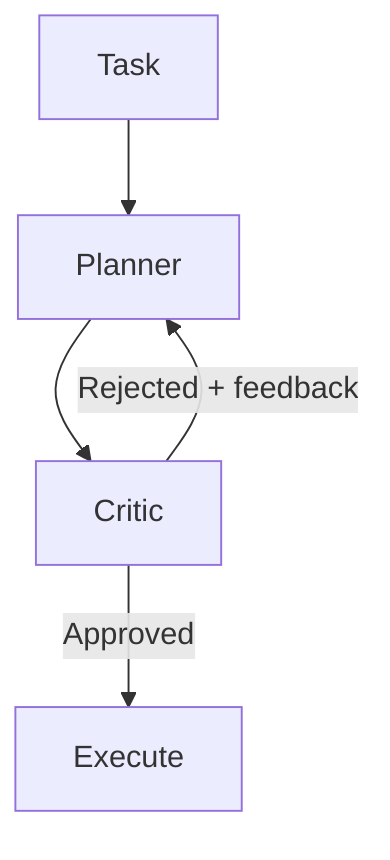

# Critic Agent Pattern

> A second model reviews the primary agent's plan before execution begins, catching structural errors early when recovery is cheap.

## Structure

The critic agent pattern inserts a dedicated review agent between the planning phase and execution:

1. Planner — the primary agent reads the task, explores context, and produces a structured plan.
2. Critic — a complementary model reviews the plan for risks, gaps, and incorrect assumptions.
3. Gating decision — execution proceeds only if the critic approves. Otherwise the planner gets structured feedback and revises the plan.

The critic is a distinct agent role, not self-review. A different model creates genuine disagreement, because the critic does not share the planner's blind spots. Research on the [self-correction blind spot](https://arxiv.org/abs/2507.02778v3) measured an average 64.5% blind-spot rate across 14 tested LLMs. The models failed to correct errors in their own outputs even while correcting identical errors from external sources. This shows that same-model review inherits the producer's failure modes.

## Why plan-gating matters

The pattern's value is timing. The [evaluator-optimizer pattern](evaluator-optimizer.md) applies a reviewer inside a generation loop, which helps with iterative refinement. The critic agent applies review at the plan stage, before any tool calls or code changes run.

Plan-stage errors are cheap. A structurally flawed plan caught before execution costs one extra model call. The same error caught mid-execution needs [rollback](rollback-first-design.md), re-planning, and re-execution. Each of those re-incurs the token cost of the steps already run.

Multi-step agentic plans amplify single errors. If step 3 of a 10-step plan assumes the wrong environment state, every later step inherits that assumption. A critic that reviews the full plan finds cross-step inconsistencies that per-step review misses.

## When to apply

The pattern pays off when:

- The task involves multiple sequential steps with compounding dependencies.
- Mistakes are expensive to reverse, such as destructive operations, external API calls, or database writes.
- The primary model has a documented tendency to miss a specific class of error, for example environment assumptions or API contract mismatches.

Skip it when:

- The task is short enough that re-running from scratch is cheaper than critic overhead.
- The plan has no branching. A single-step task has nothing for a critic to evaluate.
- Evaluation criteria are vague. A critic without clear scoring criteria produces inconsistent verdicts.

## Copilot CLI implementation

Copilot CLI [v1.0.18](https://github.com/github/copilot-cli/releases/tag/v1.0.18) (April 4, 2026) introduced an experimental critic agent. It automatically reviews plans and complex implementations with a complementary model to catch errors early. The feature is available in experimental mode for Claude models.

The release does not describe how the complementary model is selected, whether a different vendor model, a different reasoning configuration, or a separate context. Treat the specific routing as an implementation detail that may change.

## Trade-offs

| Factor | Impact |
|--------|--------|
| Latency | Each plan review adds one model round-trip before execution begins |
| Token cost | One extra model call per task; most valuable when execution cost is high relative to review cost |
| Coverage | A complementary model surfaces errors the planner's reasoning style systematically misses |
| Diminishing returns | For simple one-step tasks, critic overhead exceeds the value of catching errors |

### When a critic backfires

A high-accuracy critic is not automatically a net-positive intervention. Vasudev et al. (2026) report that a critic with strong offline accuracy (AUROC 0.94) can still cause a 26-percentage-point collapse on one model while leaving another near-unchanged. Interventions face a [disruption-recovery tradeoff](https://arxiv.org/abs/2602.03338): they recover failing trajectories, but they also disrupt trajectories that would have succeeded. Validate the critic on a sample of representative tasks before you deploy it on a high-success-rate workload. If the critic disrupts more than it recovers, gate or disable it.

A separate theoretical result bounds the upside. Ao, Gao, and Simchi-Levi (2026) show that any delegated planner-plus-critic network is [decision-theoretically dominated by a centralized Bayes decision-maker with the same information access](https://arxiv.org/abs/2603.26993). Language-based handoff between agents is a lossy channel. A critic adds value only when it brings information the planner lacked, not when it re-reads the same context with the same model family. Pair the critic with a different model and a structured rubric the planner did not see at plan time.

## Example

A developer runs: `copilot -p "Migrate the users table to add a new required column with no default"`

Without a critic, the planner generates a migration script and executes it. If the script omits a backfill step for existing rows, production fails at runtime.

With a critic, the critic reviews the plan and flags a problem: "Required column with no default will fail on existing rows — backfill step missing between `ALTER TABLE` and constraint enforcement." Execution is blocked. The planner revises the plan to add the backfill step before the constraint is applied.

The error is caught before a single query runs.

## Key Takeaways

- The critic agent reviews the plan before execution, not the output after generation, so it catches errors when they are cheapest to fix
- A complementary model creates genuine disagreement; self-review by the same model reproduces the same blind spots
- The pattern is most cost-effective for multi-step plans where errors compound across steps
- Copilot CLI v1.0.18 ships an experimental critic for Claude models that fires automatically
- For iterative output refinement, use the evaluator-optimizer; for pre-execution plan validation, use the critic agent

## Related

- [Evaluator-Optimizer Pattern](evaluator-optimizer.md)
- [Agent Self-Review Loop](../../code-review/agent-self-review-loop.md)
- [Specialized Agent Roles](specialized-agent-roles.md)
- [Rollback-First Design](rollback-first-design.md)
- [Copilot CLI Agentic Workflows](../../tools/copilot/copilot-cli-agentic-workflows.md)
- [Cross-Vendor Competitive Routing](cross-vendor-competitive-routing.md)
- [Agent Composition Patterns](agent-composition-patterns.md)
- [Convergence Detection in Iterative Refinement](../../loop-engineering/convergence-detection.md)
