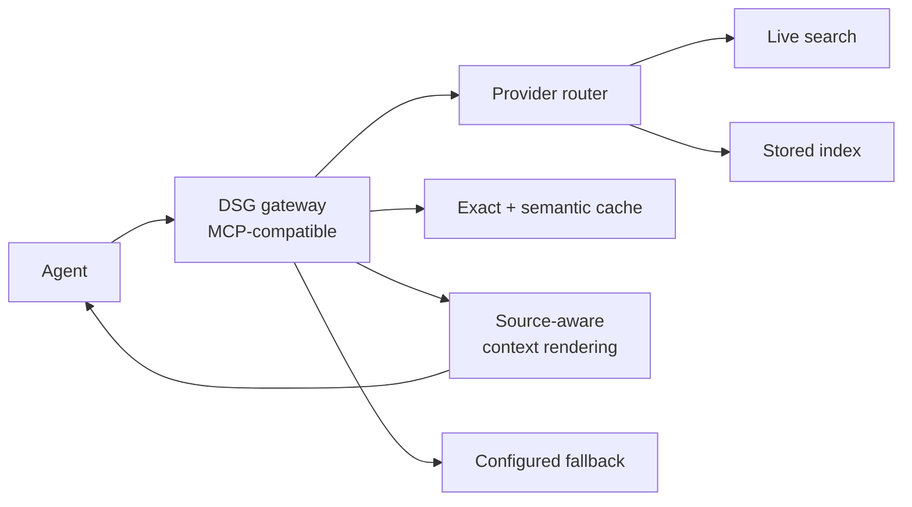

# Decoupled Search Grounding: A Vendor-Agnostic Grounding Boundary

> Decoupled Search Grounding lifts retrieval out of the reasoning model and into an MCP-compatible gateway so provider, caching, and evidence rendering become independent controls.

## When this pattern pays off

Decoupled Search Grounding (DSG) is a workload-conditional pattern, not a universal default. It pays off when three conditions hold together:

1. Strict output contracts are non-negotiable. The downstream consumer is a typed JSON schema, a function call, or a UI that breaks on prose drift. Native search grounding can trigger Search-Induced Verbosity that violates these contracts. The OpenAI Responses API web-search tool is documented to "cut content mid-output and break the JSON by ending abruptly mid-string" when paired with strict structured outputs ([OpenAI community](https://community.openai.com/t/web-search-completion-cuts-off-response-and-ignores-structured-outputs-on-complex-prompts/1229963)), and Gemini 3 needs explicit steering to suppress the conversational tone its grounding tool produces ([Google Developers Blog](https://developers.googleblog.com/new-gemini-api-updates-for-gemini-3/)).
2. The query mix is cacheable. [Boateng et al.](https://arxiv.org/abs/2606.18947) report a 99.4% warm-cache hit rate and 68% lower latency on their production e-commerce workload. But agentic tool calls with strong per-turn context dependence run closer to 5 to 15% cache hit rates in practice ([LangChain forum](https://forum.langchain.com/t/post-retrieval-temporal-decay-how-are-you-handling-stale-context-in-production-rag-pipelines/3968)). DSG's cost wins follow the cache hit rate, not the architecture.
3. Multi-vendor or multi-tenant routing is real, not aspirational. The gateway hop is overhead when one team runs one model against one search provider. It earns its keep when provider routing, source-aware context rendering, configured fallback, and per-tenant budgets are first-class controls ([Boateng et al.](https://arxiv.org/abs/2606.18947); [MCP standard as decoupling layer](https://www.mlveda.com/blog/the-mcp-standard-and-the-death-of-integration-lock-in-what-pe-operating-partners-need-to-know-about-agent-interoperability)).

When all three hold, the paper measures 86.1% accuracy on SimpleQA versus 87.7% for native search. That is a 1.6-point drop bought for 91% lower search cost. On the e-commerce workload, accuracy matches native while search cost falls by over 98% ([Boateng et al.](https://arxiv.org/abs/2606.18947)). When any one fails, native search grounding is the cheaper default.

## The five controls

DSG turns each axis that native search bundles into a separately tunable control. The boundary is an MCP-compatible gateway sitting between the agent and the search providers ([Boateng et al.](https://arxiv.org/abs/2606.18947)):



1. Provider routing. Direct recency-sensitive queries to a live search API, and route cacheable queries to a stored index. The reasoning model sees one tool surface.
2. Source-aware context rendering. The gateway formats retrieved evidence into the exact shape the downstream contract expects, sidestepping the verbosity drift that ships with native grounding tools.
3. Configured fallback. Provider outages degrade to the cached index, then to a no-grounding mode, rather than breaking the agent loop.
4. Retrieval-depth control. Depth is a knob set per query class, not a hardcoded property of the model's grounding tool.
5. Exact plus semantic caching. Exact-match caching handles repeated queries, and semantic caching handles paraphrases. Both are keyed by query, not by generated answer.

## Why it works

Each subsystem that native search bundles has a different optimal setting per workload: provider choice, retrieval depth, evidence injection, caching, and post-retrieval generation. Bundling them forces a single compromise. Pulling the boundary outside the reasoning model lets each knob tune on its own. The cache layer absorbs repeats (the [paper's](https://arxiv.org/abs/2606.18947) 99.4% warm-cache hit rate on a stable workload). Provider routing sends recency-critical questions to live search and cacheable ones to a stored index. Source-aware context rendering reformats evidence into the exact shape the downstream contract expects. The mechanism is the same one [Production MCP Agent Stack](../../tool-engineering/production-mcp-agent-stack.md) names for MCP generally: the gateway turns each axis of the design space into an independently observable, swappable control instead of a property of the model SDK.

The grounding-not-the-model lever shows up in practitioner cost-performance reports too. Sourcegraph reports that augmenting a cheaper model with its MCP-server code-search grounding beat a Mythos-class frontier model used alone ([Sourcegraph blog](https://sourcegraph.com/blog)). This is the same thesis: decoupled code-search grounding lets a cheaper model match a frontier one, measured on a coding workload rather than SimpleQA.

## When this backfires

- Recency-sensitive workloads. DSG trails native search on FreshQA by the paper's own admission ([Boateng et al.](https://arxiv.org/abs/2606.18947)), and semantic caching compounds the problem. Semantic similarity has no temporal dimension, so [stale embeddings score as high as fresh ones](https://tianpan.co/blog/2026-04-10-rag-freshness-problem-stale-embeddings-silent-failure) and a 99.4% cache hit rate on news, inventory, or pricing data confidently returns yesterday's answer.
- Single-vendor single-tenant production. The gateway adds an auth surface, a binary in the supply chain, and an operational hop. Without multi-provider routing, multi-tenant budgets, or strict-output contracts to justify it, engineering cost outweighs the 1.6-point accuracy and 91% cost wins ([Boateng et al.](https://arxiv.org/abs/2606.18947)).
- Gateway as supply chain. LiteLLM, the most cited DSG-shaped gateway, shipped credential-stealing malware in 1.82.7 and 1.82.8 ([BerriAI/litellm#24518](https://github.com/BerriAI/litellm/issues/24518)). A thinly-staffed team taking a fast-moving third-party gateway dependency can lose more to a supply-chain incident than DSG saves. Anthropic notes the same risk in its [LLM-gateway guidance](https://code.claude.com/docs/en/llm-gateway).
- Narrowing cost gap. Gemini 3's June 2026 pricing shift from $35/1k flat to $14 per 1,000 search queries ([Google Developers Blog](https://developers.googleblog.com/new-gemini-api-updates-for-gemini-3/)) shrinks the savings DSG's caching exploits, and gateway engineering cost is fixed.

## Example

A production agent serving e-commerce product Q&A has a typed JSON contract, `{title, price, in_stock, sources[]}`, and a query mix dominated by repeated catalog questions. The team measures Search-Induced Verbosity breaking the JSON contract on roughly 4% of native-grounding turns and a 60 to 70% repeat-query rate.

Before, native search grounding sits inside the reasoning model:

```python
# Single SDK call; provider, caching, and evidence rendering bundled
response = client.responses.create(
    model="gpt-5",
    tools=[{"type": "web_search_preview"}],
    response_format={"type": "json_schema", "json_schema": SCHEMA},
    input=user_query,
)
```

When the search tool fires inside the same call, the verbosity-suppressed structured output sometimes terminates mid-string and the JSON fails to parse.

After, a DSG gateway sits in front of the reasoning model:

```python
# Step 1: gateway resolves grounding; cache + router + fallback are its concern
evidence = dsg_gateway.ground(
    query=user_query,
    schema_hint="product_qa_v1",  # source-aware context rendering
    recency_class="catalog",       # routes to stored index, not live search
)

# Step 2: reasoning call sees only rendered evidence; no native tool
response = client.responses.create(
    model="gpt-5",
    response_format={"type": "json_schema", "json_schema": SCHEMA},
    input=user_query,
    extra_context=evidence.rendered_block,
)
```

The reasoning model never sees a web-search tool; structured output succeeds. Cacheable queries (the catalog majority) hit the stored index; new SKU questions are routed via `recency_class="live"` to a live provider; provider outage falls back to the cached index.

## Key Takeaways

- DSG is workload-conditional: strict output contracts, cacheable query mix, and real multi-vendor or multi-tenant routing must hold together for the gateway hop to pay off.
- The five controls — provider routing, source-aware context rendering, configured fallback, retrieval-depth control, exact + semantic caching — replace one bundled grounding decision with five separately tunable ones.
- Empirical wins from [Boateng et al.](https://arxiv.org/abs/2606.18947) are 91% lower search cost at a 1.6-point SimpleQA accuracy trade, and 98%+ cost cut at accuracy parity on e-commerce; native search still leads on recency-sensitive FreshQA.
- Backfires on recency-heavy workloads, single-vendor single-tenant deployments, and when the chosen gateway becomes its own supply-chain or version-lock-in dependency.
- The decoupling is the same MCP-shaped boundary [Production MCP Agent Stack](../../tool-engineering/production-mcp-agent-stack.md) and [Gateway Model Routing](gateway-model-routing.md) draw for tools and models — applied to retrieval.

## Related

- [Gateway Model Routing](gateway-model-routing.md) — the model-catalog analog of the same gateway boundary; DSG decouples grounding the way Gateway Model Routing decouples model choice.
- [Production MCP Agent Stack](../../tool-engineering/production-mcp-agent-stack.md) — the six MCP design axes that DSG instantiates for the search-grounding axis specifically.
- [Web Search Agent Loop](../../tool-engineering/web-search-agent-loop.md) — the in-loop retrieval shape that runs above or below a DSG gateway.
- [Documentation-Grounding MCP Servers for Vendor SDKs](../../tool-engineering/documentation-grounding-mcp-servers.md) — the docs-corpus equivalent of moving grounding behind an MCP boundary.
- [Dual-Budget Control for Search Agents](dual-budget-control-search-agents.md) — per-action VOI budgeting that sits above a DSG gateway when both tool-call and token caps bind.
