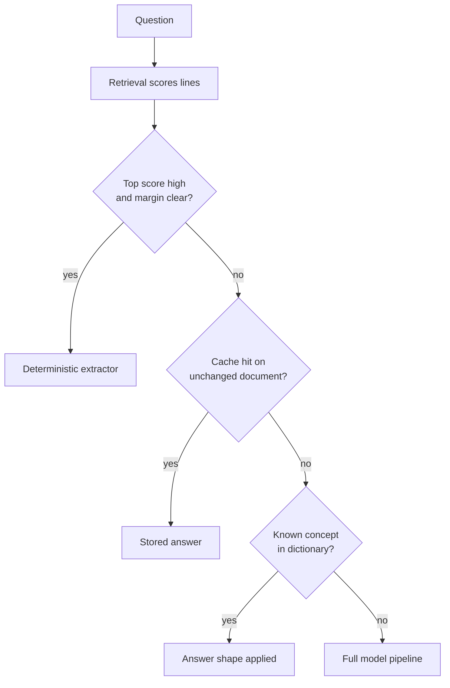

# Deterministic Fast Paths: Answer Without a Model Call

> A deterministic fast path answers the easy majority of requests from a score, a cache, or a dictionary, with no model call at all.

A deterministic fast path is a routing rung that sits below every model in the stack. Before a request goes to a cheap model, the fast path asks whether it needs a model at all, using signals the system has already computed. One enterprise retrieval pipeline began with "Three round-trips to a hosted model, in series, before the user sees a word" for parsing, arbitration, and generation. Routing an easy question past all three gave the reported contrast: "Two seconds through the full pipeline, or a tenth of a millisecond routed past it" ([Shi, Towards Data Science](https://towardsdatascience.com/cut-an-enterprise-rag-pipelines-latency-and-cost-by-calling-the-llm-less-not-by-buying-a-faster-model/)).

## When this applies

The gap between two seconds and a tenth of a millisecond is a property of a calibrated system, not of the idea. Three conditions carry it.

- Your traffic has a measured easy majority. The rungs only pay when a large share of questions resolve to a single retrieved line, and routability varies by domain: one routing baseline found medical queries hardest to route and legal queries most tractable ([Bansal and Agarwal, arXiv:2604.03455v1](https://arxiv.org/abs/2604.03455v1)).
- You have calibrated the threshold against labeled data from your own corpus. "The threshold is not a universal constant. What counts as a confident margin depends on the domain" ([Shi, Towards Data Science](https://towardsdatascience.com/cut-an-enterprise-rag-pipelines-latency-and-cost-by-calling-the-llm-less-not-by-buying-a-faster-model/)).
- You can detect a wrong fast-path answer after the fact. The fast path returns no model output to inspect, and a bad answer is served exactly like a good one, so nothing surfaces the failure unless you sample for it. "Serving a stale or hallucinated cache is a real risk" ([Sarkar, Towards Data Science](https://towardsdatascience.com/zero-waste-agentic-rag-designing-caching-architectures-to-minimize-latency-and-llm-costs-at-scale/)).

Without all three, keep one path and make it faster.

## The escalation ladder

Each rung answers cheaply or hands the request up. The decision stays deterministic whether it is "made by an indicator, a keyword score, a cache hit, a dictionary lookup". All four rungs come from the same write-up ([Shi, Towards Data Science](https://towardsdatascience.com/cut-an-enterprise-rag-pipelines-latency-and-cost-by-calling-the-llm-less-not-by-buying-a-faster-model/)).

1. Score margin. Retrieval already ranked the candidate lines. A high top score with a clear margin over the runner-up means one line answered the question, and a flat distribution means it did not.
2. Cache hit. The same question against an unchanged source document has an answer on file already.
3. Dictionary lookup. For a known concept the answer shape is written down rather than inferred: "the dictionary maps premium to (single, amount)" ([Shi, Towards Data Science](https://towardsdatascience.com/cut-an-enterprise-rag-pipelines-latency-and-cost-by-calling-the-llm-less-not-by-buying-a-faster-model/)).
4. The model. Everything the rungs declined.

## Why it works

The routing signal costs nothing because retrieval computed it anyway. Scoring happens before any inference, so the top score and its margin are already in memory, and the router is a comparison rather than a network round-trip. That is why the decision itself adds nothing measurable, leaving the three skipped model calls as the whole of the saving ([Shi, Towards Data Science](https://towardsdatascience.com/cut-an-enterprise-rag-pipelines-latency-and-cost-by-calling-the-llm-less-not-by-buying-a-faster-model/)). The signal is also informative, because score distribution encodes difficulty. SkewRoute's central observation is that "the score distributions produced by the retrieval scorer strongly correlate with query difficulty," so a peaked distribution reads as one passage having answered the question and a flat one as evidence that needs combining ([Wang et al., arXiv:2505.23841v2](https://arxiv.org/abs/2505.23841v2)). The saving is structural. Serial model calls are a fixed per-request cost, so removing all of them from the easy majority moves the latency distribution instead of shaving its mean.

## When this backfires

- The threshold is wrong for your corpus. Set it loose and hard questions reach the extractor, which returns a plausible wrong line. Set it tight and the rung never fires, leaving the calibration and maintenance cost with nothing to show ([Shi, Towards Data Science](https://towardsdatascience.com/cut-an-enterprise-rag-pipelines-latency-and-cost-by-calling-the-llm-less-not-by-buying-a-faster-model/)).
- Query input is untrusted and the cache rung is exposed. A similarity-keyed cache behaves as a fuzzy hash, and fuzzy hashes are not collision-resistant. CacheAttack, an automated black-box collision framework, reached an 86% hit rate in response hijacking with transfer across embedding models ([Zhang et al., arXiv:2601.23088v2](https://arxiv.org/abs/2601.23088v2)).
- Documents change faster than the cache invalidates. A stale hit is a correct match to a superseded version and looks identical to a good one, so the rung needs explicit validation such as a row timestamp, a data fingerprint, or a predicate staleness check ([Sarkar, Towards Data Science](https://towardsdatascience.com/zero-waste-agentic-rag-designing-caching-architectures-to-minimize-latency-and-llm-costs-at-scale/)).
- The published evidence is thinner than the headline. The clearest study of per-query routing over retrieval bundles reports 26% fewer billed tokens against always-heavy retrieval and 34% lower mean latency against always-direct inference. Those figures come from 28 queries over a 15-passage corpus, scored by a lexical proxy its own authors call a weak stand-in for answer quality ([Mishra, arXiv:2606.02581v1](https://arxiv.org/abs/2606.02581v1)). Treat published percentages as existence proofs and measure your own.
- You now maintain two answer-producing paths. The fast path shares no code with the pipeline, so it needs an evaluation set of its own.

## Example

The rule the source ships is a two-number test on the retrieval output: a top score of at least 4 with a margin of at least 3 goes to the deterministic extractor, everything else to the full pipeline ([Shi, Towards Data Science](https://towardsdatascience.com/cut-an-enterprise-rag-pipelines-latency-and-cost-by-calling-the-llm-less-not-by-buying-a-faster-model/)).

| Path | Model calls | Reported time |
|---|---|---|
| Full pipeline (parse, arbitrate, generate) | 3, in series | about 2 seconds |
| Routed past it | 0 | about 0.1 milliseconds |

Both numbers come from one pipeline with a threshold tuned for its corpus. Carry away the ratio between the rows, not the constants.

## Key Takeaways

- Ask whether a request needs a model before asking which model to use. The cheapest call is the one that never leaves the process.
- Build the slow path first and instrument it. A fast path is an exception carved out of a pipeline you already trust, not a starting design.
- Measure the hit rate before the speedup. A fast path that catches a small slice of traffic cannot move the latency distribution however fast it is.
- Ship the guard with the rung. A false fast-path hit is served exactly like a good one, so sampling and cache invalidation are part of the pattern rather than extras.

## Related

- [Scout-Then-Route: Verify the Handoff Before Routing](scout-then-route.md) — routes between models after a cheap scout reads the repository, which still pays for a model call.
- [Auto Model Selection: Harness-Driven Routing per Task](auto-model-selection.md) — vendor-side per-request routing that always ends in an inference call.
- [Trajectory-Conditioned Model Escalation (SWE-Router)](trajectory-conditioned-model-escalation.md) — escalates mid-task on a running model's partial trajectory rather than deciding before the first call.
- [Parameter-Keyed Caching and Dependency-Aware Parallelism for Plan-Execute Pipelines](parameter-keyed-caching-plan-execute.md) — hardens the cache rung by partitioning the key on parsed parameters.
- [Deterministic Precondition Gates](deterministic-precondition-gates.md) — the same instinct applied to entry conditions, refusing a run rather than answering it.
