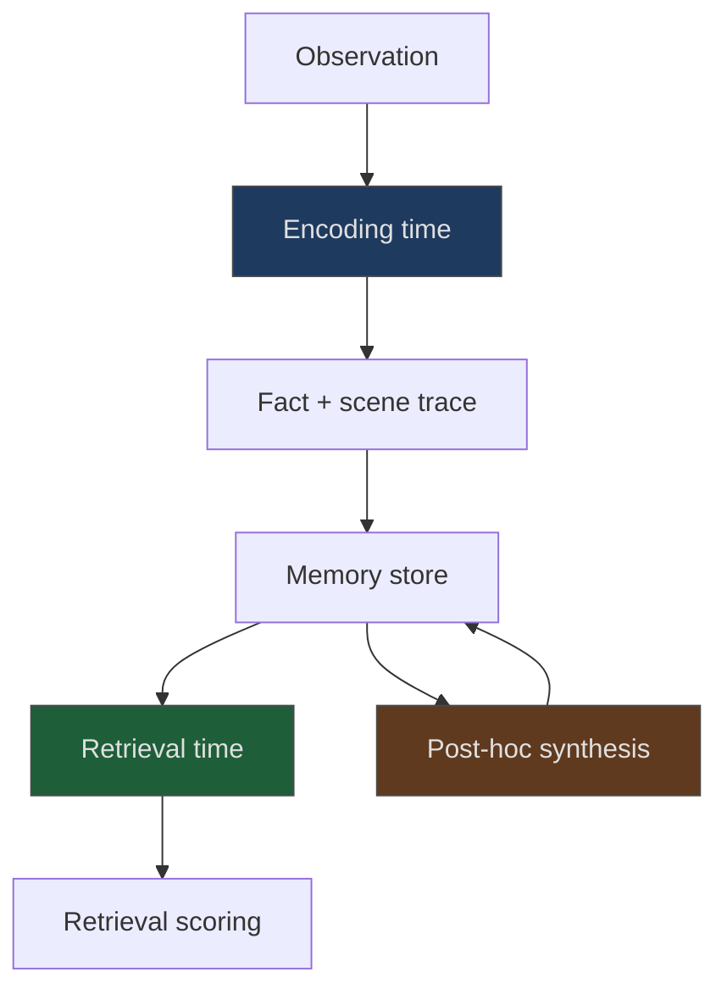

# Dual-Trace Memory Encoding

> Dual-trace memory encoding pairs each fact with a narrative scene of when it was learned, improving cross-session and temporal recall at no retrieval cost.

## The encoding gap

Most [agent memory systems](agent-memory-patterns.md) store facts as flat records: a sentence, an embedding, optionally a timestamp. The record answers what the fact is but erases when and where it was learned. Queries that depend on that context fail, because the signal was discarded at write time. Two examples: "has the rate limit changed since last quarter?" and "what was true before the refactor?"

Dual-trace encoding stores two traces per entry:

- a factual trace — the extractable claim, as in a conventional memory system
- a scene trace — a short narrative reconstruction of the moment the fact was learned: session, surrounding topic, prompting decision, temporal position

The agent commits to contextual detail at encoding time, not retrieval. Retrieval over both traces lets temporal and cross-session queries condition on the scene ([Stern & Nadel, 2026](https://arxiv.org/abs/2604.12948)).

## What the benchmark shows

On LongMemEval-S (4,575 sessions, 500 recall questions), dual-trace encoding reached 73.7% accuracy against a fact-only baseline of 53.5% — a +20.2 percentage-point gain, 95% CI [+12.1, +29.3], p < 0.0001 ([Stern & Nadel, 2026](https://arxiv.org/abs/2604.12948)). The gain concentrates in cross-session categories:

| Category | Gain over fact-only |
|----------|---------------------|
| Temporal reasoning | +40pp |
| Multi-session aggregation | +30pp |
| Knowledge-update tracking | +25pp |
| Single-session retrieval | No benefit |

The null result on single-session retrieval confirms the mechanism: scene context helps only when retrieval must disambiguate when a fact was learned. When encoding and retrieval share a session, the extra trace adds no signal.

LongMemEval covers five long-term memory abilities: information extraction, multi-session reasoning, temporal reasoning, knowledge updates, and abstention. Commercial assistants drop ~30% in accuracy on long histories on this benchmark ([Wu et al., 2024](https://arxiv.org/abs/2410.10813)) — the regime dual-trace targets.

## Where this sits in the memory cluster

Dual-trace is an encoding-time technique. It composes with retrieval-time and post-hoc strategies:



| Technique | Phase | Unit of storage |
|-----------|-------|-----------------|
| [Episodic memory retrieval](episodic-memory-retrieval.md) | Retrieval-time | Problem-solving arc (attempts, outcomes, lesson) |
| [Generative agents memory stream](generative-agents-memory-stream.md) | Retrieval + reflection | Scored observation nodes with importance |
| [Memory synthesis from execution logs](memory-synthesis-execution-logs.md) | Post-hoc | Structured lessons extracted from traces |
| Dual-trace encoding | Encoding-time | Fact + scene trace pair |

Episodic retrieval stores whole problem-solving episodes; dual-trace pairs individual facts with their learning moment. The two are orthogonal — an episode record can itself be dual-trace encoded at the fact level.

## When this pays off

The pattern targets workloads where retrieval depends on when or in what context a fact was learned:

- Cross-session aggregation. "Summarize every decision the team made about auth across the last five planning sessions."
- Knowledge updates. "Has the deployment target changed since the Q2 review?"
- Temporal reasoning. "What was our rate-limit policy before the January incident?"
- Per-user context retention. Long-running assistants accumulating facts about a user across sessions.

The pattern does not pay off for:

- Single-session bounded tasks. The benchmark null result is decisive, so the scene trace is wasted overhead.
- Context-independent facts. Stable infrastructure (`build uses pnpm`, `rate limit is 100/min`) gains nothing, because retrieval never conditions on the learning moment.
- High-frequency observation streams. Scene-trace generation is an extra LLM call per write, and at full tool-output density this compounds. Reserve it for facts worth persisting.
- Fast-moving codebases. Scene traces embed detail that decays as the codebase evolves. Without invalidation on refactor, stale traces mislead retrieval like stale facts do.

## Caveats

The published evidence is one paper on one benchmark with no independent replication. The headline +20pp comes from a synthetic long-memory benchmark; transfer to production workloads is plausible but unproven. The paper sketches a coding-agent architecture with "preliminary pilot validation" — treat that transfer as preliminary until further evidence lands ([Stern & Nadel, 2026](https://arxiv.org/abs/2604.12948)).

Retrieval token cost matches the fact-only baseline. Write-time cost — the LLM call that generates the scene trace — is a real addition and should factor into the decision to encode.

A structural critique argues LongMemEval-style benchmarks "cannot distinguish a memory system from a long-context LLM" because all computation happens inside one context window ([Tanguturi, 2026](https://arxiv.org/abs/2604.10981)). The +20pp holds within that regime; carryover to deployments that cross real session boundaries — not synthetic concatenation — is unproven.

## Example

A coding assistant tracking a long-running project across weeks. A fact-only memory entry stores a correction in isolation:

```json
{
  "fact": "Billing reconciliation runs at 02:00 UTC, not 00:00."
}
```

Six weeks later the user asks, "When did the billing job move to 02:00?" Fact-only retrieval surfaces the claim but has no signal on when or why it was learned. The agent answers "I'm not sure" or hallucinates a date.

A dual-trace entry stores the fact plus a scene trace of the moment it was learned:

```json
{
  "fact": "Billing reconciliation runs at 02:00 UTC, not 00:00.",
  "scene_trace": "During the post-incident review for the Oct 14 duplicate-charge bug, the on-call engineer noted the cron had been moved to 02:00 UTC six months earlier to avoid a DST rollover race. The original 00:00 schedule is documented in the runbook but obsolete."
}
```

The scene trace answers the temporal query directly ("six months before Oct 14") and the knowledge-update query ("the runbook entry is stale"). Both traces index into retrieval, so the question matches even when phrased around the incident rather than the cron.

## Key Takeaways

- Store a fact and its scene trace at encoding time, not just the fact — the extra commit resolves cross-session and temporal queries that fact-only storage cannot.
- Expect gains on temporal reasoning, multi-session aggregation, and knowledge-update tracking; expect no gain on single-session retrieval.
- Scene-trace generation is a write-time LLM cost — reserve dual-trace encoding for facts worth the overhead, not every observation.
- Dual-trace is an encoding-time technique that composes with [episodic retrieval](episodic-memory-retrieval.md) and memory-stream reflection; adopt it alongside, not instead of, existing memory strategies.

## Related

- [Agent Memory Patterns: Learning Across Conversations](agent-memory-patterns.md)
- [Episodic Memory Retrieval](episodic-memory-retrieval.md)
- [Generative Agents Memory Stream](generative-agents-memory-stream.md)
- [Memory Synthesis from Execution Logs](memory-synthesis-execution-logs.md)
- [Memory Retrieval as a Control Decision](memory-retrieval-as-control.md)
- [Memory Transfer Learning: Cross-Domain Memory Reuse in Coding Agents](memory-transfer-learning.md)
- [Subtask-Level Memory for SE Agents](subtask-level-memory.md)
- [Code-Native Memory Substrates](code-native-memory-substrates.md)
