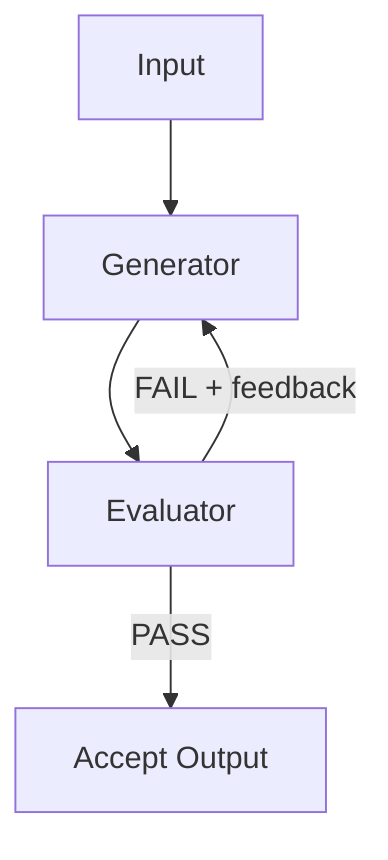

# Evaluator-Optimizer Pattern for AI Agent Development

> The evaluator-optimizer pattern loops a generator and an evaluator: the generator produces output, the evaluator critiques it, and feedback recycles until quality is met.

Learn it hands-on with the [guided Evaluator-Optimizer lesson](https://learn.agentpatterns.ai/harness-engineering/evaluator-optimizer/), which includes quizzes.

## Structure

The pattern has two roles and a termination condition:

- Generator — produces the initial output and revisions on each loop iteration
- Evaluator — applies set criteria to the generator's output and returns structured feedback (a verdict and specific issues)
- Termination condition — a quality gate that ends the loop when the evaluator returns PASS

Per [Anthropic's effective agents post](https://www.anthropic.com/engineering/building-effective-agents), the evaluator-optimizer is appropriate when there are clear evaluation criteria and iterative refinement provides measurable value.

## Evaluator design

The evaluator role can take one of two forms:

- Same model, different system prompt — lower cost, but the evaluator may inherit some of the generator's blind spots
- Different model — higher cost, but a fully independent perspective; useful when the generator and evaluator need different strengths

Evaluation criteria must be explicit and machine-checkable: tests pass, lint is clean, the specification is satisfied. The evaluator returns structured output, a JSON verdict with specific issues, so the generator can act on precise feedback rather than parsed prose.

## Termination condition

Every loop needs a clear termination condition to stop runaway iteration and cost:

- Primary: the evaluator returns PASS
- Fallback: the loop hits a maximum round limit, then escalates or returns best-effort output. Anthropic's [reference implementation](https://github.com/anthropics/anthropic-cookbook/blob/main/patterns/agents/evaluator_optimizer.ipynb) ships an unbounded `while True:` loop that only exits on PASS, so production callers must set their own cap. A starting limit of 3 is common, but the right cap depends on task complexity and cost budget.

Without a round limit, conflicting assumptions between the roles run the loop to budget exhaustion. The fallback is not a failure. It signals that the criteria or generator need adjustment.

## When to apply

The pattern produces measurable improvement when:

- "Good output" can be described precisely enough that the evaluator can score it
- Iterative refinement genuinely improves quality (the generator can act on the evaluator's feedback)
- The task does not have a single correct answer that would make iteration redundant

For coding tasks, the pattern maps naturally: the generator produces code, the evaluator runs tests, failures feed back, and the loop repeats. Tests give a machine-checkable termination condition, which makes the loop predictable and auditable.

## When this backfires

The pattern degrades or fails in five conditions:

- Shared blind spots — when the generator and evaluator are the same model with only a prompt swap, both may miss the same class of errors. The evaluator returns PASS on output that violates the intent, not because criteria are met but because neither role can detect the violation. To fix this, use a different model for evaluation, run a [committee review](../../code-review/committee-review-pattern.md) of independent reviewers, or replace the LLM evaluator with a deterministic checker such as tests, lint, or a type checker.
- Vague criteria — subjective prose ("is it high quality?") makes the PASS/FAIL signal noisy and the termination condition unpredictable. Iteration continues past the point of improvement, burning tokens without converging.
- Non-actionable feedback — if the evaluator cannot identify specific issues, the generator has no surface to act on. Each iteration produces cosmetic variation rather than real improvement, and the loop hits the round limit without resolution. This is exactly what [convergence detection](../../loop-engineering/convergence-detection.md) is meant to catch.
- Tasks with a single correct answer — when the output is either right or wrong, for example a lookup or a pure computation, iterative refinement adds cost without benefit. Use a direct call with deterministic validation instead.
- Already-high baseline accuracy — Snorkel AI's [2025 "Self-Critique Paradox" study](https://snorkel.ai/blog/the-self-critique-paradox-why-ai-verification-fails-where-its-needed-most/) found that on tasks where the generator already scored ~98%, adding a self-critique loop dropped accuracy to ~57%, because the critic hallucinates flaws to justify its existence. The pattern pays off when the generator is weak on the task (below ~35% baseline); on tasks the generator solves reliably, skip the loop and return the first output.

## Example

A code-generation loop for a sorting function:

Round 1:

- Generator input: "Write a Python function that sorts a list of dicts by a given key."
- Generator output: `sort_by_key(items, key)` uses `sorted()` with a lambda, but does not handle missing keys.
- Evaluator input: generator output plus a test suite of 3 tests (happy path, missing key, empty list).
- Evaluator output: `{ "verdict": "FAIL", "issues": ["test_missing_key: KeyError on items without the key field"] }`

Round 2:

- Generator input: the original prompt plus evaluator feedback from Round 1.
- Generator output: a revised `sort_by_key` that adds `key=lambda x: x.get(field, "")` to handle missing keys.
- Evaluator input: the revised output plus the same test suite.
- Evaluator output: `{ "verdict": "PASS", "issues": [] }`

Result: the loop terminates after 2 rounds, and the final output is the Round 2 revision.

## Relationship to committee review

The evaluator-optimizer is a two-agent loop with a single evaluator. The [committee review pattern](../../code-review/committee-review-pattern.md) extends it with multiple specialized reviewers that apply different lenses in parallel before feedback is aggregated. Use the evaluator-optimizer when one evaluation dimension is enough; use committee review when several distinct dimensions must all pass.

## Cost considerations

Each iteration adds generator and evaluator costs, so N rounds cost roughly 2N times a single generation. The loop is most cost-efficient when the evaluator terminates after one or two rounds and each revision meaningfully reduces the remaining issues. When a generator makes only marginal progress per iteration, redesign the feedback format rather than raise the round limit.

## FAQ

**Can adding an evaluator loop make output worse?**

Yes. Snorkel AI's [2025 "Self-Critique Paradox" study](https://snorkel.ai/blog/the-self-critique-paradox-why-ai-verification-fails-where-its-needed-most/) found that on tasks where the generator already scored about 98%, adding a self-critique loop dropped accuracy to roughly 57%, because the critic hallucinates flaws to justify its existence. The loop pays off when the generator is weak on the task, below about 35% baseline.

**What does each additional round cost?**

Each iteration adds a generator call and an evaluator call, so N rounds cost roughly 2N times a single generation. The loop is most cost-efficient when the evaluator terminates after one or two rounds and every revision meaningfully reduces the remaining issues. When the generator makes only marginal progress per iteration, redesign the feedback format rather than raise the round limit.

**When should I use committee review instead of one evaluator?**

When several distinct evaluation dimensions must all pass. The evaluator-optimizer is a two-agent loop with a single evaluator; [committee review](../../code-review/committee-review-pattern.md) extends it with multiple specialized reviewers that apply different lenses in parallel before feedback is aggregated. A committee also counters shared blind spots, where a same-model evaluator misses the same class of errors as the generator.

## Key Takeaways

- Generator produces output; evaluator provides structured feedback; the loop terminates on PASS or a round limit
- Evaluation criteria must be explicit and machine-checkable to produce consistent results
- The evaluator can be the same model with a different prompt (lower cost) or a different model (more independent)
- Set a maximum round limit; an unresolved loop signals misaligned criteria, not insufficient rounds
- For coding tasks, test results provide a natural machine-checkable termination condition

## Related

- [Committee Review Pattern](../../code-review/committee-review-pattern.md)
- [Prompt Chaining](../../context-engineering/prompt-chaining.md)
- [Convergence Detection](../../loop-engineering/convergence-detection.md)
- [Agent Self-Review Loop](../../code-review/agent-self-review-loop.md)
- [Loop Strategy Spectrum](../../loop-engineering/loop-strategy-spectrum.md)
- [Agent Composition Patterns](agent-composition-patterns.md)
- [Controlling Agent Output](../../instructions/controlling-agent-output.md)
- [DSPy: Programmatic Prompt Optimization](dspy-programmatic-prompt-optimization.md)
- [Knowledge Graphs as Provenance-Carrying Agent Memory](knowledge-graph-shared-memory.md) — a substrate that gives the evaluator citable criteria instead of judgments
