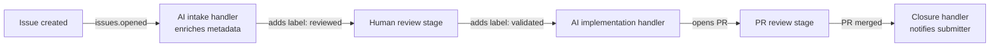

# Event-Driven Agent Routing

> Event-driven agent routing reacts to status-change events — label additions, board transitions, PR changes — to advance work between handlers, with no central coordinator.

## Stateless handlers instead of a coordinator

In an [orchestrator-worker pipeline](../multi-agent/orchestrator-worker.md), a parent agent holds the full plan and dispatches each step. Event-driven routing works the other way. Each step is a stateless handler that a state transition triggers. The handler fires, does its work, and emits the next state. No agent owns the full sequence.

GitHub's accessibility feedback pipeline runs this pattern in production. Each stage in a multi-team pipeline (AI intake, then human review, then service team resolution) is a GitHub Actions workflow. Label additions and project board status changes trigger each stage. No central coordinator calls each step in turn. [Source](https://github.blog/ai-and-ml/github-copilot/continuous-ai-for-accessibility-how-github-transforms-feedback-into-inclusion/)

## How it works

GitHub Issues and Projects already provide the state machine primitives. Actions can subscribe to labels, project field values, and PR states as observable events.

Trigger events:

| Event | Activity types | Use for |
|-------|---------------|---------|
| `issues` | `labeled`, `unlabeled`, `opened`, `closed` | Route on label additions/removals |
| `pull_request` | `labeled`, `opened`, `review_requested`, `closed` | Route on PR state transitions |
| `projects_v2_item` | `edited` (with `changes` payload) | Route on project board status field changes |

[Source: GitHub Actions events docs](https://docs.github.com/en/actions/writing-workflows/choosing-when-your-workflow-runs/events-that-trigger-workflows#issues)

Handler design: each workflow is stateless. It reads the current issue or PR state, applies its logic, and writes the next state. Because GitHub stores the state, re-running a handler is safe. Re-adding a label fires it again from a clean starting point.

Human-agent handoffs: humans and agents are interchangeable at each stage. A human reviewer marks an issue as `reviewed` by applying a label, and an agent responds the same way. Neither side needs to know what comes next. Sequencing lives in the trigger configuration.

## The routing pipeline, stage by stage



Each node is a separate, stateless GitHub Actions workflow. No node knows about the others.

## Versus orchestrator-worker

| Dimension | Orchestrator-Worker | Event-Driven Routing |
|-----------|--------------------|--------------------|
| Coordination | Central agent holds full plan | Distributed — each handler knows only its stage |
| Human handoff | Explicit callback to orchestrator | Human applies a label; event fires next handler |
| Re-run semantics | Orchestrator must track progress | Re-add label → handler re-runs from clean state |
| Ownership boundaries | One owner (the orchestrator) | Each team owns the handlers for their stage |
| Failure mode | Orchestrator error stalls all stages | Missing handler stalls silently |

Google ADK and Anthropic's multi-agent research system use synchronous orchestrator-worker patterns. Anthropic notes that async event-driven execution would improve parallelism but "adds challenges in result coordination, state consistency, and error propagation." [Source](https://www.anthropic.com/engineering/multi-agent-research-system)

## Failure modes

Silent stall: a state transition that fires no handler produces no error. The issue just stops advancing. Design for this case directly:

- Give every status a designated handler
- Add a fallback handler for `issues.labeled` that posts a comment when someone applies an unrecognized label
- Include status timestamps so reports can surface delayed advancement

Ambiguous ownership: if two teams both have handlers for the same label, both fire. Give each label or status exactly one handler so ownership stays exclusive.

GitHub's implementation softens silent stalls with automated weekly reports and a manual re-run. You re-trigger any Action by re-applying the label. [Source](https://github.blog/ai-and-ml/github-copilot/continuous-ai-for-accessibility-how-github-transforms-feedback-into-inclusion/)

## Example

GitHub's accessibility pipeline uses `issues: [opened, labeled]` to route between three tiers. The AI intake workflow fires on `issues.opened`, calls the [GitHub Models API](../../tools/copilot/github-models-in-actions.md) with prompts stored in `.github/copilot-instructions.md`, populates ~80% of metadata (severity, WCAG mapping, affected groups), then applies the next label. [Source](https://github.blog/ai-and-ml/github-copilot/continuous-ai-for-accessibility-how-github-transforms-feedback-into-inclusion/) A separate workflow fires when a human applies `validated`, routing to the service team.

```yaml
# .github/workflows/ai-intake.yml
on:
  issues:
    types: [opened]

jobs:
  enrich:
    runs-on: ubuntu-latest
    steps:
      - name: Analyze with Copilot
        # calls GitHub Models API, applies labels based on response
```

Prompts live in [`.github/copilot-instructions.md`](../../tools/copilot/copilot-instructions-md-convention.md), and you change them through pull requests. Updating the AI behavior needs no ML expertise. [Source](https://github.blog/ai-and-ml/github-copilot/continuous-ai-for-accessibility-how-github-transforms-feedback-into-inclusion/)

## Key Takeaways

- Use event-driven routing when team ownership boundaries map cleanly to status transitions — each team owns the handlers for their stage
- Each handler must be stateless: read current state, do work, emit next state
- Silent stalls are the primary failure mode — design observability (timestamps, fallback handlers) before deploying
- Humans and agents are interchangeable handlers; the routing logic only sees the label, not who applied it
- `projects_v2_item` webhook events are in public preview — test before building production pipelines on them

## Sources

- [Continuous AI for Accessibility (GitHub Blog)](https://github.blog/ai-and-ml/github-copilot/continuous-ai-for-accessibility-how-github-transforms-feedback-into-inclusion/)
- [Events that trigger workflows (GitHub Docs)](https://docs.github.com/en/actions/writing-workflows/choosing-when-your-workflow-runs/events-that-trigger-workflows#issues)
- [projects_v2_item webhook (GitHub Docs)](https://docs.github.com/en/webhooks/webhook-events-and-payloads#projects_v2_item)
- [Multi-Agent Research System (Anthropic)](https://www.anthropic.com/engineering/multi-agent-research-system)

## Related

- [Orchestrator-Worker Pattern](../multi-agent/orchestrator-worker.md)
- [Agent Composition Patterns: Chains, Fan-Out, Pipelines, Supervisors](agent-composition-patterns.md)
- [Human-in-the-Loop Placement](../../workflows/human-in-the-loop.md)
- [Agent Handoff Protocols](../multi-agent/agent-handoff-protocols.md)
- [Bounded Batch Dispatch](../multi-agent/bounded-batch-dispatch.md)
- [Idempotent Agent Operations](idempotent-agent-operations.md)
- [Classical SE Patterns and Agent Analogues](classical-se-patterns-agent-analogues.md)
- [Agentic AI Architecture Evolution](agentic-ai-architecture-evolution.md)
