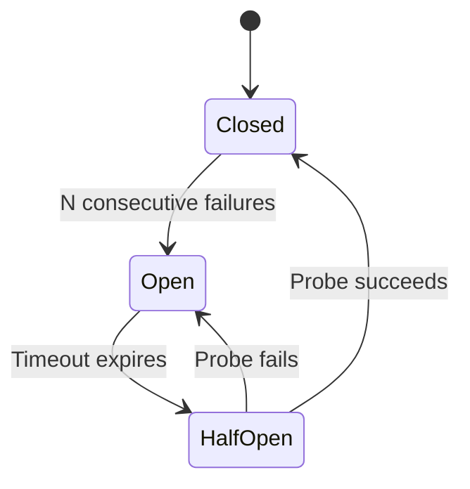

# Exception Handling and Recovery Patterns

> Exception handling decides whether a failing agent recovers and continues or fails catastrophically — corrupting state, losing progress, and repeating work.

Exception handling for coding agents is a progressive escalation — self-correct, fallback, degrade gracefully, escalate — that absorbs tool errors, model failures, and crashes without losing accumulated work.

## The progressive failure hierarchy

Self-correct: detect the error and retry or adjust. Most tool errors resolve here — a failed file read triggers a path correction, a syntax error triggers a fix.

Fallback: when the primary approach fails repeatedly, switch to an alternative strategy or model — the threshold an [agent circuit breaker](agent-circuit-breaker.md) makes explicit.

Degrade gracefully: deliver partial results rather than failing entirely.

Escalate: surface the failure to a human with enough context. Use this as a last resort, not a first response.

## Git-based recovery

Git is the primary recovery mechanism for coding agents. Anthropic recommends this approach for long-running agents ([multi-agent research system](https://www.anthropic.com/engineering/multi-agent-research-system)):

- Commit frequently, so each commit is a checkpoint
- Write progress files (for example, `claude-progress.txt`) that survive session crashes — see [Goal Monitoring and Progress Tracking](goal-monitoring-progress-tracking.md)
- Revert to known-good states with `git revert`

Git operations are cheap, atomic, and reversible. See [Rollback-First Design](rollback-first-design.md) for the broader principle.

## Model-driven error adaptation

Anthropic's [multi-agent research system](https://www.anthropic.com/engineering/multi-agent-research-system) reports that telling the model a tool is failing and letting it adapt works "surprisingly well" — the model reroutes without explicit fallback logic in the harness.

The simplest strategy is to catch the tool error, include the message in the agent's next context, and let the model decide. This outperforms rigid retry logic for novel failure modes, provided the retried action is safe to repeat (see [idempotent agent operations](idempotent-agent-operations.md)).

!!! warning "When model-driven adaptation fails"
    This breaks down for silent failures — the agent produces output without detecting the underlying error (stale data, partial writes, skipped validation). The model has to know something went wrong. Add output validation and freshness checks for failure modes the model cannot observe directly.

## Durable execution

For agents that must survive process crashes, durable execution frameworks checkpoint state after every step:

LangGraph provides [three durability modes](https://docs.langchain.com/oss/python/langgraph/durable-execution):

| Mode | Behavior | Use case |
|------|----------|----------|
| `exit` | Persist only at graph exit | Human-in-the-loop gates |
| `async` | Persist asynchronously while next step runs | Long-running research |
| `sync` | Persist synchronously before each step | Mission-critical workflows |

State is checkpointed to a configurable backend (Postgres, DynamoDB, others); after a crash, the agent resumes from the last checkpoint. LangChain pairs durability with a concrete retry, timeout, and error-handler taxonomy built into the graph runtime, giving the progressive hierarchy a framework-grounded fault-tolerance reference ([LangChain, fault tolerance in LangGraph](https://blog.langchain.com/fault-tolerance-in-langgraph)).

DBOS takes a decorator-based approach: [`@DBOS.workflow` and `@DBOS.step`](https://docs.dbos.dev/typescript/reference/workflows-steps) persist execution state automatically with exactly-once semantics.

Both solve the same problem: a 30-minute run should not lose all progress to a crash.

## Model fallback

When a model provider fails, route to an alternative. LangChain's [`ModelFallbackMiddleware`](https://docs.langchain.com/oss/python/langchain/middleware/built-in) chains models automatically (`Primary → Fallback 1 → Fallback 2`), handling outages and rate limits — though different models may produce different results for the same prompt.

That divergence is the trap: a fallback that succeeds silently can mask a quality regression rather than surface a failure. One practitioner account describes silent LLM fallbacks breaking agent pipelines downstream and argues for an explicit recovery layer that makes the switch observable rather than transparent ([Towards Data Science — LLM fallbacks break agent pipelines](https://towardsdatascience.com/llm-fallbacks-break-agent-pipelines-i-built-the-missing-recovery-layer/)). Treat a fallback as a degraded-mode signal worth logging, not a transparent substitution.

## Circuit breakers for tool calls

A circuit breaker tracks consecutive failures for a tool and disables it after a threshold.

In the closed state, calls proceed and failures are counted. In the open state, calls are blocked and the agent uses alternatives, as the [agent circuit breaker](agent-circuit-breaker.md) state machine specifies. In the half-open state, a single probe tests recovery.

Most coding agents use a lighter-weight version: count failures, tell the model the tool is unreliable, and let model-driven adaptation handle routing. Full state machines are more common in multi-agent systems with shared tool infrastructure.

## The rollback-over-prevention philosophy

Let agents make recoverable mistakes rather than preventing all mistakes: sandbox execution, review gates before permanent effects, session trees for fork/explore/discard, checkpoints at every meaningful boundary. Restrictive permissions limit capability more than they reduce risk. See [Rollback-First Design](rollback-first-design.md).

## When this backfires

The progressive hierarchy adds latency and complexity. These conditions favor failing fast instead:

- Short-lived tasks with no side effects — a task under 30 seconds with no external writes gains nothing from recovery logic, and retry overhead exceeds the benefit.
- Cascading failures in multi-agent systems — when agents share infrastructure (databases, queues, tool APIs), recovery attempts amplify load on stressed components. Circuit breakers and [agent backpressure](agent-backpressure.md) must be coordinated across agents, not per-agent.
- Silent corruption without validation — recovery requires detection. Writing to external systems without output validation means an agent that "recovers" may compound bad state. Fail fast to a human when intermediate state cannot be verified.

## Example

A coding agent tasked with refactoring a module hits a test failure after changing a function signature:

1. Self-correct: the agent reads the test error, identifies the mismatched argument, and fixes the call site. Tests pass.
2. On the next file, the same refactor produces a circular import. The agent retries twice and fails both times, which is safe only because the edits are [idempotent](idempotent-agent-operations.md).
3. Fallback: the agent abandons the automated refactor for that file and applies a manual re-export to break the cycle.
4. A third file depends on an external service that is down. The agent cannot run integration tests.
5. Degrade gracefully: the agent commits the passing unit-tested changes and leaves the integration-dependent file unchanged, noting the skip in its [progress log](../../observability/trajectory-logging-progress-files.md).
6. The agent encounters a permissions error trying to update a protected config file.
7. Escalate: the agent opens a draft PR with its completed work and flags the config change for [human review](../../workflows/human-in-the-loop.md), including the error message and the intended edit.

Throughout, the agent commits after each successful file change (`git commit -m "refactor: update signature in <file>"`), so any revert affects only one file.

## Key Takeaways

- Treat failure as a progressive escalation — self-correct, then fallback, then degrade gracefully, then escalate — so recoverable errors never reach a human.
- Git is the cheapest recovery substrate: frequent commits and progress files turn a crash into a resumable checkpoint rather than lost work.
- Model-driven adaptation (tell the model the tool failed, let it reroute) beats rigid retry logic for novel errors — but only when the failure is observable, not silent.
- Durable-execution frameworks and [circuit breakers](agent-circuit-breaker.md) add fault tolerance for crash-survival and unreliable tools; reach for them when state must outlive the process.
- Recovery requires detection — fail fast to a human whenever intermediate state cannot be validated.

## Related

- [Rollback-First Design](rollback-first-design.md)
- [Agent Circuit Breaker](agent-circuit-breaker.md) — per-tool state machine implementation with configuration thresholds
- [Retry, Switch, or Abstain: Supplying a Tool-Recovery Policy at Runtime](retry-switch-abstain-recovery-policy.md) — measured evidence for the fallback and escalate rungs of this hierarchy, and where supplying them in context backfires
- [Tail Control for Agent Workflows](tail-control-for-agent-workflows.md) — percentile-based reliability framing — per-step p95 timeouts, hedged re-draws, graceful degradation — that names the workflow-level bound the progressive recovery hierarchy lives inside
- [Idempotent Agent Operations](idempotent-agent-operations.md)
- [Agent Harness](agent-harness.md)
- [Human-in-the-Loop Placement](../../workflows/human-in-the-loop.md)
- [Loop Detection](../../observability/loop-detection.md)
- [Trajectory Logging and Progress Files](../../observability/trajectory-logging-progress-files.md)
- [Agent Self-Review Loop](../../code-review/agent-self-review-loop.md)
- [Agent Failure Trajectories and the Recovery Window](failure-trajectory-recovery-window.md) — the recovery window this failing-forward hierarchy has to act inside, with measured onset and lock-in timings
