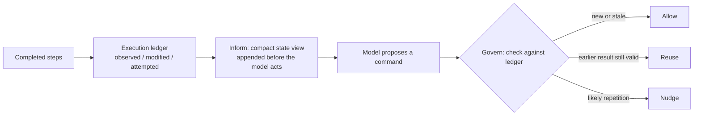

# Execution-State Ledger for Long-Horizon Coding Agents

> An execution-state ledger tracks which observations still describe the repository, then informs the coding agent and screens its next command against that state.

An execution-state ledger is a deterministic record of what an agent has observed, modified, and attempted, held outside the model and consulted at two points in every step. It exists because an append-only trajectory never marks an observation superseded. The transcript shows that the agent read `parser.py` at step 40; nothing in it shows whether step 62 changed the file. [Wang et al. (2026)](https://arxiv.org/abs/2608.00808v1) built such a layer for coding agents, adding no language-model calls and wrapping an otherwise unmodified agent.

## When this pays back

The published results were measured only where four conditions held, so treat them as the pattern's operating range ([Wang et al. 2026](https://arxiv.org/abs/2608.00808v1)):

- The session is long. The failure being fixed is ambiguity accumulated over hundreds of actions, so a short session has nothing for the ledger to resolve.
- The agent is the only writer. Freshness comes from change counters that advance when the layer sees a repository change, and a human or a CI job editing the same checkout moves the repository without moving a counter.
- Command output depends on repository state alone. Returning an earlier result is only sound when nothing outside the repository decides the answer.
- Someone maintains the exclusions. The published policy carries conservative safeguards that keep environment-configuration commands from being suppressed, and that list is written by hand.

## The two boundaries

The generalizable part is where the state is applied, not how it is stored.



The inform path renders a short state view into the model's input before it acts: recently changed files, plus an index of which files and line ranges were observed and whether each observation is still fresh. The govern path adjudicates the proposed command and returns one of three outcomes, allow, reuse an earlier still-valid result, or nudge about likely repetition ([Wang et al. 2026](https://arxiv.org/abs/2608.00808v1)).

## Why it works

Freshness is decidable; general redundancy is not. Each observation record stores the change-counter value in force when the file portion was returned, and per-file and global counters advance on every repository change, so "is this still current" becomes a comparison instead of an inference the model re-derives from [transcript position](../../context-engineering/lost-in-the-middle.md) ([Wang et al. 2026](https://arxiv.org/abs/2608.00808v1)). Independent work reaches the same diagnosis. [Zheng et al. (2026)](https://arxiv.org/abs/2607.22711v1) describe read snapshots that become "permanently fixed in the chronological history" and go stale as files change, "causing reasoning errors and causing agents to redundantly re-read files."

The second half is scope discipline: the layer acts only on repetition it can decide mechanically. That restriction matters, because judging a step redundant in general is unsolved. On RedundancyBench, the best of three methods scored 24.88% at detecting redundant steps in agent trajectories, and some scored below random ([Hu et al. 2026](https://arxiv.org/abs/2605.29893v1)).

## What the numbers show

Across all 500 SWE-bench Verified instances, Pass@1 rose from 56.2% to 64.2% with GPT-5 mini and from 75.8% to 81.0% with MiniMax M2.5, with total cost down 28.9% and 31.8%. Attached to OpenAI Codex the same layer added 3.4 percentage points at 24.4% lower cost. Redundant re-reads fell 24.2% and 35.1% on the two primary settings ([Wang et al. 2026](https://arxiv.org/abs/2608.00808v1)).

Read the ablation before assuming which path earns the gain, because the split moves with the model. With GPT-5 mini, "inform-only resolves 320 instances, while govern-only and the full system each resolve 321, compared with 281 for the baseline." With MiniMax M2.5 the govern path carries most of the gain and the state view adds three further resolutions ([Wang et al. 2026](https://arxiv.org/abs/2608.00808v1)). The headline figure is a net rather than a clean sweep: the GPT-5 mini run recovered 59 instances the baseline failed and regressed on 19 it had solved.

## When this backfires

- Anything else writes to the checkout. A concurrent human edit, a code generator, or a sibling agent changes files without advancing a counter, so the govern path hands back a stale result as still valid. Staleness of this kind does not fail loudly, which is why the [AWS Well-Architected agentic AI lens](https://docs.aws.amazon.com/wellarchitected/latest/agentic-ai-lens/agentcost04-bp03.html) prefers event-driven invalidation over time-based expiry.
- Output depends on more than the repository. Flaky tests, network calls, and time-dependent commands return different answers with the repository unchanged, so reuse is wrong even when the counters agree.
- Repetition was deliberate. Re-running a test to confirm a fix, or retrying after a transient failure, is hard to tell from waste at the command boundary.
- The scaffold already resyncs. [Zheng et al. (2026)](https://arxiv.org/abs/2607.22711v1) drop stale snapshots structurally, injecting current file contents each cycle, and report 9% to 50% fewer input tokens "while maintaining comparable pass rates." That takes the efficiency half with no policy to tune.
- The state view is noise for the decision at hand. The inform path adds prompt material every step, and model accuracy drops when a prompt carries context the task does not need ([Shi et al. 2023](https://arxiv.org/abs/2302.00093)).
- The evidence base is narrow: one benchmark, one language, single runs, and hand-chosen thresholds the paper does not publish ([Wang et al. 2026](https://arxiv.org/abs/2608.00808v1)). SWE-bench Verified scores are separately contested as partly memorized, with models identifying buggy file paths at up to 76% on benchmark tasks against 53% off it ([Liang et al. 2025](https://arxiv.org/abs/2506.12286v4)).

## Example

The failure the paper describes, sketched over a single file in a long refactor session ([Wang et al. 2026](https://arxiv.org/abs/2608.00808v1)):

```
step 40  read src/parser.py           → observation appended to trajectory
step 62  apply patch to src/parser.py → trajectory keeps both the old read and the diff
step 91  model reasons over step 40's contents, edits a line that has since moved
step 92  edit fails; model re-reads src/parser.py, appending a third copy
```

With the ledger, step 40's record carries the counter value at read time. The patch at step 62 advances the counter for that file, so the state view at step 91 marks the earlier observation stale. A repeat of an unchanged read at step 92 is served from the ledger instead of the shell.

## Key Takeaways

- Freshness is the tractable half of the problem. Track it with counters, and leave semantic judgments about redundancy to the model.
- The two boundaries transfer even when the storage does not. An inform path before the model acts and a govern path before the command runs are the reusable interfaces.
- Which path earns the gain depends on the model, so run the ablation on your own stack rather than adopting the paper's attribution.
- The pattern assumes the agent owns the checkout. If a human or a CI job can write to it mid-session, add invalidation the counters cannot supply, or drop the reuse outcome and keep only inform and nudge.

## Related

- [LedgerAgent: Structured Task State for Policy-Adherent Tool Calling](ledger-agent-structured-task-state.md) — the domain-state sibling; tracks entity fields against codified policy for customer-service agents, where this tracks observation freshness against repository change.
- [Deterministic Precondition Gates for Tool-Using Agents](deterministic-precondition-gates.md) — the govern path generalized; a read-only predicate that blocks a forbidden write rather than reusing a valid result.
- [Observation Masking: Filter Tool Outputs from Context](../../context-engineering/observation-masking.md) — the other response to observation bloat; drops processed tool output instead of indexing its freshness.
- [Stateful Iteration State-Carry](../../context-engineering/stateful-iteration-state-carry.md) — typed state carried across iterations through a tool call, for loops whose observations are large.
- [ACID for Agent Repository State](acid-for-agent-repository-state.md) — the consistency framing for repository work that this pattern's counters operate inside.
- [Fact Supersession Memory for Code Assistants](../../context-engineering/fact-supersession-memory.md) — the same freshness problem one level up, over remembered facts rather than file reads, with supersession keyed by subject and relation.
