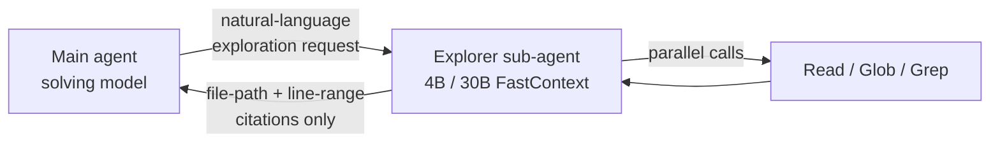

# Trained Repository Explorer Sub-Agent (FastContext)

> A trained 4B–30B explorer sub-agent runs repository search in its own context and returns file-path + line-range citations to the solver.

## When this pattern applies

The pattern works under three conditions that must hold together ([Zhang et al., 2026](https://arxiv.org/abs/2606.14066)):

1. The workload involves repeated broad exploration over a large or unfamiliar repository. SWE-bench Multilingual, SWE-bench Pro, and SWE-QA — the paper's benchmarks — are dominated by multi-file investigations in codebases the agent has never seen. That is the workload shape the savings are measured on. Reach for the pattern when your shape matches.
2. The explorer's citations are trustworthy enough that the main agent does not redo exploration. When citations are broad or imprecise, the solver re-explores anyway — the paper's hugo-12448 case study saw total tokens rise from 2,045.5k to 3,604.4k despite task resolution ([Zhang et al., 2026](https://arxiv.org/abs/2606.14066) §C.3).
3. The team can run a 4B–30B model on an OpenAI-compatible endpoint. FastContext ships as a Python library plus published HuggingFace checkpoints ([microsoft/FastContext-1.0-4B-RL](https://huggingface.co/microsoft/FastContext-1.0-4B-RL); [microsoft/fastcontext](https://github.com/microsoft/fastcontext)). Without serving infrastructure, the integration is hypothetical.

Outside these conditions, direct exploration by the main agent or the simpler untrained [Specialized SLM as Agent Sub-Tool](specialized-slm-as-agent-tool.md) pattern matches the cost-performance frontier without the training pipeline.

## The architecture



The explorer holds only three tools — `Read`, `Glob`, `Grep` — and issues calls in parallel ([microsoft/fastcontext](https://github.com/microsoft/fastcontext)). Output is a `<final_answer>` block of `/path/to/file.py:42-58` tuples, not raw snippets. The verbose intermediate state (broad regex hits, candidate file reads, ranking traces) stays inside the explorer's own context window and is discarded when it returns.

## Why it works

Context isolation along the exploration-versus-solving seam, plus citation-precision training. The solver pays for every token in its window, and exploration is verbose. Routing exploration into a separate sub-agent keeps verbose intermediate state out of the solver — only the citations (tens of tokens each) cross back. This is the same isolate-then-distill mechanism Anthropic names for sub-agent fan-out generally ([Anthropic: effective context engineering](https://www.anthropic.com/engineering/effective-context-engineering-for-ai-agents)), specialized to the repo-exploration axis with a trained model.

The training does the second half of the work. FastContext bootstraps from 2,954 SFT examples filtered from Sonnet 4.6 exploration traces, then refines with GRPO RL on a 400-prompt set, with rewards targeting patch-derived localization accuracy, structured parallel exploration, and output-validity penalties ([Zhang et al., 2026](https://arxiv.org/abs/2606.14066)). The 30B-SFT explorer reaches file-level F1 of 73.71 versus 68.57 for CodeScout-14B (prior best) — competitive with frontier models on the narrow task.

Reported integration savings on Mini-SWE-Agent: token reduction up to 60.3% on SWE-QA (418k → 166k on GPT-5.4), 20.4–26.0% on SWE-bench Multilingual, 14.1–17.9% on SWE-bench Pro; resolution-rate gains of +5.5% on SWE-bench Pro and +3.3% on SWE-bench Multilingual ([Zhang et al., 2026](https://arxiv.org/abs/2606.14066)). Overhead is marginal — across 300 GPT-5.4 SWE-bench Multilingual tasks the 4B-RL explorer consumed 22.58M tokens, ~$4.52 at serverless pricing, 2.1% of total cost.

## When this backfires

- Citation mistrust loops. When the explorer returns broad or low-confidence citations, the solver re-explores anyway. The paper's hugo-12448 case (SWE-bench Pro) measures the failure: 2,045.5k → 3,604.4k tokens total despite the task resolving ([Zhang et al., 2026](https://arxiv.org/abs/2606.14066) §C.3). Citation precision is load-bearing. If the explorer is under-trained or the output contract is wrong, the pattern adds cost.
- Single-file or single-subsystem changes. The overhead of running a 4B–30B model is not amortized when localization is trivial. The same diminishing-returns curve [Domain-Scoped Parallel Exploration](domain-scoped-parallel-localization.md) hits applies — when there is one obvious file to edit, a separate explorer is waste.
- Latency-sensitive interactive flows. Nested model invocations stack serially (the same constraint [Specialized SLM as Tool](specialized-slm-as-agent-tool.md) names). A developer waiting on every turn sees the added 4B-model inference time per exploration call.
- No serving infrastructure for the explorer. The library requires an OpenAI-compatible chat completions endpoint configured via `BASE_URL`, `MODEL`, `API_KEY` ([microsoft/fastcontext](https://github.com/microsoft/fastcontext)). Teams without that need to stand it up before the integration pays back.
- Strong same-model exploration on cached repos. When the solver model already has the repository structure cached from prior turns, re-exploring through a separate sub-agent adds cost. The paper notes "same-model exploration is not usually the best trade-off" but explicitly acknowledges exceptions ([Zhang et al., 2026](https://arxiv.org/abs/2606.14066)).

## What this is not

| Pattern | Selection unit | Explorer is… |
|---------|----------------|--------------|
| FastContext (this page) | Per exploration request | A trained 4B–30B model behind a sub-agent boundary, returning citations |
| [Specialized SLM as Tool](specialized-slm-as-agent-tool.md) | Per tool call | An untrained or fixed-role SLM behind a tool boundary; VS Code 1.118's agentic search tool is the example |
| [Sub-Agents Fan-Out](../multi-agent/sub-agents-fan-out.md) | Per parallel dispatch | The general fan-out primitive; FastContext is a specialization to repo exploration |
| [Domain-Scoped Parallel Exploration](domain-scoped-parallel-localization.md) | Per domain partition | Multiple sub-agents inside the solver's exploration phase, partitioned by subsystem |

FastContext has two distinguishing properties. First, the explorer is trained with task-grounded rewards on citation precision, not just prompted. Second, the output contract is file-path plus line-range citations only — never raw snippets — which is what makes downstream context isolation tight.

## Example

A coding agent integrating FastContext follows the paper's Mini-SWE-Agent integration shape. The main agent receives an issue, decides it needs repo context, and delegates to the explorer:

```python
# Solver makes one explorer call instead of issuing Read/Glob/Grep itself.
# BASE_URL, MODEL, API_KEY configure the explorer model via env vars.
from fastcontext.agent.agent_factory import make_fastcontext_agent

agent = make_fastcontext_agent(
    trajectory_file=".fastcontext/trajectory.jsonl",
    work_dir="/workspace/ansible",
)
answer = await agent.run(
    prompt=("Find files where the variable interpolation engine resolves "
            "inventory group overrides during play execution."),
    max_turns=6,
    citation=True,
)
# answer's <final_answer> block contains entries like:
#   lib/ansible/vars/manager.py:118-142
#   lib/ansible/template/__init__.py:204-231
#   inventory/manager.py:88-103
```

The solver's main loop never sees the explorer's intermediate `Grep` hits, file reads, or candidate ranking — only the three citation tuples reach its context.

The integration becomes a liability in the hugo-12448 case study: the explorer returned a broad candidate set, the solver did not trust the result, and it re-issued its own `Grep` and `Read` calls. Same architecture, opposite outcomes — the difference is whether the citation set is tight enough to act on.

## Key Takeaways

- FastContext is a *trained* repository-exploration sub-agent (4B–30B parameters, SFT + GRPO RL) that returns file-path + line-range citations to the solver — not raw snippets ([Zhang et al., 2026](https://arxiv.org/abs/2606.14066); [microsoft/fastcontext](https://github.com/microsoft/fastcontext)).
- The mechanism is context isolation specialized to repository exploration, plus citation-precision training — the same isolate-then-distil idea Anthropic describes for sub-agents generally, with a specialist model on the narrow task.
- Pays off when the workload is repeated broad exploration over an unfamiliar repo, citations are trusted, and serving infrastructure exists. Pattern fails (and *adds* tokens) when citations are broad enough to trigger solver re-exploration — the paper's hugo-12448 case is the worked failure.
- Distinct from [Specialized SLM as Tool](specialized-slm-as-agent-tool.md) (training step), [Sub-Agents Fan-Out](../multi-agent/sub-agents-fan-out.md) (specialized to exploration, not generic), and [Domain-Scoped Parallel Exploration](domain-scoped-parallel-localization.md) (separates exploration from solving, not partitioning within a single solver loop).

## Related

- [Specialized SLM as Agent Sub-Tool](specialized-slm-as-agent-tool.md) — Untrained / fixed-role variant of the same nested-model-behind-a-tool idea; FastContext adds the training step and the citation-only output contract.
- [Sub-Agents for Fan-Out Research and Context Isolation](../multi-agent/sub-agents-fan-out.md) — The general fan-out primitive that this pattern specializes for repository exploration with a single trained sub-agent.
- [Domain-Scoped Parallel Exploration for Multi-File Change Localization](domain-scoped-parallel-localization.md) — A sibling exploration-context-isolation pattern that partitions *within* the solver's exploration phase rather than lifting exploration out of the solver loop entirely.
- [Cognitive Reasoning vs Execution](cognitive-reasoning-execution-separation.md) — The architectural seam FastContext draws between explorer and solver is one instance of the broader reasoning-vs-execution split.
- [Discrete Phase Separation](discrete-phase-separation.md) — The same isolate-then-distil mechanism applied across workflow phases instead of across the exploration boundary.
- [Agent-Tuned Code Search](../../context-engineering/agent-tuned-code-search.md) — The hosted, vendor-indexed variant of the same explorer contract, where index freshness and code egress replace the serving-infrastructure constraint.
