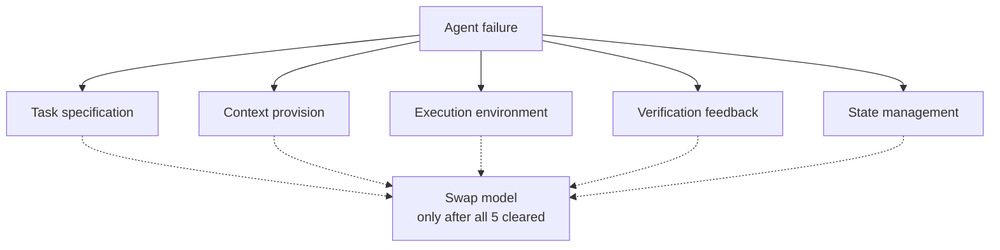

# Five-Failure-Layers Diagnostic: Attribute Before Swapping the Model

> Force every observed agent failure through a fixed harness-layer attribution before swapping models. "The model is dumb" almost always resolves to a specific layer.

## The discipline

When a coding agent fails, the default reaction is to suspect the model. The discipline inverts that: name the harness layer responsible first, then swap the model only after you have audited and ruled out every layer. A fixed enumeration enforces this. Open-ended root-cause exploration lets teams gravitate to "try a bigger model" because that conclusion is easier than fixing the actual gap.

The five working layers, derived from [harness engineering](harness-engineering.md) literature ([OpenAI](https://openai.com/index/harness-engineering/), [Anthropic](https://www.anthropic.com/engineering/effective-harnesses-for-long-running-agents), [LangChain](https://blog.langchain.com/improving-deep-agents-with-harness-engineering/)):

## The five layers

| Layer | Diagnostic question | Canonical fix |
|-------|--------------------|---------------|
| Task specification | Did the prompt define a verifiable goal, or did the agent have to guess? | Write an explicit Definition of Done — endpoints, schemas, commands ([OpenAI: humans specify intent](https://openai.com/index/harness-engineering/)) |
| Context provision | Could the agent find architectural conventions, version pins, and project rules in the repo? | A short [`AGENTS.md`](../../instructions/agents-md-as-table-of-contents.md) (~100 lines) pointing into structured `docs/` ([OpenAI](https://openai.com/index/harness-engineering/)) |
| Execution environment | Did the agent waste context on broken dev setup, missing deps, or wrong tool versions? | An [`init.sh`](https://www.anthropic.com/engineering/effective-harnesses-for-long-running-agents) the agent reads at session start; isolated worktree-per-task |
| Verification feedback | Were there machine-checkable signals (tests, lint, type checks) the agent could run, or did it self-grade? | Wire pre-completion checks; [pre-completion checklists](../../verification/pre-completion-checklists.md) and CI gates close the [verification gap](../../fallacies/consistent-capability-fallacy.md) |
| State management | Did the agent recover prior progress, or did each session re-discover everything? | Progress files, structured feature lists, git commit log; Anthropic uses a JSON feature list because models edit Markdown more freely ([Anthropic](https://www.anthropic.com/engineering/effective-harnesses-for-long-running-agents)) |

The 5-layer enumeration is one working cut. Anthropic's own table names [four](https://www.anthropic.com/engineering/effective-harnesses-for-long-running-agents) (premature victory, broken environment, premature feature-completion, undocumented run procedure); [`agent-debugging`](../../observability/agent-debugging.md) names a different four (missing context, conflicting instructions, missing tools, capability ceiling). The exact count matters less than the discipline of fixed attribution — pick a working enumeration and force every failure through it.

## Why a fixed enumeration

Free-form root-cause analysis lets the team invent new layers to avoid investigating the real one. A fixed list closes that escape. The cost — that genuinely novel failure modes get mis-attributed — is real but bounded. The more common failure is teams concluding "the model isn't good enough" without checking the five layers ([Anthropic: model swap is the most expensive option](https://www.anthropic.com/engineering/effective-harnesses-for-long-running-agents)).

Independent quantification: LangChain raised Terminal Bench 2.0 from 52.8% to 66.5% through pure harness changes — no model change ([LangChain](https://blog.langchain.com/improving-deep-agents-with-harness-engineering/)). The layers were the bottleneck.

## Diagnostic loop

1. Run the agent. Observe the failure.
2. Attribute to one of the five layers — the [agent debugging](../../observability/agent-debugging.md) step. If unattributable, add it to a separate "novel failure" log — do not invent a sixth bucket on the fly. Recent work operationalizes this attribution step directly: a method that localizes which harness layer is responsible for a failure from failed-trajectory evidence, rather than leaving the layer to a manual guess ([From Failed Trajectories to Reliable LLM Agents](https://arxiv.org/abs/2606.06324)). [Runtime harness adaptation](harness-engineering.md) takes the next step — turning each attributed failure into a rule, skill, validator, or monitor at the matching interface layer.
3. Fix that layer. Commit the fix back into the repo so all future sessions inherit it, the loop [runtime harness adaptation](harness-engineering.md) automates.
4. Re-run the same task. If it succeeds, the attribution was correct.
5. If all five layers have been cleared on the same task class and the agent still fails — only then evaluate a model swap.

## Example

A team using Claude Sonnet 4 to add an API endpoint observes repeated failures: code runs locally, fails in staging due to wrong SQLAlchemy syntax. Default reaction: "we need Opus."

Layer-by-layer attribution:

- Task specification: the prompt was "add user preferences endpoints under `/api/v2/users`" — no schema, no auth contract, no completion criteria. Gap identified.
- Context provision: no `AGENTS.md`; project conventions (SQLAlchemy 2.0, OAuth 2.0) lived only in Slack. Gap identified.
- Execution environment: the dev container worked; not the layer.
- Verification feedback: no pre-completion hook ran `pytest && mypy`, so the agent self-declared completion. Gap identified.
- State management: single-session task; not the layer.

The team writes an `AGENTS.md` (~80 lines, version pins and conventions), adds completion criteria to the prompt template, wires a pre-commit hook running `pytest tests/api/ && mypy src/`. Same model succeeds across three independent runs at ~60% better context efficiency ([Walking Labs: Lecture 01](https://github.com/walkinglabs/learn-harness-engineering/blob/main/docs/en/lectures/lecture-01-why-capable-agents-still-fail/index.md) — a re-tellable scenario the lecture documents).

The model was never the problem. The harness was.

## When this backfires

- Novel failure modes outside the enumeration — prompt-injection-induced behavior, cross-session [memory poisoning](../../security/trojan-hippo-memory-attack.md), MCP tool-call hallucinations against a freshly added server. Forcing these into the five buckets produces wrong fixes. Keep an explicit "novel failure" log so genuinely new modes accumulate visibly instead of being mis-attributed.
- Mature harnesses near the capability ceiling — once a team has spent months on legibility, mechanical enforcement, and verification, remaining failures genuinely concentrate at the model layer ([consistent capability fallacy](../../fallacies/consistent-capability-fallacy.md)). The five-layer audit becomes ceremony that delays the right call.
- Single-engineer prototypes — the discipline assumes a team that benefits from a shared vocabulary. Solo work on throwaway code pays the ceremony cost without the coordination return.

## Key Takeaways

- "The model is dumb" almost always resolves to a specific [harness](harness-engineering.md) layer once forced through a fixed attribution.
- Use a working enumeration of five layers — task spec, context, execution environment, verification, state — but treat the exact count as a working cut, not canonical. The discipline of fixed attribution is what matters.
- Model swap is the last hypothesis, not the first. LangChain demonstrated +13.7 points on Terminal Bench 2.0 from harness changes alone.
- Keep a "novel failure" log so the enumeration cannot quietly grow to fit anything.

## Related

- [Harness Engineering](harness-engineering.md) — the discipline the five layers operationalize as a diagnostic loop
- [Agent Debugging](../../observability/agent-debugging.md) — a different working enumeration (4 modes) for diagnosing bad agent output
- [The Consistent Capability Fallacy](../../fallacies/consistent-capability-fallacy.md) — why "the model already passed a harder task" is not evidence
- [Pre-Completion Checklists](../../verification/pre-completion-checklists.md) — the verification-feedback layer in concrete form
- [AGENTS.md as Table of Contents](../../instructions/agents-md-as-table-of-contents.md) — the context-provision layer in concrete form
- [Trajectory Decomposition Diagnosis](../../verification/trajectory-decomposition-diagnosis.md) — finer-grained diagnosis below the harness-layer level
- [Harness Engineering Method Map](harness-design-dimensions.md) — design dimensions the layer fixes draw from
- [Runtime Harness Adaptation](harness-engineering.md) — places each diagnosed failure at one of four interface layers in deterministic, rule-governed environments
