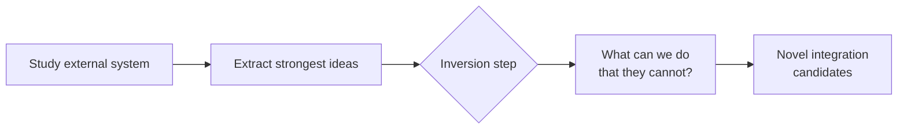

# Inversion Analysis: Surface Capabilities Competitors Cannot Replicate

> Standard competitive analysis imports what works elsewhere. Inversion asks what your architecture enables that others cannot replicate — producing novel integrations rather than feature parity.

## The standard analysis trap

The default question when studying an external system — "what does X do well that we should adopt?" — produces convergence: everyone copies the same surface patterns.

Inversion breaks this. After extracting the strongest ideas, ask:

> "What can we do with our unique primitives that the external system simply could not do?"

The answer identifies capability gaps that competitors' architectures structurally preclude — the Jacobi/Munger inversion mental model ("many hard problems are best solved only when they are addressed backwards", [Farnam Street](https://fs.blog/inversion/)) applied to architectural differentiation.

## The three-step method

Step 3 in a major-feature workflow from the [Agentic Flywheel](agentic-flywheel.md):

| Step | Question | Output |
|------|----------|--------|
| 1. Study | What does this system do well? | List of architectural strengths |
| 2. Extract | Which ideas are worth carrying forward? | Filtered pattern list |
| 3. Invert | What do our primitives enable that theirs foreclose? | Novel capability candidates |

Without Step 3, the output is imitation; with it, differentiation.

## What makes a primitive unique

A primitive qualifies as unique when it enables or precludes a class of patterns:

| Primitive | Pattern it enables | What it precludes for others |
|-----------|-------------------|------------------------------|
| Parallel context windows (multi-agent) | Independent subagent execution without [context pollution](../anti-patterns/session-partitioning.md) | Single-agent architectures must serialize or share context |
| JSONL bead storage + advisory locks | Durable, resumable task graphs | In-memory context cannot survive process restart or be locked |
| [Dynamic Tool Discovery](../anti-patterns/dynamic-tool-fetching-cache-break.md) | 85% token reduction via on-demand schema loading ([Anthropic, 2025](https://www.anthropic.com/engineering/advanced-tool-use)) | Static tool registration bloats context at session start |
| SequentialAgent / ParallelAgent primitives (ADK) | Constrained orchestration patterns per agent type | Generic agents lack enforced composition boundaries |

## Worked example: NATS versus Agent Flywheel primitives

Inversion against NATS (Go pub/sub):

Study: high-throughput message routing, durable subscriptions, subject-based filtering.

Extract: durable message queues, subject routing for task dispatch, at-least-once delivery.

Invert: NATS routes messages but has no task graph with execution state, resumable context, or advisory locking. The Flywheel's [Code-Native Memory Substrates](code-native-memory-substrates.md) + graph routing + advisory locks enables:

- Tasks that resume mid-execution after failure
- Lock-free parallelism across steps with explicit dependency edges
- Context snapshots at each bead for downstream retrieval

NATS cannot replicate this without rebuilding around an execution-state model.

## Applying inversion to agent architecture

Apply during:

- [Research-plan-implement](../../workflows/research-plan-implement.md) — invert against the reference system before committing to a design
- Architectural planning — invert against the paths not taken when choosing between primitives
- Competitive design reviews — invert before matching a competitor feature to verify it is the right goal

Example questions:

- "Sub-agents with independent context windows — what workflows does this enable that single-agent architectures cannot support without serializing context?"
- "A bead store that survives process restart — what recovery patterns does this enable that in-memory context cannot?"
- "On-demand schema loading — what does this enable that a static 200-tool context cannot?"

## Why it works

Inversion works because architectural constraints are asymmetric. A system's foundational model determines what it cannot do, not its feature set. A competitor can copy a UI, a pricing tier, or a workflow. But replicating a structural primitive — a bead store, an advisory lock model, parallel context windows — requires rebuilding core infrastructure. The inversion question forces analysis at the layer where structural constraints live, and skips the surface-level feature comparison that standard competitive analysis produces.

## When this backfires

Inversion produces poor results when applied to weak structural differences:

- Shared primitives: Teams on commodity LLM wrappers share nearly all primitives with competitors. Inversions exist in name only, because the same architecture is replicable overnight.
- Novelty bias: Enthusiastic inversion can justify keeping unusual primitives because they are unique, even when a [standard SE-pattern approach](classical-se-patterns-agent-analogues.md) would serve better. Structural preclusivity does not imply value.
- Reference system mismatch: Inverting against a system in a different domain (for example, a batch pipeline versus a real-time agent) yields false differentiation. The competitor never intended to support those patterns, rather than being unable to.
- Premature commitment: Running inversion before you study the external system enough produces shallow outputs. Step 1 (Study) must be thorough or Step 3 (Invert) generates noise.

## Key Takeaways

- Standard competitive analysis converges on imitation; inversion asks what your primitives enable that others structurally cannot replicate.
- Inversion is Step 3 of a study → extract → invert sequence; without it, the output is feature parity rather than differentiation.
- A primitive is worth inverting against only when it enables or precludes a class of patterns — shared, commodity primitives produce false differentiation.
- The mechanism is asymmetry: surface features can be copied overnight, but structural primitives require rebuilding core infrastructure.
- Inversion backfires when applied to weak structural differences, when novelty bias justifies unusual primitives for their own sake, or when Step 1 (Study) is shallow.

## Related

- [Agentic Flywheel](agentic-flywheel.md)
- [Cross-Vendor Competitive Routing](cross-vendor-competitive-routing.md)
- [Convergence Detection](../../loop-engineering/convergence-detection.md)
- [Classical SE Patterns and Agent Analogues](classical-se-patterns-agent-analogues.md)
- [Open Agent School Pattern Mapping](open-agent-school-pattern-mapping.md)
- [Code-Native Memory Substrates](code-native-memory-substrates.md)
- [Advanced Tool Use: Scaling Agent Tool Libraries](../../tool-engineering/advanced-tool-use.md)
- [Plan-First Loop](../../workflows/plan-first-loop.md)
