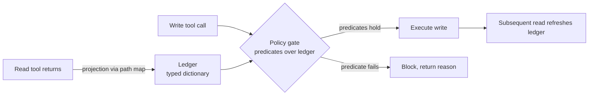

# Structured Task-State Ledger for Tool-Calling Agents (LedgerAgent)

> Maintain task state as a typed dictionary outside the prompt and gate write tools against executable policy predicates over ledger fields.

## When the ledger pays back

The pattern fits one specific shape of agent and is wasted everywhere else. Apply it only when all four conditions hold ([Uddin et al. 2026 — arXiv:2606.20529](https://arxiv.org/abs/2606.20529)):

- Structured tool returns. The domain's read tools return records with stable, addressable fields (`orders.1234.status`, `customers.5678.tier`). Free-text returns, ranked search results, and generated summaries do not project cleanly into a typed dictionary.
- Codified domain policy. The workflow has rules a developer can write as predicates over entity state — ownership, eligibility, payment consistency, entity-state preconditions. If policy lives only as natural-language guidance, there is nothing to compile into a gate.
- Multi-turn, multi-trial reliability gap. The headline benefit is on `pass^k` — the chance that all `k` independent trials of the same task succeed — not average-case `pass@1` ([Yao et al. 2024 — arXiv:2406.12045](https://arxiv.org/abs/2406.12045)). A 90% pass@1 agent drops to about 43% pass^8 (`0.9^8 ≈ 0.43`); the ledger's gain is largest at large `k`.
- Costly bad writes. Environment-changing calls — bookings, refunds, ticket updates — that are expensive to reverse. For idempotent or trivially reversible writes the policy-gate overhead is unrecovered.

The four customer-service domains in the original evaluation — Airline, Retail, Telecom, Telehealth, drawn from τ²-Bench and τ-Trait ([Uddin et al. 2026 — arXiv:2606.20529v1](https://arxiv.org/html/2606.20529v1)) — fit every condition; coding-assistant, exploratory, and one-shot workflows fit none.

## The two-component design

The pattern is a separation move, not a new architecture. The model still calls tools and replies in natural language; two artifacts run alongside it ([Uddin et al. 2026 — arXiv:2606.20529v1](https://arxiv.org/html/2606.20529v1)).



The ledger is a typed dictionary `L: 𝒫 → 𝒱` — paths are canonical addresses, values are the JSON sub-trees returned by read tools. A tool path map defines which fields of which tool return populate which ledger paths; it is written once per API surface and reused across tasks. The ledger updates only from successful read returns — write calls do not touch it until the next read re-observes the post-write state ([Uddin et al. 2026 — arXiv:2606.20529v1](https://arxiv.org/html/2606.20529v1)).

The policy gate is a set of executable predicates over ledger fields, evaluated before every environment-changing tool call. A syntactically valid call that violates an entity-state precondition (canceling an order already canceled, refunding a non-existent payment) is blocked at the boundary with a structured reason returned to the agent. The predicates are domain-level, not task-level — `cancellation_eligibility(order)` is the same predicate for every cancellation task.

## Why it works

Standard tool-calling agents reconstruct task state from the prompt history each turn. Observations, tool returns, and policy text live as scrollable transcript; the model re-attends across the whole turn-window to identify which facts are current. Two failure modes follow. First, attention failure: the model surfaces a stale or wrong observation as if it were current. Second, policy-invisible violation: a call passes type-checking against the tool schema yet violates a policy that depends on entity attributes or session history hidden from the agent's visible context — the failure mode independently characterized by [Wu & Gong 2026 — arXiv:2604.12177](https://arxiv.org/abs/2604.12177).

Projecting tool returns into a typed dictionary closes the first because current state becomes a single lookup rather than a re-attention exercise across thousands of transcript tokens. Moving the policy from prose-in-prompt to executable code over the ledger closes the second because the call is now adjudicated against the same fields the policy depends on, by deterministic code rather than by the model's interpretation of natural-language rules ([Uddin et al. 2026 — arXiv:2606.20529](https://arxiv.org/abs/2606.20529)). The gain shows up most under `pass^k` (all `k` trials succeed) because variance in attention and prompt re-reading is the dominant source of cross-trial inconsistency the design removes — reported average gains over function-calling baselines of +3.4 pass^1 / +5.6 pass^4 on Kimi-K2.5, +4.7 / +7.6 pass^1 on GLM-5, and +12.2 / +15.5 pass^1 on GPT-4.1 and GPT-5.2 respectively ([Uddin et al. 2026 — arXiv:2606.20529v1](https://arxiv.org/html/2606.20529v1)).

The policy-gate half is independently corroborated by deterministic pre-action authorization work — the Open Agent Passport (OAP) intercepts tool calls synchronously, evaluates them against a declarative policy, and enforces decisions at a measured 53 ms median (N=1,000) per call ([Uchibeke 2026 — arXiv:2603.20953](https://arxiv.org/abs/2603.20953)).

## When this backfires

The ledger is not a default upgrade. It adds cost without payback, or actively misleads, under these conditions:

- Unstructured tool returns. Tools that return free text — search results, customer-service notes, generated summaries — have no clean path → value projection. The ledger becomes a lossy parse layer whose entries no longer mean what the source said ([Uddin et al. 2026 — arXiv:2606.20529v1](https://arxiv.org/html/2606.20529v1)).
- No codified policy. Coding assistants, exploratory research agents, and IDE actions have no `ownership(order)` or `eligibility(account)` predicate set. Writing predicates for a workflow that has none is gold-plating that ages with every product change.
- Write-dominated workflows. Because the ledger only updates from read returns, a workflow dominated by writes (booking creation, ticket updates) reads an increasingly stale ledger until a read refreshes it — the staleness failure mode the pattern is meant to prevent, restored at a different layer ([Uddin et al. 2026 — arXiv:2606.20529v1](https://arxiv.org/html/2606.20529v1)).
- Single-turn or single-read interactions. Schema and tool-path-map cost is amortized over many turns where the ledger replaces re-reading the transcript. A two-turn agent never reuses the ledger.
- Native function-calling already saturates. On τ-bench, native function-calling outperforms ReAct and Act for every model that supports it — explicit reasoning steps add tokens and latency without accuracy gain on this benchmark ([Yao et al. 2024 — arXiv:2406.12045](https://arxiv.org/abs/2406.12045)). When the model already handles state implicitly, the ledger adds infrastructure for a problem the workload no longer has.
- Evaluation-time alternative. Proxy-state evaluation attacks the verifiable-reward problem from a different angle — an LLM state tracker infers a structured proxy state from interaction traces and LLM judges verify goal completion against it, replacing the deterministic database the ledger needs ([Chuang et al. 2026 — arXiv:2602.16246](https://arxiv.org/abs/2602.16246)). For teams building eval infrastructure rather than runtime gates, a proxy-state evaluator targets the same multi-turn-state failure without an inference-time framework.
- The paper's stated limit. The method cannot certify facts the agent has not retrieved — predicates evaluate only over what reads have populated. A bug requiring a fact never fetched fails open ([Uddin et al. 2026 — arXiv:2606.20529v1](https://arxiv.org/html/2606.20529v1)).

## Example

A customer-service agent receives "Cancel order 1234, refund to original payment." Standard prompt-only flow:

```
Turn 1: user → "Cancel order 1234, refund to original payment."
Turn 2: agent → get_order(1234)
Turn 3: tool → {"id": 1234, "status": "shipped", "customer_id": 9, "payment_id": "pi_X", ...}
Turn 4: agent → cancel_order(1234)            # ← syntactically valid; policy says shipped orders cannot be cancelled without manager approval
Turn 5: tool → success
Turn 6: agent → refund_payment("pi_X")        # ← refund issued against a now-uncancellable shipment
```

The policy text was in the system prompt; the order status came back four turns ago. The agent re-derived state from the transcript and missed the precondition.

With a structured task-state ledger and policy gate:

```
Turn 2: agent → get_order(1234)
        ledger ← {"orders.1234": {"status": "shipped", "customer_id": 9, "payment_id": "pi_X"}}
Turn 4: agent → cancel_order(1234)
        gate evaluates: status == "shipped" → predicate cancellation_eligibility(orders.1234) fails
        gate returns: {"blocked": true, "reason": "order shipped; requires manager approval"}
Turn 5: agent → escalate_to_manager(...)
```

The same model on the same transcript can no longer issue the policy-violating call — the gate runs against ledger state, not prose. Across `k` independent trials the gate's verdict is identical, which is why the gain concentrates in `pass^k`.

## Key Takeaways

- A structured task-state ledger pays back only under all four conditions: structured tool returns, codified domain policy, multi-turn reliability gap, and costly bad writes.
- Two artefacts per domain — a tool path map (read-tool field → ledger path) and a set of executable predicates over ledger fields — written once per API surface, reused across tasks.
- The reliability gain concentrates in `pass^k` (all-`k`-trials succeed), not `pass@1`. If a workload is not evaluated under multi-trial consistency, the headline numbers will not reflect the benefit.
- The pattern cannot certify facts the agent never fetched, and the ledger goes stale under write-dominated workflows — pair with a [sibling work-state ledger](../../instructions/acknowledged-debt-ledger.md) or write-through observers when staleness is the dominant risk.

## Related

- [Verification Ledger for Tracking Agent Output Quality](../../verification/verification-ledger.md) — sibling ledger pattern; records *what was checked*, where this records *what the world looks like*.
- [Acknowledged-Debt Ledger with Next-Trigger Conditions](../../instructions/acknowledged-debt-ledger.md) — sibling; records *deferred work* indexed by re-evaluation trigger.
- [Code-Native Memory Substrates](code-native-memory-substrates.md) — adjacent; records *code state* in machine-readable structures rather than free text.
- [Memory Retrieval as a Control Decision](memory-retrieval-as-control.md) — the abstention / gating discipline applied to retrieval rather than to writes.
- [Behavioral Firewall for Tool-Call Trajectories](../../security/behavioral-firewall-tool-call-trajectories.md) — the security-side counterpart: pre-action gating over tool-call sequences, not over ledger state.
- [CoALA Structured Action Space: Internal vs External Actions](coala-structured-action-space.md) — the internal/external action boundary that surfaces where a policy gate belongs.
- [ACID for Agent Repository State](acid-for-agent-repository-state.md) — the consistency-and-durability framing for *repository* state that this pattern parallels for *domain* state.
- [Epistemic Working Memory for Multi-Hop Reasoning (SLEUTH)](epistemic-working-memory-multi-hop-reasoning.md) — sibling ledger for investigative retrieval; tracks facts, hypotheses, and open questions instead of gating writes.
