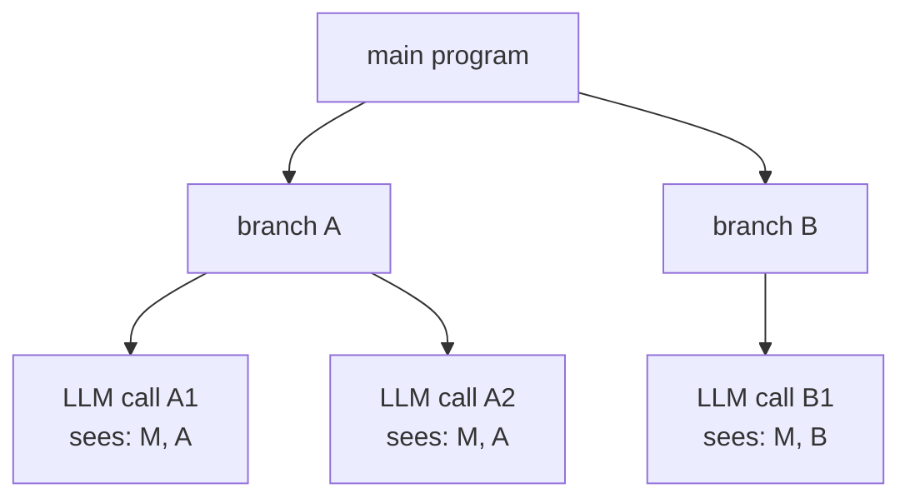

# LLM-as-Code Agentic Programming for Agent Harnesses

> When the workflow shape is enumerable, the program holds control flow and the LLM is a callable component inside an agent harness.

## The conditions that have to hold

This argument inverts the default harness shape. A program holds the loops, branching, sequencing, and stop conditions. The model is called only at the steps that need probabilistic reasoning. It pays back when three preconditions hold ([Qi et al., 2026](https://arxiv.org/abs/2606.15874)):

- Enumerable control flow. The steps and their branches are knowable up front. A program that handles them does not become a sprawling switch statement at the first surprise.
- Per-step uncertainty contained to the model call. The genuinely uncertain decision is what this construct maps to, not what the agent should do next.
- Repeated execution. The cost of encoding the orchestration amortizes over many runs — the same calculus that drives [cost-aware agent design](../../token-engineering/cost-aware-agent-design.md).

Without these, the right architecture is the alternative: an LLM-controlled loop that re-plans on what it observes. The [SWE-bench Verified Agentic Coding leaderboard](https://llm-stats.com/benchmarks/swe-bench-verified-(agentic-coding)) shows iterative agent scaffolds still leading on open-ended repair, where the path depends on findings revealed only at runtime.

## Where the LLM sits in this design

The model is a function the program calls — neither the conductor nor the loop. It owns translation choices, classification, disambiguation, and the interpretation of failures. Everything else stays in code: what to call next, when to retry, when to stop, and what survives between steps. This is the same line [cognitive reasoning vs execution separation](cognitive-reasoning-execution-separation.md) draws between layers, pushed one step further. The layer that decides which step to take next is the program, not a second reasoning model.

## Context as a call tree, not a transcript

The novel piece of the [Qi et al. (2026)](https://arxiv.org/abs/2606.15874) argument is the shape of context. An LLM-controlled orchestrator's context grows linearly with the number of steps taken — every prior tool call, observation, and reasoning trace accumulates in the window. A program-controlled harness builds context from the execution call tree instead: each model call sees only its enclosing branch of the DAG, so context length scales with call depth rather than sequence length.



Under LLM-as-orchestrator, the equivalent diagram would carry `M`, `A`, and `B` context, plus every prior call's tool outputs, into every node — context grows with the sequence, not the depth. This asymmetry removes the "context bloat scales with steps" failure mode that the paper names as architectural rather than tunable. Two long-running siblings do not pollute each other's window, and a single call carries only the ancestors it logically depends on. The [discrete phase separation](discrete-phase-separation.md) pattern applies the same idea at the conversation level — only distilled artifacts cross a phase boundary — and here it runs inside one harness.

## Why it works

Three mechanisms explain why a program-controlled harness cuts token cost and improves stability when the preconditions hold.

Token amplification disappears. An LLM-controlled orchestrator pays full context on every step, even mechanical ones — instructions, tool registry, prior calls, and reasoning traces. A program-controlled harness calls the model only at the steps that need one, replacing N full-context turns with K << N targeted prompts. [Lwin and Kumar's controlled study of COBOL-to-Python](https://arxiv.org/abs/2605.09894) measured up to 3.5x token reduction, holding model, prompt, and source constant and varying only execution control.

Variance collapses to the model call. Every LLM-controlled decision point adds a stochastic branch, so the outcome distribution widens multiplicatively across steps. Fixing branches in code collapses that distribution to the variance of the model call itself. This is why worst-case stability improves without average-case accuracy dropping ([Lwin & Kumar, 2026](https://arxiv.org/abs/2605.09894)).

Context length decouples from step count. Long-horizon runs no longer degrade as the window fills. The [Qi et al. (2026)](https://arxiv.org/abs/2606.15874) computer-use case study reports much better stability on long visual operation sequences. Anthropic's [building effective agents guidance](https://www.anthropic.com/research/building-effective-agents) recommends workflows for well-defined tasks for the same reason. The LLM-as-Code contribution is the framing: token explosion and unreliable completion stop being prompt bugs to tune and become consequences of the orchestration shape itself, sitting in the orchestration dimension of [harness design dimensions](harness-design-dimensions.md).

## When this backfires

The pattern is conditional, not universal. It backfires on workloads that violate its preconditions.

- Open-ended exploration with no enumerable branches. When the fix path depends on findings revealed only at runtime — bug repair across an unfamiliar codebase, or exploratory research — a program-controlled harness hits paths it does not have. The [SWE-bench Verified Agentic Coding](https://llm-stats.com/benchmarks/swe-bench-verified-(agentic-coding)) results put iterative agent scaffolds ahead of constrained pipelines on raw accuracy for open-ended repair. The [agentless-vs-autonomous](agentless-vs-autonomous.md) asymmetry shows the deterministic win is one of cost and variance, not an accuracy ceiling.
- One-off jobs. The orchestration code pays back only across many runs. For a single migration or a one-shot research query, the engineering cost of building the program scaffold exceeds the token cost of an agentic run.
- Evolving workflow shape. Iterating on the workflow itself — early product exploration, fast experimentation — is cheaper through prompt edits than through code changes, code review, and redeploy. The cost is paid in [harness engineering](harness-engineering.md) time, not in tokens.
- Tasks with no stable abstraction at the call-tree level. If every node in the call tree is itself an open-ended LLM decision, the DAG context model collapses back to linear accumulation and the inversion buys nothing.
- Mid-execution discovery. When the workflow's shape depends on observations the program does not anticipate — "this program calls an undocumented vendor library" — an LLM-controlled agent re-plans, while a program-controlled one needs a code change. This is the [agentless-vs-autonomous](agentless-vs-autonomous.md) trade-off in miniature.

A middle ground — graph frameworks like [LangGraph](https://docs.langchain.com/oss/python/langgraph/overview) — gives the program explicit control flow while letting the LLM re-enter at named nodes, choosing within bounded options. That hybrid resists the pure programs-hold-everything framing but inherits the same precondition: the graph still has to be enumerable enough to encode.

## Example

A computer-use harness that fills out a multi-page form illustrates the inversion. The program owns the page sequence and the field iteration; the model owns reading each field's label and choosing the right value — the kind of long visual operation sequence the paper's case study targets.

```python
# Program-controlled harness — the workflow shape is in code
def fill_application_form(application_data: dict) -> Result:
    page = open_form_page()                              # no LLM
    for page_index in range(page.total_pages):           # no LLM
        fields = enumerate_form_fields(page)             # no LLM
        for field in fields:                             # no LLM
            label = read_field_label(field)              # no LLM
            value = llm.choose_value(label, application_data)  # LLM: classification
            type_into_field(field, value)                # no LLM
        if not validate_page(page):                      # no LLM
            error = llm.explain_validation_error(page)   # LLM: interpretation
            raise FormError(error)
        page = advance_to_next_page(page)                # no LLM
    return submit_form(page)                             # no LLM
```

Each LLM call sees only the field it is choosing for, the application data, and its enclosing branch — a small slice of the call tree, not the accumulated history of every field touched. The same task under LLM-as-orchestrator would carry every prior label, value, and validation result in context on every step, and the token bill scales with page count.

## Key Takeaways

- Hand control flow back to the program when the workflow shape is enumerable, per-step uncertainty is contained, and the orchestration cost amortizes across runs — three preconditions that frame this as a conditional pattern, not a universal recommendation ([Qi et al., 2026](https://arxiv.org/abs/2606.15874)).
- The mechanism is token amplification and variance collapse, plus the call-tree context shape that decouples context length from sequence length — not "LLMs are bad at orchestration."
- Empirical anchor: up to 3.5x lower token cost and improved worst-case robustness with comparable accuracy on COBOL-to-Python under deterministic orchestration ([Lwin & Kumar, 2026](https://arxiv.org/abs/2605.09894)); stability gains on long visual operation sequences in the call-tree case study.
- The pattern backfires on open-ended exploration, one-off jobs, evolving workflows, and tasks with no stable call-tree abstraction — match the orchestration strategy to the task structure, not to fashion.
- Iterative LLM-controlled scaffolds still lead the [SWE-bench Verified Agentic Coding leaderboard](https://llm-stats.com/benchmarks/swe-bench-verified-(agentic-coding)) on open-ended repair; the inversion's win is cost and variance, not raw accuracy.

## Related

- [Deterministic Orchestration for Structured Modernization](deterministic-orchestration-structured-modernization.md) — The narrow legacy-modernization application of the same inversion, with the cost study that anchors the mechanism
- [Cognitive Reasoning vs Execution: A Two-Layer Agent Architecture](cognitive-reasoning-execution-separation.md) — The layer split that makes the inversion possible; this page pushes the boundary one step further by putting orchestration in the program
- [Agentless vs Autonomous: When Simple Beats Complex](agentless-vs-autonomous.md) — The same trade-off framed at SWE-bench scale, with the asymmetry between cost-win and accuracy-win made explicit
- [Harness Design Dimensions and Archetypes](harness-design-dimensions.md) — Where this pattern sits in the orchestration dimension of the population-level harness taxonomy
- [Stochastic vs Deterministic Boundary](stochastic-deterministic-boundary.md) — Where the LLM call hands off to deterministic code, and how to design that interface
- [Discrete Phase Separation](discrete-phase-separation.md) — The same context-isolation idea applied at conversation phase boundaries instead of within one harness
- [Cost-Aware Agent Design](../../token-engineering/cost-aware-agent-design.md) — The amortization calculus that decides when the engineering cost of program-controlled orchestration pays back
