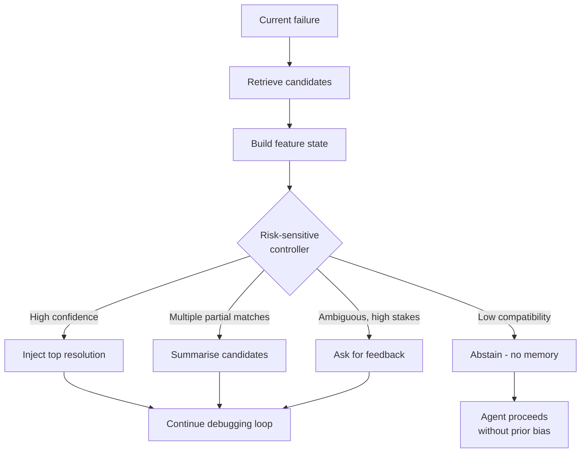

# Memory Retrieval as a Control Decision

> Treat memory injection as a control decision — abstain, gate, or utility-rank retrieved memory before it shapes an action, rather than always injecting top-k.

Standard agent memory returns the top `k` most similar entries by embedding distance and injects them into context. That treats memory as a search problem. It is not: retrieved memory helps only when the current situation is genuinely compatible with a stored one, and superficial similarity can drag a multi-turn loop down the wrong path before recovery.

Three control disciplines reframe the question from which memory is most similar to whether and how any retrieved memory should influence the trajectory. Each attacks the same point — the moment between retrieval and action — from a different angle: [RSCB-MC's abstention](#abstention-aware-retrieval) lets a risk-sensitive controller decline to inject, [PROJECTMEM's pre-action gate](#memory-as-governance-pre-action-gate) is a deterministic harness check that fires before a tool call, and [MemRL's utility scoring](#utility-scored-retrieval-memrl) re-ranks candidates by historical effectiveness. All three are control layers in front of a memory store, not retrieval mechanics themselves.

## Abstention-aware retrieval

A missed reuse costs one extra debugging round, but a confidently injected wrong episode can compound across turns. Abstention-aware retrieval treats injection as a control decision with an asymmetric loss — abstaining is a first-class action when retrieved evidence is unsafe to inject ([Iscan, 2026 — arXiv:2604.27283](https://arxiv.org/abs/2604.27283)).

A risk-sensitive controller (RSCB-MC) chooses among several actions on every retrieval, not just "return top-k":

- No memory — proceed without injection
- Inject the top resolution — high-confidence single-episode reuse
- Summarize multiple candidates — when several episodes are partially relevant
- High-precision retrieval — narrow filters, fewer candidates
- High-recall retrieval — broader search when uncertain
- Abstain — explicitly decline to inject and signal low confidence
- Ask for feedback — escalate to the user when stakes are high and signal is ambiguous

The controller cannot decide on similarity alone. RSCB-MC converts each retrieval into a 16-feature contextual state covering relevance (embedding distance, lexical overlap), uncertainty (candidate disagreement, score spread), structural compatibility (does the stored fix apply to the current code shape, framework, or environment), feedback history (how often this episode helped before), false-positive risk (historical rate at which similar matches misled), and latency/token cost. Feedback history and false-positive risk require tracking outcomes over time, so this is a learning system, not a static scoring layer ([Iscan, 2026](https://arxiv.org/abs/2604.27283)).

The reward function shapes everything. Symmetric loss recovers top-k behavior; the RSCB-MC reward penalizes false-positive injection more strongly than missed reuse, which makes "no memory" and "abstain" the safe defaults under uncertainty. In bounded smoke-scale and 200-case hot-path validations, RSCB-MC reports a 62.5% offline replay success rate and 60.5% proxy success rate, both at 0.0% false-positive injection and a 331-microsecond p95 decision latency ([Iscan, 2026](https://arxiv.org/abs/2604.27283)). These are deterministic local artifacts, not production deployments — the principle transfers, not the absolute numbers.



When this backfires. A per-retrieval controller decides one injection at a time and does not defend against risks that emerge as memory accumulates. Al-Tawaha et al. describe temporal memory contamination, where unsafe behavior grows with memory size even when each retrieval looks benign — memory safety is a longitudinal property, not a single-retrieval filter ([Al-Tawaha et al., 2026 — arXiv:2605.17830](https://arxiv.org/abs/2605.17830)). Pair abstention-aware retrieval with periodic memory audits when stores persist across sessions. It also adds cost without value when the store is small and homogeneous, when feedback is sparse, during cold-start, or in latency-sensitive paths.

## Memory-as-governance pre-action gate

Abstention controls injection at retrieval; the pre-action gate moves the check into the harness, firing before the agent edits a file or applies a previously-tried fix. The harness consults an append-only event log and emits a structured warning when the proposed action matches a recorded failure or a known-fragile target ([Malo & Qiu, 2026 — arXiv:2606.12329](https://arxiv.org/abs/2606.12329)).

The PROJECTMEM design has three components:

- Append-only event log — typed records of issues, attempts, fixes, decisions, and notes stored locally on disk. No telemetry, no cloud round-trip; the log doubles as a provenance trail.
- Summary projection layer — read tools that project the event log into compact [summaries the agent consumes on demand](memory-synthesis-execution-logs.md). Only summaries enter context, never raw events.
- Deterministic pre-action gate — a harness check that fires before a tool call. It consults the log and emits a structured warning when the proposed action matches a recorded failure or a fragile-file label; the warning re-enters the agent's context.

Independent proposals describe the same structural move: SSGM frames it as Governance Middleware over agent–memory interactions with constrained retrieval, gated writing, and asynchronous reconciliation ([Wang et al. 2026 — arXiv:2603.11768](https://arxiv.org/abs/2603.11768)); Springdrift implements it with auditable axiom trails in a 23-day single-operator case study ([Springdrift, 2026 — arXiv:2604.04660](https://arxiv.org/abs/2604.04660)). Multiple implementations, equally thin empirical evidence under each.

## Why the pre-action gate works and when it backfires

A query-only memory layer is structurally bypassable: the agent decides when to consult, and under context pressure it skips consultation precisely when consultation matters most. Moving the check into the harness reframes it as an enforced precondition — the same mechanism that makes pre-commit hooks load-bearing. What is mechanistically real is the gate's enforcement; what is unproven is that its signal — a match against a possibly-stale event entry — is fresh enough often enough to be net-positive.

When this backfires. PROJECTMEM ships with no comparison baseline; treat the gate as a conditional optimization, not a default. The binding constraint is signal freshness: frontier models reach only 55.2% overall accuracy at detecting when their own memories are out of date ([Karras et al. 2026 — STALE](https://arxiv.org/abs/2605.06527)), so an eviction or TTL discipline is mandatory. The dominant failure is stale-rule lockout — a fix that failed three months ago against a since-refactored module is no longer "previously tried" in any useful sense, but the gate fires confidently and blocks the fresh attempt that would now succeed. Cross-agent attribution ambiguity compounds this: when several agents share one log, a recorded failure does not tell the next agent whether the prior attempt failed from a real defect or a model limitation. Anchor on verifier-layer signals (tests, linters, type-checkers, CI) first — they are verifiable against current state and the gate adds value only when its failure mode is not already caught there.

| Approach | Pros | Cons |
|----------|------|------|
| Pre-action gate (PROJECTMEM-style) | Deterministic enforcement; cannot be skipped under context pressure; local-first, auditable provenance | Self-study evidence only; stale-entry lockout; cross-agent attribution ambiguity; needs eviction/TTL |
| Query-only memory (RAG over logs) | Cheap; agent decides when to consult | Structurally bypassable under context pressure |
| Verifier-layer signals only (tests, CI) | Verifiable against current state; mature tooling; no staleness | Catches the failure only after the agent tries it |

## Utility-scored retrieval (MemRL)

Where abstention and the gate decide whether to inject, utility scoring decides which candidate ranks first by making historical effectiveness a retrieval signal. Standard RAG retrieves by embedding distance, assuming similar implies useful — which fails on distractor memories: entries that rank highly by cosine similarity but represent approaches with a bad performance history. Retrieving them actively misleads the agent toward known-failed paths ([Zhang, Wang et al., 2026 — arXiv:2601.03192](https://arxiv.org/abs/2601.03192)).

Each MemRL entry holds three fields:

| Field | Content |
|-------|---------|
| Intent | Embedded representation of the original query or goal |
| Experience | The solution trace — steps attempted and their outcomes |
| Utility | A learned score reflecting historical performance, updated from outcome signals |

Retrieval separates semantic matching from effectiveness ranking. Phase 1 (semantic filter) uses embedding distance to retrieve a candidate pool. Phase 2 (utility re-ranking) sorts that pool by utility score, surfacing historically-effective entries above semantically-identical but poorly-performing ones. Semantic filtering alone promotes distractors; utility filtering alone retrieves effective-but-irrelevant experiences. The two phases together solve what neither solves alone.

Utility scores update via temporal difference learning after each episode resolves:

```
mem.utility += learning_rate × (reward - mem.utility)
```

A successful outcome pulls the score up, a failure pulls it down, and over multiple episodes scores converge toward true average effectiveness per problem class. This is reinforcement learning applied to the memory index rather than to model weights — no fine-tuning step, no catastrophic forgetting, no retraining cost. The same family of approaches was demonstrated by Reflexion, which lifted HumanEval pass@1 from a GPT-4 baseline of 80% to 91% via verbal RL over an episodic memory buffer without modifying weights ([Shinn et al., 2023 — arXiv:2303.11366](https://arxiv.org/abs/2303.11366)). MemRL extends this by replacing verbal reflection with quantitative utility scores, enabling retrieval-time re-ranking rather than context-stuffing. This matches the [context layer](continual-learning-layers.md) in the three-layer continual learning taxonomy — the cheapest, most reversible update target.

| Approach | What updates | Catastrophic forgetting | Cost |
|----------|-------------|------------------------|------|
| Fine-tuning (SFT/RL) | Model weights | Yes | High |
| Standard RAG | External corpus | No | Low |
| MemRL | Memory utility scores | No | Low |

When this backfires. Utility updates depend on reliable outcome signals — tasks where "success" is ambiguous produce noisy estimates that degrade retrieval. The cold-start problem means early performance is effectively standard RAG until enough episodes establish a score distribution. Without pruning, the memory bank grows continuously. And for highly diverse problem spaces where each task is essentially unique, utility scores transfer poorly and re-ranking adds little over pure semantic retrieval ([cross-domain reuse](memory-transfer-learning.md) is its own caveat).

## Example

A repair-trace memory store accumulates fixes across a polyglot monorepo. A failing Python pytest run produces a `ConnectionRefusedError`, and the top retrieved episode is a Node.js test that hit the same exception class against a different mock harness.

Top-k behavior — the agent injects the Node.js episode, infers it should mock the connection at the network layer, and spends three turns applying a JavaScript-shaped fix to a Python codebase before recovering.

Control-layer behavior — abstention's structural-compatibility feature scores the language and framework mismatch low and chooses abstain; or utility scoring demotes the episode after past failures; or the pre-action gate warns that this fix-class previously failed here. The agent debugs from scratch and stores a clean Python-specific episode. The cost of abstaining was one missed reuse; the cost of injecting would have been three wasted turns plus a polluted memory entry.

## Key Takeaways

- Top-k retrieval optimizes for similarity; control-layer retrieval optimizes for safety and effectiveness before the agent acts on what was retrieved.
- Abstention makes "no memory" a first-class action under an asymmetric loss; the pre-action gate enforces a deterministic harness check that cannot be skipped under context pressure; utility scoring demotes historically-failed candidates by re-ranking on outcome history.
- All three are conditional optimizations, not defaults — they earn their overhead when stores are large and heterogeneous, feedback signals support learning, and false positives are expensive.
- Signal freshness is the shared binding constraint: agents detect stale memory poorly, so eviction/TTL discipline and verifier-layer anchoring are mandatory companions.

## Related

- [Episodic Memory Retrieval](episodic-memory-retrieval.md) — what to store and how to retrieve; this page covers whether and how to inject what was retrieved
- [Agent Memory Patterns: Learning Across Conversations](agent-memory-patterns.md) — structural memory architecture these control layers sit in front of
- [Subtask-Level Memory for Software Engineering Agents](subtask-level-memory.md) — finer retrieval granularity that reduces but does not eliminate false-positive risk
- [Memory Synthesis from Execution Logs](memory-synthesis-execution-logs.md) — extracting reusable lessons from traces that these controllers decide whether to inject
- [Code-Native Memory Substrates](code-native-memory-substrates.md) — the calibrated-silence mechanism a typed memory layer uses; abstention generalizes to that retriever
- [Continual Learning for AI Agents](continual-learning-layers.md) — three-layer taxonomy locating utility scoring at the cheapest, most reversible context layer
- [Memory Transfer Learning](memory-transfer-learning.md) — cross-domain reuse and when utility scores transfer poorly
- [Layered Mutability: Governing Persistent Self-Modifying Agents](layered-mutability.md) — where governance attaches in persistent agents; the pre-action gate is one attachment point
  - long-form
