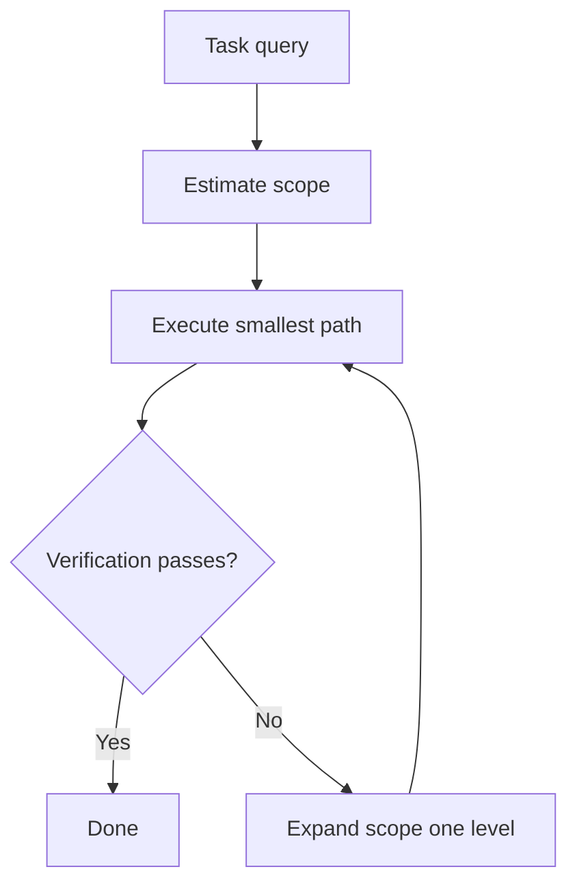

# Minimum-Sufficient Execution: Estimate Scope Before Spending Budget

> Estimate a task's scope first, run the smallest path likely to pass verification, and expand only when it fails.

Minimum-sufficient execution is the principle that an agent should gather only the information a task truly needs, then act — instead of reading every file and dependency before making a one-line edit. The operational loop for it is E3 (Estimate, Execute, Expand): judge the task's scope, run the cheapest trajectory that should satisfy the verification check, and widen the search one level at a time only when verification fails ([Yin & Feng, arXiv:2607.13034](https://arxiv.org/abs/2607.13034)).

## When it applies

This pattern pays off under specific conditions, not universally:

- A cheap, reliable verification signal exists. Expand only fires when verification fails, so tests, a compiler, or a type check must be able to catch an under-scoped edit. Without that trigger, a minimal path has no way to know it was too small.
- Reading dominates cost. The savings come from files not inspected, so the gain is real only where context-gathering is the expensive part of a task, as in cost- or latency-sensitive workloads.
- Localized edits are common. The largest redundancy sits on simple tasks — a max-context-first policy scored an [Agent Cognitive Redundancy Ratio](https://arxiv.org/abs/2607.13034) of 22.1 on single-file edits versus 5.4 on repository-wide refactors, so a task mix weighted toward small changes benefits most.

One caveat frames all three: the waste this pattern targets is largely a simulation result. In a real-model check with GPT-4o on the `toml` library, frontier models were "markedly more conservative than simulated worst-case scenarios," inspecting only 1–4 files even when told to read everything first, and E3's savings shrank to 4–18% ([Yin & Feng, arXiv:2607.13034](https://arxiv.org/abs/2607.13034)). Treat it as a discipline for the common case, not a promise of an order-of-magnitude cut on a modern agent.

## The E3 loop

- Estimate: read lexical cues in the request plus one optional probe to set an operating point — difficulty, scope, risk, confidence. A phrase like "replace the second icon with the first one's markup" signals a localized edit; "refactor across the codebase" signals repository-wide work ([arXiv:2607.13034](https://arxiv.org/abs/2607.13034)).
- Execute: run the smallest trajectory likely to pass verification. At the lowest level it edits a single localized site; higher levels reuse cached searches and trace imports to indirect sites.
- Expand: on a failed check or low confidence, raise the scope one level and replan without restarting — reusing what was already learned, so the search degrades gracefully toward an exhaustive strategy only when the task demands it.

## Why it works

Cost scales with the context an agent gathers, and for a localized task most of that context is causally irrelevant to the edit. Reading files that do not affect the edit adds cost without changing the output. The Agent Cognitive Redundancy Ratio makes the gap explicit: ACRR = (C_act − C_min) / C_min, the actual trajectory cost over the oracle-defined minimum-sufficient cost, so an ACRR of 4 means five times the necessary effort was spent ([Yin & Feng, arXiv:2607.13034](https://arxiv.org/abs/2607.13034)).

Starting minimal and expanding only on failure converges to near-oracle cost on common simple tasks while still reaching exhaustive strategies on the rare hard one. On MSE-Bench (121 deterministic code edits), E3 held ACRR at 0.55 versus a max-context-first policy's 12.9 while both solved 100% of tasks, cutting cost 85% and inspected files 92% ([arXiv:2607.13034](https://arxiv.org/abs/2607.13034)). It is the same mechanism behind "start simple, add complexity only when it improves outcomes": pay for capability when a failure names the need, not before.

## When this backfires

- Hidden coupling a minimal path cannot see. MSE-Bench models indirect edit sites only through import aliases; dynamic dispatch, configuration coupling, and runtime reflection are explicitly unmodeled ([arXiv:2607.13034](https://arxiv.org/abs/2607.13034)). In a codebase full of those, a minimum-viable path edits what it found, passes a weak check, and ships a silently incomplete change.
- Deceptive wording that hides real scope. The transparent lexical estimator deliberately under-scopes these tasks, and its accuracy fell from 85.1% to 66.9% on held-out paraphrased wording — the agent then pays extra Expand round-trips to recover what a broader first read would have found ([arXiv:2607.13034](https://arxiv.org/abs/2607.13034)).
- Weak or absent verification. Expand needs a failing check to fire. When verification is weak, under-scoping produces a confidently-wrong minimal edit with nothing to trigger the correction — the [trust-without-verify](../anti-patterns/trust-without-verify.md) surface.
- Modern agents that already read conservatively. The simulated 12.9 ACRR does not appear in frontier models, which inspect few files by default, so the pattern's payoff on a current agent is a modest trim, not the headline reduction.

## Example

The paper's motivating case is a single-file Gmail-icon swap whose oracle minimum-sufficient cost is 6.0. E3 estimates a localized edit, inspects zero irrelevant files, and lands an ACRR of 0.59. A max-context-first policy reads all seven project files first and reaches an ACRR of 10.1 — the same correct edit, produced at more than ten times the necessary effort ([Yin & Feng, arXiv:2607.13034](https://arxiv.org/abs/2607.13034)). The task did not get harder; the policy just refused to estimate before spending.

## Key Takeaways

- Minimum-sufficient execution gathers only what a task needs: estimate scope, run the smallest path that passes verification, expand only on failure.
- It requires a cheap, reliable verification signal — Expand fires only when a check fails, so weak verification lets an under-scoped edit ship silently.
- The Agent Cognitive Redundancy Ratio, ACRR = (C_act − C_min) / C_min, measures wasted effort against an oracle minimum and is the metric the pattern optimizes.
- The dramatic savings are a simulator result; on real frontier models, already-conservative reading shrinks the gain to 4–18%.
- It under-scopes tasks with hidden coupling (dynamic dispatch, config, reflection) or deceptive wording — read broadly when a wrong edit is expensive and verification is weak.

## Related

- [Task Feasibility Awareness: Stop Before You Start](task-feasibility-awareness.md) — the up-front sibling: judges whether a task is possible at all, where this page judges how much scope a possible task needs.
- [Heuristic-Based Effort Scaling in Agent System Prompts](heuristic-effort-scaling.md) — sets agent and tool-call budgets by complexity tier across tasks; this page governs context gathering within one task.
- [Reasoning Budget Allocation](reasoning-budget-allocation.md) — allocates thinking budget by task difficulty, the reasoning-side counterpart to sizing execution scope.
- [Coding Agent Scope Expansion: When to Extend Beyond the Codebase](coding-agent-scope-expansion.md) — scope across domains, where this page is scope within a single edit.
- [Cost-Aware Agent Design](../../token-engineering/cost-aware-agent-design.md) — the broader cost discipline that minimum-sufficient execution operationalizes for context gathering.
