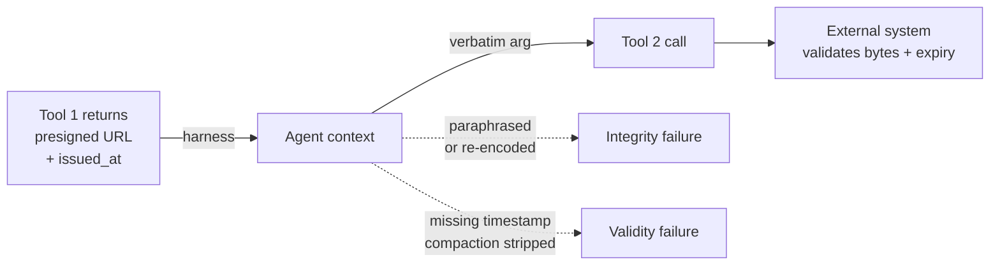

# Observation Contract Preservation in Tool-Augmented Agents

> An *observation contract* is tool output an external system later validates by exact bytes or expiry — preserve it verbatim or the chain breaks silently.

An observation contract is any tool output that an external system will later validate by exact bytes, by a timestamp, or by a one-use rule. When the agent reasons about the artifact instead of carrying it verbatim, the second call breaks — even if every individual step looks correct in isolation. The benchmark that defines the term, [ContractBench](https://arxiv.org/abs/2605.17281), found no frontier model clears 80% on contract preservation across 38 evaluated models, with the best score 77.8% (Claude Opus 4.6).

## When this pattern applies

This pattern is the prompt-and-spec-level fallback for harnesses that pass raw artifacts through the LLM context. Apply when all three hold:

- A tool call produces an artifact (URL, token, key, nonce) that a later call will validate
- The artifact crosses an LLM turn — it lands in the model's context window before the second call
- The validator is external — the harness cannot rewrite the call after the model emits it

Skip when the harness keeps the artifact opaque end-to-end. MCP servers can mark individual results to bypass truncation via the [`_meta["anthropic/maxResultSizeChars"]` annotation](https://modelcontextprotocol.io/specification/2025-06-18/basic) — when bytes survive verbatim through the harness, agent-side discipline is redundant.

## The two failure axes

[ContractBench](https://arxiv.org/abs/2605.17281) factors agent failures into two orthogonal modes:

| Mode | What breaks | Typical artifact | Example failure |
|------|------------|------------------|-----------------|
| Validity | Temporal constraint | Presigned URLs, OAuth tokens, session cookies | Agent calls after `Expires` timestamp |
| Integrity | Byte constraint | Signed URLs, idempotency keys, opaque handles | Agent re-encodes, normalizes whitespace, or paraphrases |

The two are independent — a model that hands back the exact URL can still call past expiry, and a model that calls inside the window can still corrupt the signature. ContractBench scores each axis separately.

## How it works

Three controls preserve contracts across an LLM turn:

1. Mark contract-bound fields in the tool description. Name the contract explicitly — `presigned_url (opaque, expires 15m, use verbatim)` — and the model is more likely to carry it untouched. ContractBench found that feeding the failure-class label back as an in-context signal lifts paired-failure performance by +7.1 pp on GPT-5.1 ([ContractBench paper](https://arxiv.org/abs/2605.17281)).
2. Quote artifacts in tool I/O, not in prose. Reference fields by key (`response.url`) in plans, and only emit the bytes inside the next tool call's argument slot. Reasoning-tuned models hallucinate tool outputs more often than base models ([Yin et al., 2025](https://arxiv.org/abs/2510.22977)).
3. Stamp issuance time. Capture `issued_at` next to the artifact so the agent can reason about freshness. Without an explicit timestamp, long-horizon chains and context compaction strip the original time and the agent calls past expiry.

## Diagram



## Why it works

Contract failures are mechanical, not capability-bound. [ContractBench](https://arxiv.org/abs/2605.17281) attributes failure to two causes. First, tokenization and re-emission normalize byte-level fields — URL-encoding, whitespace, smart quotes, base64 padding — breaking signatures even when the model intends to copy verbatim. Second, long-horizon reasoning loses the issuance timestamp, so the freshness check has no anchor and the agent calls past expiry. The +7.1 pp lift from feeding failure-class labels back in-context is direct evidence the model can preserve contracts when told the field is contract-bound, but does not infer this from generic descriptions. The same paper documents non-monotonic scaling across the GPT-5 family — agentic post-training can erode compliance through sycophancy-driven regression. Bigger is not safer. Explicit labels are.

## When this backfires

- Single-step tools with no second call. The artifact has no validator on a follow-up, so preservation adds ceremony without benefit. Idempotency-key plumbing in particular is wasted on read-only chains.
- Opaque-handle harnesses. When the harness already mediates artifacts (MCP `_meta` persistence, sealed-envelope adapters, server-side opaque handle indirection), prompt-level discipline fights the layer below it. The right fix is to push more state behind the harness, not to add more rules ([Towards Verifiably Safe Tool Use](https://arxiv.org/abs/2601.08012)).
- Reasoning-tuned models with deep thinking enabled. Paraphrasing during extended reasoning erodes verbatim instructions ([Yin et al., 2025](https://arxiv.org/abs/2510.22977)), so only out-of-band storage or a runtime validator survives.
- When formal verification is available. Solver-aided runtime checks prove some violations away ([Mishra et al., 2026](https://arxiv.org/abs/2603.20449)), which is preferable to a prompt-level pattern where the option exists.

## Example

A retrieval tool returns a presigned S3 URL; a download tool consumes it.

A tool description that leaks contract information:

```json
{
  "name": "get_document_url",
  "description": "Returns a URL for the document.",
  "returns": { "url": "string" }
}
```

A tool description that names the contract:

```json
{
  "name": "get_document_url",
  "description": "Returns a presigned S3 URL (opaque bytes, expires 15 minutes). Pass the url field verbatim to download_url; do not edit, decode, or paraphrase.",
  "returns": {
    "url": "string (opaque presigned URL — pass verbatim)",
    "issued_at": "ISO-8601 timestamp",
    "expires_in_seconds": "integer"
  }
}
```

The second form gives the model three signals: a contract label (`opaque`), a freshness anchor (`issued_at`), and a verbatim-use directive in the type. These are the same signals the ContractBench failure-class labels carry when fed back in-context.

## Key Takeaways

- Observation contracts fail along two independent axes: validity (expiry) and integrity (bytes) — both must be tested
- The pattern is a fallback for harnesses that leak raw artifacts; opaque-handle harnesses make it redundant
- Explicit per-field contract labels are doing real work — +7.1 pp on paired ContractBench failures
- Reasoning-tuned models with deep thinking erode verbatim-preservation prompts — runtime validation is the only durable fix at that point

## Related

- [Idempotent Agent Operations: Safe to Retry](idempotent-agent-operations.md)
- [Typed Schemas at Agent Boundaries](../multi-agent/typed-schemas-at-agent-boundaries.md)
- [RubricRefine: Pre-Execution Rubric Refinement](rubric-refine-pre-execution-tool-use.md)
- [MCP Tool Result Persistence via _meta Annotation](../../tool-engineering/mcp-result-persistence-annotation.md)
- [Rollback-First Design](rollback-first-design.md)
