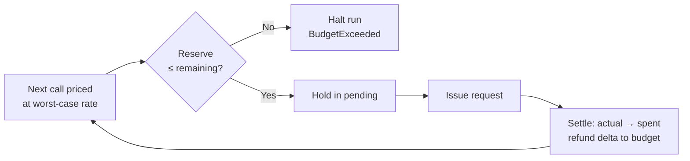

# Per-Run Budget Reservation for Coding Agent Model Calls

> Reserve worst-case cost before each model call and refund the unused hold after; the run halts before a call it cannot afford.

Per-run budget reservation is admission control for an agent's next model call: the controller prices each request's worst-case cost, holds that amount against a run-scoped budget, issues the call, and returns the unused portion once the actual cost is known. The check is prospective, so the run refuses a request whose worst case exceeds the remaining balance and the budget is never breached ([OpenAI Cookbook, 2026-08-17](https://developers.openai.com/cookbook/articles/per_run_spending_controller_responses_api)).

## When this pattern applies

Four conditions have to hold together; outside them the controller either misfires or gives false confidence.

- The run has a per-ticket cost target that org- or project-level caps cannot express (support ticket at $0.02, per-user tier with a fixed unit price, per-record batch economics). Open-ended developer sessions do not qualify.
- The traffic is synchronous, non-streaming, and on the default processing tier. The OpenAI reference explicitly excludes streaming, background (`queued`/`in_progress`) requests, and non-default tiers ([OpenAI Cookbook, 2026-08-17](https://developers.openai.com/cookbook/articles/per_run_spending_controller_responses_api)).
- Costs are dominated by model tokens. Web search, code interpreter, storage, and regional or long-context surcharges sit outside the controller's ledger.
- One process holds the run. The reference uses an in-process lock; multi-process or distributed workers need a shared reservation store the shipped pattern does not include.

If any fails, reach for [Progressive Spend Threshold Alerting](progressive-spend-threshold-alerting.md) at the period scope or an [LLM Budget Gateway](../../observability/llm-gateway-per-dimension-budgets.md) at the fleet scope instead.

## How it works

Every request runs three phases against a `RunBudget` object tracking `spent`, `pending`, and `maximum` ([OpenAI Cookbook, 2026-08-17](https://developers.openai.com/cookbook/articles/per_run_spending_controller_responses_api)):

1. Admission. Check that `maximum − spent − pending` covers the next request's worst case; raise `BudgetExceeded` and halt if not.
2. Reservation. Hold the worst-case cost in `pending`, pricing every input token at the highest applicable rate (ordinary, cached, or cache-write) and every output token at its full rate.
3. Settlement. Compute the actual charge from returned usage, move it from `pending` to `spent`, and release the difference back to the budget.

The source's worked example reserves $0.0146 for a 1,200-input, 250-output call at the cache-write ceiling. Its sample table prices ordinary input at $4.00/M, cached input at $2.00/M, cache writes at $8.00/M and output at $20.00/M. The call then settles at $0.01 once the response reveals the real mix ([OpenAI Cookbook, 2026-08-17](https://developers.openai.com/cookbook/articles/per_run_spending_controller_responses_api)).



The controller fails closed in two more places. If actual cost exceeds the reservation, or returned token usage is malformed, the run raises `UncertainCharge` and is permanently blocked: an unverifiable settlement is treated as an overspend, not a soft warning. Sub-cent arithmetic runs on `Fraction`, not floats, because IEEE-754 rounding accumulates across hundreds of settlements at these magnitudes ([OpenAI Cookbook, 2026-08-17](https://developers.openai.com/cookbook/articles/per_run_spending_controller_responses_api)).

## Why it works

The reservation shifts spend control from retrospective observation to a decidable pre-condition. Because the worst-case cost is computed from a pricing table before the request is issued, the balance check answers a yes/no question (can the next request be paid in full at its worst case?) that a post-hoc metering loop cannot answer until after the money has already left. The invariant "cumulative spend ≤ budget" holds by construction of the admission test. Reserving externally against a pricing table also sidesteps the model's own cost blindness: the [BAGEN benchmark](https://arxiv.org/abs/2606.00198v1) trained agents to predict their remaining budget interval and measured coverage capping at 47% after SFT and RL, with correlation between task capability and budget awareness of only r=0.35, so a controller that trusts the model to estimate its own spend has no safety guarantee. The refund step preserves utilization: without it, worst-case reservations compound turn over turn and the effective budget collapses to `maximum / worst-case ratio` after a handful of calls.

## When this backfires

Each entry names a case where the "cannot exceed budget" property either does not hold or costs more than it saves.

- Cache-heavy workloads over-reserve. On the sample rates above, a mix that is 60% cache reads costs $2.80/M input, while the reservation holds the $8.00/M cache-write ceiling — about 2.9x. The multiple tracks the spread between the cached and cache-write rates, so re-derive it from the table you price with. The run stops well before nominal exhaustion, a safety tax to name before shipping against a prompt-caching workload ([OpenAI Cookbook, 2026-08-17](https://developers.openai.com/cookbook/articles/per_run_spending_controller_responses_api)).
- Streaming, background, and async requests fall outside the scope; their usage settles across events, so the reserve-then-settle contract cannot hold ([OpenAI Cookbook, 2026-08-17](https://developers.openai.com/cookbook/articles/per_run_spending_controller_responses_api)).
- Hosted tool spend is invisible. Model-token reservation gives false confidence for a run whose money goes to web search, code interpreter, or storage; the controller reports headroom the invoice will not.
- Open-ended sessions gain little. Without a per-ticket target, [OpenAI's org- and project-level hard spend limits](https://developers.openai.com/api/docs/changelog) (2026-07-22) return `429` at the monthly ceiling with no code in the agent.
- Multi-process workers break the in-process lock. Two workers on one budget can each pass the admission check and overspend before either settles; a distributed reservation store is required and is not shipped.
- Pricing tables drift. The reservation is only as correct as the constants; an unpropagated provider price change silently under-reserves and voids the guarantee. Treat pricing as a versioned dependency.
- Permanent-block semantics can be surprising. After `UncertainCharge` the run is dead, not retryable — appropriate for a support ticket that must not double-bill, less so an interactive session where the operator would rather be asked.

## Relation to adjacent patterns

| Pattern | Scope | Enforcement point |
|---------|-------|-------------------|
| Per-run budget reservation (this page) | One agent run | Admission check per model call |
| [Progressive Spend Threshold Alerting](progressive-spend-threshold-alerting.md) | Billing period | Alerts at percentage thresholds |
| [Dual-Budget Control for Search Agents](dual-budget-control-search-agents.md) | Inside one run's tool-call and token caps | Per-action VOI scoring |
| [Per-Call Budget Hints on Tool Invocations](per-call-budget-hints-tool-calls.md) | One tool call | Caller-side ceiling lift |
| [LLM Budget Gateway](../../observability/llm-gateway-per-dimension-budgets.md) | Fleet across orgs, teams, users | Server-side 429 at chokepoint |

These compose rather than compete. A fleet routes through a budget gateway, an individual run holds a per-run reservation, that run scores its next action with dual-budget VOI, and a specific tool call lifts its ceiling with a per-call hint; each control sits at a different scope.

## Example

The reference implementation walks through a support-ticket agent with a $0.02 per-run budget ([OpenAI Cookbook, 2026-08-17](https://developers.openai.com/cookbook/articles/per_run_spending_controller_responses_api)):

**Before** — no per-run cap, org-level 429 is the only backstop:

```python
budget = 0.02  # informational only
for turn in range(max_turns):
    response = client.responses.create(model="gpt-5", input=messages)
    total += price(response.usage)  # observed after the fact
    if total > budget:
        break  # already overspent by one turn
```

**After** — reservation before each call, settlement after:

```python
run_budget = RunBudget(maximum=Fraction("0.02"))
for turn in range(max_turns):
    worst_case = price_worst_case(input_tokens, max_output_tokens)
    run_budget.reserve(worst_case)        # raises BudgetExceeded if unaffordable
    try:
        response = client.responses.create(model="gpt-5", input=messages)
    finally:
        actual = price_actual(response.usage)
        run_budget.settle(reserved=worst_case, actual=actual)
```

On the first response — 1,200 input tokens split 300 ordinary / 400 cached / 500 cache-writes, plus 200 output — the actual settlement is $0.01, leaving $0.01 in the run. The controller then prices the next call's worst case at $0.0146, sees the remaining balance cannot cover it, raises `BudgetExceeded`, and the run halts before the request ([OpenAI Cookbook, 2026-08-17](https://developers.openai.com/cookbook/articles/per_run_spending_controller_responses_api)). The overspend that the "Before" loop absorbed after the fact never happens.

## Key Takeaways

- Per-run reservation is admission control at the per-call boundary: it answers a yes/no question about the next request before issuing it, so the budget is never breached.
- Worst-case pricing (every input token at the highest applicable rate) is what makes the guarantee hold; the refund step keeps utilization from collapsing under compounded reservations.
- Reserve externally from a pricing table, not from a model self-estimate. The [BAGEN benchmark](https://arxiv.org/abs/2606.00198v1) measured interval coverage capping at 47% for trained agents, with a capability-awareness correlation of only r=0.35.
- Fail closed on `UncertainCharge` and use exact arithmetic (`Fraction`, not floats). An unverifiable settlement voids the guarantee.
- Scope is narrow by construction: synchronous non-streaming Responses API, default tier, model-token costs, single process. Outside that scope, use period-scoped alerts or a fleet gateway.
- Cache-heavy workloads pay a safety tax. On the source's sample rates a 60%-cached mix reserves about 2.9x its real cost. The multiple moves with the model's own cached-versus-cache-write spread, so derive it before shipping.

## Related

- [Progressive Spend Threshold Alerting for Agent Cost Governance](progressive-spend-threshold-alerting.md) — the period-scoped sibling; alerts inside a billing window versus admission inside one run
- [Dual-Budget Control for Search Agents](dual-budget-control-search-agents.md) — allocation inside a run's tool-call and token caps; complementary to the per-call reservation
- [Per-Call Budget Hints on Tool Invocations](per-call-budget-hints-tool-calls.md) — caller-side knob that raises the ceiling on one call; the reservation sees the raised ceiling as the worst case
- [Centralized LLM Gateway for Per-Dimension Agent Budgets](../../observability/llm-gateway-per-dimension-budgets.md) — the fleet-scope enforcement point that per-run reservation complements at the run scope
- [Tail Control for Agent Workflows](tail-control-for-agent-workflows.md) — engineering for worst-case behavior; the reservation is the cost-side analogue
