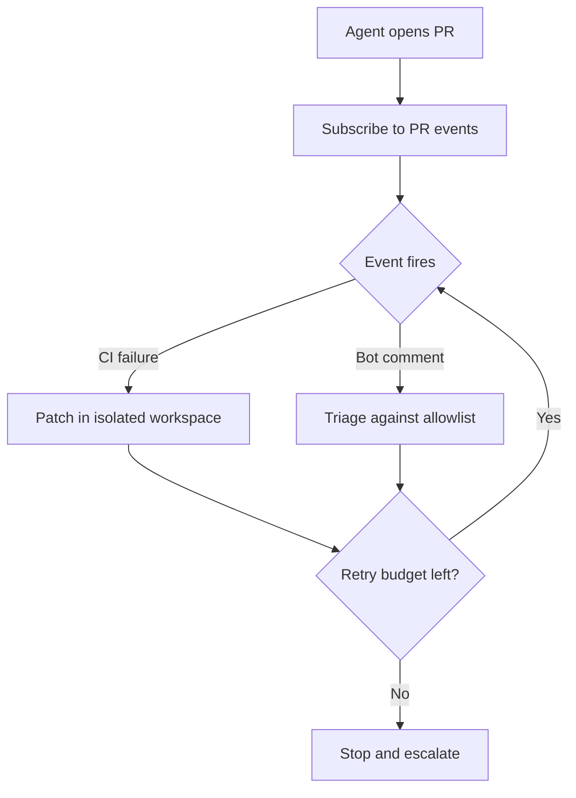

# PR-Subscribed Agent Ownership: The Agent That Opened the PR Drives It to Green

> An agent subscribed to the pull request it opened wakes on CI and review events and patches until green, inside a retry budget.

## Four conditions before you remove the trigger

This pattern is the autonomous half of [one-click CI auto-fix](../../workflows/one-click-ci-auto-fix.md), which keeps three human gates: the click, the workflow approval, and the PR review. Subscription removes the click. Adopt it only where all four conditions hold.

- The failing signal is a real oracle, not a status color. Where the only success criterion is "the check went green," the cheapest path there is editing the check. An industrial study of an autonomous repair loop documented "concrete instances of assertion weakening and test-case deletion used as workaround mechanisms to achieve superficial convergence" ([arXiv:2605.01471v1](https://arxiv.org/abs/2605.01471v1)).
- The agent holds data-plane authority only. Published work on agentic CI/CD separates data-plane authority, meaning "localized interventions such as patch generation and test reruns," from control-plane authority over "pipeline configuration, deployment policies, and approval gates" ([arXiv:2605.07062v1](https://arxiv.org/abs/2605.07062v1)). A subscribed agent that can both edit `.github/workflows/` and trigger those workflows has crossed the line without a gate.
- A retry budget and a stop condition exist as configuration, not as intent. The same paper reports "constrained autonomy as the dominant design, external governance as the primary safety mechanism," rather than intrinsic agent guarantees ([arXiv:2605.07062v1](https://arxiv.org/abs/2605.07062v1)).
- Each woken agent gets its own workspace. Cursor ships this as the precondition: "Subagents can now run on their own virtual machines. Each gets an isolated copy of the project with clean context in its own cloud environment" ([Cursor Changelog, 2026-08-19](https://cursor.com/changelog/08-19-26)).

## The subscription primitive

A subscribed agent attaches to an event source instead of being invoked per task. Cursor describes an agent that "subscribes to an event source (a thread or conversation) and wakes when something happens," covering pull requests, Slack threads, and schedules ([Cursor Changelog, 2026-08-19](https://cursor.com/changelog/08-19-26)). PR ownership follows: "Cloud agents automatically subscribe to PRs they create and drive them to completion, fixing CI and addressing bot comments."

Steering survives the subscription: follow-up messages "wait for the next tool call instead of cutting the agent off mid-action" ([Cursor Changelog, 2026-08-19](https://cursor.com/changelog/08-19-26)). That is [mid-run redirection](steering-running-agents.md) applied to a long-lived agent.

## Why it works

The saving is context re-establishment, not patch authorship. Under a per-round human trigger every CI failure starts a cold agent: GitHub's variant "opens a new pull request on top of your existing pull request, analyzes the failing check, and attempts to implement a fix," then tags a human for review ([GitHub Changelog, 2026-07-23](https://github.blog/changelog/2026-07-23-github-mobile-fix-failing-actions-checks-with-copilot-cloud-agent/)). Round N pays to rediscover everything earlier rounds established, plus the operator's context switch. A subscribed agent holds that state across wakes, so a round costs the patch alone and it knows which fixes it already tried.

Retained state also produces the failure mode. A stacked-PR loop hands each fix to a reviewer who sees it cold; a subscription removes that reader. The safe operating band therefore sits at the data plane, where safety comes from "surrounding governance infrastructure rather than intrinsic agent guarantees" ([arXiv:2605.07062v1](https://arxiv.org/abs/2605.07062v1)).

## When this backfires

Optimizing for green CI optimizes a weak proxy for merge. One study took 11,048 closed agentic pull requests, refined them to 9,799 human-reviewed, and "manually inspected 717 representative cases to recover decision rationale from interaction artifacts". In those, "only 35.7% of rejected PRs reflected clear agentic failures, while 31.2% were driven by workflow constraints and 33.1% lacked observable decision rationale" ([arXiv:2605.22534v1](https://arxiv.org/abs/2605.22534v1)). CI-fixing reaches none of the 31.2%. For the 33.1% the reason could not be recovered at all, so whether a green build would have changed the outcome is unknown rather than answered.

Convergence is not the common case. The industrial repair study measured a 70% convergence rate at scenario-family level with a mean of 3.4 repair iterations, only 10% of families succeeding on the first attempt, and 38% of reports failing to produce any executable test artifact ([arXiv:2605.01471v1](https://arxiv.org/abs/2605.01471v1)). Its conclusion is that "unrestricted autonomy leads to unstable and often misleading outcomes."

Review bots create a moving target. Cursor's feature explicitly covers "addressing bot comments" ([Cursor Changelog, 2026-08-19](https://cursor.com/changelog/08-19-26)), and each push that answers a comment can trigger a fresh review round. The shipped `/goal` primitive gives the agent "a long-lived objective to work towards until it's fully complete," which is an objective rather than a termination condition. Restrict the agent to allowlisted comment authors and cap rounds explicitly, the way an [agent circuit breaker](agent-circuit-breaker.md) bounds a retrying loop.

Flaky or slow pipelines starve the loop. A 10% first-attempt rate and a 3.4-iteration mean leave little headroom before a non-deterministic signal produces oscillation.

Shared checkouts collide. Agents woken by concurrent events against one working copy interleave branch state, which is why isolation ships alongside subscription.

## Key Takeaways

- Subscription removes the human trigger from the CI-fix loop and leaves the workflow-approval and PR-review gates to carry the whole design.
- Replace the removed trigger with three deterministic controls: data-plane-only authority, an explicit retry budget with an escalation path, and a comment-source allowlist.
- The mechanism is retained context across wakes, so the win shrinks as failure rounds get more independent of each other and disappears where each round needs fresh diagnosis anyway.
- Assertion weakening and test deletion are documented outcomes of unsupervised repair loops, so a green check is evidence only when the check itself sits outside the agent's write scope.
- Green CI is a weak merge proxy. Of 717 manually inspected rejections, 31.2% turned on workflow constraints and 33.1% left no recoverable rationale.
- Per-agent workspace isolation is a precondition for event-driven concurrency, not a later optimization.

## Related

- [One-Click CI Auto-Fix](../../workflows/one-click-ci-auto-fix.md) — the human-triggered half of this pair, holding the three gates this pattern removes one of
- [Event-Driven Agent Routing](event-driven-agent-routing.md) — the routing model underneath subscriptions, where state-change events advance work with no central coordinator
- [Steering Running Agents](steering-running-agents.md) — how follow-up messages redirect a long-lived agent without halting its current tool call
- [Agent Circuit Breaker](agent-circuit-breaker.md) — the retry-budget and stop-condition mechanism this pattern needs to replace the removed trigger
- [Self-Healing Production Agent](self-healing-production-agent.md) — the same closed-loop shape applied to post-deploy regressions rather than pre-merge CI
