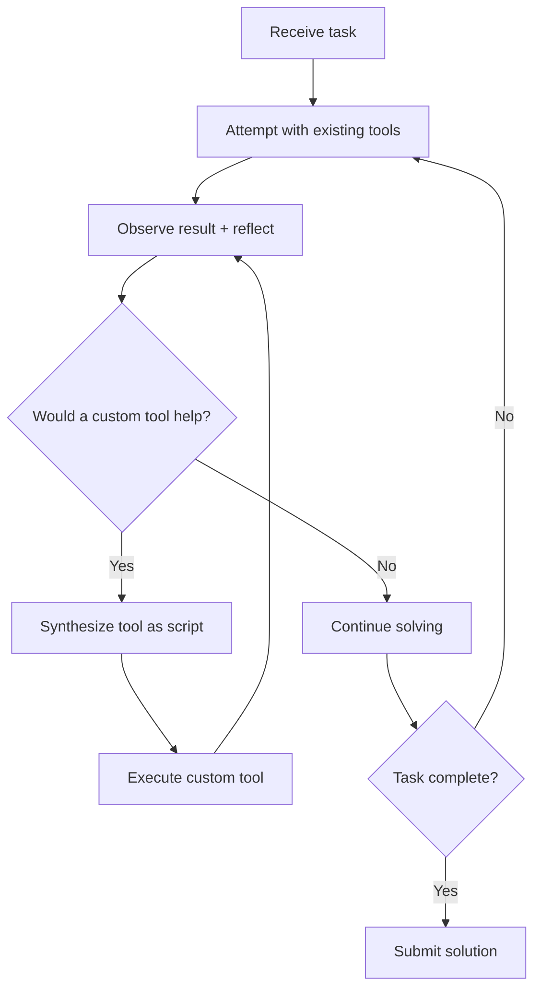

# Runtime Scaffold Evolution

> A mutable scaffold lets capable agents synthesize domain-specific tools at runtime, outperforming fixed toolkits.

## The core insight

A capable LLM already knows how to write code and reason about tooling. The missing piece is permission and prompting: you explicitly ask the agent to treat tool creation as a first-class action alongside tool use.

Live-SWE-agent demonstrated this by starting with bash-only access and autonomously evolving its toolkit — achieving 77.4% on SWE-bench Verified and 45.8% on SWE-Bench Pro without offline training or pre-built tool libraries ([Xia et al., 2025](https://arxiv.org/abs/2511.13646); [live-swe-agent leaderboard](https://live-swe-agent.github.io/); [reference implementation](https://github.com/OpenAutoCoder/live-swe-agent)).

## How it works



The mechanism is simple:

1. Minimal start: the agent begins with only bash access and no specialized tools.
2. Step-reflection prompt: after each action, a prompt asks, "Would creating or revising a tool accelerate progress?"
3. Tool synthesis: the agent writes a script with clear inputs, outputs, and error handling.
4. Iterative refinement: the agent revises tools as its understanding deepens, rather than designing them upfront.

The agentic loop does not change. It adds only a reflection prompt and permission to create scripts.

## What the agent builds

Runtime tools fold multi-step bash sequences into single domain-specific operations:

| Scenario | Bash approach | Runtime-synthesized tool |
|----------|--------------|------------------------|
| Code search | `grep -r` with manual filtering | Context-aware search excluding test fixtures and vendored code |
| Binary parsing | Chained `xxd`, `awk`, `sed` | Dedicated parser with structured output |
| Multi-file edits | Sequential `sed` commands | Batch editor with AST awareness and rollback |

Tool-creation opportunities come from friction the agent hits, not from upfront design.

## The model-capability threshold

This is not a universal technique. It requires frontier-class models:

| Model tier | Effect | Mechanism |
|-----------|--------|-----------|
| Frontier | Significant improvement | Synthesizes useful, targeted tools that reduce step count |
| Mid-tier | Modest improvement | Creates tools but sometimes over-engineers them |
| Small | Performance degrades | Gets stuck in tool-creation loops, never solves the actual problem |

In ablation experiments, the pattern yielded +22.6% improvement with Claude 4.5 Sonnet and −68.2% degradation with GPT-5-Nano. Weaker models lack the meta-reasoning to judge when tool creation is worthwhile, turning the reflection prompt into a distraction trap ([Xia et al., 2025](https://arxiv.org/abs/2511.13646)).

## Runtime versus offline evolution

| Approach | Timescale | Persistence | Human involvement |
|----------|-----------|-------------|-------------------|
| Runtime scaffold evolution | Single session | Ephemeral | None |
| [Introspective skill generation](../../workflows/introspective-skill-generation.md) | Across sessions | Persisted to library | Validation gate |
| [Continuous agent improvement](../../workflows/continuous-agent-improvement.md) | Weeks/months | Config updates | Human-driven |
| [Agentic flywheel](agentic-flywheel.md) | Continuous | Harness modifications | Tiered approval |

Tools vanish when the session ends. Promoting useful ones to a [skill library](../../tool-engineering/skill-library-evolution.md) bridges ad-hoc creation and governed reuse.

## Cost and context trade-offs

Token overhead is modest: on SWE-bench Verified, Live-SWE-agent averaged $0.68 per issue versus $0.56 for the baseline agent — roughly $0.12 incremental cost — which the authors describe as "minimal" relative to the accuracy gain ([Xia et al., 2025](https://arxiv.org/abs/2511.13646)).

The hidden cost is context pressure. Each [synthesized tool definition consumes tokens](../../tool-engineering/tool-minimalism.md). In long sessions, accumulated definitions may crowd out problem-relevant context. Current implementations do not address active tool pruning.

## When to use

Good fit: complex unfamiliar codebases, domain-specific file formats, and frontier-class models with large context windows.

Poor fit: well-defined workflows with known tool sets (use a [fixed skill library](../../tool-engineering/skill-library-evolution.md)), smaller models, and short tasks where tool-creation overhead exceeds the time saved.

## Example

A SWE-bench agent receives a bug report about incorrect CSV parsing. The system prompt includes a reflection hook:

```
After each tool result, reflect: would creating a reusable script
accelerate the remaining work? If yes, write it to /tmp/tools/ and
invoke it in subsequent steps.
```

Turn 1: the agent runs `grep -r "csv" src/` and gets 200+ matches across test fixtures and vendored code.

Turn 2, reflection fires: the agent creates `/tmp/tools/search_src.py`:

```python
#!/usr/bin/env python3
"""Search source files, excluding tests and vendored directories."""
import sys, pathlib, re

pattern = re.compile(sys.argv[1])
for p in pathlib.Path("src").rglob("*.py"):
    if any(skip in p.parts for skip in ("tests", "vendor", "__pycache__")):
        continue
    for i, line in enumerate(p.read_text().splitlines(), 1):
        if pattern.search(line):
            print(f"{p}:{i}: {line.strip()}")
```

Turn 3: the agent calls `python /tmp/tools/search_src.py "csv.*parse"`, immediately narrows to 4 relevant files, then locates and fixes the bug.

The agent created the tool in response to friction (noisy grep results), used it for the rest of the session, and discarded it on completion.

## Key Takeaways

- The mechanism is a single reflection prompt — simplicity is the point
- Requires frontier-class models; weaker models get trapped in tool-creation loops
- Ephemeral by default — combine with [skill library persistence](../../tool-engineering/skill-library-evolution.md) for cross-session reuse
- Gate behind model capability routing: enable for strongest model, disable for cost-optimized paths

## Related

- [Introspective Skill Generation](../../workflows/introspective-skill-generation.md) — offline pattern mining across sessions
- [Agentic Flywheel](agentic-flywheel.md) — closed-loop harness self-improvement
- [Skill Library Evolution](../../tool-engineering/skill-library-evolution.md) — lifecycle governance for persisted skills
- [Scaffold Architecture Taxonomy](harness-design-dimensions.md) — three-layer framework the runtime evolution operates within, across control, tool interface, and resource dimensions
- [Harness Engineering](harness-engineering.md) — designing agent environments
- [Continuous Agent Improvement](../../workflows/continuous-agent-improvement.md) — human-driven observation-to-update loop
- [Temporary Compensatory Mechanisms](temporary-compensatory-mechanisms.md) — runtime tools as removable scaffolding
- [Tool Minimalism](../../tool-engineering/tool-minimalism.md) — counterpoint: fewer tools can outperform more
- [Task Completion as Tool Certification (Silent Tool Rot)](../anti-patterns/task-completion-as-tool-certification.md) — the reliability caveat: a synthesized tool that passes its task can still be wrong on every unseen input, so reused tools need held-out conformance checks
