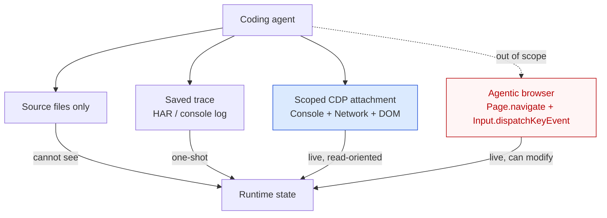

# Scoped Browser DevTools Access for Runtime Diagnosis

> A coding agent attached to a live page via a read-oriented DevTools Protocol surface diagnoses runtime errors a source-only agent can only guess at.

## The pattern

The pattern is conditional. A coding agent reading only source files is blind to what the page actually does at runtime — failed fetches, console errors, layout regressions after hydration, race conditions between API calls and DOM mutations. Scoped DevTools access closes that gap by attaching the agent to a live browser page through a narrow slice of the Chrome DevTools Protocol (CDP): Console, Network, Runtime, and DOM domains for diagnosis, not the broader "drive the browser" surface that an agentic browser model carries.

Use this attachment only when all four of these hold:

1. The bug requires runtime observation to localize — a stack trace, a network response body, a DOM state after a specific user action.
2. The same agent does not also hold consequential write tools that an injected page could coerce (no `git push`, no `npm publish`, no production API writes during the diagnostic turn).
3. The attached browser surface is a dedicated profile or sandboxed instance — not the developer's primary browser carrying banking, admin, or customer-data tabs.
4. The token budget absorbs the CDP surface; the reference [chrome-devtools-mcp implementation consumes "~17,000 tokens just for initial tool discovery"](https://github.com/ChromeDevTools/chrome-devtools-mcp/issues/340), "over two-thirds of the recommended token budget."

If any condition fails, prefer a captured trace (HAR file, console-log snippet, screenshot) replayed into context, or a deterministic reproducer the agent can run in the existing test loop.

## The two senses of "scoped"

The pattern uses *scoped* in two distinct senses; both matter.

Surface scope — which DevTools domains the agent can call. OpenAI Codex's Developer mode frames its CDP attachment as ["controlled Chrome DevTools Protocol (CDP) access for performance profiling and deeper debugging of network traffic, console output, runtime errors, and page state"](https://developers.openai.com/codex/changelog). The "controlled" qualifier is load-bearing: read-oriented diagnostic surfaces, not arbitrary `Page.navigate` / `Input.dispatchKeyEvent` automation. The reference [chrome-devtools-mcp](https://github.com/ChromeDevTools/chrome-devtools-mcp) exposes Console, Network, Performance, Memory, and DOM/Scripts — agents inspect these surfaces; the underlying CDP also permits modification, which is the cost in §When This Backfires.

Page scope — which page(s) are attached. VS Code 1.119 ships explicit per-tab opt-in: ["An agent does not automatically have access to the integrated browser. You need to explicitly share browser pages with the agent for it to interact with them"](https://code.visualstudio.com/updates/v1_119). Once attached, "the agent can read and interact with the page." Cursor takes the contrasting agent-owned model — an embedded browser pane with its own session, not the developer's primary browser. Both are forms of page scoping; the difference is whose authentication state is in the read surface.

## Why it works

Runtime state is unreachable from source. A 502 from an API call, a CORS rejection, a `TypeError` after a specific DOM mutation, a post-hydration layout regression — none of these can be inferred from reading the source tree. The agent without runtime observation guesses at causes a developer would diagnose in seconds with DevTools open.

The mechanism is the same one [Agent-Computer Interface (ACI)](../../tool-engineering/agent-computer-interface.md) work identified for editors and search: interface granularity moves benchmark numbers without changing the model. A read-oriented Console + Network + Runtime surface is the smallest set of CDP domains that closes the source-only blind spot. The same shape — a narrow read-oriented attachment matched to a diagnostic task — appears in the [function-level debugger interface](../../tool-engineering/function-level-debugger-interfaces.md) for runtime program state. Codex's Developer mode codifies the CDP slice and markets the result as ["deeper debugging"](https://developers.openai.com/codex/changelog) rather than browser automation. The narrower surface limits what an injected page can do; broader CDP attachment widens diagnostic surface and attack surface symmetrically.

## When this backfires

Four conditions degrade or invert the pattern.

Lethal trifecta closure on a single agent. Untrusted DOM enters context the moment the agent reads the page. If the same agent also holds repo Read and any write egress, the [lethal trifecta](../../security/lethal-trifecta-threat-model.md) closes within one tool call. Brave demonstrated end-to-end OTP exfiltration against Perplexity Comet by hiding instructions in a Reddit comment processed during a "Summarize this page" call — "Comet feeds a part of the webpage directly to its LLM without distinguishing between the user's instructions and untrusted content from the webpage" ([Brave: Agentic Browser Security](https://brave.com/blog/comet-prompt-injection/), 2025-08-20). Palo Alto Unit 42 documents the same attack class active in the wild ([Unit 42: Fooling AI Agents](https://unit42.paloaltonetworks.com/ai-agent-prompt-injection/)). Anthropic: ["No browser agent is immune to prompt injection"](https://www.anthropic.com/research/prompt-injection-defenses).

Bug deterministically reproducible from a saved trace. A captured HAR, a copied console stack trace, or a screenshot gives the agent the same diagnostic signal with no long-lived attack surface. Keep the live attachment only when the diagnostic requires *interaction* — clicks, form fills, repeated page state inspection across reloads — not just observation.

Browser holds sensitive cross-tab state. Chrome's remote debugging port is process-wide: ["enabling the remote debugging port opens up a debugging port on the running browser instance. Any application on your machine can connect to this port and control the browser"](https://github.com/ChromeDevTools/chrome-devtools-mcp). Attaching to the developer's primary profile bridges banking, admin-console, and customer-data tabs into the agent's read surface. Use a dedicated profile, a sandboxed Chrome instance, or an agent-owned embedded browser instead.

Tight token budget with other MCPs attached. The reference chrome-devtools-mcp consumes ~17 KB just for tool discovery — ["over two-thirds of the recommended token budget"](https://github.com/ChromeDevTools/chrome-devtools-mcp/issues/340). On a sub-200k context job with several MCPs already attached, the marginal token cost can exceed the marginal diagnostic value. A captured HAR or a single-domain MCP exposing only Console + Network is cheaper.

## Example

A representative diagnostic case: a React form that submits twice on slow networks. The source review is inconclusive — the `onSubmit` handler looks idempotent and the API has a single endpoint.

Without DevTools access — the agent reads the handler, the API route, the form's `useState` calls, and writes a guess: "the submit button needs a disabled-after-click guard." The guess might be right. It might also be wrong if the duplicate comes from a stale `useEffect` re-mounting the form on slow auth refreshes — a hypothesis the agent cannot test from source alone.

With scoped CDP attachment — using OpenAI Codex Developer mode or chrome-devtools-mcp with Console + Network domains attached to a dedicated Chrome profile, the agent throttles the network, reproduces the bug, and reads the Network panel directly. The duplicate `POST` requests and any console warnings are visible inline; the agent localizes the bug from observation rather than from speculation. The diagnostic resolves in one turn rather than three guess-and-check cycles, with the attachment limited to a dedicated profile holding no production credentials.

The page-scope guarantee is what makes the attachment safe: ["the agent can read and interact with the page"](https://code.visualstudio.com/updates/v1_119) only for the tab the developer explicitly attached, not for the parallel admin-console tab in another window.

## Key Takeaways

- The pattern is conditional, not default. The four §The Pattern conditions are load-bearing; failing any one of them flips the cost/benefit against the attachment.
- Scoping means two things: which CDP domains the agent can call (Console / Network / Runtime, not full Page automation) and which page surfaces are attached (a dedicated profile, not the developer's daily driver).
- The mechanism is information access — runtime state is unreachable from source; a captured trace beats a live attachment whenever the bug is reproducible one-shot.
- Indirect prompt injection is the binding constraint — every reachable DOM is untrusted input on the agent's principal. The pattern only stays safe when the agent's other tools cannot close the [lethal trifecta](../../security/lethal-trifecta-threat-model.md) against that input.
- Codex Developer mode and VS Code 1.119 tab sharing are concrete instances of the same generalized pattern; the contracts they ship (controlled CDP, per-tab opt-in) are the surface- and page-scope guarantees the pattern requires.

## Related

- [Browser as Agent Action Space](browser-as-agent-action-space.md)
- [Live Browser as Agent Context Channel](../../context-engineering/live-browser-context-channel.md)
- [Browser Automation as a Research Tool](../../tool-engineering/browser-automation-for-research.md)
- [Function-Level Debugger Interfaces for Coding Agents](../../tool-engineering/function-level-debugger-interfaces.md)
- [Lethal Trifecta Threat Model](../../security/lethal-trifecta-threat-model.md)
- [Hypothesis-Driven Debugging](hypothesis-driven-debugging.md)
- [Incremental Verification: Check at Each Step, Not at the End](../../verification/incremental-verification.md)
