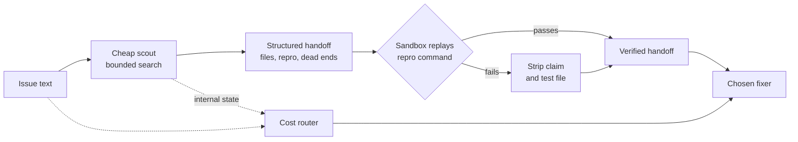

# Scout-Then-Route: Verify the Handoff Before Routing

> Verify the scout's handoff in a sandbox, strip the false claims, then route the task to the cheapest fixer that can solve it.

Scout-then-route sends a small, cheap model into the repository before picking any frontier model. The scout returns a short structured artifact. A sandbox then replays the reproduction command it claims and deletes that claim when the replay fails. Only after that does a router choose which expensive fixer receives the task. SuperScout implements the architecture and reports 159 of 266 solves on the Python slice of SWE-bench Pro at $0.230 per solve, against 158 solves at $1.274 per solve for Claude Opus 4.6 on its own ([Bhola et al., arxiv 2608.04804v1](https://arxiv.org/abs/2608.04804v1)).

## When this applies

Three conditions carry the result.

- Your fixer pool has nested strengths. Weaker models solve a subset of what the strongest solves, with overlap of 0.941, 0.912, and 0.773 across three benchmarks, so accuracy routing has little headroom and cost becomes the only axis worth routing on ([arxiv 2608.04804v1](https://arxiv.org/abs/2608.04804v1)).
- You have a cheap tier that the handoff lifts. Kimi K2.5 gained 4.0 points and Gemini 3 Flash 2.0 points once they received a scouted handoff ([arxiv 2608.04804v1](https://arxiv.org/abs/2608.04804v1)).
- You can replay a reproduction command in a sandbox. Of the 266 benchmark tasks, only 50 carried a genuine reproduction claim and 174 were demonstrably false ([arxiv 2608.04804v1](https://arxiv.org/abs/2608.04804v1)).

Outside those conditions, pin one competent mid-tier model and keep a manual escalation path.

## How it runs

1. A small model searches the repository under a bounded turn budget. SuperScout allows 40 turns and decodes with sampling: temperature 0.90 lifts the find rate from 0.110 to 0.306 ([arxiv 2608.04804v1](https://arxiv.org/abs/2608.04804v1)).
2. It writes a handoff of about a page, roughly 4 KB, holding implicated files with line regions ranked by confidence, one reproduction attempt as a file plus command plus observed output, dead ends already tried, and free-form notes ([arxiv 2608.04804v1](https://arxiv.org/abs/2608.04804v1)).
3. A sandbox replays the claimed command against the unpatched repository. A failed replay removes the claim and its test file from the handoff before any fixer sees it ([arxiv 2608.04804v1](https://arxiv.org/abs/2608.04804v1)).
4. The router scores fixers from the task text plus the scout's internal state. Against a task-text-only baseline of 30.5% held-out cost savings, adding the hidden state raises them to 34.3% and adding the handoff prose instead drops them to 8.0% ([arxiv 2608.04804v1](https://arxiv.org/abs/2608.04804v1)).
5. The chosen fixer receives the verified handoff and works the task.

## Why it works

The handoff redistributes solving ability downward rather than adding it. A verified repository briefing moves tasks that previously needed the frontier model into range for a cheaper one, which is the shape cost routing needs when solve sets are nested and accuracy routing has nothing to win ([arxiv 2608.04804v1](https://arxiv.org/abs/2608.04804v1)). Independent work on deterministic anchoring reaches the same conclusion about the mechanism: static structure helps code agents "less by making agents 'smarter' and more by making their navigation disciplined and reproducible", improving Pass@1 by 3.4 points and roughly halving run-to-run variance ([Lin et al., arxiv 2606.26979v2](https://arxiv.org/abs/2606.26979v2)). The verification step exists because a false reproduction claim is an anchor, and LLM answers follow biased hints even when prompted to ignore them ([Lou and Sun, arxiv 2412.06593v2](https://arxiv.org/abs/2412.06593v2)).

## When this backfires

- The router earns nothing. SuperScout's own no-router arm, always Kimi K2.5 plus the handoff, also solves 159 of 266 at $0.227 per solve. The authors concede that "the handoff carries the result and routing collapses to cost allocation" ([arxiv 2608.04804v1](https://arxiv.org/abs/2608.04804v1)). Build the scout and the guard first, and treat the learned router as an optional last step.
- A frontier-only pool loses accuracy. With no cheap tier to redistribute toward, the handoff is downside: GPT-5.2 fell from 60.6% to 56.6% ([arxiv 2608.04804v1](https://arxiv.org/abs/2608.04804v1)). Transferred context degrades exploration on some task types by as much as 46% while helping others ([Vigraham, arxiv 2605.04361v1](https://arxiv.org/abs/2605.04361v1)).
- No sandbox means shipping fiction. On 174 of the 266 benchmark tasks the scout's reproduction claim was demonstrably false, and the paper's separate calibration census puts 56% of claims in the same bucket, so an unverified handoff anchors the fixer on a command that never ran ([arxiv 2608.04804v1](https://arxiv.org/abs/2608.04804v1)).
- Latency-sensitive loops pay first. Up to 40 search turns and a sandbox replay run before the fixer takes a single turn ([arxiv 2608.04804v1](https://arxiv.org/abs/2608.04804v1)).
- The evidence base is thin. One benchmark's Python slice, 266 tasks, a calibration study at N=99 that reaches no significant per-fixer result, and no pass-through arm, so the guard's contribution to the headline is the authors' inference rather than a measurement ([arxiv 2608.04804v1](https://arxiv.org/abs/2608.04804v1)).

## Example

The measured trade on SWE-bench Pro's Python slice, 266 tasks, under the benchmark's capped budget tier ([arxiv 2608.04804v1](https://arxiv.org/abs/2608.04804v1)):

| System | Solves | Cost per solve |
|---|---|---|
| SuperScout, routed | 159 | $0.230 |
| No-router ablation, Kimi K2.5 plus handoff | 159 | $0.227 |
| Claude Opus 4.6 alone | 158 | $1.274 |
| GPT-5.2 alone | 139 | $1.091 |

The scout itself cost $1.13 in GPU time across all 266 search episodes, under half a cent per task. Localization stays partial even so: recall 0.586 and precision 0.833 on spontaneous handoffs, with all implicated files correct on only 28.2% of them ([arxiv 2608.04804v1](https://arxiv.org/abs/2608.04804v1)).

## Key Takeaways

- Scout first, then choose the fixer. The routing decision improves once a cheap model has read the repository, because issue text alone does not say how hard the task is.
- Verify before handing off. Most reproduction claims a scout makes are false, and a false claim anchors the fixer, so replay the command and delete what fails.
- Build in that order. The scout and the sandbox guard are cheap and carry the measured win; a learned router is the last and least proven piece, so ship it only after the handoff pays.
- Reach for it when your model pool has nested strengths and a cheap tier worth promoting. A frontier-only pool can lose accuracy to the same handoff.

## Related

- [Trajectory-Conditioned Model Escalation (SWE-Router)](trajectory-conditioned-model-escalation.md) — routes mid-task on a cheap model's partial trajectory instead of a pre-task scouting artifact.
- [Trained Repository Explorer Sub-Agent (FastContext)](fastcontext-trained-repository-explorer.md) — the same cheap-explorer split, aimed at token savings rather than model choice.
- [Auto Model Selection](auto-model-selection.md) — vendor-side per-request routing that decides from availability and policy, with no repository evidence.
- [Utility-Model Split](utility-model-split.md) — a cheaper model for background harness calls inside one turn.
- [Gateway Model Routing](gateway-model-routing.md) — the infrastructure layer that makes a multi-fixer pool addressable in the first place.
