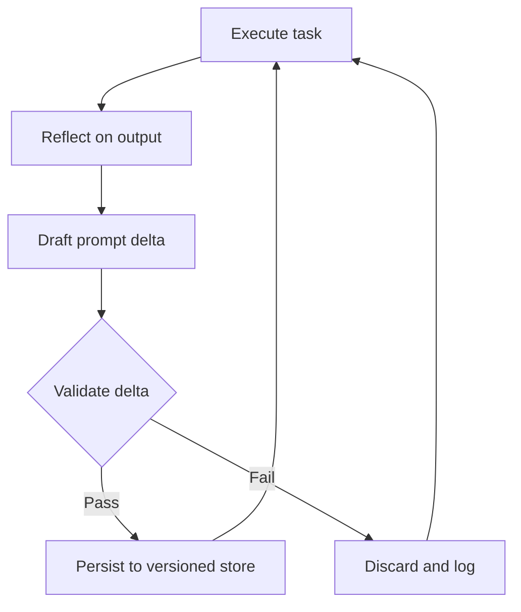

<!-- source: nibzard/awesome-agentic-patterns (Apache 2.0, https://github.com/nibzard/awesome-agentic-patterns) — retain attribution per license -->

# Self-Rewriting Meta-Prompt Loop

> An agent evaluates its own outputs, drafts a targeted edit to its system prompt, validates the change against a quality gate, and persists the revision — tightening its own instructions without human edits between runs.

## The mechanism

The loop has four steps that repeat across task runs:

1. Reflect. After finishing a task, the agent compares its output against the task objective and finds where its instructions led to weak behavior, such as verbosity, format drift, or missed constraints.
2. Draft. The agent writes a targeted delta to its own system prompt: a specific addition, deletion, or rewrite of the instruction that underperformed.
3. Validate. A quality gate scores the proposed change before adoption. The gate may be a held-out eval suite, a separate [critic agent](critic-agent-plan-review.md), or a programmatic check.
4. Persist. Changes that pass the gate are written to the versioned system prompt store. Changes that fail are discarded and logged.

This maps onto [Reflexion](https://arxiv.org/abs/2303.11366v4) (Shinn et al., 2023), which stores verbal reflections in an episodic memory buffer without weight updates and reaches 91% pass@1 on HumanEval. [Self-Refine](https://arxiv.org/abs/2303.17651v2) (Madaan et al., 2023) reaches about 20% absolute improvement through iterative self-feedback, with no training required. [APE](https://arxiv.org/abs/2211.01910v2) (Zhou et al., 2022) shows LLMs can generate instructions that beat human-written prompts on 19 of 24 NLP tasks.

The [nibzard/awesome-agentic-patterns catalog](https://github.com/nibzard/awesome-agentic-patterns/blob/main/patterns/self-rewriting-meta-prompt-loop.md) rates academic evidence as high and direct production adoption as low. Deployment constraints, not the validity of the mechanism, are the bottleneck.

## When to apply

Apply the self-rewriting meta-prompt loop when:

- the task type is high-volume and repetitive, so enough runs accumulate a reliable reflection signal
- outputs have measurable quality, meaning a scoring function exists rather than only human preference
- failures come from instruction gaps rather than model capability ceilings
- a rollback path exists, such as a versioned prompt store with a tested restore

Avoid it when:

- the system prompt faces adversarial inputs, because crafted task outputs can poison the reflection step and rewrite instructions maliciously
- the task is safety-critical, because prompt drift in production without human sign-off is a hard no
- the quality gate is weak or vague, because undefined success criteria turn the loop into a random walk

## Dual-agent architecture

The loop is safer when the executor and critic are separate agents in separate contexts. A single agent reflecting on its own output tends to rationalize rather than critique, because the same assumptions that shaped the output also shape the reflection.

The form we recommend has three roles:

- Executor: runs the task with the current system prompt and produces output.
- Critic: receives only the task specification, the output, and the current system prompt, then produces a structured assessment of which instruction caused the failure.
- Validator: scores the proposed delta against a held-out benchmark before writing to the prompt store.

This matches the [Evaluator-Optimizer](evaluator-optimizer.md) pattern, but applied to the prompt layer rather than the task output.

## Safety constraints

Version control on the system prompt is a hard prerequisite. Without a rollback path, a single bad update degrades all later tasks silently.

More constraints that reduce risk:

- Change magnitude limits: cap each delta to a maximum token change per cycle. Small token-level changes can still shift the model's high-dimensional output space a lot ([Salinas & Morstatter, 2024](https://aclanthology.org/2024.findings-acl.275/)), so small targeted edits are easier to attribute and revert than large rewrites.
- Canary rollouts: deploy the updated prompt to a fraction of traffic and compare quality metrics against the current baseline before full promotion. This mirrors the prompt-version rollout patterns now supported by platforms like [Langfuse A/B testing](https://langfuse.com/docs/prompt-management/features/a-b-testing).
- Reflection input sanitization: treat task output as untrusted before feeding it into the reflection step, then strip or validate content that could carry prompt-injection payloads.

## Contrast with human-driven refinement

[Harness Hill-Climbing](harness-hill-climbing.md) and [Skill Library Refinement Loops](../../workflows/skill-library-refinement-loops.md) both improve prompts iteratively, but require a human to approve each change. The self-rewriting meta-prompt loop removes that approval step entirely. You get faster iteration, but unreviewed drift and adversarial exposure are the tradeoff.

A 2026 study found that reflective APO with a defective seed can degrade accuracy sharply, from 23.81% to 13.50% on GSM8K, with optimization trajectories you cannot interpret ([Reflection in the Dark](https://arxiv.org/abs/2603.18388v2), Gao et al., 2026). A quality gate on the initial seed prompt, not just each delta, is a prerequisite.

## Key Takeaways

- The four-step cycle (reflect → draft → validate → persist) is supported by Reflexion, Self-Refine, and APE — each achieves measurable quality gains without weight updates, though gains depend on a sound quality gate and non-defective seed prompt
- Dual-agent architecture (executor + separate critic) reduces confirmation bias in the reflection step
- Version control and a validated quality gate are non-negotiable prerequisites — without them the loop has no floor
- Direct production adoption remains low; safety-critical and adversarially-exposed environments are hard exclusions
- Reflective APO methods can degrade performance when the seed prompt is defective — a quality gate on the seed, not just on each delta, is required ([Reflection in the Dark](https://arxiv.org/abs/2603.18388), Gao et al., 2026)
- Change magnitude limits and canary rollouts reduce the blast radius of prompt drift; apply the same staged-deployment discipline used for any production configuration change

## Related

- [Evaluator-Optimizer Pattern](evaluator-optimizer.md)
- [Agent Self-Review Loop](../../code-review/agent-self-review-loop.md)
- [Harness Hill-Climbing](harness-hill-climbing.md)
- [Loop Strategy Spectrum](../../loop-engineering/loop-strategy-spectrum.md)
- [Convergence Detection](../../loop-engineering/convergence-detection.md)
- [Runtime Scaffold Evolution](runtime-scaffold-evolution.md)
- [DSPy: Programmatic Prompt Optimization](dspy-programmatic-prompt-optimization.md)
- [Skill Library Refinement Loops](../../workflows/skill-library-refinement-loops.md)
- [Rollback-First Design](rollback-first-design.md)
