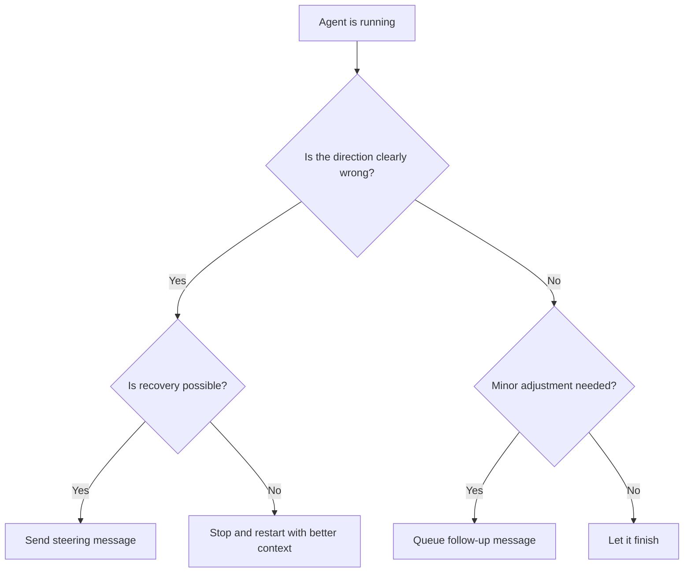

# Steering Running Agents: Mid-Run Redirection and Follow-Ups

> Steering a running agent sends a mid-execution message that redirects its tool calls without discarding the context it has already built.

Learn it hands-on with the [guided Steering Running Agents lesson](https://learn.agentpatterns.ai/harness-engineering/steering-running-agents/), which includes quizzes.

!!! note "Also known as"
    Mid-Run Correction, Unsticking Stuck Agents. You intervene before the agent goes too far off course. For reactive pre-built recovery mechanisms, see [Escape Hatches](../../workflows/escape-hatches.md).

## Two correction mechanisms

A steering message is a mid-run message that interrupts tool execution and redirects behavior. The agent stops its current approach and responds to the new direction.

A follow-up message is a correction you queue during execution. The agent delivers it after the current step completes. It finishes the current step, then processes the queued message — in Claude Code, at the next turn boundary.

Both preserve accumulated context. Restarting discards it.

## When to use each



Steer when the agent is heading toward wasted context or unusable output — wrong file, wrong approach, misunderstood requirement, the kinds of drift [goal monitoring](goal-monitoring-progress-tracking.md) surfaces.

Follow up when the current step is fine but you want to adjust the next one — "also update the tests" or "use the existing utility function."

Restart when the agent is too far down the wrong path. A fresh context with a better prompt is cheaper than repeated steering.

Let it finish when the approach is acceptable, even if not ideal.

## Observing agent direction

Good steering depends on reading tool calls as they happen — the same observation point [agent loop middleware](../../loop-engineering/agent-loop-middleware.md) hooks into. Most agent interfaces show tool use in real time. Watch which files the agent reads and which commands it runs to spot wrong direction early. Where a run is long enough that a raw tool-call stream is unreadable, a [canvas as control surface](canvas-as-control-surface.md) renders the same trajectory as workflow state instead.

These signs suggest a steer may be needed:

- The agent reads files unrelated to the task
- It creates new abstractions when existing ones would do
- Tool calls suggest it misunderstood the scope
- It repeats the same search with minor variations, which means it is stuck

## Anti-patterns

Waiting too long lets the agent finish a bad approach before you correct it. Context is consumed on useless work, and you still need to undo it — cheap only under [rollback-first design](rollback-first-design.md).

Over-steering means interrupting every few steps. The initial prompt was underspecified, so restart with a clearer specification.

Steering instead of restarting tries to salvage a fundamentally wrong run through multiple steers. Restart is cheaper — the [Ralph Wiggum loop](../../loop-engineering/ralph-wiggum-loop.md) makes a clean restart the default.

Ignoring tool calls is a trap: steering depends on spotting wrong direction early through active observation, not on waiting for output.

## Practical notes

Steer as early as possible — ideally after the first tool call that signals a problem.

Follow-up messages work best when the current step is short. For long-running steps, steering mid-step may be more efficient.

Interface behavior varies: Claude Code queues messages typed during execution and delivers them at the next turn boundary — pressing Enter alone does not interrupt the current step ([issue #36326](https://github.com/anthropics/claude-code/issues/36326)). To interrupt immediately, press Ctrl+C first, then send your message. Cursor queues a follow-up for the agent's next tool call, so the run continues rather than halting mid-step ([Cursor changelog, 2026-08-19](https://cursor.com/changelog/08-19-26)).

## Example

You ask Claude Code to refactor the authentication module. After two tool calls you see it is reading files in the payment module instead.

What you observe in the tool-call stream:

```
Tool: read_file("src/payments/stripe_client.py")   ← wrong module
Tool: read_file("src/payments/webhook_handler.py") ← still wrong
```

Send a steering message to interrupt immediately, before the agent reads more unrelated files:

```
Stop. You're reading the payments module. The task is to refactor
src/auth/ only — specifically auth/session.py and auth/tokens.py.
Do not touch anything in src/payments/.
```

The agent stops, acknowledges the redirect, and re-reads the correct files. The conversation history (and the two payment file reads) remain in context, but the agent's next tool calls target `src/auth/` as instructed.

In the follow-up scenario, the agent is correctly refactoring `auth/session.py` and is mid-way through. You want to add one more requirement without interrupting:

```
After you finish the session refactor, also update
auth/tokens.py to use the same expiry constant you define in session.py.
```

The agent queues this and processes it once the session refactor step completes. No context is lost and the agent already has the `session.py` changes in context when it moves to `tokens.py`.

Both messages preserve the file reads and reasoning the agent has already accumulated. A restart at this point would discard that context and require the agent to re-read the auth files from scratch.

## Key Takeaways

- Steering messages interrupt mid-run; follow-up messages queue for after the current step
- Both preserve accumulated context; restarting discards it
- Steer early — detecting wrong direction from tool calls beats correcting finished output
- Over-steering signals an underspecified prompt; fix the prompt, not the run

## Why it works

LLM inference is stateless between calls, but context is not — each tool call appends its inputs and outputs to the conversation history resent on the next call ([Anthropic Messages API](https://platform.claude.com/docs/en/build-with-claude/working-with-messages)). Steering mid-run prepends a new instruction to that accumulated history, so the model reads the correction alongside everything it has already learned: file contents, errors, prior tool results. A restart discards that context and forces the model to re-read files and re-derive conclusions it had already reached, paying token and latency costs again.

## When this backfires

The agent may have already run irreversible side-effects. If it has written to a database, sent API requests, or pushed commits, a mid-run steer redirects future steps but cannot undo completed actions. In pipelines with irreversible side-effects, checkpoint-and-restart with pre-verified state is safer than ad-hoc mid-run correction.

Some interfaces only queue, they do not interrupt. Sending a follow-up when you mean to interrupt does not stop the current step. In Claude Code, typed messages queue until the next turn boundary; only Ctrl+C produces an immediate interrupt ([issue #36326](https://github.com/anthropics/claude-code/issues/36326)). If the current step consumes significant context in the wrong direction, a queued correction arrives too late to be cost-effective.

Heavily cached sub-agent architectures resist steering. In [orchestrator-worker](../multi-agent/orchestrator-worker.md) setups where workers run in isolated context windows, a steering message to the orchestrator does not propagate to already-dispatched workers. The worker completes its current task with the original instruction; only the next dispatch receives the correction.

Sometimes the accumulated context is itself the problem. If earlier tool calls introduced noise — verbose error traces, irrelevant file contents, or conflicting outputs — preserving that context may hurt the next steps rather than help them. Restart with a cleaner prompt when the context itself is contaminated.

## Related

- [Rollback-First Design](rollback-first-design.md) — design agent actions to be reversible before irreversible side-effects execute
- [Escape Hatches](../../workflows/escape-hatches.md) — reactive recovery mechanisms for stuck agents
- [Agent Debugging](../../observability/agent-debugging.md)
- [Wink: Classifying and Auto-Correcting Coding Agent Misbehaviors](wink-agent-misbehavior-correction.md) — auto-correcting misbehaving agents mid-run
- [Agent Loop Middleware](../../loop-engineering/agent-loop-middleware.md) — middleware hooks for observing and intervening in the agent loop
- [Goal Monitoring and Progress Tracking](goal-monitoring-progress-tracking.md) — detecting wrong direction through progress signals
- [The Ralph Wiggum Loop](../../loop-engineering/ralph-wiggum-loop.md) — restarting with fresh context when steering cannot salvage a run
- [Convergence Detection](../../loop-engineering/convergence-detection.md) — deciding when to stop or redirect an iterating agent
