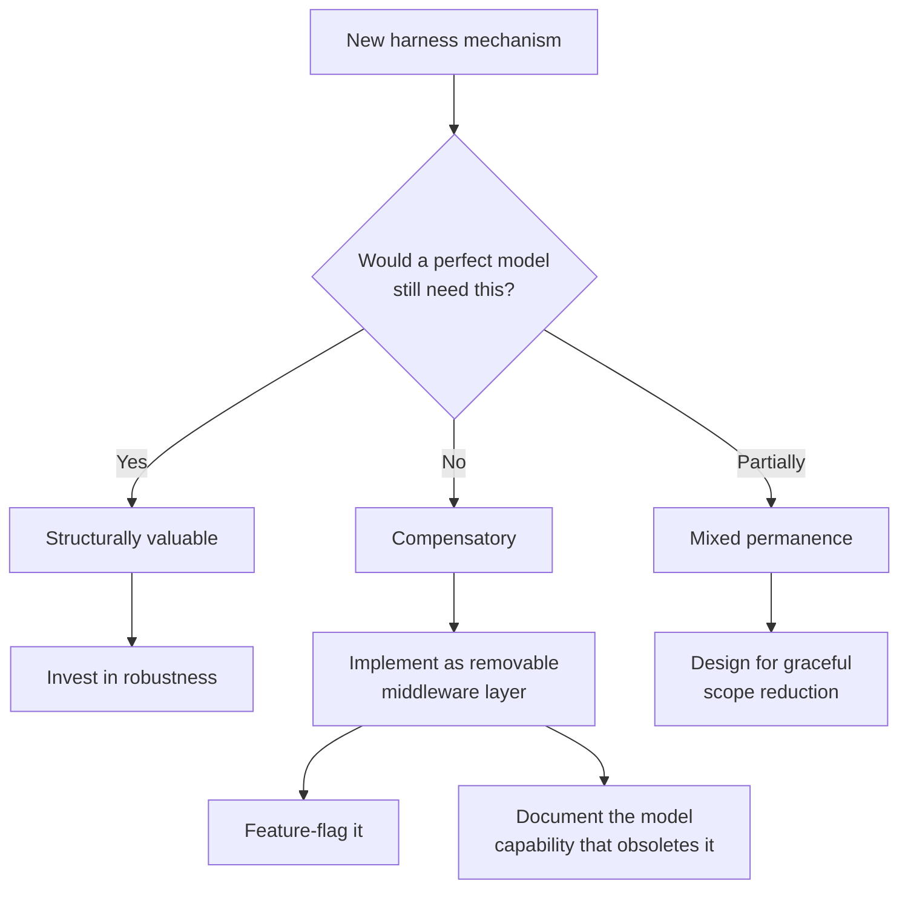

# Temporary Compensatory Mechanisms

> Design scaffolding that compensates for current model limitations as removable layers, not load-bearing architecture. Track which mechanisms are compensatory and which are permanently valuable.

## The problem

Agent harnesses accumulate mechanisms that compensate for model limitations — unreliable self-verification, instruction fade-out, infinite loops. When this scaffolding becomes load-bearing, removing it requires a rewrite. Design it for removal from the start.

## Classifying harness mechanisms

Every harness mechanism falls into one of three categories:

| Category | Design implication | Examples |
|---|---|---|
| Compensatory | Removable middleware; feature-flag; track which model capability obsoletes it | Loop detection, forced verification, instruction reminders, iteration caps |
| Structurally valuable | Invest in reliability; valuable regardless of model capability | Sandboxing, permission gates, [context compaction](../../context-engineering/context-compression-strategies.md), tool discovery, feedback loops |
| Mixed permanence | Design for graceful degradation; shrinks in scope but does not disappear | Context summarization, structured feature tracking, progress files |

Ask one question to classify a mechanism: if the model were perfect at this capability, would you still want it? Yes means structural. No means compensatory. Partially means mixed.

## Compensatory mechanisms in practice

### Loop detection middleware

[LangChain's LoopDetectionMiddleware](https://blog.langchain.com/improving-deep-agents-with-harness-engineering/) intercepts agent actions and detects repetitive patterns, because models lack consistent self-monitoring for circular behavior.

Design for removal: implement it as middleware you can disable through configuration, not as logic woven into the core agent loop.

### Forced verification passes

[Pre-completion checklists](../../verification/pre-completion-checklists.md) force agents through verification before they declare completion. Without an explicit gate, agents often declare success before running tests or checking linter output — the [premature completion](../anti-patterns/premature-completion.md) failure of treating apparent completion as actual completion.

Design for removal: separate the gate from the criteria. The criteria (tests pass, linter clean) are permanently valuable. The gate that forces the agent to check them is compensatory.

### Instruction fade-out reminders

The [OPENDEV agent](https://arxiv.org/abs/2603.05344) re-injects initial instructions during long sessions through event-driven system reminders, countering instruction fade-out as context fills.

Design for removal: implement it as configurable middleware with a kill switch. If a future model holds instruction adherence across its full context window, the reminders become noise.

### Doom-loop iteration caps

Hard iteration limits stop execution after N failed attempts. The [OPENDEV agent](https://arxiv.org/abs/2603.05344) includes this in its execution cycle.

Design for removal: implement it as a [circuit breaker](../../observability/circuit-breakers.md) with configurable thresholds, removable on its own apart from core execution logic.

## Structurally valuable mechanisms

These mechanisms stay necessary regardless of model capability:

- Sandboxing and permission gates: a more capable model is a stronger argument for sandboxing.
- Environmental feedback loops: agents must observe the effects of their actions, such as test output, build results, and runtime errors.
- Tool discovery and lazy loading: [deferred tool loading](../../tool-engineering/filesystem-tool-discovery.md) manages finite tool schema budgets, and selective loading stays efficient even with larger windows.
- Task decomposition: bounded units are sound engineering regardless of model capability.

## Decision framework



For each compensatory mechanism, record three things:

1. What limitation it compensates for — for example, "models do not self-verify before declaring completion".
2. What improvement would obsolete it — for example, "reliable self-verification with 95%+ accuracy".
3. How to remove it — for example, "disable PRE_COMPLETION_CHECKLIST_ENABLED flag; remove middleware registration".

## Example: annotating a harness config

```yaml
harness:
  middleware:
    - name: loop_detection
      type: compensatory
      compensates_for: "Models repeat failing actions without recognizing the pattern"
      obsoleted_by: "Reliable action-outcome metacognition"
      enabled: true

    - name: instruction_reminder
      type: compensatory
      compensates_for: "Instruction adherence degrades beyond ~60% context utilization"
      obsoleted_by: "Stable instruction following across full context window"
      enabled: true

    - name: sandbox_isolation
      type: structural
      rationale: "Defense-in-depth; value increases with agent capability"
      enabled: true

    - name: context_compaction
      type: mixed
      compensates_for: "Finite context windows require summarization"
      structural_aspect: "Even with larger windows, selective loading is more efficient"
      enabled: true
```

## When this backfires

Classifying scaffolding up front is not free. The steelman for building the mechanism directly:

- Short-lived projects: for internal tooling with a 6-month horizon, feature flags and middleware boundaries cost more than the eventual removal would have.
- Stable model dependencies: teams pinned to a specific model version do not get capability upgrades, so removability machinery is pure overhead.
- No middleware layer: "implement as removable middleware" presumes a middleware layer exists, the kind the [scaffold architecture taxonomy](harness-design-dimensions.md) catalogs. Retrofitting one to support a single mechanism inverts the cost-benefit.
- Slow-improving capabilities: self-verification, instruction adherence, and loop-avoidance stay unreliable years later. Many "temporary" compensations outlive the projects that built them.
- Mechanism interaction: compensatory and structural mechanisms often share state. For example, [loop detection](../../observability/loop-detection.md) feeds iteration caps. Decoupling them for independent removability can produce a thinner but more complex architecture.

Treat classification as a tagging exercise on existing scaffolding, not a mandate to build every mechanism behind its own feature flag.

## Key Takeaways

- Classify every mechanism as compensatory, structural, or mixed permanence before building it.
- Compensatory mechanisms should be removable middleware — feature-flag them and document what obsoletes them.
- Sandboxing, permission gates, and environmental feedback are permanently valuable.
- [Context management](../../context-engineering/context-engineering.md) has mixed permanence: compaction shrinks as windows grow but does not disappear.

## Related

- [Pre-Completion Checklists](../../verification/pre-completion-checklists.md)
- [Circuit Breakers for Agent Loops](../../observability/circuit-breakers.md)
- [Loop Detection](../../observability/loop-detection.md)
- [Event-Driven System Reminders](../../instructions/event-driven-system-reminders.md)
- [Agent Harness](agent-harness.md)
- [Harness Engineering](harness-engineering.md)
- [Scaffold Architecture Taxonomy](harness-design-dimensions.md)
- [Runtime Scaffold Evolution](runtime-scaffold-evolution.md)
