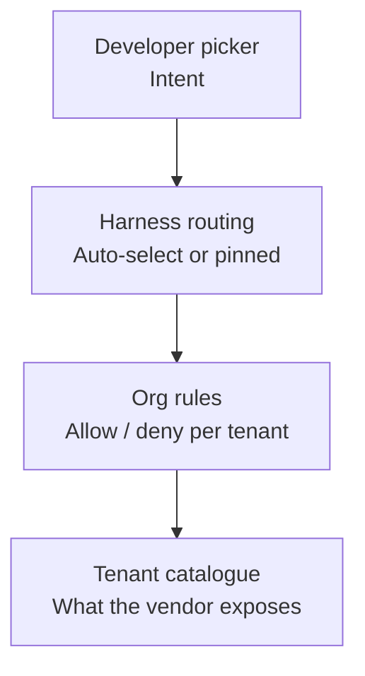

# Tenant Model Policy

> Tenant model policy is the admin-tier rule plane that decides which AI models an organization can invoke — above picker and routing.

## The four layers

Tenant model policy sits between the model invocation request and the model itself. Map any harness against four stacked decision points before you treat per-tenant rules as the right surface:



The picker reflects what a user wants. The [harness routing layer](auto-model-selection.md) decides what to call. The org rules decide what is permitted. The tenant catalog defines what exists at all for the contract. When routing logic and policy logic share a code path, the strict-priority guarantee disappears — and that guarantee is the whole mechanism (see [Microsoft: Authorization and Governance for AI Agents](https://techcommunity.microsoft.com/blog/microsoft-security-blog/authorization-and-governance-for-ai-agents-runtime-authorization-beyond-identity/4509161)).

## The three implementations

| Surface | How rules attach | Default stance | Override depth |
|---|---|---|---|
| GitHub Copilot model rules | Enterprise owner targets organizations; each model is `Enabled` (auto-on for all orgs) or `Optional` (orgs opt in) ([GitHub Changelog 2026-05-26](https://github.blog/changelog/2026-05-26-target-copilot-models-to-organizations-with-model-rules/)) | An `Enabled` rule auto-applies to all orgs without per-org action | Enterprise overrides organization ([GitHub Docs: Copilot policies](https://docs.github.com/en/copilot/concepts/policies)) |
| Claude Code `availableModels` | Managed/policy settings file; arrays merge across user/project/managed surfaces ([Claude Code: Model configuration](https://code.claude.com/docs/en/model-config)) | Default-allow by prefix match; opt-in default-deny via `enforceAvailableModels` and `availableModelsMatch: "exact"` (see Pin direction) | Managed settings take highest priority |
| Cursor Enterprise admin controls | Enterprise admins "whitelist or blocklist repos, models, and MCP servers" ([Cursor Enterprise](https://cursor.com/enterprise)); Business tier exposes no equivalent surface, per [Cursor Forum](https://forum.cursor.com/t/cursor-business-plan-restrict-models-for-all-users/44556) | Default-allow except where admin restricts | No documented per-team override; teams reach for gateway workarounds |

On 2026-08-26 GitHub made global model policy generally available, an enterprise-scoped control over which models each organization may use ([GitHub Changelog 2026-08-26](https://github.blog/changelog/2026-08-26-global-model-policy-generally-available)).

The three diverge on a critical detail: Claude Code documents that "With `availableModels: []`, named model selections are blocked and `enforceAvailableModels` has no effect." The Default option stays usable, so an `availableModels` allow-list on its own is not a deny-list. To pin model identity, admins must combine `availableModels`, `enforceAvailableModels`, `model`, and `ANTHROPIC_DEFAULT_*_MODEL` ([Claude Code: Model configuration](https://code.claude.com/docs/en/model-config#enforce-the-allowlist-for-the-default-model)).

## Pin direction

The recipe below fits a calibrated workload (a reviewer rubric, a judge harness, an eval baseline) where a silent model swap invalidates the calibration. A fleet with no such calibration gets more from prefix matching plus `deniedModels`. New capability keeps arriving without anyone adding it to a list, and `deniedModels` blocks only the release that turns out to be a problem.

### Prefix matching inherits the next release

By default, an `availableModels` entry matches by prefix. An entry such as `claude-opus-5` also permits later releases that extend it, such as Opus 5.5, as soon as Claude Code supports them ([Claude Code: Settings reference](https://code.claude.com/docs/en/settings-reference#availablemodels)). A tenant list written against one release inherits every later release in that family with no review step, so nobody has to approve Opus 5.5 for it to reach the fleet.

### The default-deny recipe

Claude Code 2.1.283, released September 25, 2026, adds `availableModelsMatch` and `deniedModels` ([Claude Code: Changelog](https://code.claude.com/docs/en/changelog#2-1-283)). Set `availableModelsMatch: "exact"` so each `availableModels` entry permits only the version it names, and list full model IDs rather than family aliases. Add `requiredMinimumVersion: "2.1.283"` so an older client cannot start and silently fall back to prefix matching:

```json
{
  "availableModels": ["claude-opus-5", "claude-sonnet-5"],
  "availableModelsMatch": "exact",
  "requiredMinimumVersion": "2.1.283"
}
```

Both keys read from managed settings only; Claude Code ignores them with a warning anywhere else ([Claude Code: Model configuration](https://code.claude.com/docs/en/model-config#block-specific-models-or-versions)). Deliver the policy through server-managed settings for Anthropic-hosted cloud sessions — a device-deployed file never reaches them. For Bedrock, Google Cloud's Agent Platform, or Microsoft Foundry sessions, deliver it through a managed settings file on the runner image instead, since those providers don't receive server-managed settings either ([Claude Code: Model configuration](https://code.claude.com/docs/en/model-config#surface-coverage)).

### `deniedModels` for the lighter touch

To hold back one bad release without going full default-deny, keep prefix matching and name the release in `deniedModels`:

```json
{
  "availableModels": ["opus", "sonnet"],
  "deniedModels": ["claude-opus-5-5"]
}
```

A blocked model disappears from the `/model` picker and is rejected by name everywhere the allowlist applies ([Claude Code: Model configuration](https://code.claude.com/docs/en/model-config#block-specific-models-or-versions)). It leaves every unnamed release on the default-allow path.

### Traps in the recipe

- A family alias defeats `"exact"`. An allowlist of `["opus", "sonnet"]` still admits the next Opus and Sonnet release: "a family alias such as `\"opus\"` still permits the whole family" ([Claude Code: Settings reference](https://code.claude.com/docs/en/settings-reference#availablemodelsmatch)). Default-deny needs full model IDs, not family names.
- A hook or background request that names a blocked model runs on the session's model rather than failing ([Claude Code: Model configuration](https://code.claude.com/docs/en/model-config#block-specific-models-or-versions)) — an agent hook tuned for a small model can run on a larger one with no error, and the hook author gets no warning.
- A blocked Default steps down through a fixed order: the newest permitted version of the same family, then the newest permitted model of each cheaper family in turn (Sonnet, then Haiku), then the first allowlist entry that names a permitted model ([Claude Code: Model configuration](https://code.claude.com/docs/en/model-config#block-specific-models-or-versions)).
- When none of those options is permitted, a session on Default refuses to start, with an error that names the key to fix ([Claude Code: Model configuration](https://code.claude.com/docs/en/model-config#block-specific-models-or-versions)).

### What the pin does not cover

A pin fixes model identity. It does not fix the harness version, the effort default, or the system prompt running on top of that identity, and Anthropic's own incident reports show all three moving behavior on their own. Anthropic changed Claude Code's default reasoning effort from high to medium on March 4, 2026, and an April 16 system-prompt change "hurt coding quality" for Sonnet 4.6, Opus 4.6, and Opus 4.7 alike before it was reverted four days later ([Anthropic: An update on recent Claude Code quality reports](https://www.anthropic.com/engineering/april-23-postmortem)). A serving-side routing bug misrouted Sonnet 4 requests between August 5 and August 31, 2026, peaking at 16% of requests in the worst hour, with no model ID change involved ([Anthropic: A postmortem of three recent issues](https://www.anthropic.com/engineering/a-postmortem-of-three-recent-issues)). Pin the Claude Code version alongside the model for a reviewer or eval workload, and keep the deprecation calendar in view: a pin still expires on the vendor's schedule ([Anthropic: Model deprecations](https://platform.claude.com/docs/en/about-claude/model-deprecations)). See [Model Deprecation Lifecycle](../../workflows/model-deprecation-lifecycle.md) and [Perceived Model Degradation](../anti-patterns/perceived-model-degradation.md) for the operational and diagnostic complements.

## Why it works

The policy decision and the model invocation sit at distinct layers. So the rule engine can reject or substitute by tenant identity before the call reaches a model. Microsoft's runtime governance framing names the mechanism: "evaluate policies in deterministic order with tenant isolation and residency checks as hard deny first, preventing approval workflows from bypassing foundational security boundaries" ([Microsoft: Authorization and Governance for AI Agents](https://techcommunity.microsoft.com/blog/microsoft-security-blog/authorization-and-governance-for-ai-agents-runtime-authorization-beyond-identity/4509161)). The pattern holds because lower-priority surfaces — picker, env var, CLI flag — never see the request once the strict-priority managed setting denies it.

The mechanism collapses the moment policy becomes advisory. A picker that hides a denied model but leaves it reachable via `--model` flag is back to four uncorrelated decision points, not a policy plane.

## When this backfires

- Allow-by-default rules under regulated workloads: when an admin sets a model's stance to `Enabled`, that model is on for every organization until someone disables it ([GitHub Changelog 2026-05-26](https://github.blog/changelog/2026-05-26-target-copilot-models-to-organizations-with-model-rules/)). Note the counter-evidence on rollout: Copilot does not auto-enable a newly-launched model for every org by default. Admins must enable each new model, and a [community request to make new models enabled-by-default](https://github.com/orgs/community/discussions/187083) is still open. So the live risk is a stale `Enabled` rule, not silent auto-onboarding. For tenants under data-residency rules (EU public sector, healthcare), pin explicit per-model rules rather than relying on either default.
- Silent fallback hides denials: when the picker substitutes a default model without surfacing the denial reason, denial telemetry drops to zero and the developer reads the rejection as "the tool just feels worse." Silent fallback is independently an [anti-pattern that distorts metrics and trust](https://medium.com/@hadiyolworld007/stop-shipping-silent-fallbacks-8-ways-models-hide-errors-6df9330a3114).
- Picker drift after deprecations: an `availableModels` list that was correct on day one becomes a deny-list of retired model IDs over months. Without a lifecycle tied to model-deprecation calendars, the policy ages into silent denial of every selection. Pair with [Model Deprecation Lifecycle](../../workflows/model-deprecation-lifecycle.md).
- Missing override depth: a security-research team needs a long-context Opus run that the cost-ceiling rule denies. Without a per-project or team-lead exception path, the request goes off-platform and the audit boundary collapses — the exact failure mode reported on the [Cursor forum](https://forum.cursor.com/t/cursor-business-plan-restrict-models-for-all-users/44556).
- Carve-outs that defeat the rule: Claude Code's documented Default-option exception means a casually-applied `availableModels` setting does not deny anything for that tier ([Claude Code: Model configuration](https://code.claude.com/docs/en/model-config)). Admins reading the docs without the recipe — `availableModels` plus `model` plus `ANTHROPIC_DEFAULT_*_MODEL` — ship policy theatre.

## Example

A Copilot Enterprise owner targeting a data-residency-constrained subsidiary with model rules sets each model's stance explicitly rather than relying on the `Enabled` default:

Before — single enterprise-wide setting, one model launch auto-onboards every org:

```text
Enterprise: claude-opus-4-7 → Enabled
EU-Public-Sector-Org: claude-opus-4-7 → (inherited) Enabled
```

After — targeted rules, the regulated org opts in explicitly:

```text
Enterprise: claude-opus-4-7 → Optional
US-Engineering-Org: claude-opus-4-7 → enabled
EU-Public-Sector-Org: claude-opus-4-7 → (no rule) disabled
```

The Claude Code equivalent in managed settings, pinning a Sonnet 4.5 build to a regulated tenant:

```json
{
  "model": "claude-sonnet-4-5",
  "availableModels": ["claude-sonnet-4-5", "haiku"],
  "enforceAvailableModels": true,
  "env": {
    "ANTHROPIC_DEFAULT_SONNET_MODEL": "claude-sonnet-4-5"
  }
}
```

Without `enforceAvailableModels`, a user who selects `Default` in the picker lands on the account's runtime default rather than the pinned Sonnet 4.5 build. Without the `env` block, `enforceAvailableModels` alone still lets Default resolve to Haiku instead of this exact Sonnet version ([Claude Code: Model configuration](https://code.claude.com/docs/en/model-config#control-the-model-users-run-on)).

## Key Takeaways

- Tenant model policy is the layer *above* harness routing and *below* the vendor catalog — failure modes come from collapsing it into either neighbour.
- An `Enabled` Copilot rule applies a model to every org until disabled, so it is the wrong stance for regulated workloads — but note Copilot does not auto-enable newly-launched models, so the standing risk is a stale rule, not silent auto-onboarding. Treat every new model launch as untrusted until an explicit rule says otherwise.
- Allow-lists in isolation are not deny-lists. Claude Code's `availableModels` requires `enforceAvailableModels`, `model`, and `ANTHROPIC_DEFAULT_*_MODEL` companions to pin model identity.
- `availableModelsMatch: "exact"` plus full model IDs turns model rollout into opt-in, but only on Claude Code v2.1.283+, only in managed settings, and only for model identity — not the harness version, effort default, or serving path that Anthropic's own postmortems show moving behavior on their own. Scope it to calibrated workloads; a general fleet does better on prefix matching plus `deniedModels`.
- Explicit denial signals matter more than the deny itself: silent fallback erases the audit trail and pushes developers off-platform.
- Tie rule lifecycle to the model-deprecation calendar — without it, policy ages into accidental total denial.

## Related

- [Administrative Effort Ceilings for Reasoning Budget](administrative-effort-ceilings.md) — the same admin tier applied to reasoning depth rather than model choice.
- [Agent Governance Policies](../../workflows/agent-governance-policies.md) — the broader three-tier policy hierarchy (enterprise → organization → user) Copilot enforces.
- [Auto Model Selection](auto-model-selection.md) — harness-side routing within the catalog an org rule has filtered.
- [Gateway Model Routing](gateway-model-routing.md) — the infrastructure-layer alternative when the harness exposes no native admin surface.
- [Cost-Aware Agent Design](../../token-engineering/cost-aware-agent-design.md) — within-budget tier routing that runs once policy has constrained the catalog.
- [Model Deprecation Lifecycle](../../workflows/model-deprecation-lifecycle.md) — the operational wrapper that prevents rule drift after model retirements.
- [Model-ID-as-Dependency: Migration Protocol for Deprecation Churn](../../workflows/model-deprecation-migration-protocol.md) — the codebase-side complement to pinning a model ID in tenant policy.
- [Perceived Model Degradation](../anti-patterns/perceived-model-degradation.md) — distinguishes the real behavioral drift a pin cannot stop from a reported regression that never happened.
