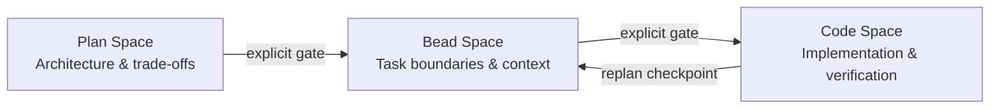

# Three Reasoning Spaces: Plan-Bead-Code Phase Gates

> Treat plan space, bead space, and code space as explicit gates — transitioning between them deliberately prevents architecture drift during implementation.

## Why separate plan, bead, and code

Agent development spans three reasoning spaces, each with its own artifacts and decisions. Mixing them degrades quality in all three — for example, debating architecture while writing code, or redesigning task boundaries during implementation. The [Agent Flywheel methodology](https://agent-flywheel.com/complete-guide) formalizes this separation. The same principle appears on its own in Osmani's 80% problem, LangChain's reasoning sandwich, and nibzard's agentic handbook.

## The three spaces

| Space | Focus | Primary Artifact | Failure when mixed |
|-------|-------|------------------|--------------------|
| Plan space | Architecture, technology choices, system trade-offs | Large markdown plan | Agent improvises architecture from a narrow local window |
| Bead space | Task boundaries, dependencies, context requirements, acceptance criteria | Self-contained work units (`.beads/` JSONL) | Execution order and context requirements are re-derived per session |
| Code space | Implementation, testing, verification against bead definitions | Code changes, test results | Settled decisions get re-debated; scope creeps mid-task |

Plan space works while the whole system fits in context. Bead space converts that plan into self-contained work units. Code space executes within those constraints.

## The law of rework escalation

A mistake costs more the deeper the layer it lands in:

```
Plan layer   →  1x cost  (pure reasoning, zero code churn)
Bead layer   →  5x cost  (orchestration rewrites, coordination overhead)
Code layer   → 25x cost  (implementation fixes + cleanup)
```

The deeper a mistake lands, the more structure has hardened around it. So getting decisions right in plan space pays off the most.

## Transitions as explicit gates

Transitions between spaces should be decisions, not drift:

- Plan to bead: convert the plan into self-contained work units before you write any code.
- Bead to code: each bead carries acceptance criteria and dependencies — see [Code-Native Memory Substrates](code-native-memory-substrates.md). Agents implement within those bounds.
- Replan checkpoints: if code-space work breaks a bead assumption, stop and flag it. Replanning is a feature, not a failure.



## Corroborating evidence

- Addy Osmani finds that good AI-assisted development puts 70% of the effort into defining the problem before 30% on execution. Skip plan space and the architecture choices end up buried in generated code.
- LangChain's reasoning sandwich gives the most compute to planning and verification, and standard compute to implementation. This enforces phase separation at the harness level.
- nibzard's agentic handbook describes a plan-then-execute gate: the agent proposes goals, steps, tools, constraints, and done checks before it starts.

## Why it works

Mixing reasoning spaces degrades quality because each space works on a different scope of context. Plan space needs global visibility — the whole system in context — to make coherent architecture decisions. Code space works on local context, a single file or function. When an agent shifts between the two in one session, the narrow window of code space makes it re-derive global constraints that plan space should have fixed. The result, according to Osmani, is implicit architecture choices buried in generated code. Bead space prevents this. It writes those constraints down as artifacts — acceptance criteria, dependency lists, required context — so code-space agents work within explicit bounds instead of guessing them. The phase gates keep each space's reasoning coherent, because it no longer competes with the concerns of the other two.

## When this backfires

Three-space separation adds overhead. It is not always the right default:

- Solo or prototype work: writing plan and bead artifacts costs more time than the rework risk is worth on small, low-stakes codebases where the whole system fits in one context window.
- Rapidly shifting requirements: if the plan is likely to be out of date before the beads run, the bead layer is wasted overhead. A tighter [plan-then-code loop](../../workflows/plan-first-loop.md) without a bead layer may work better.
- Tasks that are easy to undo: when changes are cheap to reverse (scripts, isolated utilities, feature flags), the cost gap between layers is smaller and strict phase gates help less.
- Without bead tooling: the bead format (`.beads/` JSONL) needs harness support. Without it, you can keep a manual checklist instead, but enforcement gaps make the pattern weaker.

## Key Takeaways

- Plan, bead, and code spaces have different artifacts and decision types — treat them as distinct phases with explicit gates, not a continuous flow.
- The cost of fixing a mistake compounds as it moves deeper — roughly 1x in plan space versus 25x in code space — so front-load decisions into plan space.
- Transitions between spaces should be deliberate decisions, not gradual drift.
- When code-space work invalidates a bead assumption, replan explicitly rather than adapting silently.

## Example

A feature request arrives: "add CSV export to the report dashboard." The three spaces produce distinct artifacts before any code is written.

Plan space — the whole system fits in context, so global decisions happen here:

```markdown
# CSV Export Plan

## Architecture decision
Add export via a new `ExportService` that reads from the existing `ReportRepository`.
No changes to the dashboard rendering pipeline; export is a side path.

## Technology choice
Use Python's built-in `csv` module — no new dependency. Stream rows to avoid
loading the full report into memory.

## Trade-offs accepted
- No async export queue (small reports only; revisit if >10k rows becomes common)
- No custom column mapping UI (fixed schema for v1)
```

Bead space — the plan converts into self-contained work units, each carrying its own context:

```json
{"id": "bead-001", "title": "Add ExportService", "depends_on": [],
 "context": "ReportRepository.get_rows(report_id) returns List[Row]. Row has fields: id, date, value, label.",
 "acceptance": ["ExportService.to_csv(report_id) returns bytes", "streams rows, does not buffer full report"],
 "tools_needed": ["read", "write", "test"]}

{"id": "bead-002", "title": "Wire export endpoint", "depends_on": ["bead-001"],
 "context": "ExportService exists at app/services/export.py. Route: GET /reports/{id}/export.csv",
 "acceptance": ["returns 200 with Content-Type: text/csv", "filename header set to report_{id}.csv"],
 "tools_needed": ["read", "write", "test"]}
```

Code space — each bead runs within its stated bounds. The agent implements the `ExportService` bead without reopening the question of whether to use an async queue.

When `bead-002` reveals that the route handler needs a streaming response type that wasn't anticipated, the agent stops and surfaces it — triggering a replan checkpoint rather than silently adding a new dependency.

## Sources

- [Agent Flywheel: Complete Guide](https://agent-flywheel.com/complete-guide) — Jeffrey Emanuel: three-space framework, Law of Rework Escalation
- [The 80% Problem in Agentic Coding](https://addyo.substack.com/p/the-80-problem-in-agentic-coding) — Addy Osmani: 70/30 definition/execution split
- [Improving Deep Agents with Harness Engineering](https://blog.langchain.com/improving-deep-agents-with-harness-engineering/) — LangChain: reasoning sandwich, phase-separated compute allocation
- [Agentic Handbook](https://www.nibzard.com/agentic-handbook) — nibzard: plan-then-execute gate, replan checkpoints

## Related

- [Code-Native Memory Substrates](code-native-memory-substrates.md)
- [Agent Memory Patterns: Learning Across Conversations](agent-memory-patterns.md)
- [Cognitive Reasoning vs Execution: A Two-Layer Agent](cognitive-reasoning-execution-separation.md)
- [Plan-First Loop](../../workflows/plan-first-loop.md)
- [Reasoning Budget Allocation](reasoning-budget-allocation.md)
- [Harness Engineering](harness-engineering.md)
- [Agentic Flywheel](agentic-flywheel.md)
- [Structured Agentic Software Engineering](structured-agentic-software-engineering.md)
