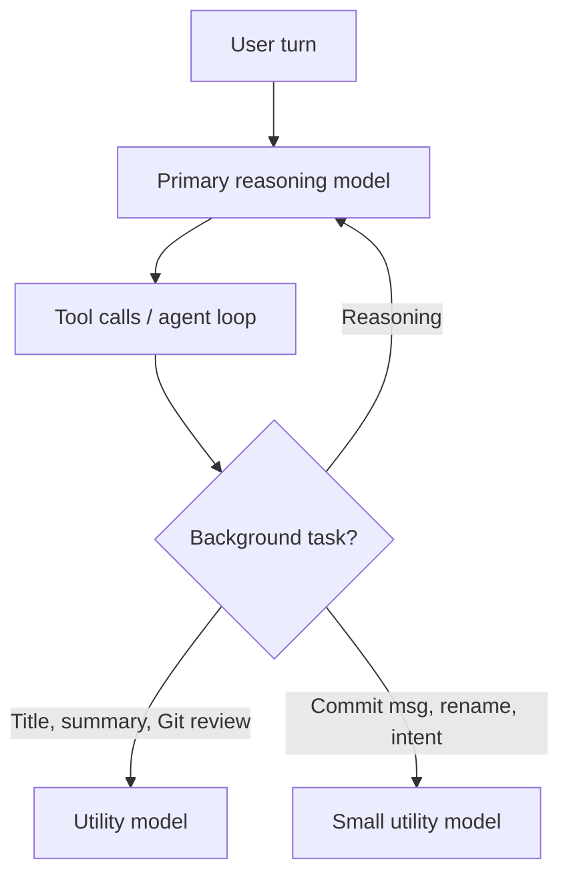

# Utility-Model Split: Background Tasks on a Cheaper Model

> Pin the primary model for reasoning, then route background harness calls — titles, commit messages, intent detection — to a cheaper utility model.

The utility-model split is a routing axis that works within a single user turn. The model that drives the agent loop stays constant. Background calls the user never directly issues — session title generation, summarization, commit messages, prompt categorization, intent detection, Git review — go to a cheaper model. VS Code 1.121 (2026-05-20) ships this as two settings, `chat.utilityModel` and `chat.utilitySmallModel`, with the small tier reserved for "fast, lightweight utility flows" ([VS Code: AI language models](https://code.visualstudio.com/docs/copilot/customization/language-models)).

This is distinct from the three routing patterns already in this directory. [Gateway Model Routing](gateway-model-routing.md) covers catalog discovery, [Auto Model Selection](auto-model-selection.md) does per-request vendor pool routing, and [Cost-Aware Agent Design](../../token-engineering/cost-aware-agent-design.md) splits per-task tiers across the loop. Utility-model split is finer-grained — it draws a line between the foreground reasoning call and every background call the harness makes inside the same turn.

## The two tiers

VS Code's documentation defines the partition by task category, not call frequency:

| Setting | Tasks |
|---------|-------|
| `chat.utilityModel` (general utility) | Generating titles and summaries, settings search, Git review |
| `chat.utilitySmallModel` (small utility) | Commit messages, rename suggestions, branch name generation, prompt categorization, intent detection |

The docs recommend "A fast and inexpensive model" only for the small tier ([VS Code: AI language models](https://code.visualstudio.com/docs/copilot/customization/language-models)). The general tier handles tasks where output length and downstream effect are larger. A Git review summary or settings search result gets read more closely than a commit message subject line.



Both settings default to the Copilot-provided utility models — overriding them is opt-in ([VS Code: AI language models](https://code.visualstudio.com/docs/copilot/customization/language-models)).

## Why it works

Utility tasks share three structural properties that primary reasoning does not: short input, short output, and a single forward pass with no tool use. Vendor pricing for LLMs spans two orders of magnitude across tiers, so the cheapest model that can handle the input distribution dominates cost. [FrugalGPT](https://arxiv.org/abs/2305.05176) demonstrates LLM cascades that "match the performance of the best individual LLM (e.g. GPT-4) with up to 98% cost reduction" by routing tractable subtasks to smaller models. For at least one utility-small task — commit messages — an 8B model with augmented diff context outperformed GPT-4 in human evaluation (46% practitioner preference vs 34%, 84% less VRAM) ([Context Conquers Parameters arXiv:2408.02502](https://arxiv.org/html/2408.02502v1)). The capability floor for short-form auxiliary tasks sits well below the primary reasoning tier, and their call frequency makes each per-call saving matter.

## When this backfires

Four conditions make the split a net loss:

- Auditable history matters. Commit messages and Git review summaries enter `git log` and PR records permanently. Regulated codebases, monorepos with required commit-message formats, or teams that use `git log` as research inputs cannot accept regressions in those outputs.
- Utility input is adversarial. Prompt categorization and intent detection feed downstream routing decisions. A weaker classifier can shift which expensive model gets invoked — misclassification cost dwarfs the per-call savings, and distilled small models are documented to "hallucinate" and "fail to perform accurate calculations" ([Distilling LLM Agent into Small Models arXiv:2505.17612](https://arxiv.org/abs/2505.17612)).
- Primary spend already dominates. When the foreground model burns far more tokens per turn than the utility calls, absolute savings from utility downgrade are negligible. Cache reads on a repeated prefix cost "0.1 times the base input tokens price" — a 90% reduction on cached input ([Claude API: prompt caching](https://platform.claude.com/docs/en/build-with-claude/prompt-caching)) — a bigger saving for the same engineering effort.
- The vendor default is already optimized. Both VS Code settings default to a Copilot-provided utility model. Overriding to a different small model swaps a tuned default for an arbitrary one without measurement — the change can regress quality without saving cost.

The small-tier capability evidence is also conditional. In the commit-message study, the 8B model required diff augmentation and method summaries to beat the 70B variant; "without these enhancements" automated scores were "considerably lower" ([arXiv:2408.02502](https://arxiv.org/html/2408.02502v1)). Plain routing without harness work on the input does not match the headline number.

Cognition's Devin Fusion packages the same split into a shipped product: sidekick agents handle background work while dynamic routing keeps foreground reasoning on the frontier model, a combination the company reports holds frontier-level quality at roughly 35% lower cost ([Cognition: Devin Fusion](https://cognition.ai/blog/devin-fusion)).

## Example

VS Code 1.121 exposes the split in `settings.json`:

```json
{
  "chat.utilityModel": "claude-haiku-4.5",
  "chat.utilitySmallModel": "gpt-4.1-mini"
}
```

Both keys take a model ID from any configured provider — the IDs above are illustrative. Leave either unset to keep the Copilot default. Per-workspace `.vscode/settings.json` lets a high-stakes repo pin both to a stronger model while everyday repos take the cheaper override ([VS Code: AI language models](https://code.visualstudio.com/docs/copilot/customization/language-models)).

## Agent-directed variant

Every split above is harness-configured: a human sets `chat.utilityModel` (or the equivalent) ahead of time. Simon Willison describes a runtime variant instead — instructing the primary agent to judge which of its subtasks warrant a cheaper model and to delegate implementation to a subagent running that lower-power model, with the choice persisted as a memory file the agent reuses on later turns ([Simon Willison: judgement](https://simonwillison.net/2026/Jul/3/judgement/)). The split still separates foreground reasoning from cheaper delegated work, but the model choice moves from static configuration to a decision the agent makes and remembers.

## Key Takeaways

- Utility-model split routes background harness calls (titles, summaries, commit messages, intent detection) to a cheaper model than the primary reasoning loop.
- VS Code's two-tier design — `chat.utilityModel` for general utility, `chat.utilitySmallModel` for lightweight flows — separates tasks by output depth, not just call frequency.
- The pattern depends on a capability floor that small models clear for short-input, short-output, no-tool-use tasks; below that, regressions surface in permanent artifacts like `git log` and PR review.
- Skip the split when primary-model spend already dominates the session, when utility output enters auditable history under regulation, or when the vendor default is already a tuned small model.

## Related

- [Gateway Model Routing](gateway-model-routing.md) — Decouple harness model selection from vendor SDKs by treating the gateway as both inference target and catalogue.
- [Auto Model Selection](auto-model-selection.md) — Vendor-side per-request routing from a managed model pool by availability and policy.
- [Cost-Aware Agent Design](../../token-engineering/cost-aware-agent-design.md) — Match model capability to task complexity across the full agent loop.
- [Specialized Small Language Models as Agent Sub-Tools](specialized-slm-as-agent-tool.md) — Hide a fine-tuned small model behind a tool-call interface to offload narrow operations.
- [The Advisor Strategy](advisor-strategy.md) — Pair a cost-effective executor with a frontier advisor for strategic guidance within one API call.
