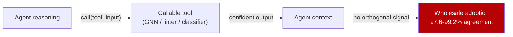

# Blind Tool Deference: Agents Parroting Callable Tools

> Agents adopt a callable tool's output wholesale instead of judging it, and stronger backbones defer more, not less.

## The anti-pattern

You expect an LLM agent to exercise judgment over a callable tool: pick the right one, weigh the answer against context, and override it when other signals disagree. Test that with a frozen GNN exposed as a tool to a ReAct-style agent on node classification (ogbn-arxiv, replicated on WikiCS), and agreement with the raw tool output sits at 97.6-99.2% across 5 seeds. The agent collapses into a "GNN parrot" that bypasses its own reasoning ([Wang & Vemuri, 2026](https://arxiv.org/abs/2606.14476v1)).

The capability sweep breaks intuition. On Qwen2.5 from 1.5B to 7B, agreement rises from 0.60 to 0.98 — stronger backbones defer more, not less ([Wang & Vemuri, 2026](https://arxiv.org/abs/2606.14476)). "Use a bigger model to get better tool judgment" fails here.

The shape generalizes beyond GNNs. Any deterministic sub-model an agent calls — a linter, type checker, SAST scanner, semantic-search index, or classifier sub-agent — is a candidate for the same wholesale adoption when nothing in the planner's context could contradict the tool.

## Why it works

The mechanism is automation bias, or complacency, from human-factors research: a confident-looking automated output pulls attention away from cross-checking ([Parasuraman & Manzey, 2010](https://journals.sagepub.com/doi/10.1177/0018720810376055)). With no orthogonal signal about the GNN's per-node confidence, the cheapest policy is to narrate the tool's output. Stronger backbones reach that minimum-loss policy more reliably, which is why deference rises with capability ([Wang & Vemuri, 2026](https://arxiv.org/abs/2606.14476)).

The latent capacity is there but unused: tool necessity is linearly decodable from pre-generation representations at AUROC 0.89-0.96, well above the model's verbalized reasoning ([Hung et al., 2026](https://arxiv.org/abs/2605.09252)). Nothing in the standard tool-call interface surfaces it.



The author-stated limit closes the loop: "reliable selective invocation looks limited by available information, not merely router design" ([Wang & Vemuri, 2026](https://arxiv.org/abs/2606.14476v1)). The agent cannot judge what it has no second source for.

## Example

Before — a single-source pipeline dressed up as a two-stage one:

```python
# Agent narrates whatever the tool returns; no cross-check
def classify_node(node_id: str) -> str:
    label = gnn_tool.predict(node_id)          # deterministic tool
    return agent.respond(
        f"The GNN predicts label={label}. Final answer: {label}."
    )
```

The agent prompt asks the model to "use its judgment" over `label`, but no orthogonal signal is in scope. Agreement with `gnn_tool.predict` is effectively 1.0, so the agent layer is decorative.

After — wire in an external check the agent can use:

```python
def classify_node(node_id: str) -> str:
    label = gnn_tool.predict(node_id)
    neighbours = graph.neighbors(node_id)
    neighbour_labels = [gnn_tool.predict(n) for n in neighbours]
    return agent.respond(
        f"GNN predicts label={label}. "
        f"Neighbour labels: {neighbour_labels}. "
        "If the neighbourhood disagrees with the predicted label, "
        "flag low confidence and return label + a verification request."
    )
```

The second prompt gives the agent a signal it can act on. The fix is not "distrust the tool" — it is "give the agent something the tool's output can be wrong against."

## When this backfires

Treating every callable as suspect is its own anti-pattern. The "blind deference" framing is over-broad in four cases:

- Tool more accurate than the agent on the typical case. A verified deterministic tool such as a compiler, type checker, or formatter, where the agent's domain reasoning is weaker. High agreement is the target behavior, and second-guessing burns tokens for nothing.
- No disambiguating signal in scope. If nothing could contradict the tool — no second tool, test, or spec — then "add verification" is a slogan. Wang & Vemuri's "limited by available information" caveat applies ([Wang & Vemuri, 2026](https://arxiv.org/abs/2606.14476)).
- Cheap downstream gate. When the tool feeds CI, code review, or a test suite, re-judging every call adds cost without adding safety.
- Calibrated tool with confidence bands. A classifier returning `(label, p)` lets the harness route low-confidence cases without involving the agent. [Classifier-gated routing](../agent-design/classifier-gated-auto-permission.md) is the better fix.

The pattern is a problem specifically when (a) the tool has known unreliability bands, (b) no orthogonal signal is in scope, and (c) the harness pretends the agent is the second-opinion layer.

## Key Takeaways

- Wrapping a deterministic tool in an LLM agent does not add a judgment layer. Empirical agreement on a GNN-tool setup is 97.6-99.2%; treat the agent as a narrator, not a reviewer ([Wang & Vemuri, 2026](https://arxiv.org/abs/2606.14476v1)).
- Capability scaling makes deference worse, not better — agreement climbs from 0.60 to 0.98 across 1.5B → 7B. A bigger backbone is not the fix ([Wang & Vemuri, 2026](https://arxiv.org/abs/2606.14476)).
- Verification needs an orthogonal signal. If nothing in scope could contradict the tool, add a second source or a calibrated confidence stream — prompting the agent to "be critical" of a tool it has no way to disagree with is performance, not safety.
- The same shape applies to linters, type checkers, SAST scanners, and classifier sub-agents — anywhere a confident structured return reaches an agent without a second source.

## Related

- [Trust Without Verify](trust-without-verify.md) — operator-level analogue: humans accepting polished agent output without independent verification.
- [Trusting Tool Error Messages as Implicit Authority](tool-error-implicit-authority.md) — adjacent failure on the *error* stream rather than the success path.
- [The Yes-Man Agent](yes-man-agent.md) — sycophancy toward user requests; this page is sycophancy toward tool returns.
- [Incremental Verification](../../verification/incremental-verification.md) — the constructive counterpart: build the orthogonal signal an agent can actually verify against.
- [Inference-Time Tool Call Reviewer](../agent-design/inference-time-tool-call-reviewer.md) — pattern that surfaces a separate review pass over tool calls before they propagate.
