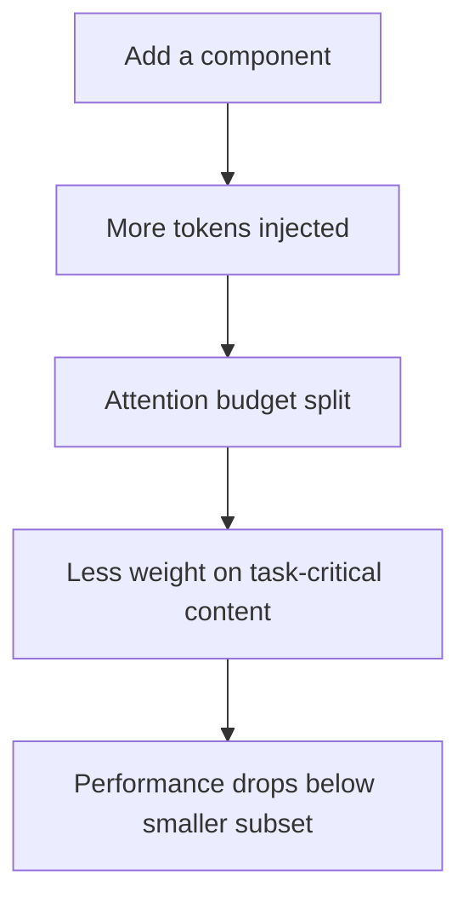

# Cross-Component Interference in Agent Scaffolds

> Stacking planning, memory, retrieval, self-reflection on tool use rarely wins: a full-factorial study shows the maximally-equipped agent losing to smaller subsets, planning and memory worst.

## The default that loses

[Liu (2026)](https://arxiv.org/abs/2605.05716) ran a full factorial over all 32 subsets of {Planning, Tools, Memory, Self-Reflection, Retrieval} on HotpotQA, GSM8K, and SWE-bench Lite. The "All-In" agent bundling every component is consistently suboptimal:

- HotpotQA at 8B: single-tool agent beats All-In by 32% (F1 0.233 vs 0.177, p=0.023).
- GSM8K: a 3-component subset beats All-In by 79% (0.43 vs 0.24, p=0.010).
- 30-50% of larger configurations underperform smaller subsets.
- Submodularity violated in 56.3% of cases — greedy "add until marginal turns negative" selection is provably unreliable.

## Worst offenders

Per-component disruption rate across CCI tasks ([Liu, 2026](https://arxiv.org/abs/2605.05716)):

| Component | Disrupts CCI tasks | Shapley value |
|---|---|---|
| Planning | 84% | -0.029 (95% CI [-0.055, -0.003]) — significantly negative |
| Memory | 68% | -0.016 on HotpotQA |
| Retrieval | 68% | task-dependent |
| Self-Reflection | 58% | task-dependent |
| Tool Use | — | captures 70% of total scaffold value |

Planning and memory are suspect by default. Tool use is the only component that pays for itself across tasks.

## Why it happens

Components share one substrate: the model's context window and attention budget. Each injects its own tokens — planning traces, retrieved passages, reflection notes, memory excerpts — competing for attention with task-relevant content. Same mechanism as [attention dilution](../agent-design/progressive-disclosure-agents.md).

A main-effects model fits R^2=0.916, beating pairwise interaction models ([Liu, 2026](https://arxiv.org/abs/2605.05716)) — most damage is per-component context cost, not destructive pairs. One positive triple exists (Tool Use + Self-Reflection + Retrieval), so interactions are real when they occur.



## Scale qualifies, does not eliminate

The All-In gap shrinks with model strength — 32% at 8B, 19% at 70B, ~0% at Claude Haiku — but All-In still never beats the best subset at any tested scale ([Liu, 2026](https://arxiv.org/abs/2605.05716v1)). Frontier models tolerate over-stacking. They do not benefit from it.

The scaffold is the dominant factor, so it is also the dominant way to lose. Harness changes alone swing Terminal Bench 2.0 by 14 points with no model swap ([LangChain harness engineering](https://blog.langchain.com/improving-deep-agents-with-harness-engineering/)). On SWE-bench Pro the scaffold produces a 22+ point swing versus ~1 point for model swaps ([particula.tech on scaffolding](https://particula.tech/blog/agent-scaffolding-beats-model-upgrades-swe-bench)).

Optimal count k* varies by task: k*=1 on HotpotQA, k*=3 on GSM8K. There is no universal right number.

## When over-stacking is defensible

- Frontier model, no ablation budget: the gap is small at Haiku-scale and above, so ship All-In and prune later when a 32-cell ablation is infeasible.
- Heterogeneous task distributions: traffic mixing math-like (k*=3) and retrieval-like (k*=1) tasks cannot be served by one fixed minimal subset, so per-task routing may dominate.
- Binary failure mode: if missing a component makes the task impossible rather than merely suboptimal, keep it even at an average performance cost.

These are exceptions. The default failure mode is scaffold inflation that nobody measured.

## Example

Before, the maximally-equipped HotpotQA agent at 8B:

```python
# All-In: planning + tools + memory + self-reflection + retrieval
agent = Agent(
    model="llama-3.1-8b",
    components=[Planner(), Tools(), Memory(), SelfReflection(), Retrieval()],
)
# F1 = 0.177 on HotpotQA (Liu, 2026, Table 2)
```

After, a single-component agent on the same task:

```python
# Tools-only — beats All-In by 32%
agent = Agent(
    model="llama-3.1-8b",
    components=[Tools()],
)
# F1 = 0.233 on HotpotQA, p=0.023 vs All-In (Liu, 2026)
```

Removing four components — Planning, Memory, Self-Reflection, Retrieval — lifted F1 by 32%. The win is not a clever combination. It is removing the components that disrupted 84% and 68% of CCI tasks (Planning and Memory) ([Liu, 2026](https://arxiv.org/abs/2605.05716v1)).

## How to avoid it

- Ablate before shipping: at minimum run a leave-one-out sweep. One measured component per release beats four at once.
- Default-suspect Planning and Memory: they have the worst disruption rates, so require positive evidence to include them.
- Anchor on Tool Use: it captures 70% of scaffold value, so build outward from it.
- Measure on hard tasks: easy tasks have high baseline accuracy that hides interference.
- Re-ablate per model: components harmful at 8B can help at 70B. Pin the scaffold to the model and re-run on swaps.

## Key Takeaways

- The maximally-equipped agent is rarely the optimum — 30-50% of larger configurations lose to smaller subsets in a full-factorial study
- Planning and memory are the worst offenders, disrupting 84% and 68% of cross-component-interference tasks
- The mechanism is per-component additive context cost, not specific destructive pairs — main-effects models fit the data with R^2=0.916
- The All-In gap shrinks at frontier scale but never inverts — frontier models tolerate over-stacking, they do not benefit from it
- Optimal component count is task-dependent (k*=1 to k*=3 in this study); there is no universal "right number"
- Default to ablation before shipping, treat Planning and Memory as suspect-by-default, and re-ablate per model

## Related

- [Scaffold Architecture Taxonomy](../agent-design/harness-design-dimensions.md) — three-layer framework for the components this anti-pattern over-stacks
- [Harness Engineering](../agent-design/harness-engineering.md) — the broader practice of which scaffold composition is one decision
- [Per-Model Harness Tuning](../agent-design/per-model-harness-tuning.md) — why CCI ablations must be re-run per model
- [Indiscriminate Structured Reasoning](reasoning-overuse.md) — sibling anti-pattern: a specific case of self-reflection added without ablation
- [The Infinite Context](infinite-context.md) — same mechanism (attention dilution) at the context-window layer
- [Progressive Disclosure for Agents](../agent-design/progressive-disclosure-agents.md) — the attention-dilution mechanism behind CCI, applied to instruction surfaces
- [Framework-First Agent Development](framework-first.md) — related anti-pattern: adopting abstractions that bundle scaffold components before measuring whether you need them
- [Blaming the Model for Scaffolding-Driven Quality Regressions](blaming-the-model-for-scaffolding-regressions.md) — what over-stacked scaffolds cost over time, and why the regression gets misattributed to the model
