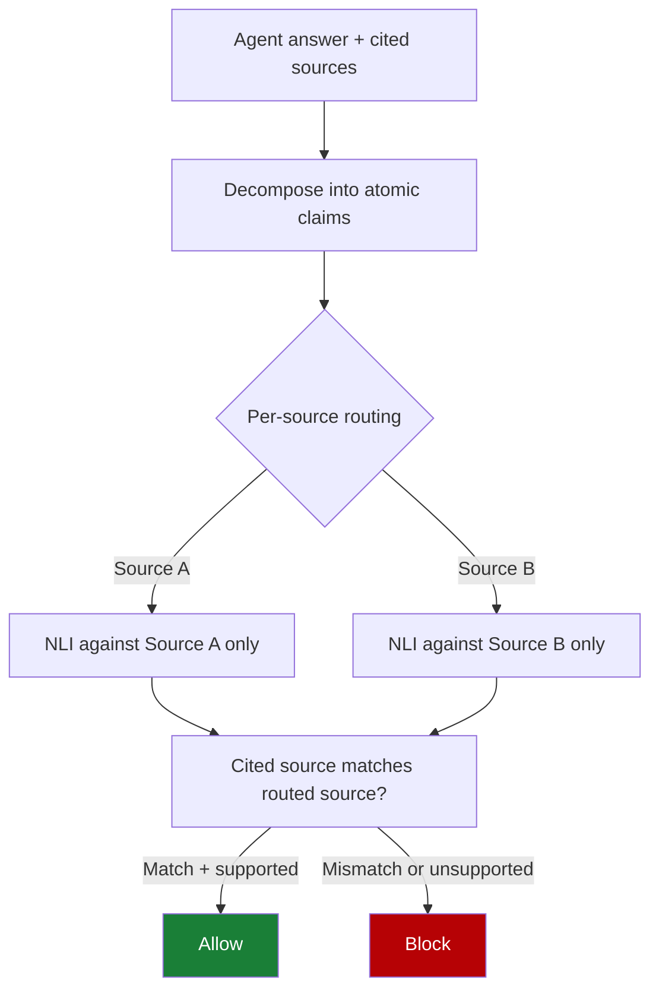

# Pooled-Evidence Factuality Checks for MCP Agents (Cross-Source Conflation)

> When an MCP agent draws on multiple sources, a pooled-evidence factuality verifier passes claims supported *somewhere* but attributed to the *wrong* source.

## When this matters most

The failure mode only appears under three conditions at once ([Alvarez et al., 2026 — arxiv:2606.18037](https://arxiv.org/abs/2606.18037)):

- Multi-source MCP traces. The agent routes a single answer through two or more tools or sources: search plus an API, a database plus a formulary, two clinical guidelines. A single-source agent has nothing to conflate.
- Stable tool and source IDs in the trace. Captured MCP traces expose tool IDs, source IDs, and raw outputs. Free-text tool returns that mash several URLs into one snippet cannot be routed deterministically, so the technique does not apply.
- A high-stakes domain. The original evaluation is medical ([arxiv:2606.18037](https://arxiv.org/abs/2606.18037)). The same risk shows up in clinical decision support, legal research, and regulated finance: anywhere a wrong attribution is itself the safety failure, not just a citation polish issue.

For low-stakes, single-source agents, the cost of per-source claim routing is not worth paying.

## The pattern

Most factuality verifiers ask one question: is this claim supported anywhere in the pooled evidence? That includes the lightweight NLI-based RAG checkers in production today ([Sankararaman et al., 2024 — arxiv:2411.01022](https://arxiv.org/abs/2411.01022)). An MCP agent that emits a citation is making two claims, not one: the factual claim, and "source X supports this claim." Pooled-evidence verifiers conflate the two checks. A claim with a wrong source ID but accurate content passes.

Alvarez et al. name this cross-source conflation: a claim "may be supported somewhere in the evidence while being attributed to the wrong source" ([arxiv:2606.18037v2](https://arxiv.org/abs/2606.18037v2)). On 50 controlled clinical conflation probes against source-blind baselines, every injected attribution swap was retained. The verifier could not tell the swap apart from a correct answer.

## Why it fails

Source attribution is an independent axis for factuality verification ([arxiv:2606.18037v2](https://arxiv.org/abs/2606.18037v2)). Two distinct failures live on the axis a pooled-evidence verifier cannot see:

| Failure | What pooled NLI sees | What the agent did |
|---|---|---|
| Unsupported claim | Fails | Fabricated content with no source backing |
| Cross-source conflation | Passes | Real content; cited the wrong source |

A `serverName`-style allowlist of sources buys nothing here. The source IDs in the trace are correct; the mapping from claim to source is wrong. Other work corroborates this. Across 14 LLMs, inline citations from deep-research agents fail link-accessibility, topical-relevance, and factual-accuracy checks at high rates ([Onweller et al., 2026 — arxiv:2605.06635](https://arxiv.org/abs/2605.06635v1)), and citation accuracy in popular generative search engines sits near 74% ([VeriCite, arxiv:2510.11394](https://arxiv.org/abs/2510.11394v1)).

## Why source-aware verification works

The corrected approach routes each atomic claim to its declared source's evidence, not the pooled set, and runs NLI against that source alone. The stated attribution must match the routed source, or the claim is blocked, regardless of what other sources would have supported. Per-source routing separates two checks: support (does this source contain evidence for the claim?) and attribution (is the cited source the one that contains the evidence?). On a 40-trace held-out split of medical MCP-agent traces, this reaches block F1 0.802 and source accuracy 0.858 over 260 source-eligible claims, and outperforms source-blind baselines ([Alvarez et al., 2026 — arxiv:2606.18037](https://arxiv.org/abs/2606.18037)).



## When this backfires

Source-aware verification only earns its overhead inside the conditions named above. Outside them the trade-offs flip:

- Semantically close sources defeat exact ownership. On a harder multi-source benchmark, source-plus-relation accuracy drops to 0.229 ([arxiv:2606.18037](https://arxiv.org/abs/2606.18037)). Two near-overlapping oncology guidelines look interchangeable to NLI, which inherits NLI's threshold sensitivity.
- Repair-and-reverify can hide the upstream problem. A repair-and-reverify loop "resolves all 173 blocked answers, though 144 require fallback text rather than substantive rewriting" ([arxiv:2606.18037v2](https://arxiv.org/abs/2606.18037v2)). A verifier that always blocks then falls back lowers the answer rate without fixing why the agent keeps misattributing.
- Free-text tool returns break routing. Web-search snippets that combine multiple URLs into one block have no stable source ID to route to, so the technique reduces to standard pooled NLI.
- Single-source agents waste the overhead. With no conflation surface, per-source NLI buys nothing over a pooled fact-checker.

## Example

Before: pooled-evidence NLI passes a cross-source conflation.

```text
Agent answer:
  "The recommended starting dose is 10 mg daily [formulary_tool]."

Pooled evidence:
  - clinical_record_tool: patient on 10 mg daily
  - formulary_tool: starting dose 5 mg, titrate to 10 mg

Pooled NLI verdict: SUPPORTED  ← passes; 10 mg appears somewhere
```

The claim content is true (10 mg shows up in pooled evidence) but the cited source is wrong (the formulary says start at 5 mg). A source-blind verifier cannot see the swap.

After: the source-aware verifier routes each claim to its source.

```text
Claim: "starting dose is 10 mg daily"
Cited source: formulary_tool

Route NLI to formulary_tool only:
  formulary_tool says: "starting dose 5 mg, titrate to 10 mg"
  NLI verdict: NOT SUPPORTED for "starting dose is 10 mg"

Attribution check: formulary_tool ≠ source that supports the claim
Verdict: BLOCK
```

The agent's answer is then revised via retrieval-augmented repair — re-route to `clinical_record_tool` for the patient's current dose, or correct the formulary quote — and re-verified before release ([arxiv:2606.18037](https://arxiv.org/abs/2606.18037)).

## Key Takeaways

- Pooled-evidence factuality verifiers cannot detect cross-source conflation — they ask "supported anywhere?" not "supported by the cited source?"
- The failure matters for multi-source MCP agents in high-stakes domains where wrong attribution is itself the safety failure.
- Source-aware verification routes each atomic claim to its declared source's evidence, then checks both support and attribution; on medical MCP traces this reaches block F1 0.802 and detects all 50 injected attribution swaps in controlled probes.
- The technique partially fails on semantically close sources (source-plus-relation accuracy drops to 0.229) and inherits NLI threshold sensitivity — it is not a complete solution.

## Related

- [Generative Provenance Records for Tool-Using Agents](../../verification/generative-provenance-records.md)
- [Provenance-Aware Decision Auditing for LLM Agents](../../security/provenance-aware-decision-auditing.md)
- [Context Poisoning: When Hallucinations Become Premises](context-poisoning.md)
- [Blind Tool Deference: Agents Parroting Callable Tools](blind-tool-deference.md)
- [MCP Allowlist by Label, Not by Identity (serverName Trap)](mcp-allowlist-label-vs-identity.md)
