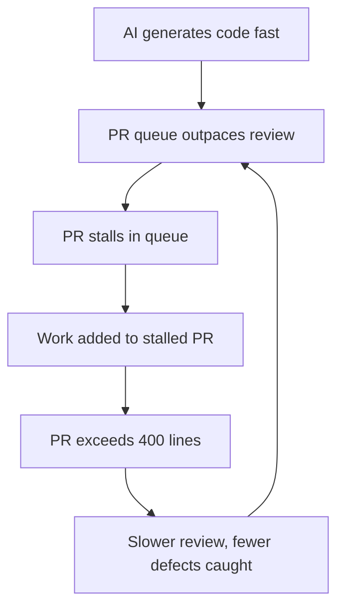

# PR Scope Creep as a Human Review Bottleneck

> When a stalled PR blocks dependent work, you add that work to the same PR — making it larger, slower to review, and harder to merge, compounding the bottleneck AI already created.

## The pattern

AI coding assistants shift the delivery constraint from writing code to reviewing it. [Faros AI telemetry (10,000+ developers)](https://www.faros.ai/blog/ai-software-engineering) shows high-adoption teams merge 98% more PRs but experience 91% longer review times and 154% larger PRs — pushing changesets past the threshold for effective review.

When a PR sits unreviewed, adding dependent work to it is the rational local response. [SmartBear's 10-month, 2,500-review study](https://smartbear.com/resources/ebooks/best-kept-secrets-of-code-review/) sets the threshold: defect detection peaks at 200–400 lines and drops sharply beyond.

## The feedback loop

The loop is self-reinforcing. [Pullflow's analysis](https://pullflow.com/blog/when-code-reviews-go-too-far/) describes the mechanism: excessive review scope pushes developers to batch changes, inflating PR size and compounding delay. [arXiv:2602.19441](https://arxiv.org/abs/2602.19441v1) finds larger changes reduce merge likelihood in agent-authored PRs, and [CodeRabbit's 2026 report](https://www.coderabbit.ai/blog/2025-was-the-year-of-ai-speed-2026-will-be-the-year-of-ai-quality) finds AI-generated code contains 1.7x more issues than human-written code — making each added line more expensive to review.

## Mitigations

[Stacked PRs](https://graphite.com/blog/stacked-prs) let you branch on top of an unmerged PR. You run development and review in parallel, without adding to the stalled changeset.

Atomic PR discipline keeps one logical change per PR, under 400 lines. Enforce it with CI diff-size checks.

AI pre-review triages issues and flags high-risk areas before human review. This cuts the cognitive load on each PR. See [Agentic Code Review Architecture](../../code-review/agentic-code-review-architecture.md).

Distribute the review load. When review concentrates on a small senior group, it amplifies the bottleneck. Rotate reviewers and assign by risk.

## When this backfires

Stacked PRs and strict atomic discipline create overhead that outweighs the benefit in some contexts:

- Small or solo teams: one person reviews everything in sequence anyway, so stacking adds branching complexity without shortening the queue.
- Fast-merge workflows: teams that merge to trunk many times a day may find stacked chains slower to maintain than batching and merging once.
- Tooling gaps: stacked PRs need explicit support such as Graphite or ghstack, and without it rebasing chains is error-prone and breaks dependents on force-push.

The 400-line threshold is a heuristic — a 600-line rename diff may be trivial while a 200-line cryptographic change is not. Apply limits to complexity, not character count.

## Example

A team runs three AI coding agents in parallel on a feature sprint. Agent A finishes a 350-line authentication refactor and opens PR #101. Two days pass with no reviewer action — the senior engineer is already reviewing two other large PRs from the same sprint.

Agent B finishes the dependent session-management update. Rather than open a new PR that will also sit in the queue, the developer adds the 280-line change onto PR #101, now at 630 lines — exceeding the cognitive review threshold.

When the reviewer opens PR #101, the combined diff takes 90 minutes rather than 30. The reviewer flags two issues and approves the rest. Defect detection drops sharply above 400 lines, so the authentication logic carries higher undetected-bug risk.

The structural fix: Agent B opens PR #102 targeting PR #101's branch using stacked PRs. Both PRs stay under 400 lines, and the reviewer can read each one on its own. This preserves merge order without letting blocking pressure build up.

## Key Takeaways

- AI moves the bottleneck from code generation to human review; reviewer capacity does not scale with generation velocity
- Scope creep is individually rational but collectively destructive — the natural response to a blocked PR makes the bottleneck worse
- PRs beyond 400 lines have lower defect detection rates and lower merge probability
- Structural mitigations (stacked PRs, atomic discipline) outperform process mitigations because they remove blocking pressure

## Related

- [The Bottleneck Migration](../../human/bottleneck-migration.md) — why review becomes the binding constraint when generation gets cheap
- [Law of Triviality in AI PRs](law-of-triviality-ai-prs.md) — reviewer psychology behind rubber-stamping large diffs
- [LLM Code Review Overcorrection](llm-review-overcorrection.md) — how AI reviewers misclassify correct code at scale
- [Shadow Tech Debt](shadow-tech-debt.md) — how AI-accelerated delivery creates invisible debt accumulation
- [Vibe Coding](vibe-coding.md)
- [Diff-Based Review Over Output Review](../../code-review/diff-based-review.md)
- [Human-in-the-Loop Placement](../../workflows/human-in-the-loop.md)
- [Agentic Code Review Architecture](../../code-review/agentic-code-review-architecture.md)
- [Agent-Authored PR Integration: Collaboration Signals](../../code-review/agent-authored-pr-integration.md)
- [Cognitive Load, AI Fatigue, and Sustainable Agent Use](../../human/cognitive-load-ai-fatigue.md) — managing the cognitive costs of sustained AI-augmented work, including review fatigue
