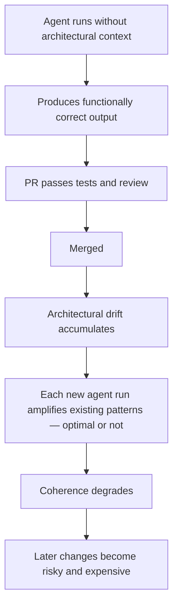
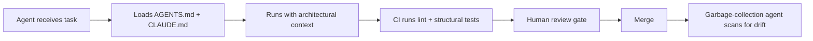

# Shadow Tech Debt

> Shadow tech debt is the silent architectural drift agents leave when they change *what* a codebase does without knowing *why* it is shaped that way.

JetBrains coined the term Shadow Tech Debt ([The New Stack](https://thenewstack.io/jetbrains-names-the-debt-ai-agents-leave-behind/)) — debt that is invisible, diffuse, and that compounds when agents run without a structural understanding of the codebase.

## What it looks like

An agent fixes a bug and the PR passes tests. But the agent skipped ADRs, ignored naming conventions, and copied a suboptimal pattern. One such PR is invisible. Ten per day compound into structural incoherence.



## Why it compounds

Agents amplify the patterns already in the repository. Suboptimal approaches spread when agents copy whatever they find ([Lavaee](https://alexlavaee.me/blog/openai-agent-first-codebase-learnings/)).

Review burden moves, it does not disappear. High-AI-adoption teams merged 98% more PRs, but review time grew 91% and PR size grew 154% ([Faros AI](https://www.faros.ai/blog/ai-software-engineering); [Osmani](https://addyo.substack.com/p/the-80-problem-in-agentic-coding)).

Context window blindness is structural. ADRs, tribal knowledge, and style rationale live outside the context window by default.

## The risk escalates in CI/CD

Without review gates, Shadow Tech Debt accumulates at machine speed. JetBrains Air concluded that complex codebases are not yet ready for pure agentic coding ([JetBrains Air blog](https://blog.jetbrains.com/air/2026/03/air-launches-as-public-preview-a-new-wave-of-dev-tooling-built-on-26-years-of-experience/)).

## When this backfires

Mitigation can cost more than it saves when:

- the codebase is greenfield or throwaway, so there is no accumulated architectural rationale to violate
- automated enforcement is comprehensive, so linting and module-boundary tests catch deviations before merge
- agentic use is infrequent, so occasional tasks under close review do not accumulate drift

## Mitigation stack

| Step | Effort | Action |
|------|--------|--------|
| 1 | Low | Machine-readable context files — [AGENTS.md](https://agents.md/) at the repo root; CLAUDE.md for Claude Code. Scoped files (`docs/CLAUDE.md`) for monorepos. |
| 2 | Medium | Deterministic enforcement — linters and structural tests for module boundaries, naming, and duplication ("[rigor relocation](../../human/rigor-relocation.md)" — [Fowler/Boeckeler](https://martinfowler.com/articles/exploring-gen-ai/harness-engineering.html)). |
| 3 | Medium | Review gates — autonomous agents must not merge without human review on shared repositories. |
| 4 | High | Garbage-collection agents — background scans for architectural inconsistencies ([Fowler/Boeckeler](https://martinfowler.com/articles/exploring-gen-ai/harness-engineering.html); [Lavaee](https://alexlavaee.me/blog/openai-agent-first-codebase-learnings/)). Requires step 1. |

A caveat on step 1. An ETH Zurich evaluation (Gloaguen et al., [arXiv:2602.11988](https://arxiv.org/abs/2602.11988v2)) found that LLM-generated or overly detailed AGENTS.md files cut task success rates by about 3% and raised inference cost by more than 20%. Agents followed the unnecessary instructions to the letter. The finding narrows step 1 rather than overturning it: limit instruction files to details an agent cannot infer, such as custom build commands and repository-specific conventions, and omit anything an agent would read from the code itself.

## What good looks like



## Example

An agent is asked to fix a bug where deactivated users can still appear in search results. It writes a working fix — but queries the database directly in the handler, bypassing the repository layer the team uses for all data access.

Without architectural context, the agent takes a shortcut:

```python
# handlers/users.py
async def handle_search(query: str, db: AsyncSession):
    # Agent-generated fix: exclude deactivated users
    result = await db.execute(
        select(User).where(User.name.ilike(f"%{query}%"), User.active == True)
    )
    return result.scalars().all()
```

The fix passes tests. But it duplicates filtering logic, skips the team's access-control scoping, and sets a precedent that future agent runs will replicate ([Pattern Replication Risk](pattern-replication-risk.md)).

With an `AGENTS.md` rule — `All DB access must go through the repository layer`:

```python
# handlers/users.py
async def handle_search(query: str, user_repo: UserRepository):
    return await user_repo.search(query, include_inactive=False)
```

```python
# repositories/users.py  (existing repository — agent adds the filter here)
async def search(self, query: str, include_inactive: bool = True):
    stmt = select(User).where(User.name.ilike(f"%{query}%"))
    if not include_inactive:
        stmt = stmt.where(User.active == True)
    return (await self.session.execute(stmt)).scalars().all()
```

Same bug fix. No architectural drift.

## Key Takeaways

- Each agentic PR can pass tests yet quietly violate ADRs, naming conventions, and the architectural rationale that lives outside the context window.
- The debt is invisible per-PR and compounds at machine speed — agents replicate whatever patterns already exist in the repo, optimal or not.
- Machine-readable context files (AGENTS.md, CLAUDE.md) are the cheapest mitigation, but keep them to non-inferable details — bloated instruction files cut task success and raise cost.
- Deterministic enforcement, human review gates, and periodic drift scans are what stop the accumulation; they do not move with the agent's context window.

## Related

- [Pattern Replication Risk](pattern-replication-risk.md)
- [Comprehension Debt](comprehension-debt.md)
- [The Implicit Knowledge Problem](implicit-knowledge-problem.md)
- [PR Scope Creep as a Human Review Bottleneck](pr-scope-creep-review-bottleneck.md)
- [Agent-First Software Design](../agent-design/agent-first-software-design.md)
- [Deterministic Guardrails](../../verification/deterministic-guardrails.md)
- [CLAUDE.md Convention](../../instructions/claude-md-convention.md)
- [Trust Without Verify](trust-without-verify.md)
- [The Patchwork Problem in LLM-Generated Code](patchwork-problem.md)
