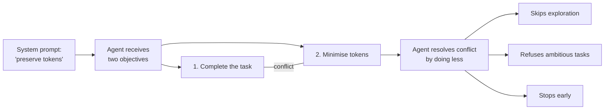

# Token Preservation Backfire

> A token preservation instruction creates a competing objective the agent resolves by doing less work, not by completing the task better.

Learn it hands-on with the [guided Token Preservation Backfire lesson and quizzes](https://learn.agentpatterns.ai/anti-patterns/token-preservation-backfire/).

## The pattern

You add instructions like "preserve tokens," "avoid waste," or "be efficient" to a system prompt. The intent is cost savings. The effect is reduced output quality.

## Why it fails

Efficiency instructions create a second objective: minimize resource use. When this competes with the user's task, the agent resolves the conflict by doing less work. It refuses explorations, skips file reads, and stops early.

Cursor found this while developing their Codex model harness. GPT-5-Codex, told to "preserve tokens and not be wasteful," would sometimes stop with:

> "I'm not supposed to waste tokens, and I don't think it's worth continuing with this task!"

The model treated token conservation as a goal in its own right. The instruction did not change how it worked. It changed whether it worked on substantial problems at all.

## The mechanism

System-level instructions override user-level task requests. When token preservation is a system directive, the efficiency constraint takes precedence over the user's objective. The agent is not being lazy. It is faithfully following a conflicting instruction.

Any instruction that frames work as a cost to cut down risks reducing agent ambition. This is a form of [objective drift](objective-drift.md), where the resource budget displaces the task goal. The effect is most documented for long-horizon coding agents. Evidence for other task types is limited to a small number of practitioner reports.

## When this applies

The failure mode is specific to long-horizon, tool-using tasks where the agent chooses whether to explore or continue, such as coding and file-system work.

Brevity framing stays safe for conversational assistants, summarization, and single-turn tasks without tool use. There the model has no chance to do less work.

The backfire is not universal. A bounded budget differs from an open-ended "don't waste tokens" directive. The Token-Budget-Aware LLM Reasoning framework reports a 68% token reduction with under 5% accuracy loss by inserting an estimated budget into the prompt ([arxiv 2412.18547](https://arxiv.org/abs/2412.18547v5), ACL 2025 Findings; [code](https://github.com/GeniusHTX/TALE)). The failure is a property of vague minimization framing, not of efficiency goals as such.

## Mitigation

| Instead of | Use |
|---|---|
| "Preserve tokens" | "Be thorough" |
| "Don't waste resources" | "Bias to action" |
| "Be efficient and concise" | "Implement with reasonable assumptions" |
| "Minimise tool calls" | "Use the tools needed to verify your work" |
| "Only read files when necessary" | "Read files to build context before acting" |

Reframe constraints as quality targets rather than resource limits.

Frame the work around action. OpenAI's Codex prompting guide says: "Bias to action: default to implementing with reasonable assumptions; do not end on clarifications unless truly blocked."

Use completion criteria. LangChain structures agent phases (Planning, Build, Verify, Fix) with pre-completion checklists, so done means quality criteria met, not budget hit.

Make constraints mechanical. Anthropic recommends requiring absolute filepaths rather than instructing "don't use relative paths," so the constraint enforces itself.

## Sources

- [Cursor -- Improving Cursor's Agent for Codex Models](https://cursor.com/blog/codex-model-harness)
- [ZenML -- Optimizing Agent Harness for Codex Models](https://www.zenml.io/llmops-database/optimizing-agent-harness-for-openai-codex-models-in-production)
- [Anthropic -- Claude 4.6 Prompting Best Practices](https://platform.claude.com/docs/en/docs/build-with-claude/prompt-engineering/claude-4-best-practices)
- [OpenAI -- Codex Prompting Guide](https://developers.openai.com/cookbook/examples/gpt-5/codex_prompting_guide/)
- [LangChain -- Improving Deep Agents with Harness Engineering](https://blog.langchain.com/improving-deep-agents-with-harness-engineering/)
- [Anthropic -- Building Effective Agents](https://www.anthropic.com/engineering/building-effective-agents)

## Key Takeaways

- Open-ended efficiency instructions ("preserve tokens", "don't be wasteful") create a second objective that long-horizon agents resolve by doing less work — skipping exploration, refusing ambitious tasks, stopping early.
- The mechanism is instruction precedence: a system-level resource constraint outranks the user's task, so the agent is faithfully following a conflicting directive, not being lazy.
- The failure mode is specific to multi-step, tool-using tasks where the agent chooses whether to continue ([harness-engineering](../agent-design/harness-engineering.md) territory); single-turn and summarization work has no "less work" to fall back to.
- A bounded, quantified token budget (e.g. TALE) can cut tokens with minimal accuracy loss — the backfire is a property of vague minimisation framing, not of efficiency goals.
- Reframe constraints as quality targets ("be thorough", "bias to action") or make them mechanical, rather than as resource limits.

## Related

- [Instruction Polarity: Positive Rules Over Negative](../../instructions/instruction-polarity.md)
- [Instruction Compliance Ceiling](../../instructions/instruction-compliance-ceiling.md)
- [Distractor Interference](distractor-interference.md)
- [Objective Drift](objective-drift.md)
- [Pre-Completion Checklists](../../verification/pre-completion-checklists.md)
- [Harness Engineering](../agent-design/harness-engineering.md) — environment design that mechanically enforces constraints agents fail to self-impose
- [Token Reduction Mistaken for Cost Reduction](token-reduction-not-cost-reduction.md) — the tooling-level cousin: a context-reduction layer judged on tokens removed instead of billed cost
