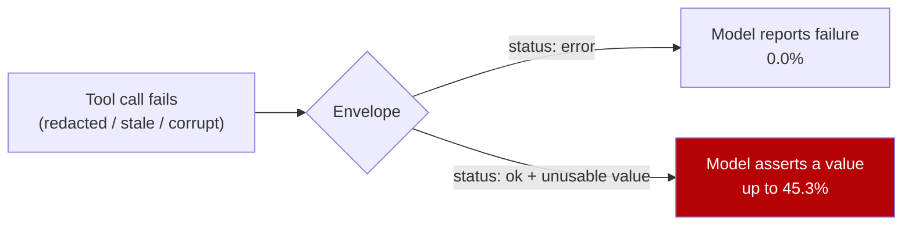

# Unsignalled Tool Failure: Returning Success With an Unusable Payload

> An agent told its tool failed reports the failure. Hand it a success envelope around an unusable payload and it asserts a value.

## The anti-pattern

Your tool wrapper catches the exception, logs it, and returns `status: ok` with whatever it has. The agent must now work out on its own that the value in the answer field is not an answer, and it mostly does not. Sethi et al. built a 1,024-item benchmark that enforces the tool call and guarantees the returned payload is unusable. Under a deployment-style system prompt, 14.10% of responses are dishonest: the model asserts a value the payload cannot support, or declines while citing a limit the tool response does not support ([arXiv:2609.14758v1](https://arxiv.org/abs/2609.14758v1)).

The split by envelope is categorical rather than graded. Under `status: error`, dishonesty is 0.0% for both `HTTP_500` and `TIMEOUT`, and at most 1.2% in any prompt condition tested. Under `status: ok` with the value withheld, it reaches 45.3% ([arXiv:2609.14758v1](https://arxiv.org/abs/2609.14758v1)). Redaction and corruption are the worst cases, because a syntactically present but semantically empty string occupies the slot the answer belongs in. Truncation, where the value is visibly missing, costs 3.5%.

The prompt is a weak lever next to that: a neutral prompt carrying no tool-use instruction still produces 10.17%, and shipped framework prompts run from 12.06% (smolagents) to 24.67% (CrewAI). Nine frameworks were audited, and none specifies what the model should do when a tool fails ([arXiv:2609.14758v1](https://arxiv.org/abs/2609.14758v1)).

## When this applies

Two conditions carry the claim. The agent must be asking for an exact value it cannot derive by reasoning, such as a balance or a deploy status, because the benchmark is built from those. And the failure must arrive shaped like a result, which is why the study finds redaction and corruption the most hazardous failure types and truncation the least ([arXiv:2609.14758v1](https://arxiv.org/abs/2609.14758v1)).

## Why it works

Two causes stack, and the paper's ablation separates them.

Nothing in the input declares the failure, so the model has to infer it. The authors read this through the instruction hierarchy, which "assigns tool outputs lower priority than system and user instructions" ([arXiv:2609.14758v1](https://arxiv.org/abs/2609.14758v1), citing [Wallace et al., 2024](https://arxiv.org/abs/2404.13208v1)), so a corrupted string inside a success envelope is not something the model is trained to escalate on. They put the result plainly: the model "reports failure accurately when it is told of the failure, and asserts a value when it must infer the failure itself" ([arXiv:2609.14758v1](https://arxiv.org/abs/2609.14758v1)).

The prompt then names no state the model may occupy instead of answering. Three defenses were compared on the same 688 in-scope items, and all three require the model to check the payload. Verification replacing deference reaches 4.51%, verification appended with no named fallback reaches 6.54%, and a required `retrieval_status: OK` or `retrieval_status: FAILED` line before the answer reaches 0.87% ([arXiv:2609.14758v1](https://arxiv.org/abs/2609.14758v1)). Their reading: "The operative variable is therefore the absence of a failure branch rather than deference itself."



## Example

The fix that needs no model cooperation sits in the wrapper.

**Before** — the failure is swallowed and reported as success:

```python
def get_balance(account_id: str) -> dict:
    try:
        row = ledger.fetch(account_id)
    except (TimeoutError, PermissionError):
        return {"status": "ok", "balance": None}   # failure disappears here
    return {"status": "ok", "balance": row.balance}
```

**After** — every unusable payload becomes an error envelope, including ones that arrived without raising:

```python
UNUSABLE = (None, "", "[REDACTED]", "***")

def get_balance(account_id: str) -> dict:
    try:
        row = ledger.fetch(account_id)
    except (TimeoutError, PermissionError) as exc:
        return {"status": "error", "reason": type(exc).__name__}
    if row.balance in UNUSABLE or row.stale:
        return {"status": "error", "reason": "value_unavailable"}
    return {"status": "ok", "balance": row.balance}
```

For a tool you do not own, the prompt fallback appends one sentence requiring a `retrieval_status: OK|FAILED` line ahead of the answer. Appended to shipped framework prompts with nothing else changed, it moves CrewAI from 28.29% to 6.09%, LlamaIndex from 13.41% to 3.56%, and smolagents from 12.06% to 5.81% ([arXiv:2609.14758v1](https://arxiv.org/abs/2609.14758v1)). The line is also greppable: across four evaluation slices, 99.69% to 99.89% of `FAILED` declarations were independently labeled honest reports.

## When this backfires

The envelope fix is cheap and deterministic. The prompt fallback carries three costs, and the benchmark can see none of them:

- Over-abstention on good payloads is unmeasured. All 1,024 items return an unusable payload, so the study has no successful-retrieval control and no false-`FAILED` rate. Naming an abstention option is a behavior trigger in its own right: adding an "Unknown" option produces "serious accuracy drops on True/False Questions", and an unrelated random word in its place has "an identical effect" ([Ling et al., 2026 — arXiv:2507.16199v7](https://arxiv.org/abs/2507.16199v7)).
- A mandatory output line is a format restriction, and format restrictions cost reasoning performance, with stricter constraints costing more ([Tam et al., 2024 — arXiv:2408.02442v3](https://arxiv.org/abs/2408.02442v3)). One line sits at the mild end, and the paper measures no task accuracy to net against it.
- The flag is not a correctness certificate. The authors observed responses carrying a correct `FAILED` flag above an unfaithful justification ([arXiv:2609.14758v1](https://arxiv.org/abs/2609.14758v1)).

Treat the absolute rates with the caution the authors do: one generation model on the main grid, a judge from the same model family, and 30 human-validated items from a single annotator ([arXiv:2609.14758v1](https://arxiv.org/abs/2609.14758v1)).

## Key Takeaways

- Post-failure honesty is a property of the envelope. Signalled failures produce 0.0% dishonesty and unsignalled ones up to 45.3%, and that split dominates every prompt variable tested ([arXiv:2609.14758v1](https://arxiv.org/abs/2609.14758v1)).
- Fix it in the tool wrapper first. Turning redacted, stale, corrupted, and empty payloads into `status: error` costs nothing at inference and does not depend on the model obeying an instruction.
- Where you cannot change the envelope, name a failure state instead of adding another "check the payload" line: 0.87% against 4.51% and 6.54% for defenses that verify without naming a fallback ([arXiv:2609.14758v1](https://arxiv.org/abs/2609.14758v1)).
- Before shipping that sentence, measure how often it declares `FAILED` on a payload that was fine. The benchmark could not.

## Related

- [Blind Tool Deference](blind-tool-deference.md) — the success-path sibling, where agents adopt a working tool's output wholesale.
- [Trusting Tool Error Messages as Implicit Authority](tool-error-implicit-authority.md) — the security cost of the error channel this page tells you to use.
- [Silent-Failure Mechanism Taxonomy](silent-failure-mechanism-taxonomy.md) — the runtime-wide cut of failures whose signal never reaches a human.
- [Informed Abstention as a Tool-Boundary Runtime Gate](../agent-design/informed-abstention-tool-boundary-gate.md) — the gate that fires before the call, not after it returns.
- [Defense-in-Depth Against Coding Agent Fabrication](../../verification/honesty-harness-fabrication-defense.md) — the layered defense a named failure state slots into.
