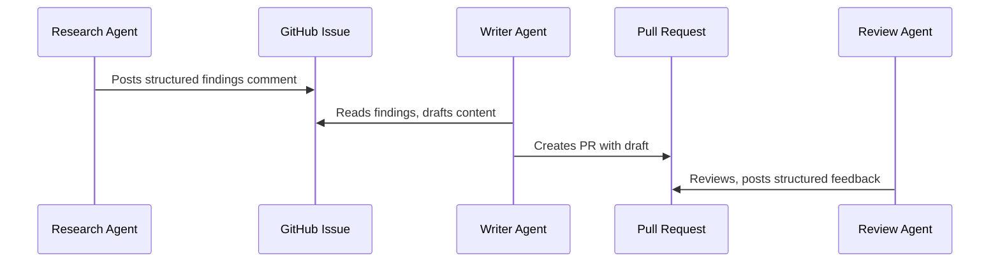

# Agent Handoff Protocols: Passing Work Between Agents

> An agent handoff protocol is an explicit contract — what the upstream stage produces and the downstream stage expects — preventing information loss between agents.

Learn it hands-on with the [Handoffs and Coordination Contracts](https://learn.agentpatterns.ai/multi-agent/handoffs-and-contracts/) guided lesson, which includes quizzes.

## The handoff problem

Each agent in a pipeline works in its own context window. The research agent's findings do not transfer to the draft agent on their own. Each handoff is a point where information can be lost. Too little context and the next agent makes wrong assumptions. Too much and the noise weighs it down. The [Multi-Agent System Failure Taxonomy](https://arxiv.org/abs/2503.13657) (MAST) annotates over 1,600 production traces. It names inter-agent misalignment as one of three primary failure categories.

The handoff protocol is the contract between agents. The upstream agent writes a defined structure, and the downstream agent reads it.

## Structured handoff formats

Define what each pipeline stage produces. Handoff formats tend to share these fields:

- what was done: the scope of work completed
- what was found: conclusions, not raw exploration
- what needs attention: items the next agent must address
- what is unresolved: open questions or blockers

A research agent that produces structured JSON or a defined markdown schema is more reliable than one that writes prose notes. Field extraction is deterministic. It does not depend on whether the receiving agent can parse unstructured natural language.

## Summarize, don't forward

The receiving agent needs conclusions, not transcripts. Passing raw exploration logs to the next agent fills its context with noise. The agent did not produce that noise and cannot parse it efficiently. So summarize at the boundary:

- keep the decisions made and the reasons for them
- keep unresolved items that the next stage must handle
- drop intermediate reasoning, failed attempts, and tool call details

## Persistent handoff media

GitHub issues and PRs work as durable handoff artifacts. They persist, and you can review and link to them. A research agent that comments findings on an issue creates a handoff that survives context resets and that humans can audit. A draft agent reading that comment gets clean, structured input without access to the predecessor's full session.

Labels encode pipeline state. They tell the next agent what stage the work is in and what format to expect.



## Context isolation is a feature

Each agent starts with a fresh context, informed by the handoff rather than weighed down by the predecessor's full session. This is a design goal, not a limitation. It prevents context bleed between pipeline stages. It also forces each handoff to be explicit about what information matters.

## Anti-pattern: raw transcript forwarding

Passing a previous agent's full output or conversation transcript to the next agent as its prompt bloats the context. The receiving agent's context fills with the sender's reasoning process rather than its conclusions. Extract and summarize at each boundary instead.

## When this backfires

Structured handoff protocols add overhead that is not always justified:

- short-lived or single-stage pipelines: when one agent can complete the task end to end, a schema adds friction without benefit. Protocols pay off only when work crosses agent boundaries.
- rapidly evolving schemas: if the upstream agent's outputs change often, keeping a schema contract in sync costs effort. Loose prose may adapt better than [typed schemas at agent boundaries](typed-schemas-at-agent-boundaries.md) during early prototyping, when the pipeline shape is not yet stable.
- over-summarization: aggressive summarization at handoff boundaries can discard context the downstream agent needs. When the upstream agent cannot tell essential detail from incidental detail, the summary may omit critical caveats or edge-case findings. The downstream agent then proceeds on an incomplete picture.
- rigid schemas hiding uncertainty: structured fields suggest certainty. An agent that fills `findings` with a well-formatted JSON array may hide that its conclusions were tentative, and the downstream agent reads the structure as authoritative. Prose notes with hedging language sometimes preserve that uncertainty better than named fields with string values.

## Example

The following shows a research agent producing a structured JSON handoff that a writer agent can consume directly. The upstream agent writes conclusions and open items, not its reasoning trace, into a file that becomes the writer agent's sole input.

```json
{
  "stage": "research",
  "completed": "Surveyed Claude API rate limiting behaviour across Tier 1–4 accounts",
  "findings": [
    "Tier 1 accounts are limited to 50 RPM on claude-3-5-sonnet; Tier 4 accounts have no published hard cap",
    "429 responses include a Retry-After header; exponential backoff without this header is unreliable",
    "Batch API bypasses RPM limits but introduces up to 24-hour latency"
  ],
  "needs_attention": [
    "Verify Tier 4 limits via direct API measurement — documentation is outdated",
    "Add Batch API latency trade-off to the draft"
  ],
  "unresolved": [
    "Whether prompt caching affects RPM accounting is undocumented"
  ]
}
```

The writer agent's system prompt references this schema directly. It reads `findings` for content, `needs_attention` for required coverage, and `unresolved` for items to flag as open questions rather than assert as facts. This stops the writer from inventing answers for gaps the research agent left open on purpose.

## Why it works

[Structured schemas](typed-schemas-at-agent-boundaries.md) remove ambiguity at parse time. A downstream agent that reads a prose summary must work out, through language understanding, where the "findings" end and the "open questions" begin. With a schema, field boundaries are explicit and predictable token for token. This makes the receiving agent less likely to misread the scope or act on information the upstream agent meant as provisional. The effect grows in longer pipelines. Each stage of ambiguity compounds, so structure early on prevents errors from spreading across many handoffs. GitHub Engineering describes the same pattern in its analysis of [why multi-agent workflows often fail](https://github.blog/ai-and-ml/generative-ai/multi-agent-workflows-often-fail-heres-how-to-engineer-ones-that-dont/), where ambiguity in early handoffs surfaces as wrong actions several agents downstream.

## FAQ

**When is a handoff schema not worth the overhead?**

When work never crosses an agent boundary. In a short-lived or single-stage pipeline, where one agent completes the task end to end, a schema adds friction and returns nothing. Schemas also cost more than they return during early prototyping: if upstream outputs change often, keeping the contract in sync is constant work, and loose prose may adapt better until the pipeline shape stabilizes.

**Can a well-formed structured handoff still lose information?**

Yes, in two ways. Aggressive summarization at the boundary can discard the caveats and edge-case findings the downstream agent needed, especially when the upstream agent cannot separate essential from incidental detail. Named fields also imply certainty: a well-formatted JSON findings array hides that its conclusions were tentative, where prose with hedging language would have carried that doubt forward.

**Why does handoff ambiguity get worse in longer pipelines?**

Because each stage compounds the last. A downstream agent reading prose must work out through language understanding where the findings end and the open questions begin, while a schema makes field boundaries explicit and predictable token for token. Ambiguity introduced early therefore surfaces as wrong actions several agents downstream, so structure in the early stages stops errors spreading.

## Key Takeaways

- Define explicit output schemas for each pipeline stage — structured handoffs are more reliable than prose.
- Summarize at boundaries: the next agent needs conclusions, not the full exploration history.
- Use persistent artifacts (GitHub issues, PRs, comments) as handoff media when cross-session durability matters.
- Context isolation between agents is intentional — the handoff is the only channel.

## Related

- [File-Based Agent Coordination](file-based-agent-coordination.md)
- [Orchestrator-Worker Pattern](orchestrator-worker.md)
- [Sub-Agents for Fan-Out Research and Context Isolation](sub-agents-fan-out.md)
- [Closed-Loop Role-Based Refinement](closed-loop-role-based-refinement.md)
- [Separation of Knowledge and Execution](../agent-design/separation-of-knowledge-and-execution.md)
- [Multi-Agent Topology Taxonomy](multi-agent-topology-taxonomy.md)
- [Fan-Out Synthesis Pattern](fan-out-synthesis.md)
- [Multi-Agent SE Design Patterns](multi-agent-se-design-patterns.md)
- [Agent as Tool vs Handoff: Who Keeps the Conversation](../agent-design/agent-as-tool-vs-handoff.md) — whether to hand off at all, or delegate and take the result back
