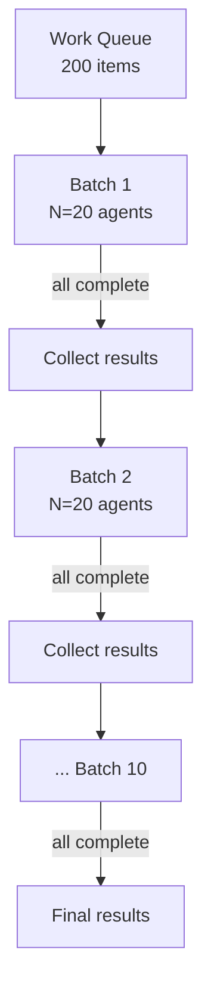

# Bounded Batch Dispatch

> Bounded batch dispatch runs large agent workloads as fixed-size sequential batches — one agent per item, N at a time — under API rate limits.

## The problem

Two naive approaches break at scale.

Unbounded fan-out spawns one agent per item, all at once. It works for 5 items. At 200 items, API rate limits trip (Anthropic Tier 1 caps at [50 requests per minute](https://platform.claude.com/docs/en/api/rate-limits)), costs spike unpredictably, and a wave of 429 errors can lose every in-progress task at once.

Sequential processing runs one agent at a time. It is safe but slow: a 200-item queue at 30 seconds per agent takes 100 minutes.

## The pattern

Split the work queue into chunks of size N. For each chunk:

1. Spawn one agent per item using background execution, so all agents in the chunk start at once.
2. Wait for every agent in the chunk to finish.
3. Collect the results.
4. Move on to the next chunk.

Each agent handles exactly one work item in its own context window — no state shared between agents, no context bleed between items.

## The control variable

Batch size N is the single tuning knob, set against two constraints.

Rate limits: a batch of N agents firing at once counts as N requests. Keep N comfortably below the RPM ceiling, allowing for retries.

Cost budget: `N × avg_tokens × price = cost per batch`. With a fixed N, the total cost for the full queue is predictable before the run starts.

Start at N=10 to 20. Reduce it if you hit 429s. Increase it if you have headroom and throughput matters.

## Why not a true sliding window

A sliding window keeps exactly N agents in flight, spawning a replacement the moment one finishes. It removes head-of-line waits but needs `wait-for-any` semantics: block until the first of N tasks completes, then act. LLM orchestrators only support `wait-for-all`. They spawn a group of background agents and resume when the whole group finishes ([Claude Code agent teams](https://code.claude.com/docs/en/agent-teams)). So a true sliding window needs an external queue worker outside the LLM context. For items of similar duration, the throughput gap is small.

## Error handling

When an agent in a batch fails, collect the completed results, record the failed item, and continue. Failed items surface in the final report for a targeted retry. A single failure never stops later batches.

## When this backfires

- Head-of-line blocking: the slowest agent delays the whole batch. For widely varying item durations, consider a [staggered launch](staggered-agent-launch.md) or [adaptive fan-out](adaptive-sandbox-fanout-controller.md) instead.
- Fixed N does not adapt: you calibrate batch size once at run start. If model latency spikes or your rate-limit tier changes mid-run, N is wrong with no feedback loop to correct it.
- Interdependent items: if item 30 needs output from item 12, batching breaks the dependency. Use sequential processing when items have ordering constraints.
- Very short items at low N: agent spawn overhead can exceed the work itself for trivial tasks. A single agent processing items in order is faster.
- Context isolation has a cost: one agent per item means one full [context initialization](sub-agents-fan-out.md) per item. For large queues with shared context (system prompt, rubric, reference data), prompt caching becomes essential to avoid ITPM exhaustion.
- N near the rate-limit ceiling: failed agents retrying at once can push the next burst over the limit. Keep N at 60 to 80% of the RPM ceiling.

## Why it works

Sequential batches cap concurrent requests at N. So peak RPM stays bounded at N × (1 / avg_agent_duration_minutes), below the rate ceiling when N is set correctly. Cost is computable up front because N is fixed: `queue_size × avg_tokens × token_price`. Context isolation is structural: each agent receives only its own work item, with no shared state to corrupt, so failures stay local and never cascade. Anthropic's own [multi-agent research system](https://www.anthropic.com/engineering/multi-agent-research-system) uses this synchronous batch model, noting that "asynchronicity adds challenges in result coordination, state consistency, and error propagation across the subagents."

## When to use

Use bounded batch dispatch when:

- the work queue has more items than your API rate limit allows in a single burst
- each item is independent, so no output from one item feeds into another
- context isolation matters, so items must not share or contaminate each other's state
- you need to know the cost before the run starts

Use unbounded fan-out for small queues (under about 15 items) where rate limits are not a concern. Use sequential processing when items have strict ordering dependencies.

## Key Takeaways

- Batch size N is the single control variable — tune against RPM limits and cost budget
- One agent per item guarantees full context isolation at the cost of one agent spawn per item
- Native background dispatch uses wait-for-all semantics; wait-for-any requires async dispatch or an external queue worker — sequential batches are the simpler default
- Errors in one batch never abort subsequent batches

## Example

A code-review pipeline must audit 80 pull requests overnight. Each review is independent. The team sets N=20 to stay well within Anthropic Tier 1 rate limits (50 RPM).

Batch 1 (items 1 to 20): the orchestrator dispatches 20 background agents at once, each with one PR diff and the review rubric, then waits. The slowest agent finishes in 45 seconds, the batch completes, and 20 review reports come back.

Batches 2 to 4 (items 21 to 80): the same process repeats. One agent in batch 3 times out, so its PR is recorded as failed and the pipeline continues. Total wall time is about 3 minutes (4 batches of about 45 seconds), against about 40 minutes in sequence.

Result collection: it aggregates 79 successful reviews and flags 1 failed item for manual retry. The cost is predictable: 80 agents times about 2,000 tokens average times the token price, computed before the run starts.

Adjusting N: if 429 errors appear, reduce to N=10. If you have headroom and throughput matters, increase to N=30, but check the new batch size against current tier limits before scaling.

## Related

- [Fan-Out Synthesis](fan-out-synthesis.md)
- [Sub-Agents for Fan-Out Research and Context Isolation](sub-agents-fan-out.md)
- [Orchestrator-Worker](orchestrator-worker.md)
- [Staggered Agent Launch](staggered-agent-launch.md)
- [Async Non-Blocking Subagent Dispatch](async-non-blocking-subagent-dispatch.md)
- [Adaptive Sandbox Fan-Out Controller](adaptive-sandbox-fanout-controller.md)
- [Cost-Aware Agent Design](../../token-engineering/cost-aware-agent-design.md)
- [Multi-Agent Topology Taxonomy](multi-agent-topology-taxonomy.md)
