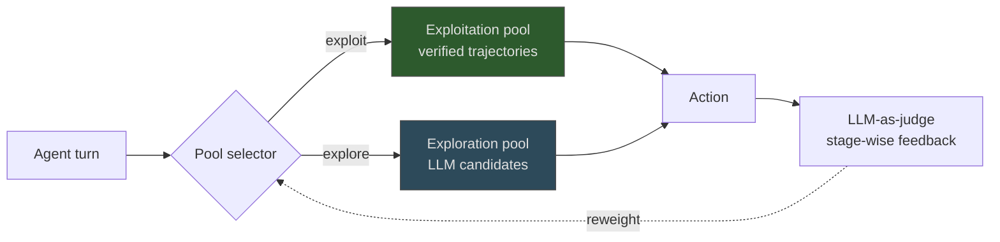

# Decentralized Memory for Self-Evolving Multi-Agent Systems

> Decentralized memory gives each agent a private store instead of a shared one, so each specializes on its own task distribution.

Decentralized memory gives each agent in a multi-agent system its own persistent local store, rather than a shared central repository. Improvement becomes a federated process: each agent builds role-specific expertise without coordinating writes. The trade swaps write contention and central-store staleness for divergence between agents and the loss of the shared-signal benefit a central store provides.

## When this pattern applies

This is a qualified architecture. Verify all four preconditions before adopting:

1. Large enough agent population: at single-digit agent counts, central-store contention is not a real cost, and the dual-pool machinery is pure overhead.
2. Heterogeneous-enough workloads: per-agent specialization assumes each agent sees a consistent task distribution. Under uniform workloads, agents relearn the same lessons.
3. Long-enough deployments: the regret bound is asymptotic in T ([Hao, Long, Zhao 2026, §3](https://arxiv.org/abs/2605.22721)). Short deployments never amortize the bandit machinery.
4. Trusted writers: N independent stores multiply the memory-poisoning surface ([Memory Poisoning in MAS, arxiv 2603.20357](https://arxiv.org/abs/2603.20357)).

If any precondition fails, prefer a shared store or a single-agent design — see [agent memory patterns](../agent-design/agent-memory-patterns.md) or [tiered memory architecture](../agent-design/tiered-memory-architecture.md).

## Architecture

Each agent maintains a dual-pool memory and updates it without coordinating with peers ([Hao, Long, Zhao 2026](https://arxiv.org/abs/2605.22721)):

- Exploitation pool: consolidated past trajectories for solutions the agent has verified
- Exploration pool: LLM-generated candidates for novel contexts the exploitation pool does not cover
- Stage-wise reweighting: an LLM-as-judge scores recent stages and adjusts the weight of each pool from feedback

Other agents in the system run the same loop against their own pools. Writes never cross agents.

## Why it works

Decentralized memory works because it separates write contention from retrieval competition. Each agent's exploitation pool anchors on its own task distribution, rather than diluting against unrelated peers' episodes. This is the same dilution argument that motivates [tiered memory architectures](../agent-design/tiered-memory-architecture.md) at the single-agent level. The exploration pool adds a stochastic-bandit term bounded at O(log T) cumulative regret. That gives each agent a controlled rate of trying novel candidates against accumulated solutions ([Hao, Long, Zhao 2026, §3](https://arxiv.org/abs/2605.22721)). Independent results from [G-Memory](https://arxiv.org/abs/2506.07398) and [Trainable Graph Memory](https://arxiv.org/html/2511.07800v1) reach comparable improvements through explicit relational structure rather than per-agent isolation. This is evidence that the operative variable is separating retrieval competition from write contention, not isolation by itself. Tiering and graph-structuring are alternative levers on the same trade.

## Reported numbers

DecentMem reports up to +23.8% accuracy over the strongest centralized-memory baseline, +52.5% over no-memory systems, and a 49% token reduction. These results span AutoGen, DyLAN, and AgentNet on Qwen3 (4B/8B/14B) and Gemma4 (E2B/E4B) backbones, across five math, code, QA, and embodied benchmarks ([Hao, Long, Zhao 2026](https://arxiv.org/abs/2605.22721v1)). These are preprint numbers, and unreplicated. Treat the architecture as defensible, but not the numbers as load-bearing.

## What coordination actually remains

The system is more accurately described as locally-decentralized but globally-coordinated. The published design keeps a task router, a shared LLM backbone (aligned in effect through identical weights), the LLM-as-judge that reweights pools (a shared evaluator with cross-agent influence), and shared benchmark definitions. Central-store contention is only one of several centralized dependencies. Account for the rest when sizing the gain.

## When this backfires

Beyond the precondition failures above, two more failure modes are worth naming:

- Tasks requiring global coherence: when agents must produce mutually consistent artifacts (shared schemas, joined outputs), per-agent divergent memory produces locally-correct but globally-inconsistent decisions. This is the canonical decentralized-topology failure mode ([Multi-Agent Topology Taxonomy](multi-agent-topology-taxonomy.md)).
- Faithfulness gaps: agents with private memory frequently regress, acknowledge mistakes then repeat them, and apply learned strategies inconsistently ([arxiv 2601.22436](https://arxiv.org/pdf/2601.22436)). Private memory alone does not produce reliable self-improvement.

A poisoned LLM-as-judge is a particular concern even when the "trusted writers" precondition holds. The judge is shared across the supposedly-independent agents, so it propagates incorrect reweighting to every agent at once.

## Key Takeaways

- Decentralized memory is one design point on the multi-agent memory spectrum, not a default — preconditions on agent count, workload heterogeneity, deployment horizon, and writer trust must hold
- Per-agent dual-pool architecture (exploitation + exploration) with LLM-as-judge reweighting eliminates central-store contention but loses shared-signal benefits
- Reported gains (+23.8% over centralized, +52.5% over no-memory) come from a paper that retains a router, shared backbone, and shared judge — call the system locally-decentralized, not fully decentralized
- The operative mechanism — separating write contention from retrieval competition — is also achieved by tiered architectures and graph-structured memory at lower architectural cost in many regimes

## Related

- [Tiered Memory Architecture: Episodic-to-Semantic Consolidation](../agent-design/tiered-memory-architecture.md) — single-agent design that achieves a similar dilution-reduction effect via promotion rather than per-agent isolation
- [Experience Graphs as Structured Memory for Self-Evolving Agents](../agent-design/experience-graphs-self-evolving-agents.md) — graph-structured alternative that reports comparable gains via relational structure
- [Agent Memory Patterns: Learning Across Conversations](../agent-design/agent-memory-patterns.md) — scope-based memory architecture covering shared-store designs
- [Continual Learning for AI Agents: Three Layers of Knowledge Accumulation](../agent-design/continual-learning-layers.md) — the context-layer view of memory updates that decentralized stores instantiate
- [Agentic Flywheel: Self-Improving Agent Systems](../agent-design/agentic-flywheel.md) — self-improvement loop that decentralized memory feeds at the per-agent level
- [Multi-Agent Topology Taxonomy: Centralized, Decentralized, and Hybrid](multi-agent-topology-taxonomy.md) — coordination-topology context for choosing per-agent vs shared state
- [Memory Retrieval as a Control Decision](../agent-design/memory-retrieval-as-control.md) — utility-score updates for retrieval that the LLM-as-judge reweighting parallels at the pool level
