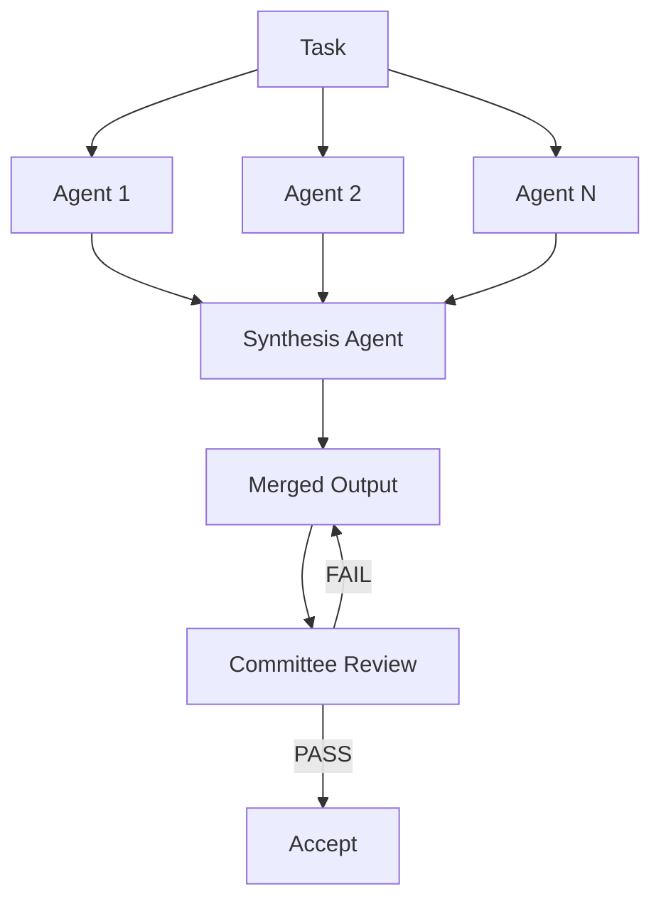

# Fan-Out Synthesis Pattern

> Fan-out spawns N independent agents on one problem, then a synthesis agent merges the strongest elements from each attempt into a single output.

Learn it hands-on with the [Fan-Out and Synthesis guided lesson](https://learn.agentpatterns.ai/multi-agent/fan-out-and-synthesis/), which includes quizzes.

!!! note "Also known as"
    Fan-Out Pattern, Parallel Dispatch, Scatter-Gather. The fan-out-then-synthesize variant adds a dedicated merge step after parallel execution. See [Agent Composition Patterns](../agent-design/agent-composition-patterns.md), [Orchestrator-Worker](orchestrator-worker.md), and [Sub-Agents Fan-Out](sub-agents-fan-out.md).

## Structure

1. Fan-out — spawn N agents with identical instructions but independent contexts. Each one produces a distinct solution.
2. Synthesis — a synthesis agent critiques all N outputs, scores them against defined criteria, and assembles a merged solution from the strongest parts.
3. Validation — pass the merged output through a committee review loop before you accept it.

## Why parallel diversity helps

A single agent commits to one set of decisions. Parallel agents with identical instructions but independent contexts explore different trade-offs, edge cases, and risks. Synthesis takes the strongest element from each attempt and assembles a composite no single agent would have reached. [Majority voting](voting-ensemble-pattern.md) picks the most popular answer. Synthesis instead combines complementary strengths on purpose.

## Why it works

The mechanism is ensemble variance reduction applied to generative outputs. A single LLM call samples the output distribution once. N independent calls sample N times with different starting conditions, so they cover more of the solution space. Synthesis selects the highest-quality elements from each sample. It exploits the variance rather than averaging it away. This mirrors ensemble methods in classical machine learning, where combining diverse weak learners beats any individual learner ([Dietterich, 2000 — Ensemble Methods in Machine Learning](https://link.springer.com/chapter/10.1007/3-540-45014-9_1)). The condition that matters is genuine diversity: if the agents converge, there is nothing to exploit.

## Diversity mechanisms

Identical instructions do not guarantee identical outputs. To widen the spread:

- Vary the model temperature between agent instances.
- Vary the seed context, so each agent starts from a different reference.
- Vary the system prompt emphasis: one agent optimizes for brevity, another for robustness, a third for edge-case coverage.

Aim for enough diversity that synthesis finds genuinely different approaches, not surface-level rephrasing.

## Synthesis agent responsibilities

The synthesis agent receives all N outputs and must:

- Score each against the evaluation criteria
- Identify which elements are strongest
- Produce a merged output that draws on those elements explicitly
- Document which source contributed each major decision

Synthesis is deliberate assembly, not summarization. The synthesizer must justify its choices.

## Cost trade-off

N parallel attempts cost N times the compute. The trade-off is worthwhile when:

- The task is high-stakes and errors are expensive to fix downstream.
- Diversity of approach is genuinely valuable, as in design, architecture, or creative output.
- Cutting iteration rounds justifies the upfront parallel cost.

For routine, well-defined tasks, a single attempt usually suffices. [Anthropic's Building Effective Agents](https://www.anthropic.com/engineering/building-effective-agents) documents voting and sectioning as the two forms of agent parallelization (with orchestrator-workers treated as a distinct workflow). Best-of-N research shows diminishing returns as N grows — quality gains compress while compute grows linearly, making N=3–5 the efficient range ([CarBoN: Calibrated Best-of-N Sampling](https://arxiv.org/abs/2510.15674)).

## When this backfires

Fan-out synthesis adds cost and coordination overhead. Several conditions make it counterproductive:

- Conformity bias collapses diversity. Agents given the same prompt can converge on the same approach rather than genuinely independent solutions. A study of multi-agent LLM failures builds a taxonomy in which inter-agent misalignment is one of three failure categories, so running more agents does not guarantee the diversity that fan-out depends on ([Cemri et al., 2025 — Why Do Multi-Agent LLM Systems Fail?](https://arxiv.org/abs/2503.13657)). Constrained solution spaces amplify the convergence.
- A weak synthesis agent makes things worse. If the synthesizer cannot judge which elements are strongest, the merge step adds errors rather than removing them, and the result can be worse than the best individual attempt. This is the highest-risk component.
- Returns diminish at high N. Quality gains compress as N grows while compute grows linearly ([CarBoN, 2025](https://arxiv.org/abs/2510.15674)). N=10 rarely justifies 10 times the cost of N=3.
- Errors cascade downstream. Passing all N outputs to one synthesizer can exceed context limits. When the merged output feeds a later agent as authoritative, synthesis errors compound rather than self-correct.

## Integration with committee review

After synthesis, run the merged output through committee review before you accept it. This catches cases where the synthesizer combined conflicting elements or misidentified the strongest approach. Fan-out generates diversity. Committee review validates the merged result.

## Key Takeaways

- Fan-out generates solution diversity by running N agents independently on the same task
- Synthesis is deliberate assembly of the strongest parts, not a vote or a summary
- Maximize diversity by varying temperature, seed context, or system prompt emphasis between agents
- N× compute cost is justified for high-stakes or creative tasks; not warranted for routine well-defined tasks
- Chain into committee review to validate the merged output before accepting

## Example

A team needs a high-stakes API design for a payment service. Rather than iterate on a single draft, they fan out to three agents:

- Agent 1, at temperature 0.3, optimizes for simplicity and minimal surface area.
- Agent 2, at temperature 0.7, optimizes for extensibility and future-proofing.
- Agent 3, at temperature 0.9, maximizes edge-case coverage and error handling.

Each agent produces an independent API specification. A synthesis agent then:

1. Scores all three on the team's evaluation criteria (simplicity, extensibility, robustness)
2. Selects Agent 1's endpoint naming conventions (simplest), Agent 2's versioning strategy (most extensible), and Agent 3's error codes (most comprehensive)
3. Assembles a merged specification documenting which source contributed each decision
4. Passes the merged spec to a committee review loop before the team accepts it

The result is a specification no single agent would have produced — combining simplicity, extensibility, and robustness — validated by committee review before acceptance.

## FAQ

**How many agents should I fan out to?**

Three to five. Best-of-N research shows quality gains compress while compute grows linearly, which makes N=3–5 the efficient range ([CarBoN: Calibrated Best-of-N Sampling](https://arxiv.org/abs/2510.15674)). N=10 rarely justifies ten times the cost of N=3, and passing ten outputs to one synthesizer risks exceeding its context limit as well.

**Which part of the pattern is riskiest?**

The synthesis agent. If the synthesizer cannot judge which elements are strongest, the merge step adds errors instead of removing them and the result can be worse than the best individual attempt. That risk compounds when the merged output feeds a later agent as authoritative, because synthesis errors then cascade downstream rather than self-correcting.

**What if all the agents produce the same answer?**

Then there is nothing for synthesis to exploit — the pattern depends on genuine diversity, and identical instructions do not guarantee it. Agents can converge through conformity bias, and constrained solution spaces amplify it; inter-agent misalignment is one of three failure categories in a taxonomy of multi-agent LLM failures ([Cemri et al., 2025](https://arxiv.org/abs/2503.13657)). More agents alone does not buy diversity.

## Related

- [Orchestrator-Worker Pattern](orchestrator-worker.md)
- [Sub-Agents Fan-Out](sub-agents-fan-out.md)
- [Voting Ensemble Pattern](voting-ensemble-pattern.md)
- [Multi-Model Plan Synthesis](multi-model-plan-synthesis.md)
- [Recursive Best-of-N Delegation](recursive-best-of-n-delegation.md)
- [Committee Review Pattern](../../code-review/committee-review-pattern.md)
- [Agent Composition Patterns](../agent-design/agent-composition-patterns.md)
- [Bounded Batch Dispatch](bounded-batch-dispatch.md)
