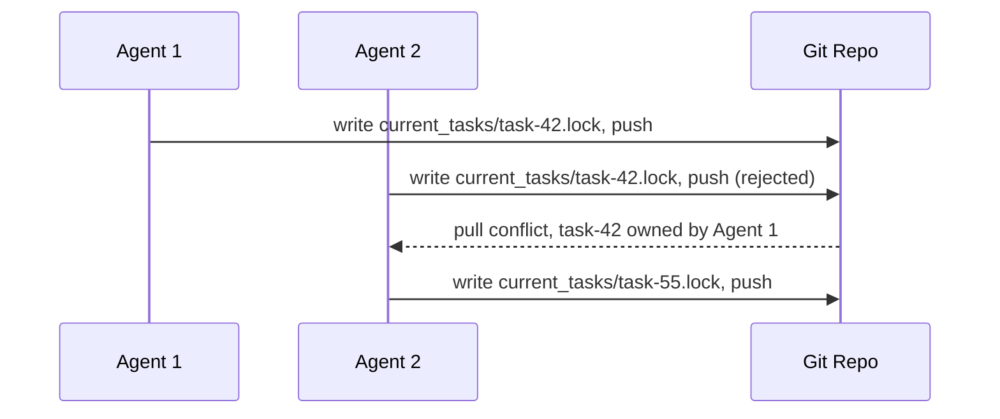

# File-Based Agent Coordination

> Coordinate parallel agents using lightweight file locks in a shared repository — git's merge mechanics enforce task exclusivity without requiring a central orchestrator.

## The problem with orchestrator-first design

Most teams assume parallel agents need a scheduler or controller to assign tasks, detect conflicts, and prevent duplicate work. That process adds infrastructure, creates a bottleneck, and introduces another failure point. For many multi-agent setups, you already have the coordination mechanism: git.

[Anthropic's C compiler case study](https://www.anthropic.com/engineering/building-c-compiler) shows that parallel agents can coordinate themselves using file-based locks and git's sync behavior, with no dedicated orchestration service.

## Mechanism

Each agent runs in its own container with a mounted shared repository. To claim a task:

1. The agent reads the task queue, a directory or file listing available work.
2. The agent writes a lock file to `current_tasks/`, for example `current_tasks/task-42.lock`, naming itself as the owner.
3. The agent pushes the lock file to the shared repository.
4. If two agents claim the same task at once, git rejects the second push. The losing agent fetches the updated state and picks a different task.

The lock file can be minimal: agent ID, timestamp, task identifier. The filesystem write makes the claim. The git push enforces it.



## Git log as audit trail

Every lock write and task completion is a git commit. The commit history becomes a human-readable record of:

- Which agent claimed which task
- When each task was started and completed
- The sequence of decisions across the parallel team

You get this audit trail without any extra logging infrastructure. It is a side effect of the coordination mechanism itself.

## What this pattern does not cover

File-based coordination handles task exclusivity. It does not handle:

- Dependency ordering — if task B needs task A's output, you need explicit dependency tracking or a sequencing step.
- Agent failure recovery — a crashed agent leaves a stale lock file, so the harness needs a timeout or cleanup mechanism.
- Load balancing — agents self-select tasks in queue order, so uneven task complexity can leave some agents idle.

When these concerns matter, use a dedicated orchestrator. The file-based pattern works best when tasks are genuinely independent and roughly uniform in complexity. Anthropic's [multi-agent research system](https://www.anthropic.com/engineering/multi-agent-research-system) shows the alternative: when tasks depend on each other or share context, you need explicit task boundaries in agent instructions to prevent duplication.

## Scaling properties

The pattern scales horizontally. Adding more agents needs no changes to the coordination mechanism. Each new agent reads the same task queue and follows the same lock contention protocol. Contention surfaces at the git push step, not at a central coordinator.

## Key Takeaways

- File locks in `current_tasks/` combined with git push rejection are sufficient to prevent duplicate work
- No dedicated orchestration service is required when tasks are independent and uniform
- Each agent runs in its own container with access to the shared repository
- Git commit history doubles as an audit trail of agent decisions at no additional cost
- The pattern does not handle dependency ordering or stale lock recovery — those require additional design

## Example

A CI pipeline spawns three agents to process a backlog of lint-fix tasks stored in `tasks/pending/`. Each agent runs the same claim script on startup:

```bash
#!/usr/bin/env bash
# claim-task.sh — run inside each agent container
set -euo pipefail

AGENT_ID="${AGENT_ID:?must set AGENT_ID}"
REPO="/workspace/shared-repo"
cd "$REPO"

for task_file in tasks/pending/*.yml; do
  TASK_SLUG=$(basename "$task_file" .yml)
  LOCK="current_tasks/${TASK_SLUG}.lock"

  # Skip if already claimed
  git pull --rebase --quiet
  [ -f "$LOCK" ] && continue

  # Write the lock file
  cat > "$LOCK" <<EOF
agent: $AGENT_ID
claimed: $(date -u +%Y-%m-%dT%H:%M:%SZ)
task: $TASK_SLUG
EOF

  git add "$LOCK"
  git commit -m "claim: $TASK_SLUG by $AGENT_ID"

  # Push — if rejected, another agent won the race
  if git push; then
    echo "Claimed $TASK_SLUG"
    # ... execute the task ...
    exit 0
  else
    # Lost the race — reset and try the next task
    git reset --hard origin/main
  fi
done
```

Lock file created at `current_tasks/fix-header-lint.lock`:

```yaml
agent: agent-02
claimed: 2025-06-14T08:31:12Z
task: fix-header-lint
```

When agent-03 attempts to push a lock for the same task, git rejects the push with a non-fast-forward error. Agent-03 pulls, sees the lock owned by agent-02, and moves to the next unclaimed task.

## Related

- [Worktree Isolation](../../workflows/worktree-isolation.md)
- [Single-Branch Git Agent Swarms](../../workflows/single-branch-git-agent-swarms.md)
- [Orchestrator-Worker Pattern](orchestrator-worker.md)
- [Staggered Agent Launch](staggered-agent-launch.md)
- [Observation-Driven Coordination: CRDT-Based Parallel Agent Code Generation](crdt-observation-driven-coordination.md)
- [Oracle-Based Task Decomposition](oracle-task-decomposition.md)
- [Multi-Agent Topology Taxonomy: Centralised, Decentralised, and Hybrid](multi-agent-topology-taxonomy.md)
- [Sub-Agents for Fan-Out Research and Context Isolation](sub-agents-fan-out.md)
