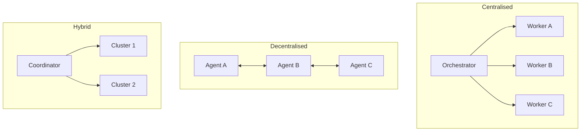

# Multi-Agent Topology Taxonomy: Centralized, Decentralized, and Hybrid

> Coordination topology choice is a primary source of multi-agent failures; centralized, decentralized, and hybrid each carry distinct failure modes.

Learn it hands-on: [When Many Agents Beat One](https://learn.agentpatterns.ai/multi-agent/when-many-agents/) — guided lesson with quizzes.

!!! info "Also known as"
    Coordination Topology. Related but distinct: [Multi-Agent SE Design Patterns](multi-agent-se-design-patterns.md) catalogs 16 finer-grained design patterns from a 94-paper literature review, while this page classifies systems at the coarser level of coordination topology — centralized, decentralized, or hybrid.

## The three topologies

Production multi-agent systems converge on three coordination topologies. The [arXiv:2602.10479 survey](https://arxiv.org/abs/2602.10479) covers related patterns — orchestrator-worker, router-solver, hierarchical, and swarm architectures — which map onto these categories.

### Centralized orchestration

One orchestrator LLM holds the task graph, delegates subtasks to workers, and aggregates results.

When to use: sequential dependencies, shared global state, or [result synthesis](orchestrator-worker.md) that needs awareness of all worker outputs.

Failure modes:

- Orchestrator context saturation — the coordinator accumulates worker results until it can no longer reason coherently about the remaining subtasks
- Single point of failure — an orchestrator error or stall halts the entire pipeline
- Worker result flooding — verbose worker results overwhelm the coordinator's context window

### Decentralized peer-to-peer

Agents coordinate via shared state or message passing. No central coordinator holds the task graph.

When to use: genuinely independent subtasks where global coherence is not needed at runtime.

Failure modes:

- Coordination storms — agents send competing updates to shared state, producing thrash
- Conflicting edits — agents change the same artifact without seeing each other's changes (resolved by [observation-driven coordination](crdt-observation-driven-coordination.md))
- Lack of global coherence — agents make locally correct but globally inconsistent decisions

### Hybrid

A coordinator manages clusters of peer agents. Each cluster handles a domain; the coordinator manages inter-cluster routing.

When to use: large pipelines with distinct phases, where intra-phase parallelism is high but inter-phase dependencies exist.

Failure modes: combines both centralized and decentralized failure modes. It needs explicit topology boundaries and typed [handoff contracts](agent-handoff-protocols.md) between clusters.

## Cross-topology failure modes

Three failure modes appear across all topologies:

Self-verification bias — an agent confirms its own output without independent checking. Mitigation: route outputs to an independent evaluator agent.

Doom loops — an agent iterates 10+ times on the same broken approach. Mitigation: [loop detection](../../observability/loop-detection.md) and budget warnings in the harness. [LangChain's harness engineering research](https://blog.langchain.com/improving-deep-agents-with-harness-engineering/) recommends [pre-completion checklists](../../verification/pre-completion-checklists.md) as a structural counter.

Context blindness — agents act without orientation in unfamiliar environments, producing directory-unaware or toolchain-unaware errors. Mitigation: inject directory structure and tooling inventories at initialization.

## Topology constraints as failure prevention

[Claude Code's agent team architecture](https://code.claude.com/docs/en/agent-teams) enforces a topology constraint: sub-agents cannot spawn sub-agents, eliminating unbounded nesting by structural enforcement. The [sub-agents documentation](https://code.claude.com/docs/en/sub-agents) describes a single-coordinator model as the canonical Claude Code topology.

[Anthropic's agent design patterns](https://www.anthropic.com/engineering/building-effective-agents) describe orchestrator-workers, parallelization, and routing as general workflow patterns (alongside [prompt chaining](../../context-engineering/prompt-chaining.md) and [evaluator-optimizer](../agent-design/evaluator-optimizer.md)). The guidance recommends starting with the simplest topology and adding complexity only when failure modes appear in production.

## Choosing a topology

| Task characteristic | Topology |
|--------------------|----------|
| Sequential dependencies, shared state | Centralized |
| Independent subtasks, no shared state | Decentralized |
| Mixed: phased with intra-phase parallelism | Hybrid |
| Unknown — start here | Centralized |

Centralized is the default because its failure modes are deterministic. Decentralized topologies need shared-state primitives (file locks, [CRDTs](crdt-observation-driven-coordination.md)) that add implementation surface.

## Choose a coordination pattern

Topology answers where the task graph lives; the coordination pattern answers how agents pass work. Before reaching for any pattern, walk down the complexity ladder — adopt the next level only when the current one stops being reliable. Microsoft's [AI agent orchestration patterns](https://learn.microsoft.com/en-us/azure/architecture/ai-ml/guide/ai-agent-design-patterns) page frames the same rule: "Use the lowest level of complexity that reliably meets your requirements."

1. Direct model call — a single well-crafted prompt, with no agent logic and no tool access. Solves classification, summarization, and single-step extraction.
2. Single agent with tools — one agent that reasons and chooses from tools and knowledge sources, looping until done. The right default for most enterprise tasks; [delegation-decision](../agent-design/delegation-decision.md) covers when to stop here.
3. Multi-agent orchestration — multiple specialized agents coordinated by an orchestrator or a peer protocol. Justified only when prompt complexity, tool overload, or security boundaries make a single agent unreliable. Anthropic's [Building Effective Agents](https://www.anthropic.com/engineering/building-effective-agents) gives the same escalation: "add multi-step agentic systems only when simpler solutions fall short."

## Map coordination patterns to topologies

Once multi-agent is justified, the coordination-pattern choice is a separate decision from topology. The table below maps the five patterns Microsoft documents to this site's canonical page for each — use the table as a router, then read the linked page for the trade-offs.

| Pattern | Coordination | Routing | Best for | Watch out for |
|---------|--------------|---------|----------|---------------|
| [Sequential](../../context-engineering/prompt-chaining.md) (a.k.a. *prompt chaining*, *pipeline*) | Linear pipeline; each agent processes the previous agent's output | Deterministic, predefined order | Step-by-step refinement with clear stage dependencies | Failures in early stages propagate; no parallelism |
| [Concurrent](fan-out-synthesis.md) (a.k.a. *fan-out / parallelization*; see also [LLM Map-Reduce](llm-map-reduce.md)) | Parallel; agents work independently on the same input | Deterministic or dynamic agent selection | Independent analysis from multiple perspectives; latency-sensitive scenarios | Conflict resolution when results contradict; resource-intensive |
| [Group chat](opponent-processor-debate.md) (a.k.a. *debate*, *maker-checker*; see also [Evaluator-Optimizer](../agent-design/evaluator-optimizer.md)) | Conversational; agents contribute to a shared thread | Chat manager controls turn order | Consensus-building, brainstorming, iterative maker-checker validation | Conversation loops; hard to control beyond three agents |
| [Handoff](agent-handoff-protocols.md) (a.k.a. *routing*, *triage*, *dispatch*) | Dynamic delegation; one active agent at a time | Agents decide when to transfer control | Tasks where the right specialist emerges during processing | Infinite handoff loops; unpredictable routing paths |
| [Magentic](https://learn.microsoft.com/en-us/azure/architecture/ai-ml/guide/ai-agent-design-patterns#magentic-orchestration) (a.k.a. *task-ledger orchestration*, *adaptive planning*; nearest in-site neighbour: [Orchestrator-Worker](orchestrator-worker.md)) | Plan-build-execute; manager agent builds and adapts a task ledger | Manager assigns and reorders tasks dynamically | Open-ended problems with no predetermined solution path | Slow to converge; stalls on ambiguous goals |

## Constraints on choosing a coordination pattern

Three constraints on reading the coordination-pattern table above:

- Do not pattern-shop. Scanning the rows and assembling several at once produces the [cargo-cult agent setup](../anti-patterns/cargo-cult-agent-setup.md) failure mode. Pick the pattern your task structure actually demands; the [pattern selection map](../selection-map.md) compares this site's patterns on six orthogonal axes (token cost, latency, blast radius, frontier-model dependency, verification cost, task class) when the four columns above are not enough.
- Sequential, Concurrent, and Handoff are framework-agnostic — every multi-agent stack supports them as plain function calls. Group chat and Magentic typically need a framework primitive ([Microsoft Agent Framework](https://learn.microsoft.com/en-us/agent-framework/workflows/orchestrations/), Semantic Kernel, LangChain, CrewAI); reach for them only when a built-in helper does the work.
- Patterns compose with topologies, they do not replace them. A Hybrid topology often runs Concurrent within a cluster and Sequential across clusters. The topology choice (above) is where state lives; the pattern choice (here) is how state moves.

## Example

A document processing pipeline that ingests legal contracts, extracts clauses, classifies risks, and generates a summary report illustrates all three topologies.

Centralized — an orchestrator agent receives each contract, delegates clause extraction to Worker A and risk classification to Worker B, and waits for both before synthesizing the summary. The orchestrator accumulates worker results in its context; on large contracts (100+ pages) it hits context saturation before synthesis, so the harness must chunk worker outputs before returning them.

Decentralized — extraction and classification agents pull contracts from a shared queue and write results to a shared JSON store. No orchestrator coordinates intra-batch work. Conflicting edits emerge when two agents process the same contract at the same time; a file lock or CRDT on the shared store resolves this (see [CRDT-Based Parallel Agent Coordination](crdt-observation-driven-coordination.md)).

Hybrid — a coordinator routes contracts by type (NDA, MSA, SOW) to domain-specific clusters. Each cluster runs extraction and classification agents in parallel (decentralized within the cluster). The coordinator handles inter-cluster routing and final report assembly. The topology boundary between coordinator and clusters must be [typed](typed-schemas-at-agent-boundaries.md): each cluster returns a structured report object, not raw text, to prevent coordinator context flooding.

## Key Takeaways

- Centralized orchestration fails via context saturation and single points of failure; decentralized fails via coordination storms and conflicting edits.
- Self-verification bias, doom loops, and context blindness are cross-topology failure modes requiring harness mitigations.
- Claude Code enforces a topology constraint (no sub-agent spawning) that eliminates unbounded nesting.
- Start with centralized; move to decentralized only when independent subtask structure is proven and shared-state primitives are in place.

## Related

- [Orchestrator-Worker Pattern](orchestrator-worker.md)
- [Declarative Multi-Agent Topology](declarative-multi-agent-topology.md)
- [Agent Composition Patterns](../agent-design/agent-composition-patterns.md)
- [Circuit Breakers for Agent Loops](../../observability/circuit-breakers.md)
- [File-Based Agent Coordination](file-based-agent-coordination.md)
- [Cognitive Reasoning vs Execution: A Two-Layer Agent Architecture](../agent-design/cognitive-reasoning-execution-separation.md)
- [Observation-Driven Coordination: CRDT-Based Parallel Agent](crdt-observation-driven-coordination.md)
- [Multi-Agent SE Design Patterns: A Taxonomy Across 94 Papers](multi-agent-se-design-patterns.md)
- [Fan-Out and Synthesis Pattern](fan-out-synthesis.md)
- [Emergent Behavior Sensitivity](emergent-behavior-sensitivity.md)
- [LLM Map-Reduce Pattern for Parallel Input Processing](llm-map-reduce.md)
- [Multi-Model Plan Synthesis for System Architecture](multi-model-plan-synthesis.md)
- [Bounded Batch Dispatch](bounded-batch-dispatch.md)
- [Voting / Ensemble Pattern](voting-ensemble-pattern.md)
- [Harness Engineering](../agent-design/harness-engineering.md) — environment design that constrains multi-agent architectures through mechanical enforcement
- [Sub-Agents for Fan-Out Research](sub-agents-fan-out.md)
- [Closed-Loop Role-Based Refinement](closed-loop-role-based-refinement.md)
- [Staggered Agent Launch](staggered-agent-launch.md)
