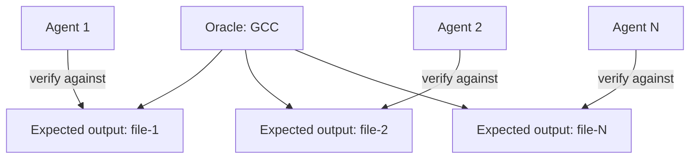

# Oracle-Based Task Decomposition

> A reference oracle generates per-unit expected outputs, converting one monolithic, interconnected task into hundreds of independently verifiable subtasks.

## The monolith problem

Parallelization is easy when tasks are naturally independent. Many real engineering tasks are not. Take a single end-to-end integration test that needs the whole system to compile and run. It is a sequential bottleneck: no agent can verify its work until every contribution is assembled.

Without decomposition, parallel agents dispatched via [fan-out](sub-agents-fan-out.md) either block on each other's output or produce partial work no one can verify. The oracle pattern removes the bottleneck.

## The oracle mechanism

A known-good reference implementation provides the expected output for each unit. Agents verify their work against that output instead of waiting for an end-to-end integration test.

[Anthropic's C compiler case study](https://www.anthropic.com/engineering/building-c-compiler) shows the approach. A differential testing setup used GCC to compile a random subset of Linux kernel files, while Claude's compiler handled the rest. Each agent worked in parallel, fixing different bugs in different files. When the kernel failed to boot, the team used delta debugging to find pairs of files that failed together but worked on their own. This two-layer approach caught both isolated bugs and subtle cross-file interactions.

## What qualifies as an oracle

An oracle is any reference tool or dataset that produces authoritative expected outputs for isolated units:

- A reference compiler (GCC, Clang) for per-file compilation output
- A golden dataset of expected transformations for a data pipeline
- A reference implementation of an algorithm for output comparison
- A known-good API for expected response validation

The oracle does not need to be perfect. It needs to be authoritative for the task at hand. If the goal is to produce output that matches GCC, then GCC is the oracle. If the goal is to pass a test suite, the suite's expected output is the oracle.

## Independence requires per-unit verification

The oracle gives you independence because each agent's verification step does not depend on any other agent. Agent 1 verifies file-1 against oracle(file-1). Agent 2 verifies file-2 against oracle(file-2). Neither agent waits for the other.

This works only when:

- The oracle can produce output for each unit on its own
- The agent's contribution is fully captured at the unit level, with no cross-unit integration needed

If a file's correct output depends on another file's implementation, file-level oracle verification is not enough. Cross-file dependencies push the verification boundary up.

## Generalization

The [test oracle problem](https://en.wikipedia.org/wiki/Test_oracle) asks how to decide whether a program's output is correct. A trusted reference implementation solves it. The oracle pattern applies in any domain where such a reference exists:

- Translation: reference translations for per-sentence verification
- Refactoring: original tests as the oracle for behavioral equivalence checks
- Data transformation: sample expected outputs from a known-correct run
- API compatibility: reference API responses for per-endpoint verification

Ask one question: is there a trusted artifact that can produce expected outputs at the unit level? If yes, you can decompose the monolith.

## When this backfires

Oracle-based decomposition fails or degrades in three conditions:

1. No oracle exists. Building a reference implementation from scratch costs more than parallelization saves. If the only oracle would be the same implementation you are writing, the pattern collapses to manual test authoring. At that point [independent test generation](independent-test-generation-multi-agent.md) is the better fit.
2. Cross-unit dependencies are pervasive. When every file's correct output depends on another file's implementation, raising the verification boundary to the cross-unit level removes the independence that makes parallelization worthwhile. The bottleneck moves rather than disappears.
3. Oracle correctness is disputed. The oracle itself may have known bugs or behavioral differences from the target, for example when GCC and a new compiler diverge on purpose over undefined behavior. Agent fixes then target the oracle's behavior rather than correct behavior, embedding the oracle's defects into the output.

## Key Takeaways

- Oracle-based decomposition converts one blocking integration test into independently verifiable unit-level checks
- The oracle is any reference tool or dataset that produces authoritative per-unit expected outputs
- Agents working on separate units never block each other — independence is structural, not assumed
- The pattern requires per-unit independence: if units have cross-dependencies, the verification boundary must be raised
- The generalization criterion: any domain with a trusted reference implementation can apply this pattern

## Example

A Python data pipeline team needs to migrate 400 transformation functions from pandas v1 to pandas v2. Each function has slightly different API changes. A full integration test takes 45 minutes, too slow for parallel agents to verify their individual fixes.

Oracle setup: run all 400 functions through the pandas v1 implementation on a frozen dataset and record the expected outputs.

Parallel agent dispatch: assign each agent a batch of functions. Each agent applies the pandas v2 migration and verifies against the oracle output right away.

Cross-function dependency handling: if any function's output depends on another, group the dependent functions into one work unit.

## Related

- [Orchestrator-Worker Pattern](orchestrator-worker.md)
- [Fan-Out Synthesis Pattern](fan-out-synthesis.md)
- [Sub-Agents Fan-Out](sub-agents-fan-out.md)
- [LLM Map-Reduce Pattern](llm-map-reduce.md)
- [File-Based Agent Coordination](file-based-agent-coordination.md)
- [Incremental Verification](../../verification/incremental-verification.md)
- [Independent Test Generation in Multi-Agent Code Systems](independent-test-generation-multi-agent.md)
- [Bounded Batch Dispatch](bounded-batch-dispatch.md)
- [Oracle-Gated Delegation Beyond Your Domain Expertise](../../workflows/oracle-gated-delegation.md)
