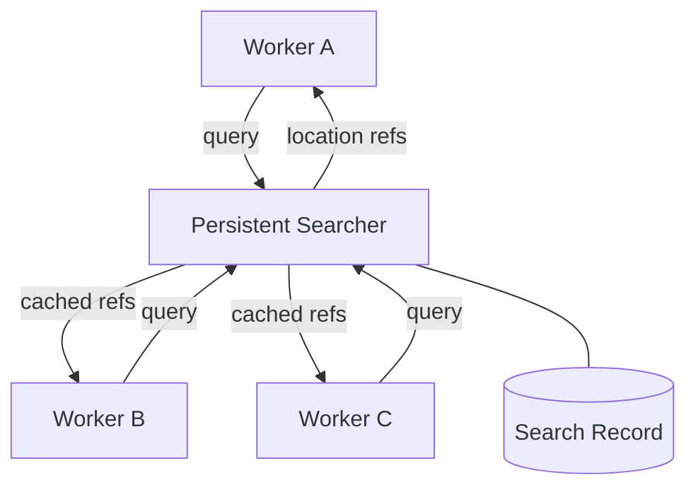

# Persistent Shared Search Sub-Agent for Output-Token Reuse

> Route repository lookups through one persistent search sub-agent so a region is explored and described once, cutting the redundant output tokens that dominate multi-agent cost.

A persistent shared search sub-agent is a single long-lived agent that owns all repository exploration for a multi-agent system. Instead of each worker independently searching and re-describing the same files, workers query the shared searcher, which keeps a record of prior lookups, skips already-covered regions, and returns compact location references rather than full file contents ([Cho et al., 2026](https://arxiv.org/abs/2605.27787)).

## When to apply

The pattern pays off only under specific conditions. Apply it when all of these hold:

- Large repository, high exploration overlap. Multiple agents repeatedly search the same modules. The redundant fraction of generated output scales with [agent count](sub-agents-fan-out.md), so the savings grow with overlap and shrink to nothing when overlap is low.
- Output-dominated workload. Agents generate a lot of text describing what they found. If agents mostly read and rarely re-emit large descriptions, the output-token saving is small, and input-side [prompt caching](../../context-engineering/prompt-caching-architectural-discipline.md) is the better spend.
- Latency tolerates a shared lookup hop. A single searcher serializes queries. The work must tolerate that hop without the searcher becoming a throughput bottleneck.
- Working tree is stable during the episode. Cached search records assume the code they point at has not moved.

If any condition fails, keep workers self-sufficient or apply per-agent output distillation instead — see [When This Backfires](#when-this-backfires).

## Why it works

The mechanism rests on a measured cost asymmetry: generating an output token consumes roughly 30 to 1,000 times the energy of processing an input or cached token ([Cho et al., 2026](https://arxiv.org/abs/2605.27787)). Multi-agent systems inflate per-episode output because independent agents re-explore overlapping repository regions, each re-generating descriptions of the same code.

Routing lookups through one persistent searcher cuts output volume on two axes:

- Deduplication: a region the searcher has [already covered](semantic-caching-multi-agent.md) is described once, not once per agent.
- Distillation: the searcher returns file-location references instead of full contents, so each response is shorter.

The expensive axis (output) shrinks while the cheap axis that gets removed is the cached input re-reads. So total cost drops without changing task outcomes. On SWE-Bench Verified, this cut per-episode GPU energy by roughly 25% at equivalent task performance ([Cho et al., 2026](https://arxiv.org/abs/2605.27787)).

This is the inverse coordination move to [fan-out](sub-agents-fan-out.md). Fan-out isolates each worker's input context but leaves every worker re-exploring. The shared searcher centralizes exploration to remove redundant output.

## Diagram

Worker B and C receive cached references for regions Worker A already explored — those lookups never re-generate full descriptions.

## When this backfires

Centralizing search reintroduces shared state, which carries its own failure modes:

- Small repos or short episodes: exploration overlap is minimal, so the searcher is pure overhead. It is a process to maintain and a latency hop that buys negligible output savings.
- High-fan-out, latency-critical work: a single searcher serializes lookups and becomes a throughput bottleneck and single point of failure. That negates the parallelism fan-out exists to provide. Anthropic's [multi-agent research system](https://www.anthropic.com/engineering/multi-agent-research-system) credits parallel, independent context as the source of speedup.
- Fast-changing working tree: when agents edit files concurrently, cached search records go stale. A returned location reference can point at moved or rewritten code, producing a wrong answer cheaply.
- Input-dominated workloads: if the cost is in reading, not re-describing, deduplicating output saves little. Cache the input instead.

In several of these cases the cheaper alternative is per-agent observation masking: return summaries, not full files. It cuts output without a stateful coordinator to keep fresh, scale, and trust.

## Key Takeaways

- Output tokens cost 30–1,000x input or cached tokens; redundant output is where multi-agent cost concentrates ([Cho et al., 2026](https://arxiv.org/abs/2605.27787)).
- One persistent searcher deduplicates exploration and returns location references, attacking output volume at both the duplication and verbosity axes.
- Reported result: ~25% lower per-episode GPU energy at equal SWE-Bench Verified performance.
- The benefit is conditional — large repos, high overlap, output-dominated work; otherwise the searcher is overhead or a bottleneck.
- It is the inverse of fan-out: fan-out isolates input context, the shared searcher centralises exploration to cut redundant output.

## Related

- [Sub-Agents for Fan-Out Research and Context Isolation](sub-agents-fan-out.md)
- [Context Budget Allocation: Every Token Has a Cost](../../context-engineering/context-budget-allocation.md)
- [Semantic Caching for Multi-Agent Code Systems](semantic-caching-multi-agent.md)
- [Orchestrator-Worker Pattern](orchestrator-worker.md)
