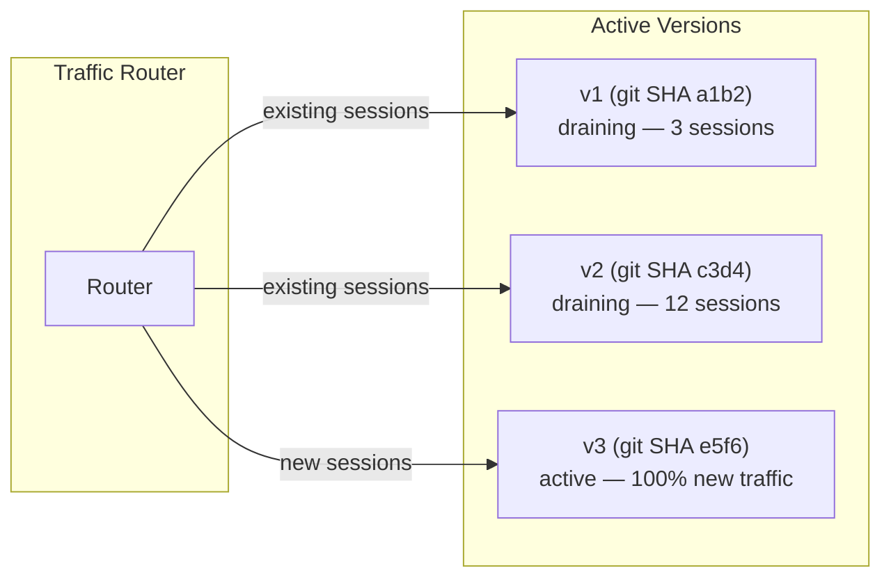
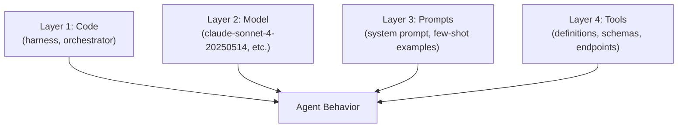

# Rainbow Deployments for Agents: Gradual Version Migration

> Rainbow deployments shift agent traffic across versions gradually, not atomically, letting each new version prove itself alongside old ones and preventing broken in-flight sessions.

Learn it hands-on: [Rainbow Deployments guided lesson](https://learn.agentpatterns.ai/multi-agent/rainbow-deployments/), with quizzes.

Rainbow deployment keeps N versions of an agent running at the same time. New sessions route to the latest version. Existing sessions stay on whichever version started them and drain as they complete. There is no forced cutover and no two-version ceiling.

## Why agents cannot blue-green

Stateless HTTP services cut over atomically — swap the load balancer, drain connections, done. Agents differ:

- Stateful execution: conversation context, tool state, and multi-step plans persist across long sessions
- Behavioral sensitivity: a small prompt, tool, or model change cascades into [large behavioral shifts](emergent-behavior-sensitivity.md)
- Expensive restarts: a forced restart loses accumulated context and wastes compute

Blue-green assumes an atomic cutover. Canary improves on this with gradual traffic shifting, but it caps you at two concurrent versions. Rainbow removes the version ceiling.

## The rainbow model



Each deployment gets a unique label, usually a git SHA. New traffic routes to the latest version. Existing sessions drain on their original version. Any number of versions can coexist.

The term comes from [Brandon Dimcheff's work at Olark (2018)](https://brandon.dimcheff.com/2018/02/rainbow-deploys-with-kubernetes/), which solved the same problem for stateful WebSocket chat services on Kubernetes. Anthropic adopted the idea for their [multi-agent research system](https://www.anthropic.com/engineering/multi-agent-research-system).

## What changes require rainbow deploys

Not every change needs gradual migration. The cost is worth it when a change alters behavior in ways that are hard to predict or [test exhaustively](../../workflows/continuous-ai-agentic-cicd.md).

| Change type | Risk level | Rainbow deploy? |
|---|---|---|
| Model version swap | High -- behavior shifts unpredictably | Yes |
| System prompt rewrite | High -- cascading behavioral changes | Yes |
| Tool definition change | High -- breaks existing tool-call patterns | Yes |
| Bug fix in harness code | Low -- deterministic, testable | Usually no |
| Adding a new tool (no removal) | Medium -- may alter tool selection | Case by case |

## The four-layer version problem

Agent behavior depends on four independently versioned layers. A change to any one can alter the output.



Track each layer independently. A deployment version is the tuple of all four. Rollback means reverting to a known-good tuple, not just the code.

## Monitoring during migration

Compare the new version against the baseline before each percentage increase.

| Metric | What to watch |
|---|---|
| Response accuracy | Are outputs correct for representative inputs? |
| [Error rate](../../observability/circuit-breakers.md) | Are tool calls, API calls, or completions failing more? |
| Latency | Is the new version slower per turn? |
| [Cost per session](../../token-engineering/cost-aware-agent-design.md) | Is token usage higher (different model, longer prompts)? |
| Hallucination rate | Is the new version fabricating more? |
| User feedback | Are users rejecting or correcting outputs more often? |

Typical progression: 5% → 25% → 50% → 100%. Advance only when the metrics hold steady at each stage.

## Rollback

To roll back, change the router to point new traffic at the previous version. Old versions are still running and draining, so rollback is near-instant and needs no redeployment. This is the main advantage over blue-green, where the previous environment may already be torn down.

## When this backfires

Three conditions make rainbow deployment worse than the alternative:

- Version sprawl with long-lived sessions: when agents run tasks that span hours or days, such as deep research or multi-day planning pipelines, old versions may never fully drain. Each deployment adds another live version that consumes infrastructure. Without a session timeout or forced-drain policy, the fleet fragments indefinitely.
- Cross-version debugging complexity: [behavioral regressions](emergent-behavior-sensitivity.md) that span a version boundary are harder to isolate. When v2 and v3 sessions coexist and users report degraded output, you need consistent version tagging on every log line and trace to tie errors to a specific version tuple (code × model × prompt × tools). Teams without mature observability often spend more time on version attribution than on the fix itself.
- Short-lived stateless agents: for agents with sessions under a few seconds, such as single-turn Q&A, inline completions, or code suggestions, atomic blue-green deployment is simpler, equally safe, and avoids the overhead of running several concurrent deployments. The value of the rainbow model grows with session duration.

## Example

A Kubernetes implementation using label selectors:

```yaml
# Deployment — each version gets a unique label
apiVersion: apps/v1
kind: Deployment
metadata:
  name: agent-e5f6
spec:
  selector:
    matchLabels:
      app: research-agent
      version: e5f6
  template:
    metadata:
      labels:
        app: research-agent
        version: e5f6
    spec:
      containers:
        - name: agent
          image: agent:e5f6
          env:
            - name: MODEL_VERSION
              value: "claude-sonnet-4-20250514"
            - name: PROMPT_VERSION
              value: "v3.2"
---
# Service — routes new traffic to current version
apiVersion: v1
kind: Service
metadata:
  name: research-agent
spec:
  selector:
    app: research-agent
    version: e5f6  # Change this to roll back
```

Rollback: change `version: e5f6` to `version: c3d4`. Old pods are still running and accepting their existing sessions.

## Key Takeaways

- Agents are stateful -- atomic version cutover breaks in-flight sessions
- Rainbow deployments allow N concurrent versions, each draining independently
- Agent versions are tuples of (code, model, prompt, tools) -- all four layers must be tracked
- Monitor accuracy, error rate, latency, and cost before advancing traffic percentages
- Rollback is a selector change, not a redeployment

## Related

- [Rollback-First Design: Every Agent Action Should Be Reversible](../agent-design/rollback-first-design.md)
- [Circuit Breakers for Agent Loops](../../observability/circuit-breakers.md)
- [Continuous AI-Agentic CI/CD](../../workflows/continuous-ai-agentic-cicd.md)
- [Agent Harness](../agent-design/agent-harness.md)
- [Emergent Behavior Sensitivity](emergent-behavior-sensitivity.md)
