# Staggered Agent Launch

> Launch parallel agents 30 seconds apart to break the thundering-herd dynamic — each agent claims work before the next one reads the queue.

## The thundering-herd problem

When multiple agents start at the same time, they all read the same queue snapshot and compete for the same high-priority items. The result:

- Repeated reservation conflicts on the same tasks
- Wasted compute re-reading and re-evaluating already-claimed work
- Inconsistent throughput as agents pile onto a narrow frontier

This is the agent-swarm version of the [thundering-herd problem](https://en.wikipedia.org/wiki/Thundering_herd_problem) in distributed systems: many processes wake at once and compete for a single resource. Only one succeeds. The rest burn cycles failing to claim it.

## The staggered launch pattern

To fix this, de-synchronize the queue reads. Launch agents with a delay between each start:

```
launch agent-1
wait 30s
launch agent-2
wait 30s
launch agent-3
...
```

Each agent reads the queue in a different state. Agent-2 sees a queue already partly claimed by agent-1. Competition for top-priority items drops because those items no longer appear available.

A 30-second stagger is a common practitioner convention. A short delay between launching an agent and sending its first prompt gives [session initialization](../agent-design/session-initialization-ritual.md) time to settle before the agent reads the queue. Neither figure comes from measured data. The real principle is to give each agent enough time to read and reserve before the next agent reads.

```mermaid
gantt
    title Staggered Launch — Queue Coverage Over Time
    dateFormat  ss
    axisFormat  %Ss
    Agent 1 starts : milestone, 00, 0s
    Agent 1 reads + claims : a1, 00, 25s
    Agent 2 starts : milestone, 30, 0s
    Agent 2 reads + claims : a2, 30, 25s
    Agent 3 starts : milestone, 60, 0s
    Agent 3 reads + claims : a3, 60, 25s
```



## When this is enough

Staggered launch works well when:

- No task-claiming infrastructure exists yet (bootstrap or prototype swarms)
- Tasks are genuinely independent with no dependency ordering
- Swarm size is small (≤5 agents) — a 10-agent swarm with a 30s stagger takes 5 minutes to fully ramp
- Queue read latency is short and consistent

It needs no infrastructure. You change no agent logic, queue design, or coordination code.

## When to upgrade

Timing-based coordination is fragile. It breaks down under:

| Condition | Why stagger fails | Better alternative |
|-----------|------------------|-------------------|
| Variable queue-read latency | Agent 2 may read before Agent 1 finishes reserving | File-locked task claims |
| Slow agent initialization | 30s window may not be enough | Worktree isolation |
| Large swarms (10+) | Ramp time becomes operationally significant | FIFO queue serialization |
| Re-contention after launch | Later task picks can still collide | Advisory file reservations |

### Structural alternatives

[Claude Code agent teams](../../tools/claude/agent-teams.md) use file locks on task claims. When a teammate writes a lock file and pushes it to the shared repo, git's push rejection stops a second agent from claiming the same task, whatever the timing. This is more reliable because the coordination mechanism enforces it, not a timing assumption. See [File-Based Agent Coordination](file-based-agent-coordination.md).

[Worktree isolation](../../workflows/worktree-isolation.md) (`isolation: worktree` in Claude Code sub-agents) removes file-level contention entirely by giving each agent its own git worktree. Agents never compete for the same file paths. It is separate from launch timing, but it removes a major source of contention.

[Block's agent-task-queue](https://github.com/block/agent-task-queue) MCP server serializes expensive concurrent operations such as builds and tests through strict FIFO queuing. This stops agents from thrashing shared resources, whatever time they launched.

## Relationship to fungible agent architecture

Staggered launch works best with a fungible agent design, where any agent can pick up any available task. Specialized or stateful agents shrink the pool of claimable work, which makes timing-based de-synchronization less useful. The stagger works by giving agents different queue frontiers to read. If each agent can only take a small subset of tasks, those subsets may overlap whatever the timing.

## Example

A bash launcher that staggers Claude Code sub-agents across a task list:

```bash
#!/usr/bin/env bash
STAGGER=30
TASKS=("refactor auth module" "add retry logic to API client" "write integration tests for billing")

for i in "${!TASKS[@]}"; do
  if [ "$i" -gt 0 ]; then
    echo "Waiting ${STAGGER}s before next launch..."
    sleep "$STAGGER"
  fi
  echo "Launching agent $((i+1)): ${TASKS[$i]}"
  claude --message "Complete this task: ${TASKS[$i]}" \
    --allowedTools "Edit,Write,Bash,Read" &
done

echo "All agents launched. Waiting for completion..."
wait
echo "All agents finished."
```

Each agent starts 30 seconds after the previous one. By the time agent 2 reads the working directory, agent 1 has already started changing its target files. This reduces the chance of overlapping edits.

## Key Takeaways

- Simultaneous launch causes all agents to read the same queue state and contend for the same top-priority items
- A 30-second stagger de-synchronizes queue reads so each agent claims work before the next agent reads
- No changes to agent logic or coordination infrastructure are required
- The 30-second figure is a practitioner heuristic, not an empirically validated interval — tune based on your queue-read latency
- For swarms larger than ~5 agents or with variable latency, prefer file-locked task claims or worktree isolation

## Related

- [File-Based Agent Coordination](file-based-agent-coordination.md)
- [Sub-Agents Fan-Out](sub-agents-fan-out.md)
- [Orchestrator-Worker Pattern](orchestrator-worker.md)
- [Bounded Batch Dispatch](bounded-batch-dispatch.md)
- [Multi-Agent Topology Taxonomy](multi-agent-topology-taxonomy.md)
- [Agent Backpressure](../agent-design/agent-backpressure.md)
- [Developer Attention Management with Parallel Agents](../../human/attention-management-parallel-agents.md)
- [Swarm Migration Pattern](swarm-migration-pattern.md)
