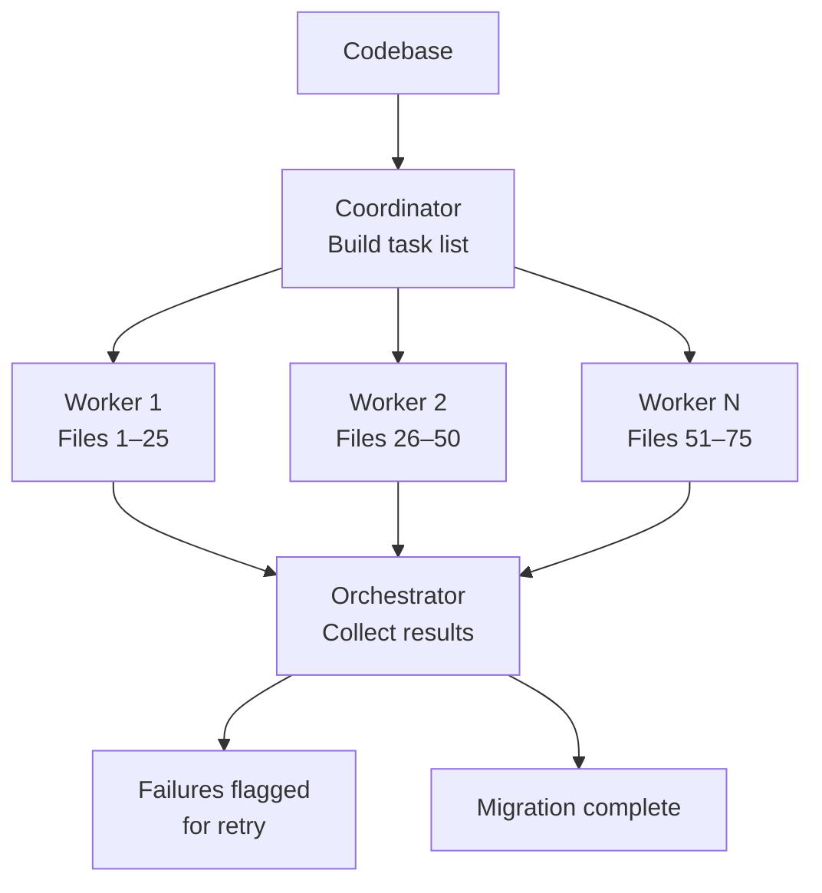

<!-- source: nibzard/awesome-agentic-patterns (Apache 2.0, https://github.com/nibzard/awesome-agentic-patterns) — retain attribution per license -->

# Swarm Migration Pattern

> A swarm migration fans a coordinator's task list out to 10–20 parallel workers, each migrating an independent file slice for 6–10x speedup.

## How it works

Two phases:

1. Coordinator: a single orchestrator lists every affected file and produces a complete task list. No workers run yet.
2. Workers: the [orchestrator dispatches workers](orchestrator-worker.md) in parallel. Each worker gets a bounded file slice and a clear migration spec, then reports results.

Workers do not talk to each other. The only coordination point is the orchestrator collecting results.



Boris Cherny (Anthropic): "The main agent makes a big to-do list for everything and then map reduces over a bunch of subagents. You start 10 agents and migrate all the stuff over." ([nibzard/awesome-agentic-patterns](https://github.com/nibzard/awesome-agentic-patterns/blob/main/patterns/swarm-migration-pattern.md))

The same shape now ships in production at cross-repository scale: Sourcegraph's agentic Batch Changes (public beta) runs an agent that scopes, executes, and ships large-scale code migrations across hundreds of repositories, iterating until every pull request is mergeable ([Sourcegraph — Agentic Batch Changes public beta](https://sourcegraph.com/blog/agentic-batch-changes-public-beta)).

## Eligible migrations

Atomicity is the critical constraint: you must migrate each file without reading or depending on other files migrating at the same time. If a worker's output on file A changes how file B transforms, the migration is not swarm-eligible.

Eligible:

- Testing library upgrades (Jest → Vitest, Mocha → Jest)
- Lint rule enforcement across a codebase
- Import path refactoring
- API version updates applied file-by-file
- Code modernization (CommonJS → ESM, class components → hooks)

Not eligible:

- Tightly coupled code where file B imports from file A and both change semantically
- Transformations that need a global refactor pass (for example, renaming a shared interface used across hundreds of files at once)
- Files with expected failure rates above 30% — worker retries compound cost rapidly

## Swarm size

The best swarm size is 10–20 agents. Below 10, sequential execution is comparable. Beyond 20, coordination overhead and API rate limits take over, and the extra throughput tails off. [nibzard catalog](https://github.com/nibzard/awesome-agentic-patterns/blob/main/patterns/swarm-migration-pattern.md)

Reported speedup for qualifying migrations: 6–10x versus sequential. Token costs rise about 10x, but the wall-clock saving usually gives a net positive ROI for migrations over 50–100 files. [nibzard catalog](https://github.com/nibzard/awesome-agentic-patterns/blob/main/patterns/swarm-migration-pattern.md)

## Running with Claude Code

[Claude Code best practices](https://code.claude.com/docs/en/best-practices) document this workflow explicitly under "Fan out across files":

```bash
# 1. Generate the task list
claude -p "list all Python files that need migrating from unittest to pytest" > files.txt

# 2. Fan out one worker per file
for file in $(cat files.txt); do
  claude -p "Migrate $file from unittest to pytest. Return OK or FAIL." \
    --allowedTools "Edit,Bash(git commit *)"
done
```

The `--allowedTools` flag scopes each worker's permissions, which matters for unattended runs. Without it, workers can take actions beyond the migration scope.

## Prerequisites before fan-out

- Test coverage: workers must verify their output. Lint rule migrations and test library upgrades are "super easy to verify" ([nibzard catalog](https://github.com/nibzard/awesome-agentic-patterns/blob/main/patterns/swarm-migration-pattern.md)). Without a fast verification step, failures pile up silently.
- A clear migration spec: vague prompts produce inconsistent results across workers.
- Sandboxed execution: workers must commit only their own file slice. Shared-state side effects, for example editing a shared config file, create merge conflicts.

## Staged rollout

Validate before full fan-out:

1. Run on 2–3 representative files, then correct the worker prompt on any errors.
2. Run on a 10–20 file subset, then review failures and adjust the swarm size.
3. Scale to the full file list.

A prompt defect spreads to every file in a full swarm at once. Staged rollout is the only cost-effective way to catch it.

## Failure handling

The orchestrator should record failed files without stopping the queue, report failures, and retry only the failed items. Do not retry inline — a stuck worker holds a slot that could process other files.

## Why it works

Sequential migration takes `N × t`. A swarm of `W` workers collapses that to `⌈N / W⌉ × t`. What makes this work is inter-file independence: each worker reads and writes its slice without reading any other worker's output, so there is no coordination latency. The orchestrator handles bookkeeping only — adding workers does not raise coordination overhead in step.

## When this backfires

- Rate limit exhaustion: 10–20 simultaneous calls often hit provider rate limits, which serializes execution. Stagger launches or queue work to stay under per-minute token budgets.
- Context window overflow: files larger than the model's [usable context](../../context-engineering/context-budget-allocation.md) produce silent partial migrations. Pre-filter large files and handle them with a narrower prompt.
- LLM non-determinism: parallel workers on similar code patterns make inconsistent stylistic choices. If you need strict uniformity, run a normalization pass after the swarm.
- Partial-migration state: failure rates above ~30% leave the codebase in a mixed state that is harder to reason about than a fully unmigrated one. Isolate it with a feature flag or a dedicated branch.
- Token cost vs ROI: at ~10x sequential token cost, the break-even is roughly 50–100 files. Below that, manual staged migration is cheaper.

## Key Takeaways

- Atomicity is the eligibility gate — if file A's correct transformation depends on file B's concurrent transformation, the migration is not swarm-eligible
- Swarm size of 10–20 agents is the practical optimum; beyond 20, returns diminish
- Stage rollouts: validate on 2–3 files → subset → full swarm
- Scope each worker with `--allowedTools` to prevent unintended side effects during unattended runs
- Record failures without stopping the queue; retry targeted failures in a second pass

## Example

A codebase has 400 JavaScript files using the `require()` CommonJS syntax that must migrate to ES module `import` syntax.

Coordinator prompt:
```
List all .js files in src/ that contain require() calls. Output one filepath per line.
```

Worker prompt (per file):
```
Convert all require() calls in $file to ES module import syntax.
Do not modify any other files.
Run `node --input-type=module < $file` to verify syntax.
Return OK if the file passes, FAIL with a one-line reason if it does not.
```

The orchestrator fans out 20 workers at a time (to stay within API rate limits), collecting results. Files returning FAIL are written to `failed.txt` for a targeted follow-up pass. Total wall time for 400 files: ~20 batches × ~30 seconds per batch = ~10 minutes, versus ~200 minutes sequentially.

## Related

- [Whole-Codebase Visibility as a Migration Prerequisite](../../workflows/whole-codebase-visibility-migration-prerequisite.md) — the scoping check that decides whether a swarm migration needs whole-codebase visibility infrastructure first, and supplies the complete file list this pattern consumes.
- [Orchestrator-Worker Pattern](orchestrator-worker.md)
- [Bounded Batch Dispatch](bounded-batch-dispatch.md)
- [Fan-Out Synthesis Pattern](fan-out-synthesis.md)
- [LLM Map-Reduce Pattern](llm-map-reduce.md)
- [Staggered Agent Launch](staggered-agent-launch.md)
- [Sub-Agents Fan-Out](sub-agents-fan-out.md)
- [File-Based Agent Coordination](file-based-agent-coordination.md)
