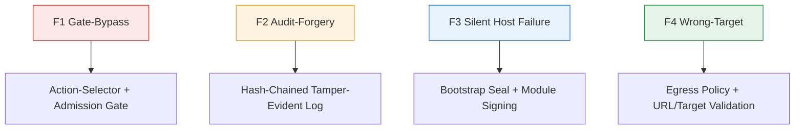

# Action-Audit Divergence: A Four-Mode Taxonomy for Runtime Hardening

> Name the four ways an agent action can diverge from its audit record — gate-bypass, audit-forgery, silent host failure, wrong-target — to convert "is this runtime hardened?" into a coverage checklist against existing controls.

## What the Runtime Must Guarantee

An agentic runtime issues tool calls, sends messages, and actuates devices on behalf of an LLM. The load-bearing safety property is that the audit record matches what actually happened. [Metere (arXiv:2605.01740)](https://arxiv.org/abs/2605.01740) formalises this as four divergence modes:

| Mode | Name | What the audit lies about |
|------|------|----------------------------|
| **F1** | Gate-bypass | Authorisation said no; the action ran |
| **F2** | Audit-forgery | Action ran; log shows a different action |
| **F3** | Silent host failure | Log says action ran; host did nothing |
| **F4** | Wrong-target | Log names target X; action hit target Y |

The taxonomy is a navigation aid, not a defense. It converts "is this runtime hardened?" into four closed questions — which control covers F1? F2? F3? F4? — mapped to controls already documented on this site.

## Mapping Each Mode to Existing Controls

**F1 — Gate-bypass.** Authorisation rejected the request; the action ran anyway. The control is a single chokepoint every tool call must pass. The [action-selector pattern](action-selector-pattern.md) restricts the LLM to a fixed catalog so unsanctioned actions are unrepresentable; the [MCP runtime control plane](mcp-runtime-control-plane.md) intercepts every MCP call at one policy evaluation point. Biconditional checking — denial logged on reject paths, not just allow — closes the asymmetry attackers exploit when only allow-paths are observable.

**F2 — Audit-forgery.** The action ran and was logged, but the log was modified to claim a different action ran. Tamper-evident hash chains defeat this by construction: each entry includes the hash of the previous, so any modification breaks the chain on verification ([AuditableLLM, MDPI 2026](https://www.mdpi.com/2079-9292/15/1/56)). The site's [Cryptographic Governance Audit Trail](cryptographic-governance-audit-trail.md) covers the implementation with ML-DSA-65 receipt signing.

**F3 — Silent host failure.** The log records "action X executed" but the host did nothing — process crashed, swallowed error, container killed mid-call. The signal must come from outside the runtime: bootstrap seals verify a known-good start state, module signing verifies executing code matches audited code, and post-execution probes confirm the side effect landed. Without these, F3 is indistinguishable from drift.

**F4 — Wrong-target.** Log says "wrote to /tmp/foo" but the write hit /etc/foo; log says "emailed alice@" but the message went to attacker@. The control is target validation at the egress boundary, not at argument generation. The [agent network egress policy](agent-network-egress-policy.md) restricts reachable domains; the [URL exfiltration guard](url-exfiltration-guard.md) validates targets independently of LLM intent.

## Using the Taxonomy as a Review Checklist

Walk F1-F4 against any runtime or harness:

1. **F1 — name the chokepoint.** Where does every tool call pass authorisation? "The LLM checks" is not a chokepoint — the LLM is what is being authorised.
2. **F2 — name the integrity mechanism.** Append-only is not enough; the log must be tamper-evident under an attacker on the host. Hash chains, Merkle trees, or external receipt sinks ([nono.sh on tamper-evident agent audit](https://nono.sh/blog/secure-agent-audit)) close the gap.
3. **F3 — name the liveness probe.** What confirms the action *actually ran*? Side-effect verification, downstream acks, or out-of-band telemetry beat "the call returned 200".
4. **F4 — name the target validator.** What checks the file path, hostname, recipient, or endpoint is the intended one, independent of LLM-generated arguments? [HashiCorp's write-up](https://www.hashicorp.com/en/blog/agentic-runtime-security-solving-agentic-ai-identity-and-access-gaps) frames this as unifying infrastructure telemetry with identity logs.

A control may cover multiple modes (a hash-chained log with policy receipts covers F1 and F2). A mode may need multiple controls. The taxonomy does not prescribe — it names the question each control answers.

## Where the Framing Backfires

The decomposition assumes there is an audit worth defending. Three conditions where it adds cost without value:

- **Single-user local runtimes with no compliance obligation.** F1-F4 each motivate non-trivial architecture; capability minimisation and [rollback-first design](../agent-design/rollback-first-design.md) deliver more safety per unit of complexity.
- **Pure-text agents.** Without tool calls, there is no action to diverge from an audit.
- **Reversible-state systems.** When every action is rolled back on detection of badness, post-hoc tamper-evidence is less load-bearing than detection latency.

The framing complements the [four-layer threat taxonomy](four-layer-agent-security-taxonomy.md): the layered model groups threats by attack surface; this one groups runtime safety properties by failure mode. Use both — one places controls on a grid, the other audits whether the grid is load-bearing.

## Key Takeaways

- An agent runtime's load-bearing safety property is that the audit record matches what actually happened.
- Four divergence modes — F1 gate-bypass, F2 audit-forgery, F3 silent host failure, F4 wrong-target — name the specific ways the audit can lie.
- Each mode maps to existing site coverage: action-selector and MCP control plane for F1, hash-chained audit trail for F2, bootstrap and module signing for F3, egress and URL validation for F4.
- Use the taxonomy as a review checklist, not a defense — name the chokepoint, integrity mechanism, liveness probe, and target validator for any runtime under review.
- The framing assumes an audit worth defending; for single-user local runtimes, pure-text agents, and reversible-state systems, capability minimisation often beats divergence detection.

## Related

- [Four-Layer Taxonomy of Agent Security Risks](four-layer-agent-security-taxonomy.md) — companion threat-surface layering; pair with this divergence-mode model
- [Cryptographic Governance Audit Trail](cryptographic-governance-audit-trail.md) — F2 control: hash-chained tamper-evident logs with ML-DSA receipts
- [Action-Selector Pattern](action-selector-pattern.md) — F1 control: deterministic execution from a fixed action catalog
- [MCP Runtime Control Plane](mcp-runtime-control-plane.md) — F1 control: single chokepoint for tool-call policy evaluation
- [Agent Network Egress Policy](agent-network-egress-policy.md) — F4 control: target validation at the network boundary
- [Tool Signing and Signature Verification](tool-signing-verification.md) — F3 control: module-level integrity for executing code
- [Lifecycle-Integrated Security Architecture for Agent Harnesses](lifecycle-security-architecture.md) — competing lifecycle-phase decomposition; complements this failure-mode decomposition
