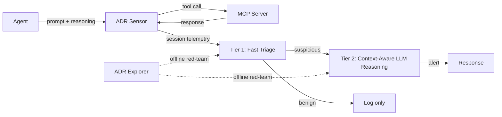

# Agentic Detection and Response at the MCP Boundary

> Instrument the MCP transport so agent reasoning, prompts, and tool calls become a runtime detection signal that endpoint tools cannot reconstruct.

Agentic Detection and Response (ADR) is the runtime monitoring half of MCP-mediated agent security: an in-process sensor captures prompts, reasoning, tool calls, and server responses, and a two-tier detector classifies sessions as benign or compromised before the action chain completes. Uber's production deployment reports **97.2% precision** at **>10,000 agent sessions daily across 7,200+ hosts** ([Li et al., 2026](https://arxiv.org/abs/2605.17380)).

ADR complements the [MCP Runtime Control Plane](mcp-runtime-control-plane.md): the control plane gates calls before execution, ADR observes the full trajectory so detection can fire on signals the gate cannot evaluate in isolation.

## Why Endpoint Tools Miss MCP Attacks

EDR sees file writes, process exec, and network connections, but not agent reasoning, prompts, or the causal chains linking intent to execution ([Li et al., 2026](https://arxiv.org/abs/2605.17380)). A compromised agent looks identical to a benign one at the OS layer — same process, same outbound HTTPS, same syscalls. MCP tool servers sit at the junction of protocol traffic, OS execution, and agent decision-making, and attacks live in the gaps.

## How It Works

Three components compose the system ([Li et al., 2026](https://arxiv.org/abs/2605.17380)):

- **ADR Sensor** — captures telemetry at the MCP transport: prompts, reasoning, tool arguments, server responses, and the causal chains linking them. Closes the observability gap EDR cannot.
- **ADR Explorer** — runs offline red-teaming before deployment, generating test cases that calibrate the detector against attacker behaviour the production stream has not yet seen.
- **ADR Detector** — two-tier online classifier. Fast triage handles bulk traffic deterministically; only suspicious sessions pay the cost of context-aware LLM reasoning, amortising inference cost across volume.

On the public ADR-Bench evaluation the system reported **zero false positives at 67% attack recall**, a 2-4x F1 improvement over three baselines ([Li et al., 2026](https://arxiv.org/abs/2605.17380)).

## Why It Works

The mechanism is **co-occurrence at a single transport**. Prompt, reasoning, and tool call all pass through the MCP envelope in structured form, so instrumenting that boundary captures the causal chain EDR cannot reconstruct from OS-layer events ([Li et al., 2026](https://arxiv.org/abs/2605.17380)). The two-tier detector then makes the economics work: cheap triage for the bulk, context-aware LLM reasoning only for the suspicious tail. That amortisation keeps a 10,000-sessions-per-day deployment affordable rather than "prohibitively expensive at scale" ([Li et al., 2026](https://arxiv.org/abs/2605.17380)).

## When This Backfires

The pattern is calibrated for enterprise deployments; smaller or differently-shaped workloads may pay net cost.

- **Small deployments and single-developer workflows.** Value comes from enterprise scale (7,200+ hosts in the Uber report) where cross-host correlation drives detection quality ([Li et al., 2026](https://arxiv.org/abs/2605.17380)). For a single agent on one developer machine, sensor overhead adds cost without enabling cross-session signal — a [policy gate alone](mcp-runtime-control-plane.md) fits better.
- **Tightly constrained tool catalogs.** When tool sequences are fully enumerable, a [Behavioral Firewall for Tool-Call Trajectories](behavioral-firewall-tool-call-trajectories.md) gives deterministic enforcement at ~2.2 ms per call. A probabilistic detector only generates alerts the firewall already blocks.
- **Slow-drift and memory-poisoning attacks.** Triggered backdoors in agent memory or RAG stores activate only on attacker-chosen conditions — AgentPoison achieves >80% attack success with <1% benign-task degradation ([Chen et al., arXiv:2407.12784](https://arxiv.org/abs/2407.12784)) — so per-session detectors that never observe the trigger miss them. Pair ADR with offline baselining or memory provenance; see [Trojan Hippo: Dormant Memory Payloads](trojan-hippo-memory-attack.md).
- **No SOC capacity to action alerts.** A ~97% precision detector at 67% recall still generates triage load. Teams without incident response accumulate unactioned alerts and devalue the signal.
- **Naive telemetry without two-tier amortisation.** Provenance-EDR systems have historically added up to **821% runtime overhead** and 10x the industry-expected memory footprint per host ([Dong et al., arXiv:2307.08349](https://arxiv.org/pdf/2307.08349)). Copying the sensor without the triage architecture reproduces that cost problem.

## Trade-offs

| Approach | Pros | Cons |
|----------|------|------|
| ADR at MCP boundary | Captures intent + execution causal chain; tiered inference cost; per-session online detection | Cost amortisation requires enterprise volume; misses slow-drift attacks; needs SOC to action alerts |
| Policy gate only ([control plane](mcp-runtime-control-plane.md)) | Deterministic, low-overhead, fail-closed at the boundary | No detection signal for novel patterns the policy does not encode |
| Trajectory firewall ([pDFA](behavioral-firewall-tool-call-trajectories.md)) | Sub-millisecond enforcement on stable tool catalogs | Brittle when tool catalog or sequence space grows |
| EDR only | Mature tooling and SOC integration | Cannot see agent reasoning, prompts, or causal chains ([Li et al., 2026](https://arxiv.org/abs/2605.17380)) |

## Key Takeaways

- The MCP transport is the architectural location where prompt, reasoning, and tool call co-occur — instrumenting it captures the causal chain endpoint tools cannot reconstruct.
- The two-tier detector design is what makes runtime LLM-based detection affordable; cheap triage handles the bulk, context-aware reasoning runs only on the suspicious tail.
- The pattern is enterprise-scale. Below ~thousands of sessions per day with a SOC to action alerts, simpler policy gates or trajectory firewalls cover the same ground at lower cost.
- ADR observes; it does not gate. Pair it with the [MCP Runtime Control Plane](mcp-runtime-control-plane.md) to refuse risky calls and with the [Action-Audit Divergence Taxonomy](action-audit-divergence-taxonomy.md) to validate that the telemetry it produces is itself trustworthy.

## Related

- [MCP Runtime Control Plane: Policy Evaluation Between Agent and Tool](mcp-runtime-control-plane.md) — the gate half of the same architecture; ADR observes, the control plane refuses
- [Behavioral Firewall for Tool-Call Trajectories](behavioral-firewall-tool-call-trajectories.md) — offline trajectory enforcement via parameterized DFA; complementary to ADR's online detection
- [Action-Audit Divergence: A Four-Mode Taxonomy for Runtime Hardening](action-audit-divergence-taxonomy.md) — formalises what the audit record must guarantee, the safety property ADR's telemetry feeds
- [Enterprise Agent Hardening: Governance, Observability, and Reproducibility](enterprise-agent-hardening.md) — the broader checklist ADR sits inside as the observability gate
- [Agent Observability: OTel, Cost Tracking, Trajectory Logs](../observability/agent-observability-otel.md) — adjacent observability mechanics for non-MCP signals
