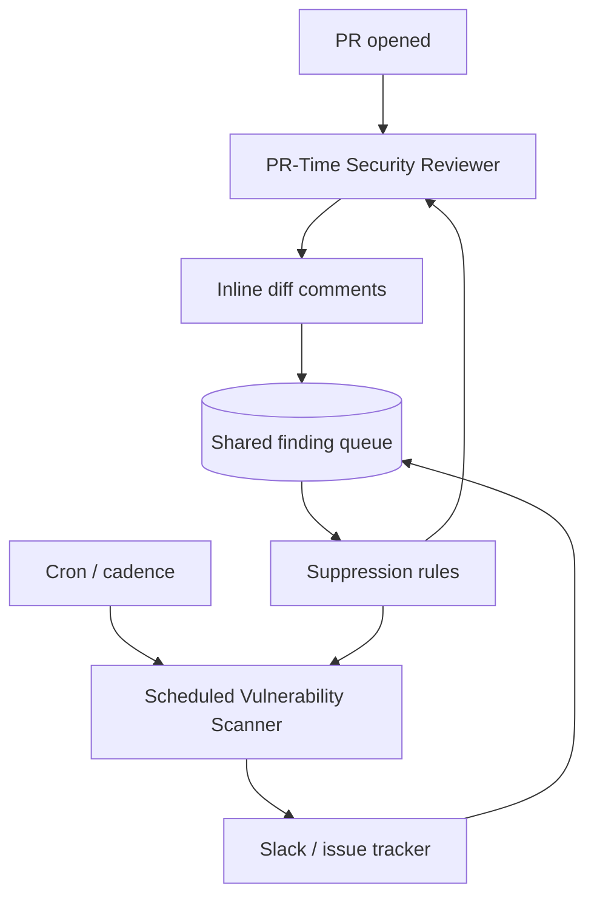

# Always-On Agentic PR Security Review

> Pair a PR-time security reviewer with a scheduled whole-codebase scanner. The reviewer covers new risk introduced by each diff; the scanner covers resident risk that no PR ever touches.

## Two Coverage Gaps

Security review fails along two temporal axes:

- **New risk** — vulnerabilities in today's changes. Diff-scoped, cheap to review at PR open, lost if not caught before merge.
- **Resident risk** — vulnerabilities already in the codebase, plus drift in dependencies, config, and policy. No PR may touch the affected files for months.

PR-only review never finds resident risk; scheduled-only scanning adds days of merge-time exposure for new code.

## The Pattern

Two agents share one finding format and one triage queue.



| Dimension | PR-time reviewer | Scheduled scanner |
|---|---|---|
| Scope | Diff only | Whole codebase |
| Trigger | `pull_request` open/sync | Cron, cadence, dependency advisory |
| Latency budget | Seconds to a few minutes | Hours acceptable |
| Output | Inline comment at the changed line | Aggregated report to a channel |
| Failure mode | Block merge or post warning | File issue or notify owner |

Cursor shipped this split in beta on 2026-04-30: a *Security Reviewer* that "checks every PR for security vulnerabilities, auth regressions, privacy and data-handling risks, agent tool auto-approvals, and prompt injection attacks" plus a *Vulnerability Scanner* that "runs scheduled scans of your codebase to check for known vulnerabilities, outdated dependencies, and configuration issues." [Source: [Cursor changelog](https://cursor.com/changelog/04-30-26)] Anthropic's [`claude-code-security-review`](https://github.com/anthropics/claude-code-security-review) Action is the convergent PR-time component; `/security-review` runs the same review locally before commit. [Source: [Anthropic Help](https://support.claude.com/en/articles/11932705-automated-security-reviews-in-claude-code)]

## Prompt-Injection Review Is a Distinct Dimension

The reviewer flags injection vectors *in the diff* — content that, once shipped, will land in another agent's context and rewrite its instructions.

| Check class | Looks for | Signal |
|---|---|---|
| CVE / dependency | Known-vulnerable package versions | Advisory database |
| SAST | Tainted data flow to a sink | AST / data-flow graph |
| Secrets | High-entropy strings, known patterns | Regex + entropy |
| Prompt-injection | New retrieval paths into agent context, untrusted-input boundaries, system-prompt mutations, tool descriptions, skill `SKILL.md` text | Heuristic + LLM judgement |

The attack surface is semantic — the same string is benign in a code comment and dangerous in a system prompt loaded at runtime. Deterministic SAST will not flag a `SKILL.md` whose `## Examples` section contains injected instructions; an LLM reviewer with the [Lethal Trifecta](lethal-trifecta-threat-model.md) and [task-scope boundary](task-scope-security-boundary.md) in scope will. [Source: [Prompt Injection Resistant Agent Design](prompt-injection-resistant-agent-design.md)]

## The Reviewer Itself Is a Target

A PR-triggered reviewer reading PR titles, descriptions, and comments runs untrusted input through an LLM with repository credentials in scope — the [Lethal Trifecta](lethal-trifecta-threat-model.md) at the reviewer.

The April 2026 *Comment and Control* disclosure exploited this against Claude Code Security Review, Gemini CLI Action, and GitHub Copilot Agent. The attacker injects instructions in a PR title; the agent auto-triggers on `pull_request`, executes the directive (e.g. `whoami`), and exfiltrates `ANTHROPIC_API_KEY`, `GITHUB_TOKEN`, and `GEMINI_API_KEY` as a "security finding" comment. Anthropic rated it CVSS 9.4. [Source: [Comment and Control writeup](https://oddguan.com/blog/comment-and-control-prompt-injection-credential-theft-claude-code-gemini-cli-github-copilot/); [SecurityWeek](https://www.securityweek.com/claude-code-gemini-cli-github-copilot-agents-vulnerable-to-prompt-injection-via-comments/); [The Register](https://www.theregister.com/2026/04/15/claude_gemini_copilot_agents_hijacked/)]

Mitigations are structural:

- Treat PR title, description, and comments as untrusted data — never as instructions
- Avoid `pull_request_target` for forked PRs unless secrets are scoped via a [credentials proxy](scoped-credentials-proxy.md)
- Restrict the reviewer's tool catalog to read-only operations on the diff; gate writes and network calls behind [confirmation gates](human-in-the-loop-confirmation-gates.md)
- Apply the [Action-Selector pattern](action-selector-pattern.md) so the reviewer cannot synthesise arbitrary tool calls from PR text

## False-Positive Economics

Single-stage detection is the wrong shape. One observed mitigation pairs a cheap stage-1 filter accepting an 8.5% false-positive rate with a stage-2 reasoning pass that drops it to 0.4%. [Source: [ARMO: Detecting Prompt Injection in Production AI Agent Workloads](https://www.armosec.io/blog/how-to-detect-prompt-injection-in-production-ai-agent-workloads/)]

Suppression must be first-class. Cursor accepts custom instructions and MCP-wrapped SAST/SCA/secrets scanners so deterministic tools own high-confidence classes and the LLM judges residual semantic surface. [Self-improving review agents](../code-review/learned-review-rules.md) persist accept/reject signals as rules so the reviewer narrows over time.

## When the Pattern Backfires

- **No AppSec triage owner.** Findings land on the PR author; without a triage queue, noise leads to dismissal.
- **Mature deterministic tooling already covers the surface.** Tuned CodeQL, Semgrep, Snyk, Dependabot — incremental coverage may not exceed cost.
- **High-volume, low-security churn.** Docs sites, generated code, config-heavy monorepos produce findings the reviewer cannot prioritise.
- **`pull_request_target` with repository secrets.** Comment-and-Control attack precondition; fix the trust boundary first.

## Example

Cursor's beta configuration shows the operational shape end to end:

```yaml
# Reviewer agent — runs at PR open
trigger: pull_request
scope: diff
checks:
  - vulnerabilities
  - auth_regressions
  - privacy_data_handling
  - agent_tool_auto_approvals
  - prompt_injection
output: inline_review_comment
mcp_servers:
  - sast_scanner
  - sca_scanner
  - secrets_scanner

# Scanner agent — runs on cadence
trigger: schedule
scope: whole_codebase
checks:
  - known_vulnerabilities
  - outdated_dependencies
  - configuration_issues
output: slack_channel
```

Both draw from a shared usage pool and a shared suppression-rule store. [Source: [Cursor Security Review changelog](https://cursor.com/changelog/04-30-26)]

## Key Takeaways

- New risk and resident risk need different triggers — one agent cannot cover both economically
- Prompt-injection review is a semantic check the LLM does well, not a SAST replacement
- The reviewer agent is itself an injection target whenever it processes PR text with credentials in scope; mitigations are structural
- The pattern fails on false-positive economics unless suppression rules are first-class

## Related

- [Code Injection Attacks on Multi-Agent Systems](code-injection-multi-agent-defence.md)
- [Designing Agents to Resist Prompt Injection](prompt-injection-resistant-agent-design.md)
- [Lethal Trifecta Threat Model](lethal-trifecta-threat-model.md)
- [Self-Improving Code Review Agents — Learned Rules](../code-review/learned-review-rules.md)
- [Human-in-the-Loop Confirmation Gates](human-in-the-loop-confirmation-gates.md)
- [Action-Selector Pattern](action-selector-pattern.md)
- [Scoped Credentials via Proxy](scoped-credentials-proxy.md)
